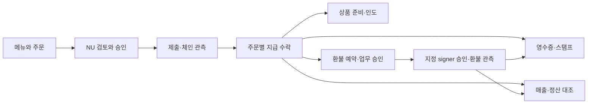

# 키오스크·결제·환불·스탬프·정산 종단 연결

2026-09-19 · **DS-03 설계 후보. 실제 앱·기기·거래·운영 실행은 하지 않았다.** RN 태블릿 키오스크, StableNet testnet, USDC 우선/더미 토큰 시연, EOA 우선, 초기 고객 가스 부담을 유지한다. 향후 스마트 계정/운영자 후원은 기존 범위와 순서를 유지하며 이번에 앞당기지 않는다.

[구조화 원본](kiosk-commerce-journey-design.json) · [검증기](validate_kiosk_commerce_journeys.py) · [현재 승인 기준](approval-baseline.md) · [대사 연결](commerce-reconciliation-integration.md) · [정산 계약](settlement-ops-contracts.md)

## 1. 고객과 점주의 한 흐름

고객은 메뉴를 고르고 NU에서 가게·자산·금액·수취·가스를 확인해 승인한다. 키오스크는 확인 중 상태를 거쳐 서버가 원 지급을 수락했을 때 결제 완료를 표시한다. 점주는 주문을 준비/인도하고, 필요한 경우 원 지급을 선택해 환불을 요청한다. 실제 환불 signer는 자신의 앱/기기에서 따로 승인한다. 매출 화면은 유효 매출·귀속 수취·환불·보류를 나눠 보여주고 기간 마감을 기록한다.

초기 guest NU 결제에 매번 고객 폰 로그인을 필수로 추가하지 않는다. 앱 계정에 연결되지 않은 영수증/스탬프는 결제 당시 증거를 보존한 뒤 본인 claim으로 연결한다. 점주가 키오스크와 모바일 앱에 같은 계정으로 로그인해도 조회·메뉴·환불 업무 승인·실제 지갑 서명 권한은 각자 검사한다.

다음 Mermaid는 정상 경로의 논리 연결이며 실행 완료나 분산 트랜잭션을 뜻하지 않는다.

## 2. 사실과 화면의 구분

서명완료 ≠ 제출접수 ≠ 체인실행/확정 ≠ 업무상 지급수락 ≠ 상품인도다. 화면에서 이 상태를 하나의 success boolean으로 합치지 않는다. 현재 주문 수락 정책 D08이 미선정이면 정상 결제 시연에 필요한 입력이 아직 없는 것이며, 정책 보류를 결제 완료로 표시하지 않는다.

| 표시 | 근거 | 가능한 행동 | 제한 |
|---|---|---|
| PS-01 장바구니 | API-026 현재 메뉴 | 주문 만들기 | 가격/품절 검증 후 API029; local cart는 가격 권위 아님 |
| PS-02 결제 준비 | API-030 원 주문 + API-032 견적 | NU 연결/취소 가능 여부 조회 | policy/profile·자산/가스 조건 미확정이면 진행 불가 |
| PS-03 기기에서 확인해 주세요 | API-034 snapshot + 원 D01 review | 기기 물리 승인 또는 거절 | 가격/수취/체인/가스 변경 시 이전 승인 재사용 금지 |
| PS-04 전송/결제 확인 중 | 원 operation·API-019·API-035 | 상태 확인/지원 안내 | 추가 결제 버튼 자동노출 금지; signed/submitted != accepted |
| PS-05 결제 완료 | API-030의 현재 유효 수락 projection + 본인 API-035 | 주문번호·허용 영수증 안내 | order.paid만 보고 현재 유효성 추정 금지; 다른 지급 승자 정보 노출 없음 |
| PS-06 지급 확인 필요 | invalidated/exception/held projection | 원내역 조회·지원 요청 | 과거 fulfilled 이력 보존; 자동 unpaid/재결제 유도 금지 |
| PS-07 환불 처리 중 | 원 refund reservation/authorization/observation | 원환불 상태 확인 | 신규 key로 같은 환불 재요청·예약 임의해제 금지 |
| PS-08 환불 완료 | API-038 현재 refund reconciliation | 자기 allocation 환불 내역 | 환불 reorg 시 확인필요로 표시; 기존 출금 노출은 유지 |
| PS-09 스탬프 연결/반영 대기 | current eligibility/entitlement/claim revision | 본인 연결·상태조회 | 미귀속 적립 사용 금지; 소유 claim이 추가 적립 트리거 아님 |
| PS-10 마감 완료/보정 필요 | API-093 snapshot + API-039 현재 원천 차이 | 권한 있으면 후보 재검토 | 지갑잔액·원화정산 완료와 혼동 금지 |

같은 order라도 화면 주체가 다르다. 고객은 자기 attempt/allocation 및 허용된 주문 최소정보만 보고, 직원은 현재 exact-store 역할 범위만 본다. paymentId는 payment_allocations.id이며 txHash/orderId/attemptId와 대체할 수 없다. 표시 revision은 각 원천 권위 안에서 비교하며 서로 다른 서비스 숫자의 max로 최신성을 만들지 않는다.

## 3. 12개 종단 여정

### KJ-01 · 매장 가입·선택·고객 모드

- 화면: K01, K04. 경로: API-103, API-001, API-021, API-022, API-023, API-024, API-025.
- 진행: 소셜 인증→매장 생성/소속 선택→등록 terminal 증명→exact-store 고객 세션 발급. 관리 모드 복귀는 현재 권한/재인증.
- 사용자에게 완료로 보이는 조건: 매장·단말·역할이 검증된 고객 모드. 고객 화면에서 관리자 token/개인 지갑/매출/복구자료 접근 불가.
- 중단/복구: 재시작 시 관리 모드 자동 복귀 금지. 단말/소속 철회는 새 주문/결제 차단과 원거래 관측을 구분.

### KJ-02 · 메뉴 수정·품절·가격 변경

- 화면: K02. 경로: API-026, API-027, API-029, API-030.
- 진행: 관리자는 expectedRevision으로 메뉴 변경. 고객은 메뉴/옵션/수량 선택 후 서버 가격·품절 재검증→불변 주문 snapshot.
- 사용자에게 완료로 보이는 조건: 서버가 검증한 메뉴·가격·수취 설정 revision의 주문 생성. 가격 변경은 고객 재확인 후 새 요청.
- 중단/복구: MENU_CHANGED면 변경 내역과 새 총액 표시. 응답 유실은 같은 key/body 결과 복구; body를 고쳐 같은 key 재사용 금지.

### KJ-03 · 매장 수취 지갑 변경

- 화면: K04, U02. 경로: API-028.
- 진행: 자금관리 최근 인증→새 wallet 소유 증명→expectedRevision CAS→적용 시점 표시.
- 사용자에게 완료로 보이는 조건: 새 설정이 확정되고 이후 주문에 적용. 기존 주문/intent 수취 주소는 보존.
- 중단/복구: 변경 응답 유실은 설정/원요청 조회. 기존 주소 접근 상실이면 영향 주문/환불 보류, 새 주소로 원 snapshot 덮어쓰기 금지.

### KJ-04 · 고객 NU 결제 정상 흐름

- 화면: K02, K03, D01. 경로: API-029, API-032, API-033, API-034, API-108, API-109, API-018, API-019, API-020, API-030, API-035.
- 진행: 주문→자산/EOA 선택·견적→NU 인증→snapshot→기기 새 물리 승인→원 승인 결과/현재 제출권한으로 제출→관측→업무 수락.
- 사용자에게 완료로 보이는 조건: 유효한 원 지급 allocation을 선택된 policy로 서버가 수락한 뒤에만 결제 완료 표시. 상품 인도는 별도.
- 중단/복구: 원 attempt/context/operation/transaction을 조회; BLE ACK/서명/HTTP접수만으로 결제 완료 금지.

### KJ-05 · 결제 중단·재연결·다음 손님

- 화면: K03, D01, O03. 경로: API-031, API-035, API-030, API-020, API-019, API-110.
- 진행: 거리 이탈/거절/만료/앱 종료→노출 여부와 원상태 조회→안전한 중단 또는 확인 중→고객 세션 분리.
- 사용자에게 완료로 보이는 조건: 새 손님 화면에서 이전 고객의 결제/주소/영수증/서명 접근 불가; 기존 지급 추적은 서버에서 유지.
- 중단/복구: 서명 가능성 있으면 자동 새 attempt/다른지갑 결제 금지. 고객 세션 복구증명 없이 orderId만으로 결과 공개 금지.

### KJ-06 · 지연·중복·부분·잘못된 지급

- 화면: K03, K05, O03. 경로: API-030, API-035, API-087.
- 진행: 각 증거를 원 attempt/payer/asset/allocation에 귀속→원 정책·최신 관측 검증→정상 수락 또는 exception/hold.
- 사용자에게 완료로 보이는 조건: 새 수락은 선택된 D08 policy 필요. 정책 미정·귀속 불명은 보류; 예외를 정상 매출/스탬프로 자동 분류하지 않음.
- 중단/복구: 다른 손님의 지급정보·환불예산 노출 금지. 자동 반환·부분합산·새 결제 요청은 정책/권한 없이 실행하지 않음.

### KJ-07 · 주문 접수·상품 인도

- 화면: K05, K03. 경로: API-092, API-030.
- 진행: 점주가 현재 결제 수락과 주문 이력 확인→상품 준비/인도→중복 방지 인도 기록 후보.
- 사용자에게 완료로 보이는 조건: fulfillment 권한·revision·idempotency 계약으로 실제 인도 기록 확인. 현재 카탈로그에는 이 mutation이 미등록.
- 중단/복구: 정상 시연의 준비/인도 단계는 미등록 계약 채택 전 완료 주장 금지. reorg가 과거 인도 사실을 삭제하거나 자동 재결제시키지 않음.

### KJ-08 · 개인 영수증·스탬프 연결

- 화면: U11, U10, D02. 경로: API-104, API-105, API-106, API-042, API-043, API-044.
- 진행: 결제 당시 eligibility→계정 연결 또는 guest pending entitlement→나중 본인 claim→동일 source 한 번 적립/표시→별도 혜택 사용.
- 사용자에게 완료로 보이는 조건: 본인 영수증 연결·스탬프 원장 반영을 각각 표시; pending/unclaimed는 사용 가능 잔액 아님.
- 중단/복구: 반납/재대여/주소 소유만으로 과거 구매 claim 불가. 소비 후 환불/reorg는 저장 ruleVersion에 따른 목표 감소 때만 correction/deficit; 정책 미정이면 혜택 판단 보류·소비이력 유지, 자동 재지급·자산 차감 금지.

### KJ-09 · 부분·전액 환불

- 화면: K05, U03, D01, U11. 경로: API-030, API-036, API-037, API-038, API-015, API-108, API-109, API-018, API-019, API-020.
- 진행: exact-store 환불 권한으로 paymentId 원천 선택→목적지 증명/금액/최신 fundingRevision→예약→업무 승인→지정 signer 검토/서명→제출/대사.
- 사용자에게 완료로 보이는 조건: 원 allocation에 귀속된 환불 거래의 현재 canonical/confirmation 정책과 서버 상태 확인 뒤 환불 완료. 요청/예약/서명은 완료 아님.
- 중단/복구: 한도는 원 cap-reserved-confirmed. hold면 잔여 한도가 있어도 새승인 불가. 목적지/원천/signer 변경은 새검토; 응답유실은 원 refund 조회.

### KJ-10 · 매출 조회·기간 마감·보정

- 화면: K06. 경로: API-039, API-040, API-041, API-093.
- 진행: 매장/기간/chain/asset 선택→asOf·원천 완전성/정책·음수 차이 확인→닫힌 기간의 저장 candidate 검토→마감/보정.
- 사용자에게 완료로 보이는 조건: API040 마감 snapshot 또는 API041 새 correction version의 commit 확인. 기존 version 불변; 송금/환전 완료를 뜻하지 않음.
- 중단/복구: revision/generation/digest 충돌 시 새 후보 재검토. stale/null/held 표시, 같은 target 재처리는 NO_CHANGE.

### KJ-11 · 운영 예외 재조회·보정

- 화면: O03, O04. 경로: API-087, API-088, API-089.
- 진행: 원천 재조회 또는 preview→단일 consumer/projection 차이 검토→별도 publish 권한으로 SR-02 후보→CP-B06 반영 확인.
- 사용자에게 완료로 보이는 조건: preview 완료와 publication 완료 구분. 새 generation/fence가 실제 commit된 뒤 보정 반영 완료.
- 중단/복구: 운영자가 paid/환불/보상/마감 값을 입력하여 확정 금지. 202 뒤 권한/원천 변경이면 hold. SR-01/02는 미등록.

### KJ-12 · 점주 모바일 자산 조회·환불 승인

- 화면: U01, U02, U03, K05. 경로: API-005, API-007, API-008, API-037, API-015, API-020, API-018.
- 진행: 동일 소셜 계정 로그인→매장 context/현재 membership→지갑 조회권→원 merchant_refund snapshot에 지정된 실제 signer 승인.
- 사용자에게 완료로 보이는 조건: 매장 조회/업무 승인/실제 서명권 세 조건을 각자 충족. NU 또는 Cloud 선정 경로로만 서명.
- 중단/복구: 모바일 개인송금 API017로 환불 우회 금지; 점주 로그인만으로 MPC 복구/NU signer 권한 생성 금지.

## 4. 매장 운영과 단말의 수명

단말 앱에는 고객 주문 surface와 점주 관리 surface를 분리한다. hidden route나 뒤로가기가 권한 경계가 아니며 서버는 모든 관리 호출의 membership/action을 확인한다. 관리자 재인증·앱 resume·기기 분실·store 변경 시 cached 화면/비동기 응답 generation도 분리한다. shared tablet에 점주 개인키/MPC share를 지갑 사용 편의 목적으로 복제하지 않는다.

고객 한 명의 order/attempt 범위는 다음 손님 화면 초기화와 함께 분리한다. 로컬 display/state/subscription을 정리해도 이미 노출된 서명/서버 operation은 삭제하지 않는다. 원고객에게 제한된 결과 복구 증명을 전달하는 방식은 별도 profile이며, 공개 주문번호/영수증 QR 하나를 조회권으로 만들지 않는다. 고객의 민감 결과와 관리자 복구자료를 일반 로컬 캐시에 남기지 않는다.

네트워크가 끊기면 이전 메뉴를 정보로 보여줄 수 있으나 최신 가격·품절·recipient·권한 확인 없이 새 주문/결제를 성공 처리하지 않는다. 오프라인 주문 접수/재고 예약을 이미 지원한다고 가정하지 않는다. 품절/가격 변경은 주문 생성 전 재검증이고, 생성 후 가격·수취 주소는 원 snapshot에 고정한다. 실제 수량 재고 예약이 필요하면 별도 contract가 있어야 하며 availability flag만으로 과판매 방지를 보장하지 않는다.

## 5. 금액·가스·환불·정산

- 주문 표시통화와 결제 asset atomic 단위를 분리한다. 실제 전송 금액/반올림/견적 기한과 원 가격을 함께 저장하고 변경되면 새 검토를 요청한다. 현재 원화 환율 공급자·표시 정책은 선택하지 않았다.
- 토큰은 symbol이 아니라 environment/chain/address/decimals/profile로 식별한다. 더미 USDC를 실제 USDC로 표시하지 않는다. gas asset·금액은 검증된 chain profile에 따라 표시하며 토큰 잔고만으로 가스 가능 여부를 판단하지 않는다.
- 환불 한도와 가스 지불능력은 별개다. cap/reserved/confirmed가 허용하더라도 signer 권한·source hold·실제 가스/잔고를 별도 검사한다. 환불 가스 부담/수수료 공제 정책을 임의로 정하지 않는다.
- 원입금 reorg 후 환불은 아직 유효할 수 있다. 이때 매출/귀속현금 net이 음수면 그대로 검토필요로 표시한다. 가용 환불 예산이 있어도 funding hold 중 새 승인을 막는다.
- 정산은 현재 코인 수취·환불 대조의 불변 마감 snapshot이다. 자동 원화 환전·은행송금·법정 회계 적합성 완료로 표현하지 않는다. 기초 wallet balance에는 주문 외 이체·가스·DeFi가 있으므로 매출 카드와 일치한다고 가정하지 않는다.

## 6. 정책 입력과 명세의 빈 곳

다음은 기존 D 결정에 연결한 입력 표이며 새로운 확정 정책이 아니다. 모든 selection은 null이다.

| ID | 기존 결정 | 주제 | 필요한 선택/증거 | 미선정 동작 |
|---|---|---|---|
| KP-01 | D08 | 주문 수락·부분/초과/다중 지급 | 최초 업무 수락 한건 또는 명시적 분할 지원 비교; 시각/선착순 추정 금지 | selection 없으면 새 수락 보류 |
| KP-02 | D08 | 견적·가격/환율·token decimals·가스 | 주문 KRW 표시와 atomic token 수량 분리; source/version/rounding/expiry를 quote에 고정 | 환율/가스 지원 미검증이면 새 quote/서명 차단 |
| KP-03 | D08, D09 | 취소·지연 입금·환불 목적지·수수료 | 원 allocation별 반환 증명·수수료 부담·환불 조건 비교; 고객 최초 가스 유지 | 미정이면 자동 반환/수수료 임의 공제 금지 |
| KP-04 | D17 | 스탬프·부분환불·소비 후 취소 | ruleVersion, 적립/회수/면제와 deficit 정책 | 미정 rule이면 새혜택/사용 보류, 과거 기록 보존 |
| KP-05 | D02, D19 | 단말 관리/고객 세션·다음 손님 | terminal 등록·종료/분실·idle TTL·고객 receipt recovery 전달 | 세션 수치·복구 증명 전달 profile 미선정; 자동 권한 확대 금지 |
| KP-06 | D08, D19 | 매출 기간·정산·보정 | store timezone/사업시각·기간 partition·asset별 manifest | 미선정이면 마감/보정 승인 불가 |
| KP-07 | D01, D02 | 상품 준비·인도 | fulfillment writer/역할/expectedRevision·멱등·취소 경합 | 미등록 mutation으로 실제 인도완료 기록 주장 금지 |

| 연결 변경 | 기존 경로 | 주제 | 채택 전 남은 계약 |
|---|---|---|---|
| KD-01 | API-023 | 단말 등록·증명/고객 세션 종료·철회 확인·관리 복귀 | 현재 API023 입력은 terminalId/mode. 최초 provisioning/고객 recovery scope/종료 ack의 전체 계약은 추가 필요 |
| KD-02 | API-027, API-029, API-028 | 메뉴 가격/옵션/품절 검증과 recipient snapshot 원자 고정 | order writer는 current menu/recipient revision 검증 후 commit. 메뉴변경과 가격재확인 UX·recipient cut 및 소유증명 세부 DTO 채택 필요 |
| KD-03 | API-032 | 견적·지원 asset·native gas·표시금액/실제금액 일치 | 더미 USDC의 검증 주소/decimals/chain manifest 필요. StableNet gas denomination은 현재 baseline/profile 확인; token 잔고=가스 잔고 추정 금지 |
| KD-04 | API-092, API-030 | 상품 준비/인도 명령과 지원 직원 권한 | fulfillment mutation은 현재 미등록. 서버 accepted 상태·expectedRevision·idempotency·audit 필요. 새 명령명/번호 자동등록 안 함 |
| KD-05 | API-030, API-035, API-036, API-037, API-038 | 대사/환불 projection 계약 채택 | commerce-reconciliation 후보 채택 필요; API037 merchantSigner+expectedRevision+expectedFundingRevision 및 approval envelope 유지 |
| KD-06 | API-042, API-043, API-044, API-104, API-105, API-106 | 개인영수증·pending entitlement·혜택사용 연결 | guest ticket 전달/내보내기와 앱 claim UI; rule/privacy/current ownership revision 연결. ticket/주문번호 단독으로 권한 부여 금지 |
| KD-07 | API-039, API-040, API-041, API-093, API-087 | 마감·보정·운영 publish 연결 | settlement-ops 후보/별도 SR 권한을 채택하기 전 운영 반영 불가. 기존 API087을 publish 권한으로 확대 금지 |

특히 주문 조회 API가 있다고 상품 인도 writer가 구현된 것은 아니다. KJ-07은 해당 mutation/권한/저장 계약을 채택해야 정상 대조군을 완료할 수 있는 상태다. 서버 주문 원장·실제 인도 기록의 재시도/취소/reorg 처리는 명시적으로 남긴 설계 항목이다. 원장 값을 운영자가 편집하여 이 빈 곳을 대신하지 않는다.

이번 문서는 화면 간 연결 후보다. 승인 API037/018의 전체 schema를 축소하지 않고, commerce/settlement 후보의 별도 버전 협상을 유지한다. API/화면/SQL 기준 카탈로그는 변경하지 않았다. SR-01/02 및 fulfillment/단말복구 경로는 등록된 공개 API 수에 더하지 않는다.

## 7. 앱 연동 수용 계획

각 여정은 정상 대조군과 아래 예외 분기 증거를 모두 요구한다. 거절이 맞는 분기의 PASS가 정상 결제/인도/환불/정산 전체 완료를 의미하지 않는다. 미지원 정책/route/profile은 blocked, 미실행은 not_run으로 남긴다. 모든 사례의 현재 status는 not_run, evidenceRefs는 빈 목록이다.

| 사례 | 여정 | 상황 | 기대 결과 |
|---|---|---|---|
| KC-T01 | KJ-01 | 다른 매장/미등록 terminal | 고객 세션 발급 거절 |
| KC-T02 | KJ-01 | 재부팅 후 관리자 화면 복원 | 재인증 전 관리정보 비공개 |
| KC-T03 | KJ-02 | 장바구니 중 품절/가격 변경 | 차이 표시·재확인, 원금액 자동결제 없음 |
| KC-T04 | KJ-02 | 주문 commit 후 응답 유실 | 같은 key/body로 한 주문 복구 |
| KC-T05 | KJ-03 | 수취 설정과 주문 생성 경합 | 일관된 한 recipient revision만 고정 |
| KC-T06 | KJ-03 | 기존 주문 후 주소 변경 | 원 주문 수취 유지, 키접근 상실은 보류 |
| KC-T07 | KJ-04 | 유효 NU EOA 정상 지급 | 정책/가스/profile 준비 후 accepted 확인, 서명완료만으로 성공 금지 |
| KC-T08 | KJ-04 | USDC 보유·native gas 부족 | 가스 부족 표시, 자동후원/Cloud 대체 없음 |
| KC-T09 | KJ-04 | 동명 가짜 토큰/잘못된 decimals | chain/address/manifest 불일치 거절 |
| KC-T10 | KJ-04 | 녹음/FOTA와 결제 경합 | DS01 busy/사용자 종료 후 새승인, 자동입력재사용 금지 |
| KC-T11 | KJ-05 | 서명후 BLE 끊김 | 원결과 관측, 자동 재서명/재결제 없음 |
| KC-T12 | KJ-05 | 다음 손님 이전 주문번호 조회 | 다른 payer 결과·주소·capability 노출 금지 |
| KC-T13 | KJ-05 | 취소와 지급 수락 경합 | 같은 원장/권한 경계에서 일관된 결과, 늦은 입금 추적 |
| KC-T14 | KJ-06 | 두 attempt가 모두 지급 | 각 allocation 분리, 선택policy 외 자동이중매출/적립 금지 |
| KC-T15 | KJ-06 | 부분/초과/늦은 지급 정책없음 | policy held; 새 정상수락/자동반환 없음 |
| KC-T16 | KJ-06 | Indexer 지연/중복 관측 | unknown/stale 표시, 같은 revision 중복반영 없음 |
| KC-T17 | KJ-07 | 정상 상품 인도 | 등록된 writer 권한/멱등/증거 없으면 미검증; 인도중복 기록 없음 |
| KC-T18 | KJ-07 | 상품 인도후 원지급 reorg | 인도이력 유지·현재 지급검토, 자동재결제 금지 |
| KC-T19 | KJ-08 | guest 결제후 앱 claim | 당시eligibility 증명, 동일entitlement 한번연결 |
| KC-T20 | KJ-08 | 다음 대여자의 과거영수증 claim | 현재기기/주소만으로 거절 |
| KC-T21 | KJ-08 | 스탬프 사용후 부분환불/reorg | 저장 ruleVersion으로 적립 목표가 감소한 경우에만 correction/deficit; 정책 미정은 판단보류, 소비이력 보존·자동돈청구 없음 |
| KC-T22 | KJ-08 | 혜택사용과 원지급무효화 경합 | 현재 source gate 기준 직렬화, stale projection으로 사용 불가 |
| KC-T23 | KJ-09 | 타매장 allocation을 권한 없이 환불 원천으로 선택 | exact-store refund 권한 불일치 거절; 정상 매장 환불담당자에게 고객 payer 소유권까지 요구하지 않음 |
| KC-T24 | KJ-09 | 동시 부분환불 cap 초과 | 한도예약/CAS로 과다노출 방지 |
| KC-T25 | KJ-09 | 환불 승인자와 signer 다름 | 원 merchant_refund snapshot 유지; 개인송금 우회 금지 |
| KC-T26 | KJ-09 | 환불서명 후 timeout/취소 | 노출예약 유지, 원 refund 관측 |
| KC-T27 | KJ-09 | 확정환불 reorg | confirmed→reserved 재분류, 가능액 임의증가 없음 |
| KC-T28 | KJ-10 | 정상 기간마감 commit 응답유실 | 같은key 원 snapshot 복구; 추가 마감 없음 |
| KC-T29 | KJ-10 | 원입금0·유효환불6 | signed -6/검토필요, 0으로 숨기지 않음 |
| KC-T30 | KJ-10 | 마감후 새 source 보정 | 원version 불변·correction_pending→별도승인 |
| KC-T31 | KJ-11 | ops_reconcile만으로 publish | 별도권한없음 거절 |
| KC-T32 | KJ-11 | 202후권한철회/source변경 | 최종commit 보류, 새금융효과없음 |
| KC-T33 | KJ-12 | 점주로그인만으로 wallet sign | 실제signer/approval 없으면 거절 |
| KC-T34 | KJ-12 | 로그아웃후늦은환불서명결과 | 현 read/release·gate 재검사, 기존거래관측만 유지 |

실제 증거 묶음에는 board/FW/app/backend/contract/indexer build와 선택 policyVersion, 테스트 asset/chain/decimals, 원 operation/attempt/payment/refund/settlement 연결, 각 화면 상태와 권한 거절 결과를 포함한다. 원문키·share·token·서명 raw bytes·타인 개인정보를 리포트에 담지 않는다. 상품 인도/금융 원장을 시연 스크립트가 강제로 성공으로 바꾸는 방식은 수용 증거가 아니다.

## 8. 범위 보존과 다음 작업

연결 작업: APP-04, BASE-02, INDEX-05, OPS-01, OPS-03, PAY-01, PAY-02, PAY-03, PAY-04, PAY-05, SHOP-01, SHOP-02, SHOP-03, SHOP-04, SHOP-05, SHOP-06, STAMP-01, STAMP-02. 104개 작업·320개 세부 작업·19개 미결정·API110개·화면37개를 유지한다. 역할/공수와 기존 RR-DEC-01 선택을 변경하지 않았다. 자료는 로컬 설계 참조 점검이며 새 제도 검토·실거래 운영 승인 결과가 아니다.

**다음은 DS-04 StableNet 자산·스마트계정·Indexer 호환 설계**다. 자산/가스/ABI/address/version manifest와 EOA 이후 스마트계정 전환, 계약 이벤트→조회 모델·재처리 경계를 연결한다. DS-03의 위 7개 계약 보강과 정책 입력은 채택 전 미완성 항목으로 유지한다.
