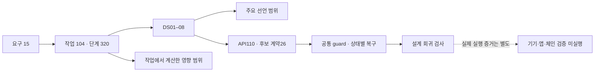
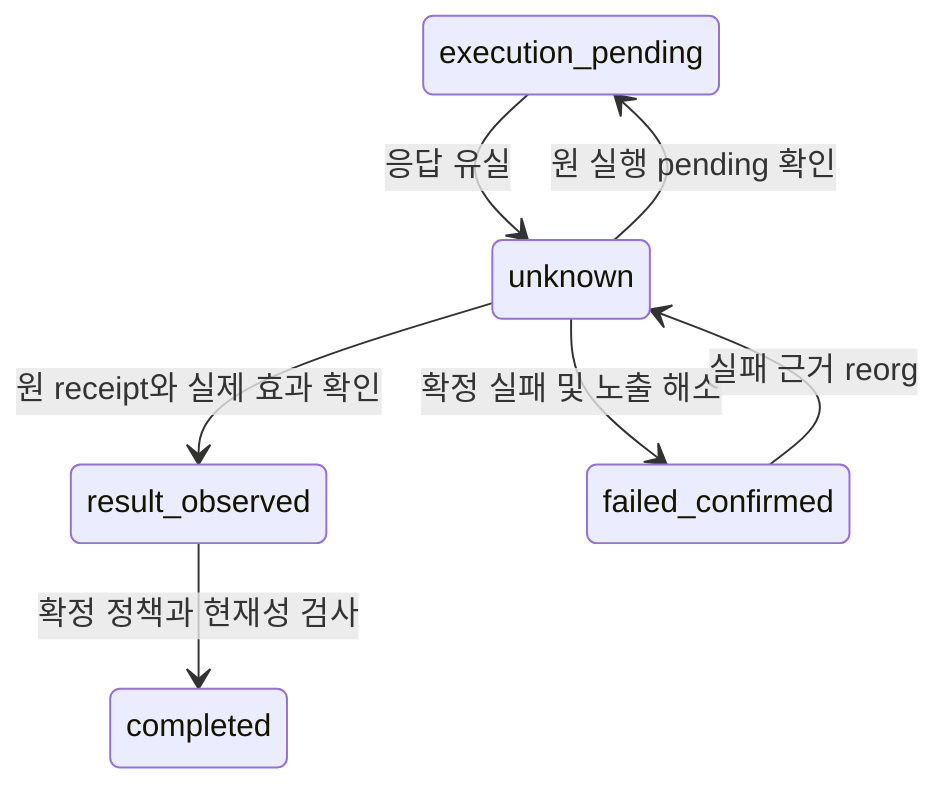
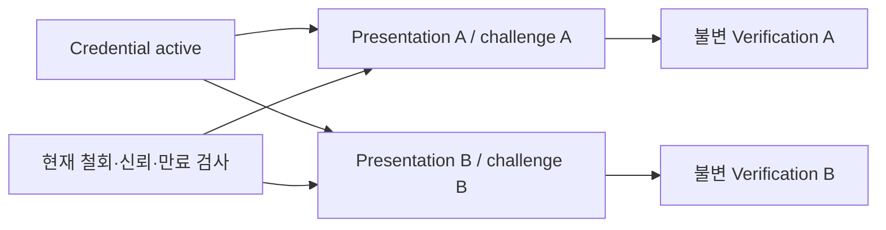
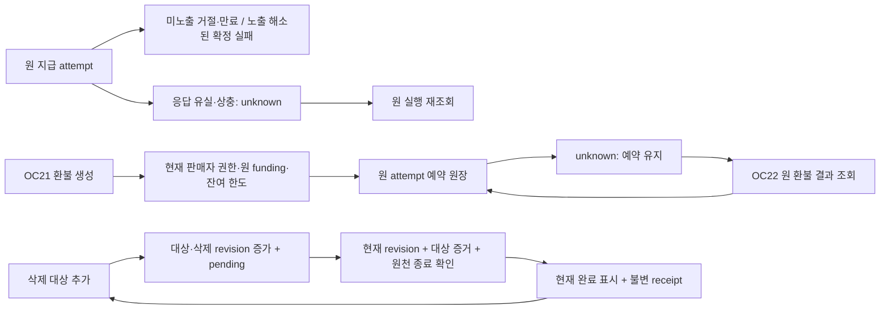
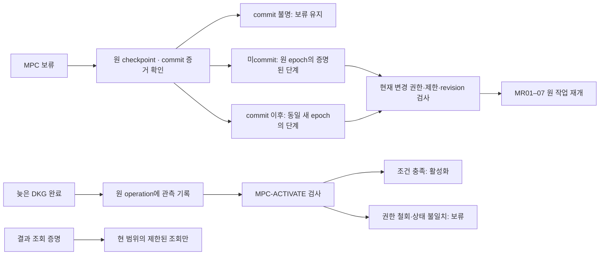
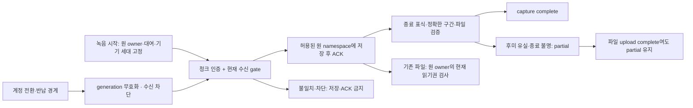
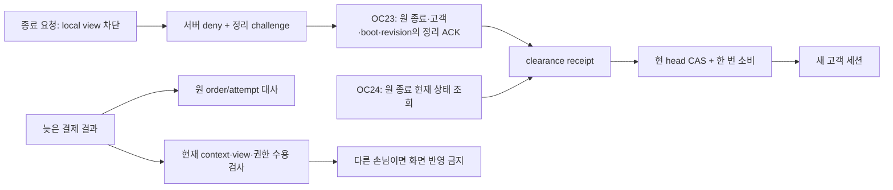
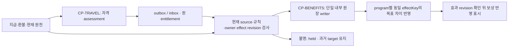
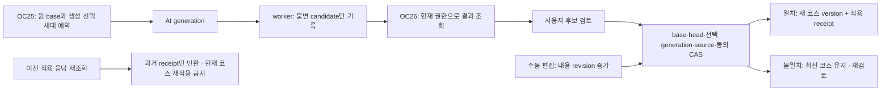

# 문서 관계 그래프와 논리 보완 결과

**LG-01~18 모두 원본 설계에 수정 반영했다.** 기존 반례와 수정 전 파일은 보존했다. 논리 설계 회귀 검사와 문서 참조 검증을 수행했으며 제품의 보안·실기·체인 실행 검증은 아니다.

x-theory 정의는 아직 미확인이다. 아래 분류와 관계는 중립적인 provenance 분석이며 x-theory 적용 완료를 주장하지 않는다.

현재 선택 authority는 `DF-20260920-01`이다. 그래프는 과거 open 기록을 보존하면서 D01~D19와 RR-DEC-01의 20개 결정을 `selected_for_design_baseline`으로 overlay한다.

목록: 261개 문서/스키마/참조 SQL·GraphQL. 상세 의미 검토는 13개 구조화 핵심 문서 중심이다. 그래프는 2083개 노드·9723개 관계이며, 과거 보존 디렉터리와 이 분석 폴더의 수정 전 스냅샷은 입력에서 제외한다.

## 반영한 수정

### LG-01 · 수정 반영

unknown의 원 allowance/실행 관측별 복구 전이 6개와 실패 근거 reorg 재검증 전이를 추가했다. 실행 노출이 있는 상태에서 review_ready로 돌아가 재서명할 수 없도록 제한했다.

수정 전 문제: MT-08은 응답 유실·재조직 때 unknown으로 이동하지만 9개 전이 중 unknown을 출발점으로 하는 전이가 없다. 원천을 다시 조회한다는 서술은 있어도 재확인 결과를 적용할 상태·조건이 정의되지 않았다.

회귀 기준: 응답 유실 뒤 원 거래 확정, 확정 실패, reorg 후 재포함을 각각 같은 business effect로 복구; 새 지급 0건.

- 현재 근거: [market-product-design.json](../../specifications/market-product-design.json) — `/tradeTransitions/9`

### LG-02 · 수정 반영

CredentialStatus, PresentationSession, 불변 VerificationRecord를 분리했다. 같은 active credential을 서로 다른 challenge에 독립 제시하며, challenge 단회 소비와 철회 검사는 유지한다.

수정 전 문제: CV-02/03을 하나의 credential 상태로 읽으면 issued→presentation_ready→verified가 되고, 정상 verified 상태에서 다른 challenge를 위한 새 presentation을 만들 경로가 없다. 반대로 presentation 상태라면 발급·철회·만료가 다른 객체의 상태다.

회귀 기준: 같은 active credential로 서로 다른 challenge 두 건을 독립 검증; 같은 challenge 재사용 차단; 철회 시 새 검증 차단·과거 결과 보존.

- 현재 근거: [credential-paid-resource-design.json](../../specifications/credential-paid-resource-design.json) — `/presentationTransitions/0`

### LG-03 · 수정 반영

PR-COMMON / PR-GRANT / PR-GENERATE / PR-PUBLISH를 정의하고 PX05/06/07/11에서 참조한다. 최초 실행·재시도·공개가 동일 refund/authority/privacy/source/revision 조건을 검사한다.

수정 전 문제: 최초 제공 PX-06은 refund fence와 동일 entitlement revision CAS를 명시하지만, 재시도 PX-11은 현재 권한·입력·기한만 명시한다. 공통 상태 축의 전역 제한을 적용하면 안전하게 해석할 수 있으므로 확정적 우회 버그가 아닌 guard 명세의 불일치다.

회귀 기준: 환불 예약과 retry 경합에서 신규 생성·공개가 차단되고 기존 전달 이력은 유지된다.

- 현재 근거: [credential-paid-resource-design.json](../../specifications/credential-paid-resource-design.json) — `/paidResourcePredicates/0`

### LG-04 · 수정 반영

OC17~20으로 refresh 요청/결과조회와 identity unlink 요청/결과조회를 추가했다. 회전 단일 successor, 이전 bearer 재전달 제한, 병렬 마지막 로그인 수단 제거 방지를 명시했다.

수정 전 문제: AU-06은 unregistered_refresh_adapter, AU-09는 unregistered_identity_unlink를 사용한다. OC-01은 인증 flow/identity 연결, OC-02는 세션 철회를 다루며 갱신과 unlink의 완전한 요청·응답·권한·결과 복구 계약은 없다. overlay의 전체 미연결 경계를 닫는다는 설명은 범위를 좁혀야 한다.

회귀 기준: 동시 refresh·응답 유실·철회된 family 및 마지막 로그인 수단 unlink의 정상/거절/복구 사례.

- 현재 근거: [preimplementation-contract-overlay.json](../../specifications/preimplementation-contract-overlay.json) — `/routeContracts/16`

### LG-05 · 수정 반영

8개 DS와 전체 설계·인계서에 declaredScopeRequirementRefs와 transitiveTaskImpactRequirementRefs를 분리했다. WBS 104개 작업의 원 요구사항은 보존했다.

수정 전 문제: DS-07 requirementRefs는 3·7·14이지만 REC-03의 원 요구사항에는 4(유저 앱)도 있다. 다른 4개 DS에서도 선언 범위와 소속 작업의 요구사항 합집합이 다르다. 주된 범위라면 모순은 아니지만 같은 covers 의미로 합치면 변경 영향 누락 또는 과장으로 이어진다.

회귀 기준: 104개 작업의 원 requirementRefs를 보존하며 DS별 파생 영향 합집합을 별도 계산한다.

- 현재 근거: [recording-travel-ai-design.json](../../specifications/recording-travel-ai-design.json) — `/transitiveTaskImpactRequirementRefs`

### LG-06 · 수정 반영

지급 확정 확인을 grant/generate/publish 공통 guard로 이동했다. reorg 시 지급 상태와 제한을 같은 CAS로 갱신하고, 복구는 payment_uncertain 이유만 해제한다.

수정 전 문제: PR-GRANT에만 payment_currently_confirmed가 있고 generate/publish는 entitlement_active와 source_current에 의존했다. PX08의 payment unknown 전환도 entitlement 제한을 원자적으로 기록한다고 명시하지 않아, 현재 source revision은 갱신됐지만 active entitlement가 남는 해석이 가능했다.

회귀 기준: payment unknown/invalid에서는 generation·publish 차단. 원 payment 재확인으로 payment_uncertain 원인만 해제하고 refund/privacy/authority hold는 유지.

- 현재 근거: [credential-paid-resource-design.json](../../specifications/credential-paid-resource-design.json) — `/paidSourceRecovery`

### LG-07 · 수정 반영

refresh 결과의 generation과 현재 family generation을 비교한다. 이전 결과는 superseded로 토큰 없이 응답하며, 늦은 응답을 클라이언트에 설치하지 않는다.

수정 전 문제: OC18은 현재 family/session revoke epoch를 검사하지만 결과 generation과 현재 family generation 비교를 명시하지 않았다. g→g+1 응답을 잃고 이후 g+2가 활성화된 뒤 첫 결과를 다시 읽으면 폐기된 토큰을 재전달할 수 있다.

회귀 기준: 현재 generation과 일치하는 원 결과만 재전달. 이전 결과는 superseded metadata만, 미래 generation 불일치는 hold. 조회 자체가 새 회전/토큰 생성/재사용 경보를 만들지 않음.

- 현재 근거: [preimplementation-contract-overlay.json](../../specifications/preimplementation-contract-overlay.json) — `/refreshResultPolicy`

### LG-08 · 수정 반영

목적별 동의 철회와 삭제 plan을 분리했다. purpose_blocked 상태는 원음을 임의 삭제하지 않으며, 승인된 plan 범위 밖 파일은 삭제하지 않는다.

수정 전 문제: PV01이 동의 철회와 삭제 요청을 함께 deny_effective로 보내고 PV02는 삭제대상 목록 확인만으로 deleting으로 진행했다. 요약 동의만 철회했을 때 별도 보존/삭제 정책 없이 개인 폰 원음까지 삭제 대상으로 해석될 여지가 있었다.

회귀 기준: 목적별 이용 차단과 명시 삭제를 분리. 삭제는 사용자 범위 또는 선택된 보존정책의 구체 plan이 필요. 새 동의는 삭제 tombstone을 해제하거나 기존 job을 자동 재시작하지 않음.

- 현재 근거: [recording-travel-ai-design.json](../../specifications/recording-travel-ai-design.json) — `/privacyActionContract`

### LG-09 · 수정 반영

지급 attempt의 거절·만료·확정 실패와 원 실행 복구 경로를 추가했다. 응답 유실과 부분 지급은 노출 해소 증거 없이 실패로 종료하지 않는다.

수정 전 문제: PX 흐름은 proof_received→settlement_pending→paid와 unknown 복구 성공을 표현하지만, 지급되지 않았음이 확정된 실패·유효하지 않은 proof·미노출 만료의 종료 상태가 없다. 확인 불가와 확정 실패가 같은 대기 상태에 머물 수 있다.

회귀 기준: 미노출 proof 거절/만료, 원 실행 확정 실패, unknown 재관측을 분리. timeout/mempool 부재만으로 실패 판정 또는 새 지급을 생성하지 않음.

- 현재 근거: [credential-paid-resource-design.json](../../specifications/credential-paid-resource-design.json) — `/paymentAttemptTransitions`

### LG-10 · 수정 반영

OC21/22 유료자원 환불 생성·조회 계약과 RF 환불 전이표를 추가했다. 현재 판매자 권한·원 funding·원장 revision을 결합하고 unknown 노출을 계속 차감한다.

수정 전 문제: PX12는 별도 유료서비스 환불 계약이 필요하다고 명시하지만 OC12에는 환불 생성/결과 조회의 actor·signer·한도·attempt identity가 없다. 환불 독립 축은 서술만 있어 unknown 이후의 복구와 잔여 한도를 일관되게 구현할 수 없다.

회귀 기준: resource 범위 operator 및 signer 권한, 원 funding 연결, confirmed+reserved+unknown 노출 공제, 동일 attempt 재조회와 현재권한 확인. 카페 환불 adapter로 우회하지 않음.

- 현재 근거: [credential-paid-resource-design.json](../../specifications/credential-paid-resource-design.json) — `/paidRefundContract`

### LG-11 · 수정 반영

삭제 완료는 대상 집합과 삭제 revision의 CAS, 발견 queue와 알려진 원천 작업의 종료 증거를 요구한다. 늦은 대상 추가는 완료 표시를 pending으로 돌리고 과거 receipt를 보존한다.

수정 전 문제: PV04는 모든 대상의 증거 수집을 완료 조건으로 삼고 PV05는 늦은 대상을 추가한다. 하지만 완료 판단이 읽은 대상 집합 revision과 현재 revision을 CAS하는 조건이 명시되지 않아, 새 pending 대상 추가 뒤 오래된 worker가 completed를 덮을 수 있다.

회귀 기준: targetSetRevision·deletionRevision CAS와 원천 job closure를 만족할 때만 완료. 늦은 대상 등록은 revision 증가와 pending 전환을 원자 처리하고 과거 완료 receipt는 이력으로 보존.

- 현재 근거: [recording-travel-ai-design.json](../../specifications/recording-travel-ai-design.json) — `/deletionCompletionContract`

### LG-12 · 수정 반영

MPC 보류에서 재개할 7개 단계를 원 operation checkpoint·commit 증거·epoch에 연결했다. 불명 commit과 현재 권한 미충족은 보류하며 active 직접 복귀와 material 재사용을 금지한다.

수정 전 문제: MP11은 7개 처리 단계에서 recovery_hold로 이동한다. holdResumeRule에 원 단계 재개 원칙은 있지만 재개 대상·commit 여부·필수 근거를 결합한 전이가 없다. 원칙을 상태표로 옮길 때 commit 이후 구세대로 돌아가거나 active로 바로 복귀하는 해석을 배제할 상세 계약이 필요하다.

회귀 기준: 보류는 권위 있는 원 operation checkpoint로만 7단계 중 일치하는 단계에 재개. commit 불명은 보류, commit 이후 구세대 및 active 직접 복귀 금지. 원 material 소모/불확정 이력 보존.

- 현재 근거: [social-wallet-recovery-design.json](../../specifications/social-wallet-recovery-design.json) — `/mpcResumeTransitions`

### LG-13 · 수정 반영

늦은 DKG 완료 관측과 최초 지갑 활성화·주소 공개를 분리했다. MP03에 현재 enrollment 권한·보안 제한·operation revision CAS를 추가하고 조회 증명의 변경 권한을 명시적으로 차단했다.

수정 전 문제: MP03의 활성화 guard는 참가자 publicKey/address/epoch와 내구 저장 증거를 요구하지만 현 enrollment 권한·보안 제한·operation revision 검사가 명시돼 있지 않다. MP05의 늦은 서명 처리와 같은 현재성 조건을 지갑 최초 활성화에도 명시해야 한다.

회귀 기준: 프로토콜 완료 관측과 지갑 활성화·주소 공개 분리. 현재 operation/epoch/권한/보안 제한/CAS 검증. read-only 복구 조회 증명으로 재개·활성화 금지.

- 현재 근거: [social-wallet-recovery-design.json](../../specifications/social-wallet-recovery-design.json) — `/mpcActivationContract`

### LG-14 · 수정 반영

청크의 불변 owner/대여/binding/device epoch/stream generation을 수신 commit에 결합했다. 계정 전환·반납 차단 이후에는 새 계정으로 저장·ACK하지 않으며 기존 파일 소유권·현재 읽기권·삭제 scope를 분리했다.

수정 전 문제: AR01/02는 시작 시 소유자와 청크 session/auth를 검사하고 TC01은 owner+recordingId+deviceSessionId를 사용한다. 그러나 계정 전환·반납과 늦은 청크 저장이 경합할 때 적용할 대여/binding 세대와 수신 차단의 직렬화 경계가 없다. 다른 계정으로 연결하지 않는 원칙을 구체적인 native 저장/ACK 계약으로 연결해야 한다.

회귀 기준: 녹음별 불변 capture binding과 현 수신 lease를 검사. 계정/대여 경계 뒤 청크는 새 계정 저장·ACK 금지. 기존 파일의 소유권과 현 읽기권을 구분하며 반납을 전체 파일 삭제권으로 해석하지 않음.

- 현재 근거: [recording-travel-ai-design.json](../../specifications/recording-travel-ai-design.json) — `/recordingCaptureContract`

### LG-15 · 수정 반영

capture complete는 인증된 종료 범위와 정확한 durable 수신 구간·파일 검증·manifest CAS를 모두 요구한다. 재생 가능한 후미 유실은 partial이며 upload complete가 이를 승격하지 않는다.

수정 전 문제: AR03은 마지막 ACK만으로 complete를 표시하지 말고 decode/재생 검증을 요구하지만, 기대하는 종료 sample 범위를 확정할 인증된 종료 표식은 정의하지 않았다. 후미 청크가 유실된 파일도 정상 재생될 수 있어 누락 없이 저장됐다는 판정 근거가 부족하다. OC13의 upload complete와 capture complete도 명시적으로 구분해야 한다.

회귀 기준: 동일 capture binding의 인증된 종료 범위와 durable 수신 구간의 정확한 일치, 무결성·파일 검증을 모두 요구. 종료 근거 불명/후미 유실은 partial이며 업로드 성공으로 complete 승격 금지.

- 현재 근거: [recording-travel-ai-design.json](../../specifications/recording-travel-ai-design.json) — `/recordingCompletionContract`

### LG-16 · 수정 반영

키오스크 종료 요청·고객 세대·현재 boot·challenge에 정리 ACK를 결합했다. OC23/24로 확인·조회를 분리하고 현재 head CAS에서 clearance를 한 번 소비해 다음 세션을 발급한다. 늦은 지급 결과는 원 서버 거래에만 반영하며 현재 화면은 별도 수용 조건을 검사한다.

수정 전 문제: KJ05는 다음 손님에게 이전 고객 결과를 노출하지 말도록 하고 AC02는 단말 ACK 전 재사용을 막는다. 그러나 OC04에는 정리 ACK/결과 조회 계약과 종료 요청·boot/view 세대 결합이 없다. 오래된 정리 응답 또는 늦은 결제 callback이 새로운 고객 context에 적용되지 않도록 구체적인 재사용 전이와 수용 조건이 필요하다.

회귀 기준: 정리 ACK를 정확한 endRequest/terminal grant/고객 세대/현재 boot/challenge에 결합. 현재 head와 revision 아래 한 번만 소비해 다음 세션 발급. 닫힌 고객의 결과는 원 서버 거래에만 반영하고 새 화면에 공개하지 않음.

- 현재 근거: [kiosk-commerce-journey-design.json](../../specifications/kiosk-commerce-journey-design.json) — `/terminalClearanceContract`

### LG-17 · 수정 반영

CP-TRAVEL은 챌린지 자격 assessment만 생성하고 CP-BENEFITS가 내부 혜택 효과 원장을 단독 갱신하도록 정의했다. program별 tagged entitlement identity와 고정 rule binding으로 중복 보정·재발급을 막고 정당한 복수 혜택은 분리한다. unknown 목표는 보류하며 consume 이력과 독립 방문/후기는 보존한다.

수정 전 문제: TR08은 기존 consumer repair 경로로 보상을 보정하고 CP-TRAVEL과 CP-BENEFITS 양쪽에 reward/혜택 보정 규칙이 있다. 각 consumer의 멱등 원칙은 있지만 한 챌린지 보상에 대해 누가 효과 원장을 쓰는지, purchase eligibility가 없는 challenge entitlement를 어떻게 식별하는지는 명시돼 있지 않다. 독립 consumer key만으로 중복 보정을 막았다고 해석할 수 있는 공백이다.

회귀 기준: 비금전 내부 혜택 효과의 단일 writer와 tagged entitlement source를 정의. 여행은 현재 자격 assessment만 전달, 원장 writer가 현재 source/권한/revision을 재검증. program별 정당한 복수 혜택은 별도 효과로 유지, 재구축/이벤트/rule migration으로 새 효과 생성 금지.

- 현재 근거: [commerce-consumer-repair-design.json](../../specifications/commerce-consumer-repair-design.json) — `/benefitEffectOwnership`

### LG-18 · 수정 반영

AI worker는 원 generation의 불변 후보만 저장하고 현재 코스는 사용자 적용 CAS로 변경한다. 내용 revision과 생성 선택 revision을 분리했으며 수동 편집·최신 입력·동의·검토 digest를 재확인한다. 과거 성공 재시도는 원 receipt 조회로 처리해 최신 편집을 되돌리지 않는다.

수정 전 문제: TR06/API081은 수동 편집의 expectedRevision과 조용한 덮어쓰기 금지를 정의한다. API080은 worker가 결과 코스를 저장하며 TC04에는 생성 작업의 base revision·candidate·현재 head 적용 조건이 없다. source/privacy 검사가 통과하더라도 작업 시작 이후의 사용자 편집이나 다른 생성 결과를 덮어쓰지 않도록 별도 계약이 필요하다.

회귀 기준: worker는 원 generation의 불변 후보 결과만 저장. 적용은 현재 owner/동의/source, 원 base revision, 현재 선택 generation과 검증 결과를 사용자 검토 후 CAS. 이전 성공 응답 재전송은 과거 결과 조회이며 현재 코스를 재적용하지 않음.

- 현재 근거: [recording-travel-ai-design.json](../../specifications/recording-travel-ai-design.json) — `/itineraryGenerationContract`
- 현재 근거: [recording-travel-ai-design.json](../../specifications/recording-travel-ai-design.json) — `/itineraryApplyContract`

## 수정된 관계







## 검증 결과와 경계

- WBS 의존 관계 272개: 순환 0개.
- 원본 source hash 328개: 현재 참조 불일치 0개.
- `validate_logic_fixes.py`: 수정 전 결함 재현과 수정 후 전이·객체·guard·계약 연결·범위 구분을 검사한다. 형식 모델/판정표 검사이며 실제 경쟁 상황이나 암호 구현을 증명하지 않는다.
- 후보 API는 논리 계약으로 추가했다. 기존 카탈로그110개를 런타임 API가 구현된 것으로 변경하지 않았다.
- 과거 source의 open 결정 19개와 RR 질문 기록은 보존하며, 현재 checkpoint에서는 20개가 모두 설계 기준으로 선택됐다.

## 산출물과 재현

- [전체 그래프 JSON](graph.json) · [DOT](graph.dot) · [검토 주석 포함 그래프](review-graph.json)
- [수정 전 근거와 수정 상태](findings.json) · [1차 해시 변경](source-pin-rebase.json) · [후속 해시 변경](round2-source-pin-rebase.json) · [3차 해시 변경](round3-source-pin-rebase.json) · [4차 해시 변경](round4-source-pin-rebase.json) · [5차 해시 변경](round5-source-pin-rebase.json) · [6차 해시 변경](round6-source-pin-rebase.json) · [7차 해시 변경](round7-source-pin-rebase.json) · [8차 해시 변경](round8-source-pin-rebase.json) · [검사 결과](correction-validation.json)

```sh
python3 content/analysis/document-logic/build_graph.py
python3 content/analysis/document-logic/validate_logic_fixes.py
python3 content/analysis/document-logic/validate_followup.py
python3 content/analysis/document-logic/validate_round3.py
python3 content/analysis/document-logic/validate_round4.py
python3 content/analysis/document-logic/validate_round5.py
python3 content/analysis/document-logic/validate_round6.py
python3 content/analysis/document-logic/validate_round7.py
python3 content/analysis/document-logic/validate_round8.py
python3 content/analysis/document-logic/render_review.py
```

## 지급·환불·삭제 완료 경로



검사 결과: 기존 정합성 검사 20개, 최초 회귀 52개, 후속 예제 16개, 3차 예제 37개·4차 예제 63개·5차 예제 45개·6차 예제 41개·7차 예제 35개·8차 예제 33개 통과. 환불 원장 산술과 CAS 순서 검사는 유한 설계 예제이며 실제 저장소 동시성·체인 확정 검증을 대체하지 않는다.

## MPC 보류·현재 권한 경계



원 복구 원칙을 단계별로 구체화한 설계다. D04에서 cb-mpc 2-of-3을 선택했지만 실제 재개·중단 지원과 분산 저장·서명 검증은 아직 수행하지 않았다.

## 녹음의 계정·대여 경계와 완료 조건



수신 gate의 실제 native 원자성, BLE 인증된 wire/종료 표식, RAM·DMA 정리와 lease 만료는 구현·실기 검증 대상이다. 원격 철회의 오프라인 즉시 적용이나 이미 공개된 데이터 회수는 보장하지 않는다.

## 키오스크 다음 고객 전환



정리 ACK는 선택된 profile의 앱 보고다. 실제 native 정리, 프로세스 재시작, 중복 요청 경합의 실기 검증은 별도로 필요하다. 고객 개인 결과 조회 증명의 발급·전달 profile(KP05)은 설계 기준에 포함됐지만 runtime 비활성이며 기존 원 eligibility/claim 권한을 대체하지 않는다.

## 스탬프·챌린지 보상 효과의 책임



이 책임 분리는 내부 스탬프·혜택 원장의 논리 후보다. D09에서 적립·부분환불 debt 규칙을 선택했으며 program catalog와 실행 writer는 runtime 비활성이다. 온체인·현금성 보상 실행 권한이나 분산 원자성을 확보했다고 주장하지 않는다.

## 추천 생성과 현재 코스 적용



현재 내용과 생성 선택은 별도 revision이며 생성 시작만으로 코스가 변경되지 않는다. wire/worker registry·실제 저장소 경쟁·AI 호출·유료 요청 연동은 미구현이며 실제 검증은 별도다.

## 전체 추적 관계 점검

[요구·작업·후보 계약·증거 연결 및 현재/과거 해시 검증](traceability-audit.md). 이 연결은 설계 변경 영향 분석이며 구현 완료 판정이 아니다.
