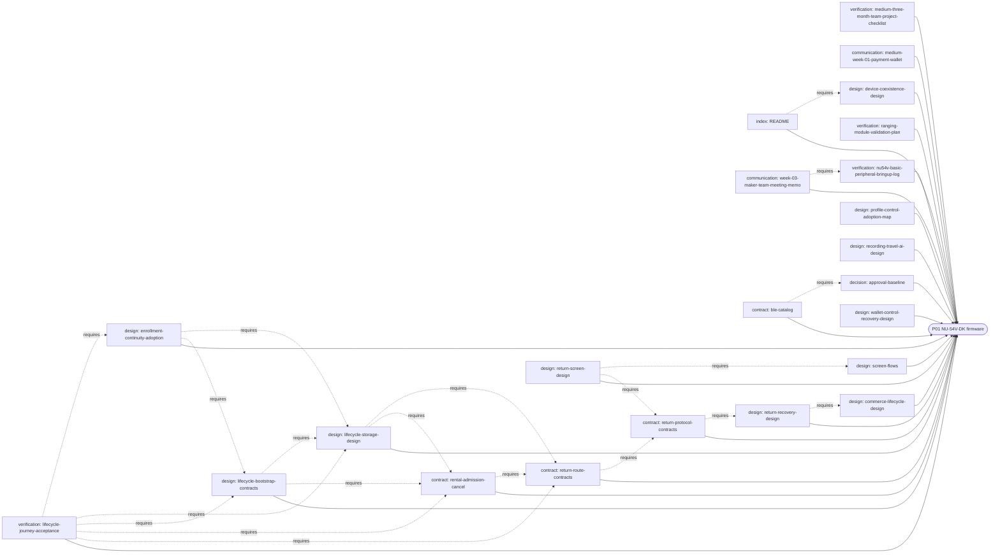
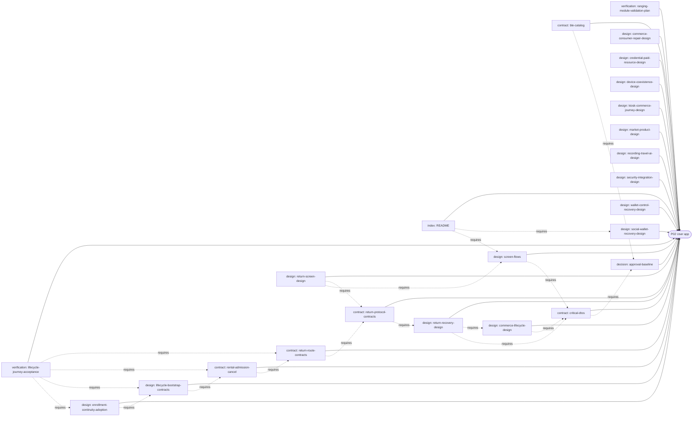
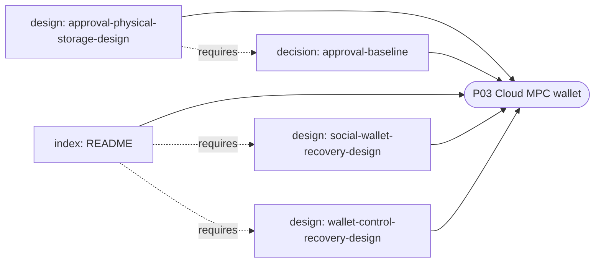
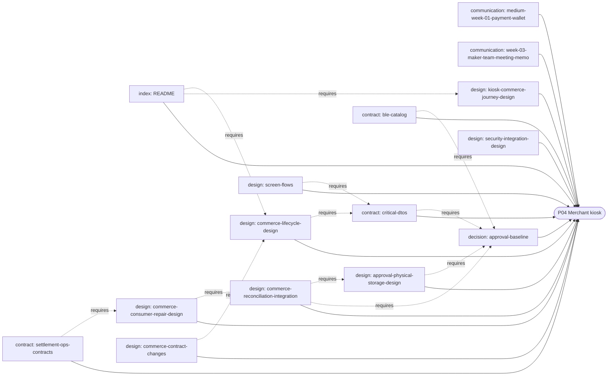
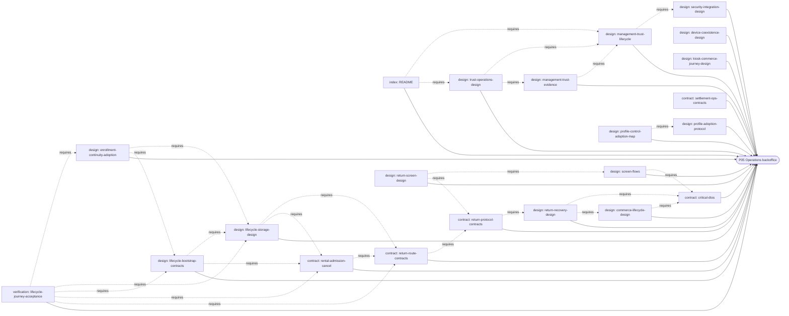
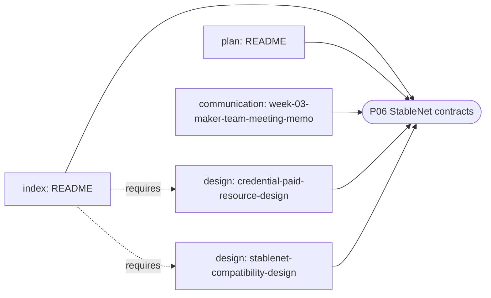
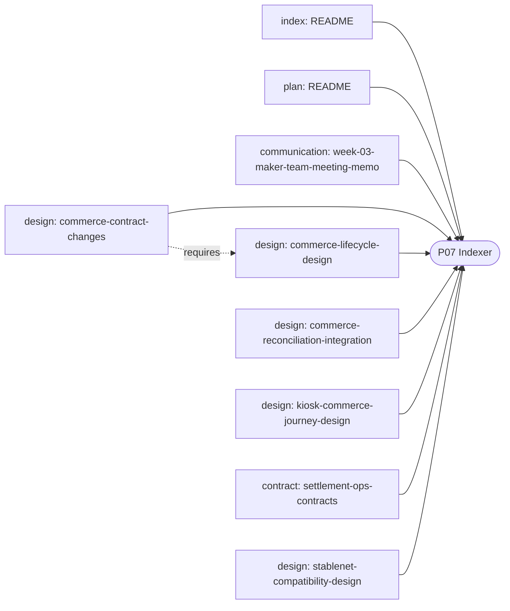
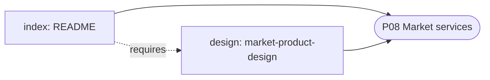
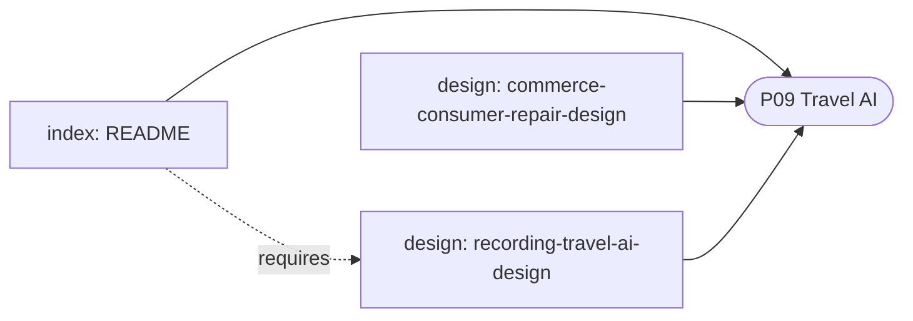
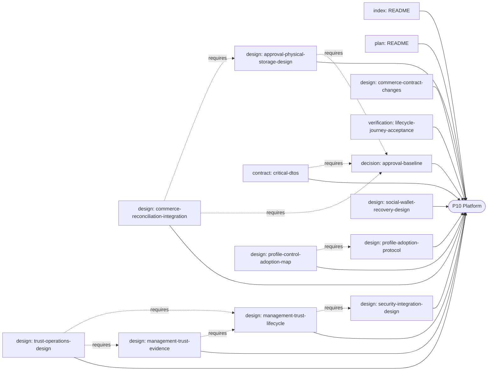

# X-bar document graph findings

Generated by `build_xbar_graph.py`; do not edit by hand. Method: [METHOD.md](METHOD.md).

- Documents: 137 · nodes: 349 · edges: 1409
- Authority: current=52, draft=37, historical=9, reference=14, superseded=23, withdrawn=2
- Head types: communication=11, contract=20, decision=5, design=36, index=16, plan=18, requirement=3, research=16, verification=12
- Missing records: 0 · broken targets: 0 · stale complements: 11 · claim conflicts: 23 · orphans: 4

## Claim conflicts among live documents

- `acceptance.runtime.cases`
  - 23개 전부 not_run — `docs/content/specifications/rental-admission-cancel.md`
  - 18개 모두 not_run — `docs/content/specifications/return-route-contracts.md`
  - 18개 not_run — `docs/content/specifications/settlement-ops-contracts.md`
- `api.catalog.count`
  - 107 (VAL-03 판정 항목 표기) — `docs/content/planning/technology-validation-plan.md`
  - 110 — `docs/content/specifications/rental-admission-cancel.md`
  - 107 — `docs/content/specifications/return-protocol-contracts.md`
  - 107 — `docs/content/specifications/return-recovery-design.md`
  - 110 — `docs/content/specifications/return-route-contracts.md`
  - 107 — `docs/content/specifications/security-integration-design.md`
  - 110 — `docs/content/specifications/settlement-ops-contracts.md`
  - 107 — `docs/content/specifications/wallet-control-recovery-design.md`
- `api.count`
  - 110 — `REPOSITORY-CHECKPOINT.md`
  - 110 — `docs/content/analysis/document-logic/review.md`
  - 107 (승인 통합 후 110) — `docs/content/work-breakdown-plan.md`
  - 110 — `docs/content/specifications/access-transactions.md`
  - 110 — `docs/content/specifications/api-access-transactions.md`
  - 110 — `docs/content/specifications/api-catalog.md`
  - 110 — `docs/content/specifications/approval-baseline.md`
  - 110 — `docs/content/specifications/commerce-consumer-repair-design.md`
  - 107 (작성 당시 기준) — `docs/content/specifications/commerce-contract-changes.md`
  - 107 (작성 당시 기준) — `docs/content/specifications/commerce-lifecycle-design.md`
  - 110 — `docs/content/specifications/commerce-reconciliation-integration.md`
  - 110 — `docs/content/specifications/critical-dtos.md`
  - 110 — `docs/content/specifications/design-baseline-contract.md`
  - 110 — `docs/content/specifications/enrollment-continuity-adoption.md`
  - 107 (6행 문맥상 '현재 전체 107개 API') — `docs/content/specifications/extended-contracts.md`
  - 110 — `docs/content/specifications/interface-contracts.md`
  - 110 — `docs/content/specifications/kiosk-commerce-journey-design.md`
  - 110 — `docs/content/specifications/lifecycle-bootstrap-contracts.md`
  - 110 — `docs/content/specifications/profile-control-adoption-map.md`
- `chain.id`
  - 8283 — `docs/content/environment/README.md`
  - 8283 — `docs/content/twelve-week-completion-scope-v3.md`
  - 8283(0x205b) — `docs/content/planning/design-freeze-checkpoint.md`
  - 8283 — `docs/content/planning/product-worklist-and-12week-wbs.md`
  - 8283 — `docs/content/planning/remaining-work-list.md`
  - 8283(2026-09-17 관측값) — `docs/content/specifications/stablenet-compatibility-design.md`
- `db.reference_engine`
  - PostgreSQL 15 (비교용, 운영 DB 미정) — `docs/content/specifications/approval-physical-storage-design.md`
  - PostgreSQL 15 (참조 엔진 제안) — `docs/content/specifications/database/README.md`
- `db.table.count`
  - 61 — `docs/content/specifications/access-transactions.md`
  - 61 — `docs/content/specifications/approval-baseline.md`
  - 61 (기존, 변경 없음) — `docs/content/specifications/approval-physical-storage-design.md`
  - 61 — `docs/content/specifications/commerce-consumer-repair-design.md`
  - 61 — `docs/content/specifications/commerce-contract-changes.md`
  - 61 — `docs/content/specifications/data-model.md`
  - 61 — `docs/content/specifications/database/README.md`
  - 61 — `docs/content/specifications/database/tables.md`
- `decision.count`
  - 20 — `README.md`
  - 20 — `docs/content/analysis/document-logic/traceability-audit.md`
  - 20 — `docs/content/planning/design-freeze-checkpoint.md`
  - 19 — `docs/content/specifications/kiosk-commerce-journey-design.md`
- `decision.status`
  - 19개 결정과 RR-DEC-01 미선택 — `docs/content/planning/design-closure-review.md`
  - 20개 선택 완료 — `docs/content/planning/design-freeze-checkpoint.md`
- `design.package`
  - DS-06 — `docs/content/specifications/credential-paid-resource-design.md`
  - DS-02 — `docs/content/specifications/social-wallet-recovery-design.md`
- `firmware.sdk`
  - NCS v3.4.0 / Zephyr 4.4 계열 — `docs/content/planning/design-freeze-checkpoint.md`
  - Zephyr; SDK 배포판·버전·NU board target 미선정 — `docs/content/planning/implementation-sequence.md`
- `firmware.sdk.selected`
  - None — `docs/content/specifications/device-coexistence-design.md`
  - 미선정 — `docs/content/specifications/implementation-interfaces.md`
- `kiosk.platform`
  - Android 태블릿 React Native — `products/p04-merchant-kiosk/README.md`
  - Android 태블릿, React Native — `docs/content/week-03-maker-team-meeting-memo.md`
- `milestone.m2.content`
  - NU approval → EOA submission → indexer confirmation → kiosk receipt — `docs/content/medium-three-month-team-project-en.md`
  - NU 승인 → EOA 제출 → Indexer 확정 → 키오스크 영수증 — `docs/content/medium-three-month-team-project.md`
- `milestone.m2.week`
  - 4 — `docs/content/medium-three-month-team-project-en.md`
  - 4 — `docs/content/medium-three-month-team-project.md`
  - 4 (NU 승인→EOA→Indexer→paid→키오스크 영수증) — `docs/content/planning/product-wbs-overview.md`
  - 4 — `docs/content/planning/product-worklist-and-12week-wbs.md`
- `recovery.rr_dec_01.selection`
  - 미선택 — `docs/content/specifications/lifecycle-journey-acceptance.md`
  - 미답변 — `docs/content/specifications/lifecycle-storage-design.md`
- `return.recovery.policy`
  - 미결정(RECOVERY_POLICY_UNRESOLVED 시 신규 commit 거절) — `docs/content/specifications/return-protocol-contracts.md`
  - 사용자 선택 대기 — `docs/content/specifications/return-screen-design.md`
- `scope.decision.count`
  - 19 — `docs/content/work-breakdown-plan.md`
  - 20 (D01~D19 + RR-DEC-01), 모두 선택 — `docs/content/planning/remaining-work-list.md`
  - 19 — `docs/content/specifications/stablenet-compatibility-design.md`
  - 19 — `docs/content/specifications/wallet-control-recovery-design.md`
- `scope.task.count`
  - 104 — `docs/content/planning/design-closure-review.md`
  - 104 — `docs/content/planning/execution-readiness.md`
  - 104 — `docs/content/planning/implementation-sequence.md`
  - 104 — `docs/content/planning/preimplementation-task-handoffs.md`
  - 104 (표 열 이름은 '세부 작업') — `docs/content/planning/product-wbs-overview.md`
  - 104 — `docs/content/planning/product-worklist-and-12week-wbs.md`
  - 104 — `docs/content/planning/remaining-work-list.md`
  - 104 (패키지로 표기) — `docs/content/planning/technology-validation-plan.md`
  - 104 (세부 320) — `docs/content/specifications/approval-baseline.md`
  - 104 — `docs/content/specifications/commerce-lifecycle-design.md`
  - 104 — `docs/content/specifications/stablenet-compatibility-design.md`
- `security.storage.logical_resource.count`
  - 28 — `docs/content/specifications/approval-baseline.md`
  - 15 — `docs/content/specifications/data-model.md`
- `task.execution.status`
  - 모든 세부 작업 미실행 — `docs/content/planning/execution-readiness.md`
  - not_run — `docs/content/planning/preimplementation-task-handoffs.md`
- `task.readiness.status`
  - 착수 가능 여부 미평가 — `docs/content/planning/execution-readiness.md`
  - not_assessed — `docs/content/planning/implementation-sequence.md`
- `team.size`
  - 3 — `docs/content/medium-three-month-team-project-en.md`
  - 3 — `docs/content/medium-three-month-team-project.md`
  - 3명 — `docs/content/twelve-week-completion-scope-v3.md`
  - 3 — `docs/content/planning/implementation-sequence.md`
  - 3 — `docs/content/specifications/lifecycle-journey-acceptance.md`
  - 3 — `docs/content/specifications/wallet-control-recovery-design.md`
- `wallet.mpc.threshold`
  - 2-of-3 — `products/p03-cloud-mpc-wallet/README.md`
  - 2-of-3 — `docs/content/medium-three-month-team-project-en.md`
  - 2-of-3 — `docs/content/medium-three-month-team-project.md`
  - 2-of-3 — `docs/content/series/README.md`
  - 미정 (2-of-3 또는 특정 벤더 확정하지 않음) — `docs/content/twelve-week-completion-scope-v3.md`
  - 2-of-3 ECDSA (cb-mpc/cb-mpc-go v0.2.1) — `docs/content/planning/design-freeze-checkpoint.md`
  - 2-of-3 — `docs/content/planning/product-worklist-and-12week-wbs.md`
  - 2-of-3 (cb-mpc) — `docs/content/planning/remaining-work-list.md`
  - 2-of-3 (A+B+C) 우선 비교 후보, 미선택 — `docs/content/specifications/wallet-control-recovery-design.md`

## Live documents that require superseded or withdrawn documents

- `products/p07-indexer/README.md` requires `docs/content/indexer-integration-and-test-token.md` (superseded)
- `docs/content/ranging-module-validation-plan.md` requires `docs/content/payment-platform-scope-v2.md` (superseded)
- `docs/content/planning/design-closure-review.md` requires `docs/content/planning/preimplementation-handoff.md` (superseded)
- `docs/content/planning/functional-execution-spec.md` requires `docs/content/planning/work-cards.md` (historical)
- `docs/content/planning/functional-execution-spec.md` requires `docs/content/planning/decisions.md` (superseded)
- `docs/content/planning/technology-validation-plan.md` requires `docs/content/planning/technology-selection.md` (superseded)
- `docs/content/specifications/commerce-lifecycle-design.md` requires `docs/content/specifications/security-api-integration.md` (historical)
- `docs/content/specifications/extended-dtos.md` requires `docs/content/specifications/security-api-integration.md` (historical)
- `docs/content/specifications/preimplementation-contract-overlay.md` requires `docs/content/planning/preimplementation-handoff.md` (superseded)
- `docs/content/specifications/profile-adoption-protocol.md` requires `docs/content/planning/integration-adoption-matrix.md` (superseded)
- `docs/content/specifications/selection-profile-contract.md` requires `docs/content/planning/decision-briefing.md` (superseded)

## Broken targets

## Live documents nothing depends on

- `docs/content/medium-three-month-team-project-checklist.md`
- `docs/content/medium-three-month-team-project-en.md`
- `docs/content/series/README.md`
- `docs/content/week-03-maker-team-meeting-memo.md`

## Open questions by product

### ALL
- x-theory 정의 미확인 — `docs/content/analysis/document-logic/review.md`
- 실제 재개·중단 지원과 분산 저장·서명 검증 미수행(MPC) — `docs/content/analysis/document-logic/review.md`
- 수신 gate native 원자성·BLE 종료 표식 등 실기 검증 대상 — `docs/content/analysis/document-logic/review.md`
- NU-54V-DK revision, pin map, memory, secure-service capability require the actual board — `docs/content/analysis/document-logic/traceability-audit.md`
- OAuth, Kakao, OpenAI credentials registration outside repository — `docs/content/analysis/document-logic/traceability-audit.md`
- StableNet contract addresses disabled until deployment evidence — `docs/content/analysis/document-logic/traceability-audit.md`
- MPC, passkey BLE, FOTA, audio throughput, Chain Sounding and app journeys runtime-unverified — `docs/content/analysis/document-logic/traceability-audit.md`
- Commercial use requires legal and provider-terms review — `docs/content/analysis/document-logic/traceability-audit.md`
- 팀원별 주당 가능 시간과 대면 작업 시간 — `docs/content/medium-three-month-team-project.md`
- 보드 리비전·Zephyr 타깃·핀·메모리·BLE 전송량 — `docs/content/medium-three-month-team-project.md`
- MPC 조각 보관·복구 주체·도입 방식 — `docs/content/twelve-week-completion-scope-v3.md`
- 패스키 대상 서비스·OS·전송 방식 — `docs/content/twelve-week-completion-scope-v3.md`
- 실제 결제 데이터 범위와 실제 USDC 필수 여부 — `docs/content/twelve-week-completion-scope-v3.md`
- FX·DeFi·STO·DID·x402 상품/프로토콜 경계 — `docs/content/twelve-week-completion-scope-v3.md`
- FOTA·녹음·찾기 성능/용량/배터리 기준 — `docs/content/twelve-week-completion-scope-v3.md`
- 환불·정산·혜택·위치 데이터 운영 정책 — `docs/content/twelve-week-completion-scope-v3.md`
- SDK 배포판·Zephyr 버전·NU board target — `docs/content/work-breakdown-plan.md`
- 역할·공수 배정 — `docs/content/work-breakdown-plan.md`
- 실제 USDC 조달 여부 — `docs/content/work-breakdown-plan.md`
- CS-01 관련 선택 고정(awaiting_selections) — `docs/content/planning/design-closure-review.md`
- CS-02 선정 모델 구체 계약 — `docs/content/planning/design-closure-review.md`
- CS-03 공통 채택 checkpoint(candidate_not_merged) — `docs/content/planning/design-closure-review.md`
- CS-04 구현 전환 지시(deferred_by_user) — `docs/content/planning/design-closure-review.md`
- NU-54V-DK 실제 revision·pin·flash/RAM·secure service 측정 — `docs/content/planning/design-freeze-checkpoint.md`
- Google·Apple·Kakao·OpenAI 계정·secret 등록 — `docs/content/planning/design-freeze-checkpoint.md`
- StableNet 계약 배포 주소·code hash·ABI digest 미등록 — `docs/content/planning/design-freeze-checkpoint.md`
- MPC·BLE passkey·오디오·FOTA·거리 측정·12개 통합 여정 미실행 — `docs/content/planning/design-freeze-checkpoint.md`
- 실자산·실권리·상용 대여 법률·약관 검토 — `docs/content/planning/design-freeze-checkpoint.md`
- 빌드·실행 전 SDK/board/provider/chain profile 선택·기록 필요 — `docs/content/planning/execution-readiness.md`
- 폰·키오스크 연결 동시 유지/전환은 HW-07 실기 검증 후 고정 — `docs/content/planning/functional-execution-spec.md`
- 백엔드 배포 단위 미정 — `docs/content/planning/functional-execution-spec.md`
- confirmed 전 예약한 환불 한도 해제 방식 — `docs/content/planning/functional-execution-spec.md`
- 과거 사용 혜택 처리 정책 — `docs/content/planning/functional-execution-spec.md`
- Zephyr SDK 배포판·버전·NU board target 선정 — `docs/content/planning/implementation-sequence.md`
- 구현 착수는 사용자 지시 전까지 보류 — `docs/content/planning/implementation-sequence.md`
- 통합 입력: MPC protocol/provider/threshold/recovery policy — `docs/content/planning/preimplementation-task-handoffs.md`
- 통합 입력: 실제 NU board revision/pins/power, Zephyr/NCS/bootloader — `docs/content/planning/preimplementation-task-handoffs.md`
- 통합 입력: 실 chain identity·addresses/ABI/codehash·AA 버전·Indexer endpoint — `docs/content/planning/preimplementation-task-handoffs.md`
- 실제 담당자와 공수(세 사람의 주력 분야·주당 시간 입력 후 추가) — `docs/content/planning/product-worklist-and-12week-wbs.md`
- 구 client↔새 server 호환·부분 peer profile 적용 등 공통 검사 6개 미완 — `docs/content/planning/remaining-work-list.md`
- 실제 계정·키·주소 등록 — `docs/content/planning/remaining-work-list.md`
- 실운영 출시 검토(G-05)는 테스트넷 완료와 별도 — `docs/content/planning/remaining-work-list.md`
- 점주 역할 기본 권한은 제품 설정으로 확정할 대상 — `docs/content/specifications/access-transactions.md`
- GAP-01~05 adapter 선정·구현 검증 — `docs/content/specifications/access-transactions.md`
- GAP-04 폰 없이 결제한 주문의 영수증 연결 API/보관 방식 — `docs/content/specifications/access-transactions.md`
- 실제 다중 세션 잠금 검증은 구현 단계 — `docs/content/specifications/access-transactions.md`
- 실제 SQL GRANT는 배포 단위·role 결정 후 작성 — `docs/content/specifications/access-transactions.md`
- 모든 COMP 항목의 버전 값 미기입·실행 미검증 — `docs/content/specifications/compatibility-matrix.md`
- 보관 기간과 법적 보존 의무 — `docs/content/specifications/data-model.md`
- MPC 조각 제공 경로·회전·복구·철회 — `docs/content/specifications/data-model.md`
- 원음/위치 기본 설정·보관 기간 — `docs/content/specifications/data-model.md`
- 백업 복구 목표·주기·키 관리 — `docs/content/specifications/data-model.md`
- 운영 DB 선정 — `docs/content/specifications/database/README.md`
- 다중 세션 경쟁·잠금·앱 권한 검증 — `docs/content/specifications/database/README.md`
- 운영 forward fix·백업 복구·배포 중단 기준 — `docs/content/specifications/database/README.md`
- migration 실행 권한과 앱 권한 분리 배포 — `docs/content/specifications/database/README.md`
- 생성 schema·후속 migration·실제 profile·배포 manifest·runtime 수용 증거 통과 전까지 실행 비활성 — `docs/content/specifications/design-baseline-contract.md`
- profile별 상세 payload — `docs/content/specifications/extended-contracts.md`
- 보안 adapter의 실제 저장 매핑 — `docs/content/specifications/extended-contracts.md`
- 실제 ABI/주소 manifest — `docs/content/specifications/extended-contracts.md`
- 하드웨어 전송 profile — `docs/content/specifications/extended-contracts.md`
- DB 엔진·호스팅 제공자 — `docs/content/specifications/extended-contracts.md`
- ProfileInput 내부 profile별 검증기 미선정 — `docs/content/specifications/extended-dtos.md`
- Zephyr revision, SDK 배포판(NCS 포함 여부), NU board target, toolchain, crypto/controller 조합 미선정 — `docs/content/specifications/implementation-interfaces.md`
- GATT UUID·MTU·코덱·프레이밍·암호 suite — `docs/content/specifications/interface-contracts.md`
- 실제 브로커 — `docs/content/specifications/interface-contracts.md`
- DB 엔진·DDL — `docs/content/specifications/interface-contracts.md`
- BLE transport profile(HW-03) — `docs/content/specifications/interface-contracts.md`
- D11~16 상품 선택에 따른 actionInput — `docs/content/specifications/interface-contracts.md`
- OP-01 배포주소/ABI·Indexer endpoint — `docs/content/specifications/operations-release-acceptance-design.md`
- OP-02 RPO/RTO·latency/battery 목표 — `docs/content/specifications/operations-release-acceptance-design.md`
- OP-03 보관기간/삭제 SLA — `docs/content/specifications/operations-release-acceptance-design.md`
- OP-04 운영 role scope·키 회전·긴급접근 — `docs/content/specifications/operations-release-acceptance-design.md`
- OP-05 실자산 운영 모델 — `docs/content/specifications/operations-release-acceptance-design.md`
- API 번호·operationClass 미부여 — `docs/content/specifications/preimplementation-contract-overlay.md`
- profile manifest pin 전 wire codec/limit 미확정 — `docs/content/specifications/preimplementation-contract-overlay.md`
- 새 물리 DDL 별도 migration 문서 — `docs/content/specifications/preimplementation-contract-overlay.md`
- 현재 wire에 없는 subtype의 계약 고정 — `docs/content/specifications/selection-action-gates.md`
- 선택 필드별 실제 값·버전·근거 — `docs/content/specifications/selection-profile-contract.md`
- action/branch별 schema·권한·원자 저장·호환 reader 고정 — `docs/content/specifications/selection-profile-contract.md`
- DB 엔진·SQL 문법·partial unique index 등 구체 수단 — `docs/content/specifications/storage-operations.md`
- nullable·FK·삭제 규칙·마이그레이션 순서 — `docs/content/specifications/storage-operations.md`

### P01
- 실제 board revision, pin, flash/RAM, bootloader와 BLE 처리량 — `products/p01-device-firmware/README.md`
- 실물 보드 모델명·리비전 — `docs/content/medium-three-month-team-project-checklist.md`
- SDK·Zephyr·툴체인·보드 타깃 — `docs/content/medium-three-month-team-project-checklist.md`
- BLE 광고·GATT 결과 — `docs/content/medium-three-month-team-project-checklist.md`
- 공개 전 민감정보 제거 — `docs/content/medium-three-month-team-project-checklist.md`
- 거리 측정 안정성 — `docs/content/medium-week-01-payment-wallet.md`
- 키 보관·서명 지원 범위 — `docs/content/medium-week-01-payment-wallet.md`
- 제스처 오인식 — `docs/content/medium-week-01-payment-wallet.md`
- 휴대용 전원 구성 — `docs/content/medium-week-01-payment-wallet.md`
- 디버거 결정 — `docs/content/medium-week-01-payment-wallet.md`
- 보드 리비전·SoC 표기·내장 디버거·기본 LED/버튼 — `docs/content/nu54v-basic-peripheral-bringup-log.md`
- SDK/Zephyr/툴체인/보드 타깃 — `docs/content/nu54v-basic-peripheral-bringup-log.md`
- Flash·RAM·부팅 시간 — `docs/content/nu54v-basic-peripheral-bringup-log.md`
- 보드 리비전·폰 OS·빌드 호환성 — `docs/content/ranging-module-validation-plan.md`
- 정확도와 로그인 거리 임계값 — `docs/content/ranging-module-validation-plan.md`
- NU 보드 reflector 포팅 — `docs/content/ranging-module-validation-plan.md`
- 요청 만료 시간(초) — `docs/content/week-03-maker-team-meeting-memo.md`
- 버튼 길게 누름(초) — `docs/content/week-03-maker-team-meeting-memo.md`
- 확정으로 볼 블록 수 — `docs/content/week-03-maker-team-meeting-memo.md`
- 디스플레이 모델·인터페이스 — `docs/content/week-03-maker-team-meeting-memo.md`
- 배터리·충전 모듈 — `docs/content/week-03-maker-team-meeting-memo.md`
- 역할 담당자·발표자 — `docs/content/week-03-maker-team-meeting-memo.md`
- 승인 ancestry·provenance 등 새 물리 제약의 SQL 반영·실행 검증 — `docs/content/specifications/approval-baseline.md`
- smart_account/market_action/credential_proof/paid_resource adapter 미등록 — `docs/content/specifications/approval-baseline.md`
- crypto/profile/실기 호환 24개 시나리오·COMP 26개 미검증 — `docs/content/specifications/approval-baseline.md`
- RR-DEC-01과 MPC/지갑 정책 사용자 선택 — `docs/content/specifications/approval-baseline.md`
- 실제 GATT/codec/profile/실기 호환 검증 — `docs/content/specifications/ble-catalog.md`
- D08 분할 지급·늦은 지급·예외 환불 정책 — `docs/content/specifications/commerce-lifecycle-design.md`
- timeout 숫자·재시도 횟수(D19) — `docs/content/specifications/commerce-lifecycle-design.md`
- 늦은 자산 복구 정책과 하드웨어 보호 profile — `docs/content/specifications/commerce-lifecycle-design.md`
- control_deadline·crypto_nonpreemptible_time·flash_erase_write_latency 등 measurementVariables selectedValue None — `docs/content/specifications/device-coexistence-design.md`
- DC-X02 apply_prepare_control의 별도 wire 명령 미등록 — `docs/content/specifications/device-coexistence-design.md`
- 원 holder 분실 복구 — `docs/content/specifications/enrollment-continuity-adoption.md`
- 철회 후 재승인 — `docs/content/specifications/enrollment-continuity-adoption.md`
- staged/unknown 등록의 안전한 회수 — `docs/content/specifications/enrollment-continuity-adoption.md`
- profile과 보드 능력 검증 — `docs/content/specifications/enrollment-continuity-adoption.md`
- root/profile과 실제 보드 능력 — `docs/content/specifications/lifecycle-bootstrap-contracts.md`
- 예약 후 holder/session 복구 — `docs/content/specifications/lifecycle-bootstrap-contracts.md`
- 동의 철회 후속 처리 — `docs/content/specifications/lifecycle-bootstrap-contracts.md`
- 새 논리 자원의 물리 저장·버전·권한 채택 — `docs/content/specifications/lifecycle-bootstrap-contracts.md`
- LJG-01 RR-DEC-01 신규 여행 지갑 복구 정책 — `docs/content/specifications/lifecycle-journey-acceptance.md`
- LJG-02 원 holder 분실·철회 후 재승인 — `docs/content/specifications/lifecycle-journey-acceptance.md`
- LJG-03 staged/unknown 등록 회수 — `docs/content/specifications/lifecycle-journey-acceptance.md`
- LJG-04 출고 root·암호/삭제/영속 profile — `docs/content/specifications/lifecycle-journey-acceptance.md`
- LJG-05 최종 wire/SQL/권한/화면 공동 채택 — `docs/content/specifications/lifecycle-journey-acceptance.md`
- epoch 표현 범위(기기 profile 선정 전) — `docs/content/specifications/lifecycle-storage-design.md`
- 다형 owner 참조의 FK/무결성 경계 — `docs/content/specifications/lifecycle-storage-design.md`
- SDK/board target·보안 profile — `docs/content/specifications/lifecycle-storage-design.md`
- RR-DEC-01 — `docs/content/specifications/lifecycle-storage-design.md`
- management trust profile·wire codec/limit·lease·proof suite 미선정 — `docs/content/specifications/profile-control-adoption-map.md`
- 물리 저장/registry 일관성 미검증 — `docs/content/specifications/profile-control-adoption-map.md`
- API020/107 typed reader 및 BLE 신규 command schema 미채택 — `docs/content/specifications/profile-control-adoption-map.md`
- TP-01 녹음 codec/sampleRate/buffer — `docs/content/specifications/recording-travel-ai-design.md`
- TP-02 지도/장소/후기 provider — `docs/content/specifications/recording-travel-ai-design.md`
- TP-03 목적별 동의/보관기간 — `docs/content/specifications/recording-travel-ai-design.md`
- TP-04 코스 평가 합격률 — `docs/content/specifications/recording-travel-ai-design.md`
- TP-05 보상사용 후 증거철회 — `docs/content/specifications/recording-travel-ai-design.md`
- TP-06 STT/AI provider·model·지역 — `docs/content/specifications/recording-travel-ai-design.md`
- 출고 증거와 등록 holder bootstrap — `docs/content/specifications/rental-admission-cancel.md`
- 수령인 동의 발급 — `docs/content/specifications/rental-admission-cancel.md`
- 기기 보호 저장·antirollback — `docs/content/specifications/rental-admission-cancel.md`
- profile·버전 협상 — `docs/content/specifications/rental-admission-cancel.md`
- 기존 경로/화면/권한 병합 — `docs/content/specifications/rental-admission-cancel.md`
- RR-DEC-01 복구 정책 미답변 — `docs/content/specifications/rental-admission-cancel.md`
- 신규 여행 지갑 복구 정책 — `docs/content/specifications/return-protocol-contracts.md`
- NU 신원/부트·저장·epoch 보호 profile — `docs/content/specifications/return-protocol-contracts.md`
- 서명/암호화/정규화 profile — `docs/content/specifications/return-protocol-contracts.md`
- relay 발급·증거 접수·cleanup 실제 endpoint/명령 및 버전 협상 — `docs/content/specifications/return-protocol-contracts.md`
- 신규 여행 지갑 늦은 자산 복구 정책(개인 암호화 백업 여부) — `docs/content/specifications/return-recovery-design.md`
- NU 장치 신원/세대·journal 보호 방식 — `docs/content/specifications/return-recovery-design.md`
- recovery relay 인증/암호화 profile — `docs/content/specifications/return-recovery-design.md`
- commit·완료·재대여 gate 요청/응답 타입 — `docs/content/specifications/return-recovery-design.md`
- 기기 상대시간 허용값 — `docs/content/specifications/return-recovery-design.md`
- SDK/board target — `docs/content/specifications/return-route-contracts.md`
- 보호 저장/epoch/저널 능력과 proof/profile — `docs/content/specifications/return-route-contracts.md`
- RR-DEC-01 개인 복구 백업 정책 — `docs/content/specifications/return-route-contracts.md`
- API045 등록 분기와 grant 발급 전 취소 계약 — `docs/content/specifications/return-route-contracts.md`
- 반납 물리 저장·이행안 — `docs/content/specifications/return-route-contracts.md`
- 신규 여행 지갑 개인 암호화 백업 여부 — `docs/content/specifications/return-screen-design.md`
- 반납 도움 받기 실제 지원 채널·응답 기준 — `docs/content/specifications/return-screen-design.md`
- 기기 화면 크기·최종 시각 디자인 — `docs/content/specifications/return-screen-design.md`
- 영어 번역 검수 — `docs/content/specifications/return-screen-design.md`
- 실제 라우트/페이지 수 — `docs/content/specifications/screen-flows.md`
- 담당자·공수 배정 — `docs/content/specifications/screen-flows.md`
- WC-P01 HW·Cloud 별도 주소 — `docs/content/specifications/wallet-control-recovery-design.md`
- WC-P02 MPC C 운영 주체·B+C 권한 — `docs/content/specifications/wallet-control-recovery-design.md`
- WC-P03 신규 여행 지갑 복구 백업(RR-DEC-01 답변 대기) — `docs/content/specifications/wallet-control-recovery-design.md`
- WC-P04 로그아웃·탈퇴 키 삭제·보관 정책 — `docs/content/specifications/wallet-control-recovery-design.md`

### P02
- 보드 리비전·폰 OS·빌드 호환성 — `docs/content/ranging-module-validation-plan.md`
- 정확도와 로그인 거리 임계값 — `docs/content/ranging-module-validation-plan.md`
- NU 보드 reflector 포팅 — `docs/content/ranging-module-validation-plan.md`
- 승인 ancestry·provenance 등 새 물리 제약의 SQL 반영·실행 검증 — `docs/content/specifications/approval-baseline.md`
- smart_account/market_action/credential_proof/paid_resource adapter 미등록 — `docs/content/specifications/approval-baseline.md`
- crypto/profile/실기 호환 24개 시나리오·COMP 26개 미검증 — `docs/content/specifications/approval-baseline.md`
- RR-DEC-01과 MPC/지갑 정책 사용자 선택 — `docs/content/specifications/approval-baseline.md`
- 실제 GATT/codec/profile/실기 호환 검증 — `docs/content/specifications/ble-catalog.md`
- D08 최초수락/부분지급/예외반환 정책 — `docs/content/specifications/commerce-consumer-repair-design.md`
- 소비된 혜택·부분환불·챌린지 보상 보정 정책과 규칙 버전 — `docs/content/specifications/commerce-consumer-repair-design.md`
- 정산 attribution/마감/보정 승인 규칙 — `docs/content/specifications/commerce-consumer-repair-design.md`
- D02 source manifest provider·일관성 모델·물리 저장/브로커 — `docs/content/specifications/commerce-consumer-repair-design.md`
- D19 경보 임계값·운영 보관 기간 — `docs/content/specifications/commerce-consumer-repair-design.md`
- D08 분할 지급·늦은 지급·예외 환불 정책 — `docs/content/specifications/commerce-lifecycle-design.md`
- timeout 숫자·재시도 횟수(D19) — `docs/content/specifications/commerce-lifecycle-design.md`
- 늦은 자산 복구 정책과 하드웨어 보호 profile — `docs/content/specifications/commerce-lifecycle-design.md`
- D14 시험 권리/issuer/대표행위·contract 제한 — `docs/content/specifications/credential-paid-resource-design.md`
- D15 DID method·VC format/proof suite·registry·status 방식 — `docs/content/specifications/credential-paid-resource-design.md`
- D16 x402 버전·scheme·StableNet binding·facilitator — `docs/content/specifications/credential-paid-resource-design.md`
- 유료자원 가격/제공기한/환불 규칙 — `docs/content/specifications/credential-paid-resource-design.md`
- D19 보관기간·운영권한 — `docs/content/specifications/credential-paid-resource-design.md`
- 후속 commerce/return 후보의 전체 병합 — `docs/content/specifications/critical-dtos.md`
- RR-DEC-01 미응답 — `docs/content/specifications/critical-dtos.md`
- control_deadline·crypto_nonpreemptible_time·flash_erase_write_latency 등 measurementVariables selectedValue None — `docs/content/specifications/device-coexistence-design.md`
- DC-X02 apply_prepare_control의 별도 wire 명령 미등록 — `docs/content/specifications/device-coexistence-design.md`
- 원 holder 분실 복구 — `docs/content/specifications/enrollment-continuity-adoption.md`
- 철회 후 재승인 — `docs/content/specifications/enrollment-continuity-adoption.md`
- staged/unknown 등록의 안전한 회수 — `docs/content/specifications/enrollment-continuity-adoption.md`
- profile과 보드 능력 검증 — `docs/content/specifications/enrollment-continuity-adoption.md`
- KP-01~ policyInputs selection None — `docs/content/specifications/kiosk-commerce-journey-design.md`
- KP05 고객용 독립 결과 조회 증명 발급/전달 profile 미선정 — `docs/content/specifications/kiosk-commerce-journey-design.md`
- API023 후속 세션 admission 확장 채택·실기 검증 — `docs/content/specifications/kiosk-commerce-journey-design.md`
- root/profile과 실제 보드 능력 — `docs/content/specifications/lifecycle-bootstrap-contracts.md`
- 예약 후 holder/session 복구 — `docs/content/specifications/lifecycle-bootstrap-contracts.md`
- 동의 철회 후속 처리 — `docs/content/specifications/lifecycle-bootstrap-contracts.md`
- 새 논리 자원의 물리 저장·버전·권한 채택 — `docs/content/specifications/lifecycle-bootstrap-contracts.md`
- LJG-01 RR-DEC-01 신규 여행 지갑 복구 정책 — `docs/content/specifications/lifecycle-journey-acceptance.md`
- LJG-02 원 holder 분실·철회 후 재승인 — `docs/content/specifications/lifecycle-journey-acceptance.md`
- LJG-03 staged/unknown 등록 회수 — `docs/content/specifications/lifecycle-journey-acceptance.md`
- LJG-04 출고 root·암호/삭제/영속 profile — `docs/content/specifications/lifecycle-journey-acceptance.md`
- LJG-05 최종 wire/SQL/권한/화면 공동 채택 — `docs/content/specifications/lifecycle-journey-acceptance.md`
- MD-01 자산쌍·DEX/LP 모델 — `docs/content/specifications/market-product-design.md`
- MD-02 FX 모델 — `docs/content/specifications/market-product-design.md`
- 이하 policyInputs selection None — `docs/content/specifications/market-product-design.md`
- TP-01 녹음 codec/sampleRate/buffer — `docs/content/specifications/recording-travel-ai-design.md`
- TP-02 지도/장소/후기 provider — `docs/content/specifications/recording-travel-ai-design.md`
- TP-03 목적별 동의/보관기간 — `docs/content/specifications/recording-travel-ai-design.md`
- TP-04 코스 평가 합격률 — `docs/content/specifications/recording-travel-ai-design.md`
- TP-05 보상사용 후 증거철회 — `docs/content/specifications/recording-travel-ai-design.md`
- TP-06 STT/AI provider·model·지역 — `docs/content/specifications/recording-travel-ai-design.md`
- 출고 증거와 등록 holder bootstrap — `docs/content/specifications/rental-admission-cancel.md`
- 수령인 동의 발급 — `docs/content/specifications/rental-admission-cancel.md`
- 기기 보호 저장·antirollback — `docs/content/specifications/rental-admission-cancel.md`
- profile·버전 협상 — `docs/content/specifications/rental-admission-cancel.md`
- 기존 경로/화면/권한 병합 — `docs/content/specifications/rental-admission-cancel.md`
- RR-DEC-01 복구 정책 미답변 — `docs/content/specifications/rental-admission-cancel.md`
- 신규 여행 지갑 복구 정책 — `docs/content/specifications/return-protocol-contracts.md`
- NU 신원/부트·저장·epoch 보호 profile — `docs/content/specifications/return-protocol-contracts.md`
- 서명/암호화/정규화 profile — `docs/content/specifications/return-protocol-contracts.md`
- relay 발급·증거 접수·cleanup 실제 endpoint/명령 및 버전 협상 — `docs/content/specifications/return-protocol-contracts.md`
- 신규 여행 지갑 늦은 자산 복구 정책(개인 암호화 백업 여부) — `docs/content/specifications/return-recovery-design.md`
- NU 장치 신원/세대·journal 보호 방식 — `docs/content/specifications/return-recovery-design.md`
- recovery relay 인증/암호화 profile — `docs/content/specifications/return-recovery-design.md`
- commit·완료·재대여 gate 요청/응답 타입 — `docs/content/specifications/return-recovery-design.md`
- 기기 상대시간 허용값 — `docs/content/specifications/return-recovery-design.md`
- SDK/board target — `docs/content/specifications/return-route-contracts.md`
- 보호 저장/epoch/저널 능력과 proof/profile — `docs/content/specifications/return-route-contracts.md`
- RR-DEC-01 개인 복구 백업 정책 — `docs/content/specifications/return-route-contracts.md`
- API045 등록 분기와 grant 발급 전 취소 계약 — `docs/content/specifications/return-route-contracts.md`
- 반납 물리 저장·이행안 — `docs/content/specifications/return-route-contracts.md`
- 신규 여행 지갑 개인 암호화 백업 여부 — `docs/content/specifications/return-screen-design.md`
- 반납 도움 받기 실제 지원 채널·응답 기준 — `docs/content/specifications/return-screen-design.md`
- 기기 화면 크기·최종 시각 디자인 — `docs/content/specifications/return-screen-design.md`
- 영어 번역 검수 — `docs/content/specifications/return-screen-design.md`
- 실제 라우트/페이지 수 — `docs/content/specifications/screen-flows.md`
- 담당자·공수 배정 — `docs/content/specifications/screen-flows.md`
- Google/Apple OS SDK 경로·provider proof 형식 — `docs/content/specifications/security-integration-design.md`
- BLE 인증 profile·TTL·철회 전달 시간 — `docs/content/specifications/security-integration-design.md`
- 최초 관리자 bootstrap·승인 주체 — `docs/content/specifications/security-integration-design.md`
- 익명 claim ticket 전달/보관 — `docs/content/specifications/security-integration-design.md`
- 객체 저장 제품·키 관리·보관기간 — `docs/content/specifications/security-integration-design.md`
- providerSdk — `docs/content/specifications/social-wallet-recovery-design.md`
- mpcProvider — `docs/content/specifications/social-wallet-recovery-design.md`
- threshold — `docs/content/specifications/social-wallet-recovery-design.md`
- participantOperators — `docs/content/specifications/social-wallet-recovery-design.md`
- recoveryEvidenceProfile — `docs/content/specifications/social-wallet-recovery-design.md`
- hwCloudAddressPolicy — `docs/content/specifications/social-wallet-recovery-design.md`
- sessionTtl — `docs/content/specifications/social-wallet-recovery-design.md`
- recoveryDelay — `docs/content/specifications/social-wallet-recovery-design.md`
- WC-P01 HW·Cloud 별도 주소 — `docs/content/specifications/wallet-control-recovery-design.md`
- WC-P02 MPC C 운영 주체·B+C 권한 — `docs/content/specifications/wallet-control-recovery-design.md`
- WC-P03 신규 여행 지갑 복구 백업(RR-DEC-01 답변 대기) — `docs/content/specifications/wallet-control-recovery-design.md`
- WC-P04 로그아웃·탈퇴 키 삭제·보관 정책 — `docs/content/specifications/wallet-control-recovery-design.md`

### P03
- 승인 ancestry·provenance 등 새 물리 제약의 SQL 반영·실행 검증 — `docs/content/specifications/approval-baseline.md`
- smart_account/market_action/credential_proof/paid_resource adapter 미등록 — `docs/content/specifications/approval-baseline.md`
- crypto/profile/실기 호환 24개 시나리오·COMP 26개 미검증 — `docs/content/specifications/approval-baseline.md`
- RR-DEC-01과 MPC/지갑 정책 사용자 선택 — `docs/content/specifications/approval-baseline.md`
- 운영 DB·isolation level·writer 권한/trigger — `docs/content/specifications/approval-physical-storage-design.md`
- 보호 저장소와 키 관리 — `docs/content/specifications/approval-physical-storage-design.md`
- crypto profile/MPC 구성 — `docs/content/specifications/approval-physical-storage-design.md`
- replay 기록 등 보관 기간 — `docs/content/specifications/approval-physical-storage-design.md`
- 복구 watermark 근거(WAL/감사 원장/외부 authority) — `docs/content/specifications/approval-physical-storage-design.md`
- RR-DEC-01 — `docs/content/specifications/approval-physical-storage-design.md`
- providerSdk — `docs/content/specifications/social-wallet-recovery-design.md`
- mpcProvider — `docs/content/specifications/social-wallet-recovery-design.md`
- threshold — `docs/content/specifications/social-wallet-recovery-design.md`
- participantOperators — `docs/content/specifications/social-wallet-recovery-design.md`
- recoveryEvidenceProfile — `docs/content/specifications/social-wallet-recovery-design.md`
- hwCloudAddressPolicy — `docs/content/specifications/social-wallet-recovery-design.md`
- sessionTtl — `docs/content/specifications/social-wallet-recovery-design.md`
- recoveryDelay — `docs/content/specifications/social-wallet-recovery-design.md`
- WC-P01 HW·Cloud 별도 주소 — `docs/content/specifications/wallet-control-recovery-design.md`
- WC-P02 MPC C 운영 주체·B+C 권한 — `docs/content/specifications/wallet-control-recovery-design.md`
- WC-P03 신규 여행 지갑 복구 백업(RR-DEC-01 답변 대기) — `docs/content/specifications/wallet-control-recovery-design.md`
- WC-P04 로그아웃·탈퇴 키 삭제·보관 정책 — `docs/content/specifications/wallet-control-recovery-design.md`

### P04
- 거리 측정 안정성 — `docs/content/medium-week-01-payment-wallet.md`
- 키 보관·서명 지원 범위 — `docs/content/medium-week-01-payment-wallet.md`
- 제스처 오인식 — `docs/content/medium-week-01-payment-wallet.md`
- 휴대용 전원 구성 — `docs/content/medium-week-01-payment-wallet.md`
- 디버거 결정 — `docs/content/medium-week-01-payment-wallet.md`
- 요청 만료 시간(초) — `docs/content/week-03-maker-team-meeting-memo.md`
- 버튼 길게 누름(초) — `docs/content/week-03-maker-team-meeting-memo.md`
- 확정으로 볼 블록 수 — `docs/content/week-03-maker-team-meeting-memo.md`
- 디스플레이 모델·인터페이스 — `docs/content/week-03-maker-team-meeting-memo.md`
- 배터리·충전 모듈 — `docs/content/week-03-maker-team-meeting-memo.md`
- 역할 담당자·발표자 — `docs/content/week-03-maker-team-meeting-memo.md`
- 승인 ancestry·provenance 등 새 물리 제약의 SQL 반영·실행 검증 — `docs/content/specifications/approval-baseline.md`
- smart_account/market_action/credential_proof/paid_resource adapter 미등록 — `docs/content/specifications/approval-baseline.md`
- crypto/profile/실기 호환 24개 시나리오·COMP 26개 미검증 — `docs/content/specifications/approval-baseline.md`
- RR-DEC-01과 MPC/지갑 정책 사용자 선택 — `docs/content/specifications/approval-baseline.md`
- 운영 DB·isolation level·writer 권한/trigger — `docs/content/specifications/approval-physical-storage-design.md`
- 보호 저장소와 키 관리 — `docs/content/specifications/approval-physical-storage-design.md`
- crypto profile/MPC 구성 — `docs/content/specifications/approval-physical-storage-design.md`
- replay 기록 등 보관 기간 — `docs/content/specifications/approval-physical-storage-design.md`
- 복구 watermark 근거(WAL/감사 원장/외부 authority) — `docs/content/specifications/approval-physical-storage-design.md`
- RR-DEC-01 — `docs/content/specifications/approval-physical-storage-design.md`
- 실제 GATT/codec/profile/실기 호환 검증 — `docs/content/specifications/ble-catalog.md`
- D08 최초수락/부분지급/예외반환 정책 — `docs/content/specifications/commerce-consumer-repair-design.md`
- 소비된 혜택·부분환불·챌린지 보상 보정 정책과 규칙 버전 — `docs/content/specifications/commerce-consumer-repair-design.md`
- 정산 attribution/마감/보정 승인 규칙 — `docs/content/specifications/commerce-consumer-repair-design.md`
- D02 source manifest provider·일관성 모델·물리 저장/브로커 — `docs/content/specifications/commerce-consumer-repair-design.md`
- D19 경보 임계값·운영 보관 기간 — `docs/content/specifications/commerce-consumer-repair-design.md`
- D08 최초 수락·분할 지급·늦은 지급 반환 정책 — `docs/content/specifications/commerce-contract-changes.md`
- D02 버전 협상/물리 저장 구조 — `docs/content/specifications/commerce-contract-changes.md`
- LC-GAP-04~05는 다음 설계 — `docs/content/specifications/commerce-contract-changes.md`
- D08 분할 지급·늦은 지급·예외 환불 정책 — `docs/content/specifications/commerce-lifecycle-design.md`
- timeout 숫자·재시도 횟수(D19) — `docs/content/specifications/commerce-lifecycle-design.md`
- 늦은 자산 복구 정책과 하드웨어 보호 profile — `docs/content/specifications/commerce-lifecycle-design.md`
- D08 정책 선택 — `docs/content/specifications/commerce-reconciliation-integration.md`
- D02 버전/저장 adapter — `docs/content/specifications/commerce-reconciliation-integration.md`
- D19 기본 페이지/운영 임계값 — `docs/content/specifications/commerce-reconciliation-integration.md`
- RR-DEC-01 — `docs/content/specifications/commerce-reconciliation-integration.md`
- 후속 commerce/return 후보의 전체 병합 — `docs/content/specifications/critical-dtos.md`
- RR-DEC-01 미응답 — `docs/content/specifications/critical-dtos.md`
- KP-01~ policyInputs selection None — `docs/content/specifications/kiosk-commerce-journey-design.md`
- KP05 고객용 독립 결과 조회 증명 발급/전달 profile 미선정 — `docs/content/specifications/kiosk-commerce-journey-design.md`
- API023 후속 세션 admission 확장 채택·실기 검증 — `docs/content/specifications/kiosk-commerce-journey-design.md`
- 실제 라우트/페이지 수 — `docs/content/specifications/screen-flows.md`
- 담당자·공수 배정 — `docs/content/specifications/screen-flows.md`
- Google/Apple OS SDK 경로·provider proof 형식 — `docs/content/specifications/security-integration-design.md`
- BLE 인증 profile·TTL·철회 전달 시간 — `docs/content/specifications/security-integration-design.md`
- 최초 관리자 bootstrap·승인 주체 — `docs/content/specifications/security-integration-design.md`
- 익명 claim ticket 전달/보관 — `docs/content/specifications/security-integration-design.md`
- 객체 저장 제품·키 관리·보관기간 — `docs/content/specifications/security-integration-design.md`
- D02 버전·저장/일관성 protocol — `docs/content/specifications/settlement-ops-contracts.md`
- D19 목록 기본값·운영 임계값 — `docs/content/specifications/settlement-ops-contracts.md`
- 정산 기간/보정 정책 — `docs/content/specifications/settlement-ops-contracts.md`
- 제안 운영 권한 scope — `docs/content/specifications/settlement-ops-contracts.md`
- RR-DEC-01 — `docs/content/specifications/settlement-ops-contracts.md`

### P05
- D08 분할 지급·늦은 지급·예외 환불 정책 — `docs/content/specifications/commerce-lifecycle-design.md`
- timeout 숫자·재시도 횟수(D19) — `docs/content/specifications/commerce-lifecycle-design.md`
- 늦은 자산 복구 정책과 하드웨어 보호 profile — `docs/content/specifications/commerce-lifecycle-design.md`
- 후속 commerce/return 후보의 전체 병합 — `docs/content/specifications/critical-dtos.md`
- RR-DEC-01 미응답 — `docs/content/specifications/critical-dtos.md`
- control_deadline·crypto_nonpreemptible_time·flash_erase_write_latency 등 measurementVariables selectedValue None — `docs/content/specifications/device-coexistence-design.md`
- DC-X02 apply_prepare_control의 별도 wire 명령 미등록 — `docs/content/specifications/device-coexistence-design.md`
- 원 holder 분실 복구 — `docs/content/specifications/enrollment-continuity-adoption.md`
- 철회 후 재승인 — `docs/content/specifications/enrollment-continuity-adoption.md`
- staged/unknown 등록의 안전한 회수 — `docs/content/specifications/enrollment-continuity-adoption.md`
- profile과 보드 능력 검증 — `docs/content/specifications/enrollment-continuity-adoption.md`
- KP-01~ policyInputs selection None — `docs/content/specifications/kiosk-commerce-journey-design.md`
- KP05 고객용 독립 결과 조회 증명 발급/전달 profile 미선정 — `docs/content/specifications/kiosk-commerce-journey-design.md`
- API023 후속 세션 admission 확장 채택·실기 검증 — `docs/content/specifications/kiosk-commerce-journey-design.md`
- root/profile과 실제 보드 능력 — `docs/content/specifications/lifecycle-bootstrap-contracts.md`
- 예약 후 holder/session 복구 — `docs/content/specifications/lifecycle-bootstrap-contracts.md`
- 동의 철회 후속 처리 — `docs/content/specifications/lifecycle-bootstrap-contracts.md`
- 새 논리 자원의 물리 저장·버전·권한 채택 — `docs/content/specifications/lifecycle-bootstrap-contracts.md`
- LJG-01 RR-DEC-01 신규 여행 지갑 복구 정책 — `docs/content/specifications/lifecycle-journey-acceptance.md`
- LJG-02 원 holder 분실·철회 후 재승인 — `docs/content/specifications/lifecycle-journey-acceptance.md`
- LJG-03 staged/unknown 등록 회수 — `docs/content/specifications/lifecycle-journey-acceptance.md`
- LJG-04 출고 root·암호/삭제/영속 profile — `docs/content/specifications/lifecycle-journey-acceptance.md`
- LJG-05 최종 wire/SQL/권한/화면 공동 채택 — `docs/content/specifications/lifecycle-journey-acceptance.md`
- epoch 표현 범위(기기 profile 선정 전) — `docs/content/specifications/lifecycle-storage-design.md`
- 다형 owner 참조의 FK/무결성 경계 — `docs/content/specifications/lifecycle-storage-design.md`
- SDK/board target·보안 profile — `docs/content/specifications/lifecycle-storage-design.md`
- RR-DEC-01 — `docs/content/specifications/lifecycle-storage-design.md`
- TP-01 OOB·최초 설치 증거 발급·검증 주체 — `docs/content/specifications/management-trust-evidence.md`
- TP-02 suite·정규화·승인 수 — `docs/content/specifications/management-trust-evidence.md`
- TP-03 소비/세대 seal 보호 저장 — `docs/content/specifications/management-trust-evidence.md`
- TP-04 독립 복구 채널 — `docs/content/specifications/management-trust-evidence.md`
- TP-05 시간 근거·오차 — `docs/content/specifications/management-trust-evidence.md`
- TP-06 보관 기간·삭제 권한 — `docs/content/specifications/management-trust-evidence.md`
- TP-01~06 selection 모두 null(승인자 수·suite·보호 저장·recovery authority·유효기간·보존) — `docs/content/specifications/management-trust-lifecycle.md`
- 관리 신뢰 root/서명 형식 — `docs/content/specifications/profile-adoption-protocol.md`
- cohort 범위·lease 수명·offline 허용 action — `docs/content/specifications/profile-adoption-protocol.md`
- 동일 scope 중첩·저장 원자 경계 — `docs/content/specifications/profile-adoption-protocol.md`
- native 적용/재시작·peer attestation 증거 — `docs/content/specifications/profile-adoption-protocol.md`
- schema/ACL/ABI/물리 migration 채택값 — `docs/content/specifications/profile-adoption-protocol.md`
- management trust profile·wire codec/limit·lease·proof suite 미선정 — `docs/content/specifications/profile-control-adoption-map.md`
- 물리 저장/registry 일관성 미검증 — `docs/content/specifications/profile-control-adoption-map.md`
- API020/107 typed reader 및 BLE 신규 command schema 미채택 — `docs/content/specifications/profile-control-adoption-map.md`
- 출고 증거와 등록 holder bootstrap — `docs/content/specifications/rental-admission-cancel.md`
- 수령인 동의 발급 — `docs/content/specifications/rental-admission-cancel.md`
- 기기 보호 저장·antirollback — `docs/content/specifications/rental-admission-cancel.md`
- profile·버전 협상 — `docs/content/specifications/rental-admission-cancel.md`
- 기존 경로/화면/권한 병합 — `docs/content/specifications/rental-admission-cancel.md`
- RR-DEC-01 복구 정책 미답변 — `docs/content/specifications/rental-admission-cancel.md`
- 신규 여행 지갑 복구 정책 — `docs/content/specifications/return-protocol-contracts.md`
- NU 신원/부트·저장·epoch 보호 profile — `docs/content/specifications/return-protocol-contracts.md`
- 서명/암호화/정규화 profile — `docs/content/specifications/return-protocol-contracts.md`
- relay 발급·증거 접수·cleanup 실제 endpoint/명령 및 버전 협상 — `docs/content/specifications/return-protocol-contracts.md`
- 신규 여행 지갑 늦은 자산 복구 정책(개인 암호화 백업 여부) — `docs/content/specifications/return-recovery-design.md`
- NU 장치 신원/세대·journal 보호 방식 — `docs/content/specifications/return-recovery-design.md`
- recovery relay 인증/암호화 profile — `docs/content/specifications/return-recovery-design.md`
- commit·완료·재대여 gate 요청/응답 타입 — `docs/content/specifications/return-recovery-design.md`
- 기기 상대시간 허용값 — `docs/content/specifications/return-recovery-design.md`
- SDK/board target — `docs/content/specifications/return-route-contracts.md`
- 보호 저장/epoch/저널 능력과 proof/profile — `docs/content/specifications/return-route-contracts.md`
- RR-DEC-01 개인 복구 백업 정책 — `docs/content/specifications/return-route-contracts.md`
- API045 등록 분기와 grant 발급 전 취소 계약 — `docs/content/specifications/return-route-contracts.md`
- 반납 물리 저장·이행안 — `docs/content/specifications/return-route-contracts.md`
- 신규 여행 지갑 개인 암호화 백업 여부 — `docs/content/specifications/return-screen-design.md`
- 반납 도움 받기 실제 지원 채널·응답 기준 — `docs/content/specifications/return-screen-design.md`
- 기기 화면 크기·최종 시각 디자인 — `docs/content/specifications/return-screen-design.md`
- 영어 번역 검수 — `docs/content/specifications/return-screen-design.md`
- 실제 라우트/페이지 수 — `docs/content/specifications/screen-flows.md`
- 담당자·공수 배정 — `docs/content/specifications/screen-flows.md`
- Google/Apple OS SDK 경로·provider proof 형식 — `docs/content/specifications/security-integration-design.md`
- BLE 인증 profile·TTL·철회 전달 시간 — `docs/content/specifications/security-integration-design.md`
- 최초 관리자 bootstrap·승인 주체 — `docs/content/specifications/security-integration-design.md`
- 익명 claim ticket 전달/보관 — `docs/content/specifications/security-integration-design.md`
- 객체 저장 제품·키 관리·보관기간 — `docs/content/specifications/security-integration-design.md`
- D02 버전·저장/일관성 protocol — `docs/content/specifications/settlement-ops-contracts.md`
- D19 목록 기본값·운영 임계값 — `docs/content/specifications/settlement-ops-contracts.md`
- 정산 기간/보정 정책 — `docs/content/specifications/settlement-ops-contracts.md`
- 제안 운영 권한 scope — `docs/content/specifications/settlement-ops-contracts.md`
- RR-DEC-01 — `docs/content/specifications/settlement-ops-contracts.md`
- TP-01 최초 등록 독립 채널·evidence issuer — `docs/content/specifications/trust-operations-design.md`
- TP-02 승인 집계·veto·독립성 — `docs/content/specifications/trust-operations-design.md`
- TP-03 보호 저장소·restore 증거 — `docs/content/specifications/trust-operations-design.md`
- TP-04 복구 주체 신원/채널 — `docs/content/specifications/trust-operations-design.md`
- TP-05 세션/승인 만료·재인증 — `docs/content/specifications/trust-operations-design.md`
- TP-06 증거 열람/export/폐기·보존 — `docs/content/specifications/trust-operations-design.md`

### P06
- NU-54V-DK 실제 revision·board definition commit·flash 측정 — `docs/content/environment/README.md`
- Google/Apple/Kakao/OpenAI 계정·redirect·비밀 등록 — `docs/content/environment/README.md`
- dummy USDC와 상품 계약 배포·주소/codeHash/ABI digest — `docs/content/environment/README.md`
- 실 endpoint·DB/object store·decoder registry 배포 — `docs/content/environment/README.md`
- 실제 인물·workload identity·KMS/HSM key reference의 2인 등록 — `docs/content/environment/README.md`
- 요청 만료 시간(초) — `docs/content/week-03-maker-team-meeting-memo.md`
- 버튼 길게 누름(초) — `docs/content/week-03-maker-team-meeting-memo.md`
- 확정으로 볼 블록 수 — `docs/content/week-03-maker-team-meeting-memo.md`
- 디스플레이 모델·인터페이스 — `docs/content/week-03-maker-team-meeting-memo.md`
- 배터리·충전 모듈 — `docs/content/week-03-maker-team-meeting-memo.md`
- 역할 담당자·발표자 — `docs/content/week-03-maker-team-meeting-memo.md`
- D14 시험 권리/issuer/대표행위·contract 제한 — `docs/content/specifications/credential-paid-resource-design.md`
- D15 DID method·VC format/proof suite·registry·status 방식 — `docs/content/specifications/credential-paid-resource-design.md`
- D16 x402 버전·scheme·StableNet binding·facilitator — `docs/content/specifications/credential-paid-resource-design.md`
- 유료자원 가격/제공기한/환불 규칙 — `docs/content/specifications/credential-paid-resource-design.md`
- D19 보관기간·운영권한 — `docs/content/specifications/credential-paid-resource-design.md`
- manifest 서명/배포 registry — `docs/content/specifications/stablenet-compatibility-design.md`
- 실제 주소/ABI — `docs/content/specifications/stablenet-compatibility-design.md`
- smart_account source/DTO — `docs/content/specifications/stablenet-compatibility-design.md`
- decoder 업그레이드 위치 — `docs/content/specifications/stablenet-compatibility-design.md`
- AA event 귀속 profile — `docs/content/specifications/stablenet-compatibility-design.md`
- 확정/가스 정책 — `docs/content/specifications/stablenet-compatibility-design.md`
- 기존 Indexer schema 확장 — `docs/content/specifications/stablenet-compatibility-design.md`
- EIP-7702 체인 지원 여부 — `docs/content/specifications/stablenet-compatibility-design.md`

### P07
- 기존 저장소 가져오기 전 commit pin, 라이선스, 이력 보존 방식 기록 — `products/p07-indexer/README.md`
- NU-54V-DK 실제 revision·board definition commit·flash 측정 — `docs/content/environment/README.md`
- Google/Apple/Kakao/OpenAI 계정·redirect·비밀 등록 — `docs/content/environment/README.md`
- dummy USDC와 상품 계약 배포·주소/codeHash/ABI digest — `docs/content/environment/README.md`
- 실 endpoint·DB/object store·decoder registry 배포 — `docs/content/environment/README.md`
- 실제 인물·workload identity·KMS/HSM key reference의 2인 등록 — `docs/content/environment/README.md`
- 요청 만료 시간(초) — `docs/content/week-03-maker-team-meeting-memo.md`
- 버튼 길게 누름(초) — `docs/content/week-03-maker-team-meeting-memo.md`
- 확정으로 볼 블록 수 — `docs/content/week-03-maker-team-meeting-memo.md`
- 디스플레이 모델·인터페이스 — `docs/content/week-03-maker-team-meeting-memo.md`
- 배터리·충전 모듈 — `docs/content/week-03-maker-team-meeting-memo.md`
- 역할 담당자·발표자 — `docs/content/week-03-maker-team-meeting-memo.md`
- D08 최초 수락·분할 지급·늦은 지급 반환 정책 — `docs/content/specifications/commerce-contract-changes.md`
- D02 버전 협상/물리 저장 구조 — `docs/content/specifications/commerce-contract-changes.md`
- LC-GAP-04~05는 다음 설계 — `docs/content/specifications/commerce-contract-changes.md`
- D08 분할 지급·늦은 지급·예외 환불 정책 — `docs/content/specifications/commerce-lifecycle-design.md`
- timeout 숫자·재시도 횟수(D19) — `docs/content/specifications/commerce-lifecycle-design.md`
- 늦은 자산 복구 정책과 하드웨어 보호 profile — `docs/content/specifications/commerce-lifecycle-design.md`
- D08 정책 선택 — `docs/content/specifications/commerce-reconciliation-integration.md`
- D02 버전/저장 adapter — `docs/content/specifications/commerce-reconciliation-integration.md`
- D19 기본 페이지/운영 임계값 — `docs/content/specifications/commerce-reconciliation-integration.md`
- RR-DEC-01 — `docs/content/specifications/commerce-reconciliation-integration.md`
- KP-01~ policyInputs selection None — `docs/content/specifications/kiosk-commerce-journey-design.md`
- KP05 고객용 독립 결과 조회 증명 발급/전달 profile 미선정 — `docs/content/specifications/kiosk-commerce-journey-design.md`
- API023 후속 세션 admission 확장 채택·실기 검증 — `docs/content/specifications/kiosk-commerce-journey-design.md`
- D02 버전·저장/일관성 protocol — `docs/content/specifications/settlement-ops-contracts.md`
- D19 목록 기본값·운영 임계값 — `docs/content/specifications/settlement-ops-contracts.md`
- 정산 기간/보정 정책 — `docs/content/specifications/settlement-ops-contracts.md`
- 제안 운영 권한 scope — `docs/content/specifications/settlement-ops-contracts.md`
- RR-DEC-01 — `docs/content/specifications/settlement-ops-contracts.md`
- manifest 서명/배포 registry — `docs/content/specifications/stablenet-compatibility-design.md`
- 실제 주소/ABI — `docs/content/specifications/stablenet-compatibility-design.md`
- smart_account source/DTO — `docs/content/specifications/stablenet-compatibility-design.md`
- decoder 업그레이드 위치 — `docs/content/specifications/stablenet-compatibility-design.md`
- AA event 귀속 profile — `docs/content/specifications/stablenet-compatibility-design.md`
- 확정/가스 정책 — `docs/content/specifications/stablenet-compatibility-design.md`
- 기존 Indexer schema 확장 — `docs/content/specifications/stablenet-compatibility-design.md`
- EIP-7702 체인 지원 여부 — `docs/content/specifications/stablenet-compatibility-design.md`

### P08
- MD-01 자산쌍·DEX/LP 모델 — `docs/content/specifications/market-product-design.md`
- MD-02 FX 모델 — `docs/content/specifications/market-product-design.md`
- 이하 policyInputs selection None — `docs/content/specifications/market-product-design.md`

### P09
- D08 최초수락/부분지급/예외반환 정책 — `docs/content/specifications/commerce-consumer-repair-design.md`
- 소비된 혜택·부분환불·챌린지 보상 보정 정책과 규칙 버전 — `docs/content/specifications/commerce-consumer-repair-design.md`
- 정산 attribution/마감/보정 승인 규칙 — `docs/content/specifications/commerce-consumer-repair-design.md`
- D02 source manifest provider·일관성 모델·물리 저장/브로커 — `docs/content/specifications/commerce-consumer-repair-design.md`
- D19 경보 임계값·운영 보관 기간 — `docs/content/specifications/commerce-consumer-repair-design.md`
- TP-01 녹음 codec/sampleRate/buffer — `docs/content/specifications/recording-travel-ai-design.md`
- TP-02 지도/장소/후기 provider — `docs/content/specifications/recording-travel-ai-design.md`
- TP-03 목적별 동의/보관기간 — `docs/content/specifications/recording-travel-ai-design.md`
- TP-04 코스 평가 합격률 — `docs/content/specifications/recording-travel-ai-design.md`
- TP-05 보상사용 후 증거철회 — `docs/content/specifications/recording-travel-ai-design.md`
- TP-06 STT/AI provider·model·지역 — `docs/content/specifications/recording-travel-ai-design.md`

### P10
- NU-54V-DK 실제 revision·board definition commit·flash 측정 — `docs/content/environment/README.md`
- Google/Apple/Kakao/OpenAI 계정·redirect·비밀 등록 — `docs/content/environment/README.md`
- dummy USDC와 상품 계약 배포·주소/codeHash/ABI digest — `docs/content/environment/README.md`
- 실 endpoint·DB/object store·decoder registry 배포 — `docs/content/environment/README.md`
- 실제 인물·workload identity·KMS/HSM key reference의 2인 등록 — `docs/content/environment/README.md`
- 승인 ancestry·provenance 등 새 물리 제약의 SQL 반영·실행 검증 — `docs/content/specifications/approval-baseline.md`
- smart_account/market_action/credential_proof/paid_resource adapter 미등록 — `docs/content/specifications/approval-baseline.md`
- crypto/profile/실기 호환 24개 시나리오·COMP 26개 미검증 — `docs/content/specifications/approval-baseline.md`
- RR-DEC-01과 MPC/지갑 정책 사용자 선택 — `docs/content/specifications/approval-baseline.md`
- 운영 DB·isolation level·writer 권한/trigger — `docs/content/specifications/approval-physical-storage-design.md`
- 보호 저장소와 키 관리 — `docs/content/specifications/approval-physical-storage-design.md`
- crypto profile/MPC 구성 — `docs/content/specifications/approval-physical-storage-design.md`
- replay 기록 등 보관 기간 — `docs/content/specifications/approval-physical-storage-design.md`
- 복구 watermark 근거(WAL/감사 원장/외부 authority) — `docs/content/specifications/approval-physical-storage-design.md`
- RR-DEC-01 — `docs/content/specifications/approval-physical-storage-design.md`
- D08 최초 수락·분할 지급·늦은 지급 반환 정책 — `docs/content/specifications/commerce-contract-changes.md`
- D02 버전 협상/물리 저장 구조 — `docs/content/specifications/commerce-contract-changes.md`
- LC-GAP-04~05는 다음 설계 — `docs/content/specifications/commerce-contract-changes.md`
- D08 정책 선택 — `docs/content/specifications/commerce-reconciliation-integration.md`
- D02 버전/저장 adapter — `docs/content/specifications/commerce-reconciliation-integration.md`
- D19 기본 페이지/운영 임계값 — `docs/content/specifications/commerce-reconciliation-integration.md`
- RR-DEC-01 — `docs/content/specifications/commerce-reconciliation-integration.md`
- 후속 commerce/return 후보의 전체 병합 — `docs/content/specifications/critical-dtos.md`
- RR-DEC-01 미응답 — `docs/content/specifications/critical-dtos.md`
- LJG-01 RR-DEC-01 신규 여행 지갑 복구 정책 — `docs/content/specifications/lifecycle-journey-acceptance.md`
- LJG-02 원 holder 분실·철회 후 재승인 — `docs/content/specifications/lifecycle-journey-acceptance.md`
- LJG-03 staged/unknown 등록 회수 — `docs/content/specifications/lifecycle-journey-acceptance.md`
- LJG-04 출고 root·암호/삭제/영속 profile — `docs/content/specifications/lifecycle-journey-acceptance.md`
- LJG-05 최종 wire/SQL/권한/화면 공동 채택 — `docs/content/specifications/lifecycle-journey-acceptance.md`
- TP-01 OOB·최초 설치 증거 발급·검증 주체 — `docs/content/specifications/management-trust-evidence.md`
- TP-02 suite·정규화·승인 수 — `docs/content/specifications/management-trust-evidence.md`
- TP-03 소비/세대 seal 보호 저장 — `docs/content/specifications/management-trust-evidence.md`
- TP-04 독립 복구 채널 — `docs/content/specifications/management-trust-evidence.md`
- TP-05 시간 근거·오차 — `docs/content/specifications/management-trust-evidence.md`
- TP-06 보관 기간·삭제 권한 — `docs/content/specifications/management-trust-evidence.md`
- TP-01~06 selection 모두 null(승인자 수·suite·보호 저장·recovery authority·유효기간·보존) — `docs/content/specifications/management-trust-lifecycle.md`
- 관리 신뢰 root/서명 형식 — `docs/content/specifications/profile-adoption-protocol.md`
- cohort 범위·lease 수명·offline 허용 action — `docs/content/specifications/profile-adoption-protocol.md`
- 동일 scope 중첩·저장 원자 경계 — `docs/content/specifications/profile-adoption-protocol.md`
- native 적용/재시작·peer attestation 증거 — `docs/content/specifications/profile-adoption-protocol.md`
- schema/ACL/ABI/물리 migration 채택값 — `docs/content/specifications/profile-adoption-protocol.md`
- management trust profile·wire codec/limit·lease·proof suite 미선정 — `docs/content/specifications/profile-control-adoption-map.md`
- 물리 저장/registry 일관성 미검증 — `docs/content/specifications/profile-control-adoption-map.md`
- API020/107 typed reader 및 BLE 신규 command schema 미채택 — `docs/content/specifications/profile-control-adoption-map.md`
- Google/Apple OS SDK 경로·provider proof 형식 — `docs/content/specifications/security-integration-design.md`
- BLE 인증 profile·TTL·철회 전달 시간 — `docs/content/specifications/security-integration-design.md`
- 최초 관리자 bootstrap·승인 주체 — `docs/content/specifications/security-integration-design.md`
- 익명 claim ticket 전달/보관 — `docs/content/specifications/security-integration-design.md`
- 객체 저장 제품·키 관리·보관기간 — `docs/content/specifications/security-integration-design.md`
- providerSdk — `docs/content/specifications/social-wallet-recovery-design.md`
- mpcProvider — `docs/content/specifications/social-wallet-recovery-design.md`
- threshold — `docs/content/specifications/social-wallet-recovery-design.md`
- participantOperators — `docs/content/specifications/social-wallet-recovery-design.md`
- recoveryEvidenceProfile — `docs/content/specifications/social-wallet-recovery-design.md`
- hwCloudAddressPolicy — `docs/content/specifications/social-wallet-recovery-design.md`
- sessionTtl — `docs/content/specifications/social-wallet-recovery-design.md`
- recoveryDelay — `docs/content/specifications/social-wallet-recovery-design.md`
- TP-01 최초 등록 독립 채널·evidence issuer — `docs/content/specifications/trust-operations-design.md`
- TP-02 승인 집계·veto·독립성 — `docs/content/specifications/trust-operations-design.md`
- TP-03 보호 저장소·restore 증거 — `docs/content/specifications/trust-operations-design.md`
- TP-04 복구 주체 신원/채널 — `docs/content/specifications/trust-operations-design.md`
- TP-05 세션/승인 만료·재인증 — `docs/content/specifications/trust-operations-design.md`
- TP-06 증거 열람/export/폐기·보존 — `docs/content/specifications/trust-operations-design.md`

## Product graphs (live documents)

### P01 NU-54V-DK firmware

### P02 User app

### P03 Cloud MPC wallet

### P04 Merchant kiosk

### P05 Operations backoffice

### P06 StableNet contracts

### P07 Indexer

### P08 Market services

### P09 Travel AI

### P10 Platform

