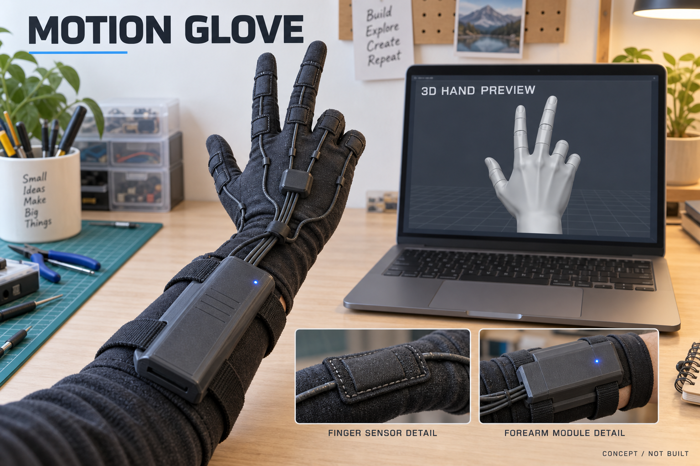
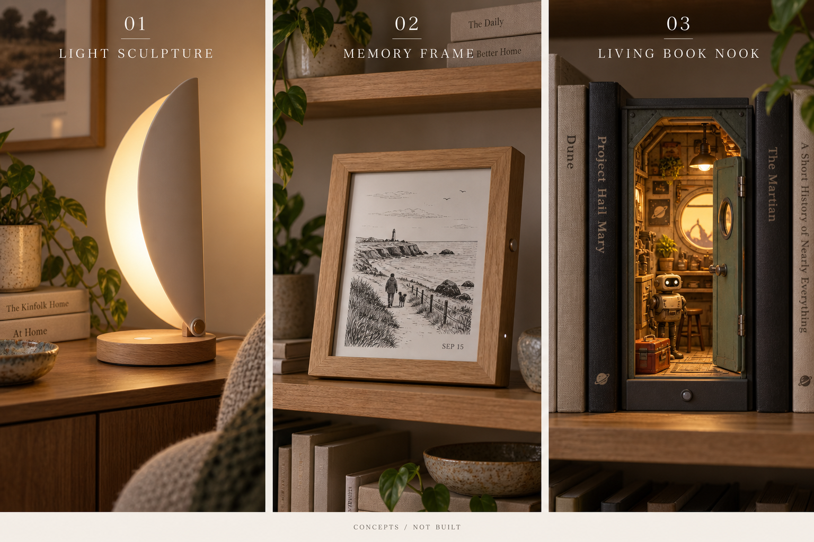
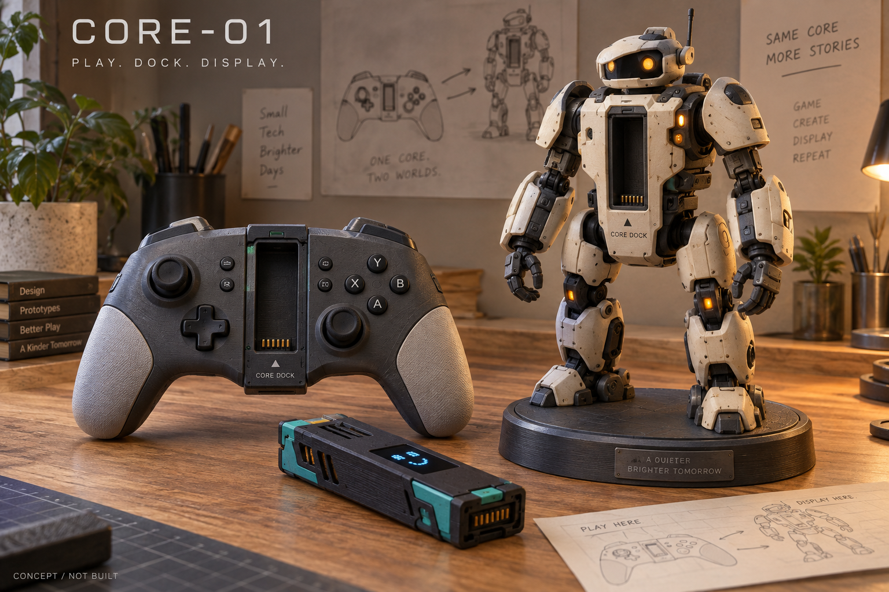
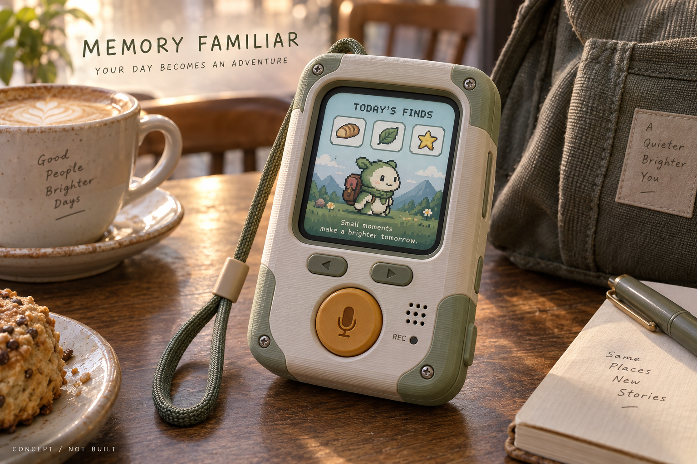
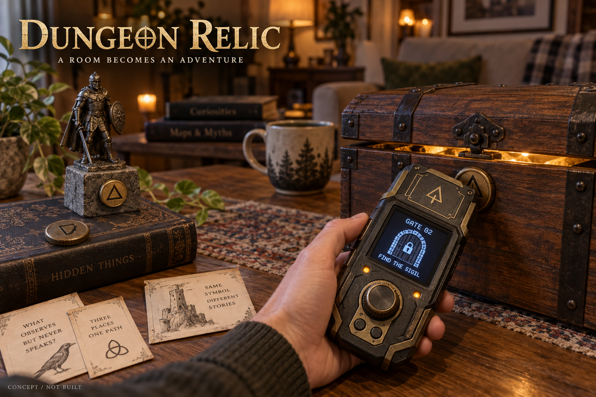
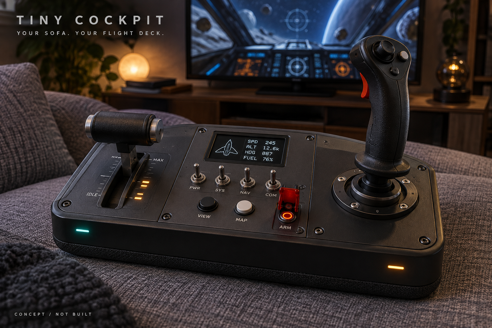
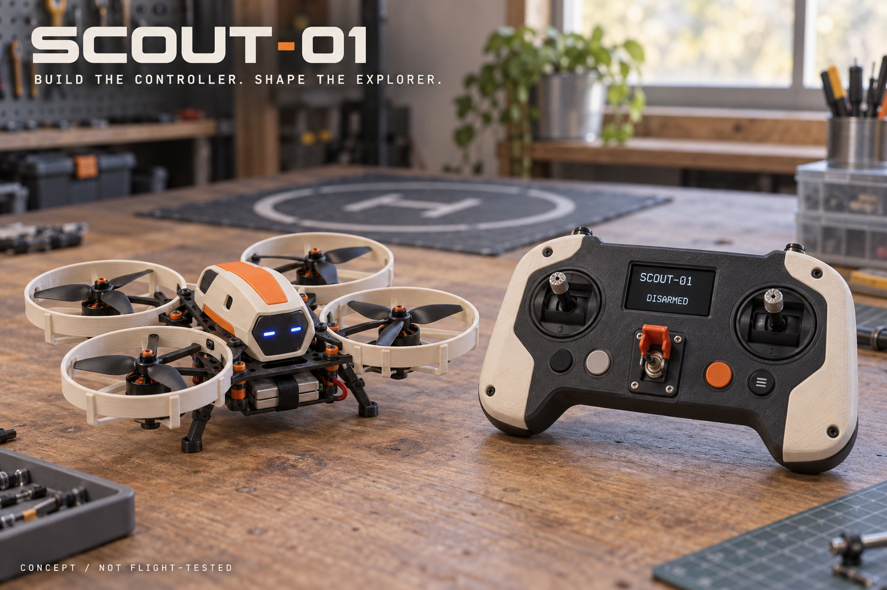

# NU-54V DK 제품 콘셉트 갤러리

모두 OpenAI 내장 image_gen으로 만든 제작 전 예상 이미지입니다. 화면은 예시이며 실제 하드웨어·비행 성능 검증 결과가 아닙니다.

## 최신 · 모션 장갑

센서의 실제 배치와 측정 정확도는 미검증이다. [기획 검토](interior-and-motion-glove.md).

## 최신 · 인테리어 전자 소품

왼쪽부터 조명·기억 액자·북눅. [기획과 12주 범위](interior-and-motion-glove.md).

## 01 · CORE-01

컨트롤러가 피규어의 심장이 된다

전자 코어를 게임패드와 피규어 외장 사이에서 옮겨 쓰는 구상. 피규어의 관절·표정·조명 범위는 제작 시 조정합니다.

## 02 · Memory Familiar

내 하루를 먹고 자라는 동행 기기

짧은 음성 기록을 PC에서 정리하고, 캐릭터의 아이템과 모험 일지로 표현합니다. 화면은 예시입니다.

## 03 · Dungeon Relic

집 한 칸이 던전이 되는 실물 유물

태그를 읽고 다이얼·센서를 조작해 퍼즐을 풉니다. 상자와 피규어는 이야기의 소품입니다.

## 04 · Tiny Cockpit

소파에서 펼치는 나만의 조종석

스틱·스로틀·토글 스위치를 가진 게임 컨트롤러. 화면의 게임 데이터 표시는 별도 게임 연동이 필요합니다.

## 05 · SCOUT-01

자작 조종기와 SF 탐사 드론

NU-54V DK 조종기와 별도 비행 제어기를 가진 기체의 구상. 실제 드론 연결에는 기체별 통신 경로가 필요하며, PC 중계는 그림에서 생략했습니다.
