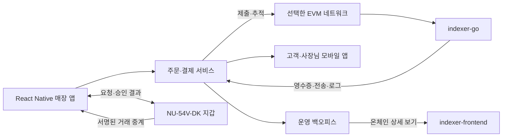

# 기존 Indexer 연동과 테스트 토큰 설계

> 2026-09-18 범위 갱신: [12주 완료 범위 v3](twelve-week-completion-scope-v3.md)가 최신 기준이다. 아래 기존 검토에서 패스키·녹음·스마트 계정 등을 후보/후속으로 둔 부분은 새 범위를 따른다. 초기 EOA 개발 순서와 고객 가스 부담은 유지하며, 새 Cloud Wallet의 MPC는 별도로 설계한다.

작성: 2026-09-17. 진행 중인 요구사항 인터뷰의 설계 자료다. 사용자 결정과 아래 제안을 구분한다. 저장소 소스를 읽었으며 서버 실행·통합 시험·컨트랙트 배포는 수행하지 않았다.

## 1. 이번에 확정한 내용

- 기존 백엔드: [0xmhha/indexer-go](https://github.com/0xmhha/indexer-go).
- 기존 프론트엔드: [0xmhha/indexer-frontend](https://github.com/0xmhha/indexer-frontend).
- 추가 온체인 재사용 자산: [0xmhha/stable-poc-contract](https://github.com/0xmhha/stable-poc-contract). [더미 토큰·스마트 계정·Paymaster 검토](stable-contract-reuse-plan.md). 초기는 일반 지갑(EOA)이다. 후속 스마트 계정을 ERC-4337로 구현하면 아래 거래 추적에 개별 UserOperation 추적을 추가한다.
- 테스트넷 USDC를 확보하기 어려워 개발·시연에 사용할 더미 토큰 컨트랙트를 배포한다.
- 실제 서비스는 USDC 우선, 매장은 스테이블코인을 직접 수령한다는 기존 결정을 유지한다.
- 체인은 후속 답변으로 StableNet 8283, 초기 가스는 고객의 네이티브 토큰 지불로 확정했다. 컨트랙트 배포 주소는 미정이다. 부담 주체는 초기 고객, 후속 운영자 후원으로 확정했다. 더미 토큰의 이름과 아래 사양도 제안이다.

## 2. 검토 기준과 재사용 범위

백엔드 기준 커밋: `5baff647f3cfab935f73db1bbd742ad42317045f`.
프론트엔드 기준 커밋: `e0f8100f94cf9c3862b02f4132fb542bdeae0ae9`.

| 확인한 구현 | 프로젝트 적용 제안 | 근거 |
|---|---|---|
| EVM 거래·영수증·로그 GraphQL 조회 | 지급 실행 상태와 정확한 이벤트 확인에 재사용 | [백엔드 schema.go](https://github.com/0xmhha/indexer-go/blob/5baff647f3cfab935f73db1bbd742ad42317045f/pkg/api/graphql/schema.go#L157) |
| ERC-20 거래별·토큰별·주소별 전송 조회 | 고객 자산 내역과 매장 입금 목록의 기반 | [ERC-20 조회 필드](https://github.com/0xmhha/indexer-go/blob/5baff647f3cfab935f73db1bbd742ad42317045f/pkg/api/graphql/schema.go#L931) |
| `/graphql/ws` 구독 서버 | 신규 이벤트 알림. 끊겼을 때는 과거 범위를 다시 조회 | [백엔드 라우팅](https://github.com/0xmhha/indexer-go/blob/5baff647f3cfab935f73db1bbd742ad42317045f/pkg/api/server.go#L252) |
| Next.js 웹 탐색기와 영수증·로그 화면 | 백오피스에서 ‘온체인 상세 보기’로 연결 | [프론트 패키지](https://github.com/0xmhha/indexer-frontend/blob/e0f8100f94cf9c3862b02f4132fb542bdeae0ae9/package.json), [영수증 조회](https://github.com/0xmhha/indexer-frontend/blob/e0f8100f94cf9c3862b02f4132fb542bdeae0ae9/lib/apollo/queries/receipt.ts#L14) |
| ERC-20 조회 훅·타입·변환 함수 | 순수 데이터 코드부터 React Native 공유 가능성 검토 | [ERC-20 훅](https://github.com/0xmhha/indexer-frontend/blob/e0f8100f94cf9c3862b02f4132fb542bdeae0ae9/lib/hooks/useERC20Hooks.ts#L28) |
| StableNet·Anvil 네트워크 설정 | 기존 환경에서 통합 시연을 시작할 후보. 실제 가동 환경은 미확인 | [네트워크 설정](https://github.com/0xmhha/indexer-frontend/blob/e0f8100f94cf9c3862b02f4132fb542bdeae0ae9/config/networks.config.ts#L28) |

결론은 **기존 Indexer와 탐색기를 재사용하고, 주문·매출·대여 업무를 담당하는 서비스와 앱을 추가하는 것**이다. Next.js 화면을 그대로 React Native 키오스크로 옮길 수 있다고 보지 않는다. 탐색기의 조회 API 인증도 가맹점 계정·역할 권한을 대신하지 않는다. 검토한 프론트 경로에서 주문·메뉴·정산·대여 업무 구현은 발견하지 못했다.

## 3. 결제 연동 구조 제안

후속 제공된 [poc-platform](poc-platform-reuse-plan.md)에는 Indexer 조회 client와 지갑 SDK·Bundler·Paymaster Proxy가 있다. 기존 연결 코드를 우선 활용하되, 웹 거래 이력의 `confirmed` 표시는 카페 결제 확정 판정으로 그대로 사용하지 않는다. 아래 구조에 AA를 적용할 경우 개별 UserOperation 추적을 추가한다.

이 그림은 EVM을 채택할 경우의 제안이다. 고객 폰의 공동 서명을 매 결제에 요구하지 않는 기존 결정을 유지한다. 제출 중계가 수수료 후원을 뜻하지는 않는다. 보드의 보호 영역 내 EVM 서명 구현은 개발 단계에서 검증할 항목으로 유지한다.

주문 서비스가 보관할 항목은 주문 ID, 결제 시도 ID, 체인 ID, 허용 토큰 주소, 고객 지급 주소, 매장 수취 주소, 최소 단위 정수 금액, 거래 해시, 이벤트 식별자, 관측 블록과 결제 상태다. 키·니모닉은 이 데이터 모델에 포함하지 않는다.

표준 ERC-20 `Transfer` 이벤트에는 주문 ID가 없다. 최초 시연은 결제 시도와 서명 거래 해시를 연결한 뒤, 실제 영수증의 허용 토큰 전송이 기대값과 맞는지 확인하는 방식을 제안한다. `chainId + transactionHash + logIndex`에 고유 제약을 두어 동일 지급이 여러 주문에 재사용되지 않게 한다. 블록 해시는 재구성 추적에 별도 보관한다. 주문 ID 전용 이벤트가 필요하면 토큰 자체의 비표준 전송에 의존하지 말고 별도 결제 컨트랙트의 필요성을 평가한다. [ERC-20 규격](https://eips.ethereum.org/EIPS/eip-20)

## 4. 연동 시 보완·검증할 부분

1. **결제 확인에는 raw logs와 receipt를 사용한다.** 프론트의 REST token-transfers 응답에는 `logIndex`, `blockHash`, `removed`가 생략된다. 이 응답을 그대로 결제 대사의 유일한 근거로 쓰기보다 백엔드 GraphQL을 직접 사용하거나 API를 확장한다. [REST 변환 코드](https://github.com/0xmhha/indexer-frontend/blob/e0f8100f94cf9c3862b02f4132fb542bdeae0ae9/app/api/v1/token/%5Baddress%5D/transfers/route.ts#L84)
2. **수신 알림과 최종 확정을 구분한다.** 영수증 성공·허용 토큰·수취 주소·금액을 확인하고 선택 체인의 확정 정책을 적용한다. `removed` 필드와 저장소 삭제 메서드가 존재하는 사실만으로 전체 재구성 복구가 검증되었다고 판단하지 않는다.
3. **재연결은 누락 복구를 포함한다.** 마지막 처리 블록/커서를 저장하고 범위를 겹쳐 재조회한 뒤 중복 제거한다. 구독의 제한된 `replayLast`만으로 장시간 단절을 복구한다고 가정하지 않는다. 인덱싱 지연을 ‘결제 실패’로 바꾸지 않는다.
4. **조회 경로와 체인 설정을 맞춘다.** 검토한 프론트의 네트워크 설정은 백엔드와 같은 `/graphql/ws`를 사용한다. README 예시보다 실행 시 선택되는 설정을 기준으로 확인한다. 앱·서비스·탐색기의 체인 ID와 토큰 주소가 일치해야 한다.
5. **권한은 서비스가 담당한다.** 매장별 주문·매출 접근과 운영자 권한은 별도 계정 모델로 검증한다. 탐색기 링크에 개인 메모·녹음·대여 식별 정보를 실어 보내지 않는다.

## 5. 더미 토큰의 초기 사양 제안

EVM 선택 시 가칭 `MockUSDC`, 심볼 `mUSDC`를 사용한다. 화면과 영수증에는 ‘테스트 토큰’을 명확히 표시한다.

추가 저장소의 `test/mocks/ERC20Mock.sol`은 재사용 출발점이다. 현재 무권한 mint/burn을 그대로 공동 시연용으로 배포하지 않고 발행·소각 정책을 정리한다. 배포 및 초기 발행 스크립트는 추가 작업이다. 이 mock이 실제 USDC의 서명 기반 전송 기능까지 제공하는 것으로 간주하지 않는다.

| 항목 | 제안 |
|---|---|
| 기본 표준 | ERC-20의 잔액·전송·승인·allowance와 표준 이벤트 |
| 소수점 | 6자리로 초기 시험. 모든 금액은 정수로 저장하고 표시 단계에서 변환 |
| 발행 | 테스트 관리자 또는 제한된 테스트 faucet이 필요한 양을 공급 |
| 발행 권한 | 고객 결제 키와 분리. 앱 배포물에 발행자 개인키를 넣지 않음 |
| 식별 | 환경·체인 ID·컨트랙트 주소로 구분. 토큰 이름만으로 USDC 판정 금지 |
| 주문 연결 | 우선 표준 전송과 거래 해시 연결. 더미 전용 결제 함수에 앱을 종속시키지 않음 |
| 초기 범위 | 잔액 부족·정상 전송·잘못된 수취/토큰·반복 이벤트·환불 전송 시험 |

더미 토큰 공급과 체인 거래 수수료 조달은 별도 설계 항목이다. 초기에는 고객이 수수료를 부담하며, 지정된 StableNet에서 고객의 네이티브 가스를 준비한다. 확보 경로·충전 지원은 아직 미정이다. 운영자 후원은 이후 추가한다.

일반 ERC-20 시연만으로 실제 USDC의 모든 기능이 검증되지는 않는다. 후속 설계에서 permit·서명 기반 전송·수수료 후원 등을 사용하면 해당 네트워크의 실제 USDC가 지원하는 방식과 맞춰 별도 시험해야 한다. 6자리·이름·인터페이스를 맞추는 것만으로 동등한 보안·관리 동작을 구현했다고 표현하지 않는다.

## 6. 실제 USDC 전환을 위한 개발 단계 확인

- 선택 체인의 공식 USDC 주소와 지원 기능을 확인하고 환경별 허용 목록을 분리한다.
- 동일 주문 흐름에서 더미 토큰과 실제 목표 토큰의 금액·이벤트·서명 방식을 비교한다.
- 실패 거래, 지연·누락·중복 관측, 체인 재구성, 거래 교체, 취소 뒤 늦은 지급을 시험한다.
- 매장 수취·매출·환불 대사가 일치하고 패스포트 적립이 중복되지 않는지 확인한다.
- 실제 자산 사용 여부는 기존의 파일럿 완료 기준·운영 조건 결정과 별도로 연결한다. 이번 더미 토큰 결정이 실자산 파일럿 승인은 아니다.

## 7. 다음 결정

첫 시연 체인은 사용자 지정 StableNet RPC이며, chain ID 8283을 조회했다. [네트워크 확인](stablenet-testnet-baseline.md). 다음은 이 환경의 Indexer API·확정 정책과 실제 컨트랙트 배포 주소를 정한다. 로컬 Anvil은 별도 반복 시험 후보로 남긴다.

하드웨어 두 기기는 보유하고 있으며, 실제 연결·거리·서명 검증은 사용자의 지시에 따라 개발 단계에서 진행한다.
