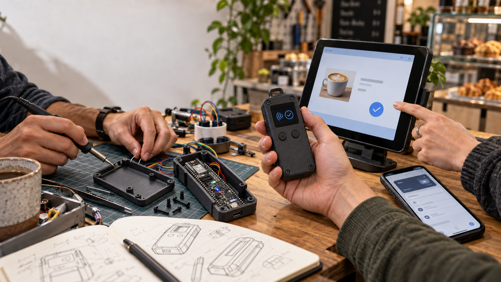

# NU-54V-DK로 만드는 여행자용 스테이블코인 지갑: 세 사람의 12주 제작 계획

### 외국인 여행자와 소상공인 카페를 잇는 결제 기기·앱·키오스크·블록체인 서비스를 함께 설계하다

3개월 팀 프로젝트를 앞두고 있다. 처음에는 NU-54V-DK로 만들 수 있는 제품을 넓게 탐색했다. 드론과 휴머노이드, 모션 장갑, 게임 컨트롤러, 음성 기록기까지 검토했고, 지금은 **외국인 여행자가 카페에서 스테이블코인으로 결제할 때 사용할 수 있는 휴대형 기기와 서비스**로 방향을 좁혔다.

여행자는 자신의 지갑을 연결하거나 여행용 지갑을 새로 만들 수 있다. 카페 키오스크에서 주문하면 휴대형 기기에 매장과 금액이 표시되고, 사용자가 내용을 확인한 뒤 물리 버튼으로 승인한다. 결제 결과는 키오스크, 사용자 앱, 점주 화면에서 같은 주문으로 확인한다. 대여 중에는 결제 기록과 방문 장소를 여행 발자취로 남기고, 반납할 때는 잔액 이전과 기기 초기화까지 마치는 흐름을 생각하고 있다.

*AI로 생성한 프로젝트 콘셉트 이미지다. NUCODE의 NU-54V-DK 공식 제품 사진을 참조해 보드의 긴 검정 PCB 형상과 케이스 내부 배치를 표현했다. 실제 제품 사진이나 정밀 기구 설계도는 아니며, 케이스 치수와 포트 위치는 실물 보드를 측정한 뒤 확정해야 한다.*

기획 범위는 이미 커졌다. 그래서 이번 글에서는 기능을 더 늘리기보다, 이 아이디어를 세 사람이 12주 동안 함께 완성하려면 무엇을 먼저 맞춰야 하는지 정리한다. 또한 아직 사용해 본 적 없는 Zephyr로 NU-54V-DK의 기본 페리페럴을 직접 동작시키는 첫 실험도 프로젝트의 출발점으로 삼으려 한다.

## 1. 3개월 팀 프로젝트 관점에서 보완할 점

가장 먼저 보완할 것은 기능의 개수가 아니라 **하나의 연결된 성공 경로**다. 첫 목표는 다음 한 줄로 정의할 수 있다.

> 키오스크에서 주문 → BLE로 기기에 전달 → 기기에서 내용 확인과 버튼 승인 → StableNet 테스트넷 결제 → Indexer 확인 → 키오스크 영수증 표시

이 흐름이 실제 기기와 앱에서 한 번 끝까지 동작해야 각자 만든 결과가 하나의 제품이 된다. 이를 위해 팀 개발을 시작하기 전에 주문 ID, 기기 ID, 요청 버전, 만료 시간, 중복 요청 처리, 오류 코드처럼 여러 제품이 공유할 통신 규칙을 먼저 고정해야 한다. 앱 화면이 완성돼도 펌웨어와 서버가 서로 다른 상태를 이해하면 통합 시점에 다시 만들게 되기 때문이다.

두 번째는 **보드에서 직접 확인해야 할 불확실성을 초기에 줄이는 것**이다. NU-54V-DK의 정확한 보드 리비전, Zephyr 보드 타깃, 기본 LED와 버튼의 핀, 디버거와 플래시 방법, 사용 가능한 메모리, BLE 연결과 실제 전송량을 확인해야 한다. 이 결과가 있어야 디스플레이, IMU, 마이크, 배터리, FOTA를 어떤 순서로 붙일지 현실적으로 판단할 수 있다.

현재 기술 스택의 기준점도 단순하게 잡았다. 기기 펌웨어는 Zephyr, 매장 키오스크는 Android 태블릿에 설치할 수 있는 React Native 앱, 결제 확인은 기존 Go 기반 Indexer를 재사용한다. 컨트랙트 계층은 StableNet 테스트넷과 대체 USDC로 시작한다. 사용자 앱, 백오피스, 여행 서비스는 이 첫 결제 경로가 공유하는 ID와 상태를 그대로 소비하도록 맞춘다.

세 번째는 지갑의 역할을 분리하는 것이다. 휴대형 기기는 사용자가 눈으로 확인하고 직접 승인하는 물리적 지갑 역할을 맡는다. 소셜 로그인을 기반으로 한 Cloud Wallet은 앱의 편의 기능과 복구 흐름을 맡는다. 두 지갑은 같은 것처럼 보이지 않게 구분하고, 어떤 요청을 어느 지갑이 서명했는지 영수증과 운영 기록에서 추적할 수 있어야 한다.

마지막으로 세 사람 모두가 같은 완료 기준을 사용해야 한다. 화면 한 장이나 API 한 개가 끝났다는 뜻이 아니라, 동일한 주문 ID가 키오스크·기기·체인·Indexer·점주 화면을 통과하고 실패 후에도 결과를 다시 찾을 수 있을 때 한 기능이 완료된 것으로 본다. 공개 글에서는 이 구조와 사용자 경험을 설명하되, 키 처리의 세부 구현이나 공격에 이용될 수 있는 내부 값은 드러내지 않을 예정이다.

## 2. 한 장으로 정리한 제품 구조

처음에는 휴대형 결제 기기와 키오스크만 만들면 된다고 생각했다. 하지만 실제 사용 장면을 따라가 보니 사용자 앱, 점주 기능, 대여 운영, 체인 이벤트 확인, 여행 기록까지 서로 다른 수명주기를 가진 제품이 필요했다. 그래서 전체 범위를 **10개 제품 모듈, 57개 상위 작업 패키지, 104개 구현 작업**으로 나눴다.

*제품별 WBS를 기준으로 직접 작성한 시스템 다이어그램이다. 파랑은 사용자·매장 가까이에서 실행되는 Local 영역, 초록은 Cloud 서비스와 운영·데이터 영역, 보라는 StableNet 테스트넷의 Blockchain 영역, 주황은 외부 인증·장소·AI 제공자를 뜻한다. C1~C9는 BLE, HTTPS, 체인 RPC·이벤트처럼 제품 사이에서 먼저 합의해야 할 통신 경계다.*

다이어그램의 목적은 많은 기능을 자랑하는 것이 아니다. 누가 어떤 상태를 소유하고, 실패했을 때 어느 제품이 결과를 복구해야 하는지 보이게 만드는 것이다. 예를 들어 결제 트랜잭션이 체인에 제출됐지만 키오스크 응답이 끊길 수 있다. 이때 키오스크가 다시 결제시키는 대신 Indexer와 주문 ID로 기존 결과를 찾을 수 있어야 한다. BLE가 끊겨도 이미 제출된 거래가 자동으로 취소되는 것은 아니므로, 기기 연결 상태와 체인 결제 상태도 분리해야 한다.

## 3. 구현할 제품 모듈과 핵심 기능

### Local — 사용자와 매장 가까이에서 동작하는 제품

- **P01 · NU-54V-DK 펌웨어:** Zephyr 기반 하드웨어 지갑, BLE 등록과 인증 세션, 결제 내용 표시와 물리 버튼 승인, FOTA, 패스키, 녹음 전송, 기기 찾기, 결제 스탬프를 담당한다. 여러 기능이 동시에 BLE와 메모리를 사용할 때의 자원 중재도 이 제품의 책임이다.
- **P02 · 사용자 앱:** Google·Apple 로그인, 기기 등록과 설정, FOTA 진행, HW Wallet과 Cloud Wallet의 주소·잔액 구분, 결제 승인·영수증, 여행 기록과 DApp 화면을 제공한다.
- **P04 · React Native 키오스크:** Android 태블릿에서 가게 로그인, 메뉴·품절·주문, 스테이블코인 결제, 부분·전체 환불, 매출·정산 조회를 처리한다. NU-54V-DK와는 임시 BLE 결제 세션으로 연결한다.

### Cloud — 계정, 운영, 데이터와 부가 서비스를 담당하는 제품

- **P03 · Cloud MPC Wallet:** 소셜 계정과 연결된 2-of-3 분산 키 생성, 별도 모바일 승인, threshold 서명, share refresh와 복구를 담당한다. 전체 개인키를 한곳에서 다시 조립하지 않는 흐름을 목표로 한다.
- **P05 · 백오피스:** 가맹점 승인, 기기 대여·반납, 잔액 회수 확인, 접근권한 해제, FOTA 캠페인, 지연·중복·초과 결제의 대사와 감사 기록을 관리한다.
- **P07 · Indexer와 조회 프런트엔드:** StableNet의 블록·트랜잭션·이벤트를 수집하고 중복·재시작·reorg를 처리한다. 키오스크와 앱에는 결제 확정 상태를, 점주와 운영자에게는 매출·환불·대사 상태를 제공한다.
- **P08 · 시장 서비스:** 테스트 범위의 DEX, TEST FX, Perpetual 견적과 실행, 오라클·keeper 상태를 앱과 연결한다. 첫 결제 경로가 안정된 뒤 붙이는 확장 모듈이다.
- **P09 · 여행·AI 서비스:** 장소 검색, 결제 근거가 있는 후기, 발자취, 음성 전사·요약, AI 추천 코스, 따라하기 챌린지와 스탬프를 담당한다. 위치·음성·후기 데이터의 동의와 삭제도 같은 범위에 둔다.
- **P10 · 공통 플랫폼:** API, 인증·권한, 공통 ID와 상태, 설정, 감사 로그, 관측, CI, 수용 시험과 릴리스 기준을 제공한다. 각 제품이 서로 다른 주문·결제 상태를 만들지 않도록 중심 계약을 관리한다.

### Blockchain — 결제와 상품 상태를 검증하는 제품

- **P06 · StableNet 컨트랙트:** 테스트넷용 dummy USDC와 WKRC, 이후의 Smart Account, DID, CafePass 형태의 제한형 테스트 발행물, x402 결제를 담당한다. DEX·FX·Perpetual 계약의 이벤트도 Indexer가 같은 방식으로 추적할 수 있게 한다.

기능은 많지만 첫 번째 성공 기준은 여전히 하나다. **NU-54V-DK에서 확인하고 승인한 카페 주문 한 건이 StableNet에 제출되고, Indexer를 거쳐 키오스크 영수증과 사용자 기록으로 돌아오는 것**이다. 나머지 모듈은 이 경로에서 검증한 ID, 상태, 권한과 오류 처리 방식을 재사용한다.

## 4. WBS로 나눈 12주 타임라인

작업 우선순위는 기능의 중요도 순위가 아니라 **의존성을 해소하는 순서**로 정했다.

- **C0 · 즉시 착수:** 실기기 bring-up, 공통 통신 계약, StableNet·토큰·Indexer 기준선, 앱과 키오스크 골격을 연다.
- **C1 · 첫 종단 경로:** HW 지갑 서명, 주문·결제·대사, 두 지갑 UI와 영수증을 연결해 첫 실제 결제를 만든다.
- **C2 · 필수 확장:** FOTA, 패스키, 녹음·찾기, MPC 복구, 환불·정산, 대여·반납, 시장과 여행 기능을 붙인다.
- **C3 · 통합·출시:** 전 기능 회귀, 실패 복구, 권한·삭제, 성능, 백업과 운영 인수를 검증한다.

### 1개월차 — 실기기 확인과 첫 결제 경로

NU-54V-DK에 Zephyr 기반 최소 펌웨어를 빌드하고 플래시한다. 기본 LED, 버튼, 부팅 로그, 타이머, BLE 광고와 간단한 GATT 통신을 차례로 확인한다. 동시에 키오스크에는 메뉴 한 개와 주문 한 개만 만들고, StableNet 테스트넷의 대체 USDC 계약과 기존 Indexer를 연결한다. 첫 달의 목표는 꾸며진 화면이 아니라, 하나의 주문이 기기 승인에서 테스트넷 이벤트 확인까지 이어지는 장면을 재현하는 것이다.

### 2개월차 — 제품 통합과 실패 복구

사용자 앱에 기기 등록과 지갑 설정을 연결하고, 키오스크 앱에 주문·결제·부분 환불·매출 확인을 붙인다. 펌웨어에는 화면과 버튼 승인, FOTA, 패스키, 기기 찾기, 음성 기록 전달, 결제 스탬프를 순서대로 추가한다. BLE가 중간에 끊기거나 같은 요청이 두 번 도착하는 경우, 요청이 만료된 경우, 체인 결과가 늦게 보이는 경우도 함께 다룬다.

### 3개월차 — 카페 시나리오 검증과 발표 준비

협력 카페에서 외국인 여행자 대여 시나리오를 기준으로 등록, 주문, 승인, 결제, 환불, 반납을 반복한다. 3D 프린트 케이스와 클립 구조, 전원과 휴대성도 점검한다. 마지막에는 성공 화면만 보여주기보다 연결 시간, 반복 성공률, 실패 복구 결과와 남은 한계를 함께 발표할 수 있도록 기록을 정리한다.

12주 일정에는 다음과 같은 통합 관문을 두었다.

- **1주 · M0 — 실행 가능한 기반:** 보드 플래시, 앱·키오스크 실행, StableNet RPC와 재현 빌드
- **2주 · M1 — 연결 기준선:** 인증 BLE, 테스트 토큰 배포 정보, Indexer 원 이벤트, 주문 골격
- **4주 · M2 — 첫 실제 결제:** NU 승인 → EOA 제출 → Indexer 확정 → 키오스크 영수증
- **6주 · M3 — 핵심 제품 완성:** FOTA·패스키·녹음·찾기, 환불·정산, MPC 서명, 여행 핵심 기능
- **8주 · M4 — 전체 범위 첫 통합:** 계획한 제품 모듈이 실제 기기·계정·테스트넷·앱과 최소 한 번 연결됨
- **10주 · M5 — 릴리스 후보:** 카페 회귀, 장애·대사·권한·삭제·성능·복구 기준 통과
- **11주 · M6 — 수용 판정:** 기기·지갑·매장·온체인·여행 수용 시험과 남은 결함 기록
- **12주 · M7 — 릴리스와 인수:** 재현 가능한 결과물, 운영·복구 문서, 시연과 증거 목록

한 작업을 끝냈다고 판단하려면 코드나 화면만 있어서는 부족하다. 실제 대상에서 정상 흐름과 관련 실패·복구를 실행하고, 사용한 버전과 로그·사진·트랜잭션·교차 검토 결과를 남겨야 한다. 이 완료 기준이 세 사람이 만든 결과를 마지막에 하나의 제품으로 묶어 줄 것이라고 생각한다.

## 5. 기술적 강점과 관심 영역

내 강점은 블록체인과 백엔드, 그리고 여러 제품 사이의 경계를 설계하는 일에 가깝다. 컨트랙트 이벤트가 Indexer를 거쳐 앱과 운영 화면에 어떻게 반영되는지, 결제와 환불이 중복 실행되지 않도록 어떤 상태와 식별자가 필요한지, 장애 뒤에 결과를 어떻게 대사할지를 구체화하는 데 관심이 있다. 앱·서버·컨트랙트가 따로 완성되는 것보다 하나의 사용자 행동이 모든 계층에서 같은 의미를 갖도록 연결하는 일을 맡고 싶다.

반면 Zephyr와 실제 개발보드 펌웨어는 이번에 처음 다룬다. 이 약점을 숨기기보다 작은 실기기 검증부터 직접 수행해 보려 한다. 첫 번째 목표는 화려한 기능이 아니라 빌드와 플래시, LED와 버튼, 로그, BLE 연결을 내가 다시 재현할 수 있는 상태다. 회로와 전원 설계, PCB, 배터리 안전, 기구와 외관은 상대적으로 경험이 적어 팀의 도움과 검토가 필요하다.

## 6. 팀에서 맡고 싶은 역할 · 도움받고 싶은 부분

나는 전체 시스템 계약, 블록체인·Indexer, 백엔드와 앱의 연결을 중심으로 맡고 싶다. 주문에서 결제와 환불까지 이어지는 데이터 모델, 물리 지갑과 Cloud Wallet의 역할 분리, 실제 시연 증거를 한 흐름으로 남기는 작업이 주요 관심사다. 여기에 NU-54V-DK의 첫 번째 보드 bring-up도 직접 진행해 소프트웨어 설계가 하드웨어 조건과 맞는지 확인하려 한다.

도움받고 싶은 부분은 Zephyr의 보드 정의와 핀 설정, 디버거 사용, 배터리·충전·전원 설계, 마이크·디스플레이·IMU 회로, 클립형 케이스와 3D 프린트 설계다. BLE 전송량과 FOTA 중단 복구처럼 실제 기기에서만 드러나는 문제도 함께 시험하고 싶다.

세 사람의 역할은 크게 **기기**, **앱·매장 경험**, **체인·데이터**로 나눌 수 있다. 다만 경계 기능은 혼자 끝내지 않는다. 기기 담당과 앱 담당이 BLE 메시지를 함께 검토하고, 앱 담당과 체인 담당이 주문·영수증 상태를 함께 검증하는 식으로 교차 확인할 계획이다.

## 7. 관심 있는 문제 · 도메인

내가 풀고 싶은 문제는 여행 중 낯선 결제 수단을 안전하고 쉽게 사용하는 경험이다. 주요 관심 키워드는 외국인 여행자의 현지 결제, 소상공인 카페의 주문·환불·정산, 화면과 물리 버튼을 이용한 승인, 대여 기기의 초기화와 복구, 실제 결제를 바탕으로 한 여행 발자취다. 이후에는 음성 메모와 AI 정리, 방문 기록을 활용한 추천 코스와 여행 챌린지로 확장할 수 있다.

이번 12주 프로젝트는 StableNet 테스트넷과 대체 USDC를 이용하는 PoC다. 실제 자산을 받는 상용 결제 단말이나 정식 대여 서비스가 목표는 아니다. 실자산, 개인정보, 세무, 전자금융 및 가상자산 관련 의무는 별도의 법률·보안·운영 검토를 거쳐야 한다. 이번에는 기술적으로 검증 가능한 범위와 사용자가 이해할 수 있는 승인 경험을 만드는 데 집중한다.

## 8. 투입 가능한 시간과 리소스

팀을 구성할 때 각자의 주당 가능 시간과 대면 작업 가능 시간을 숫자로 맞출 예정이다. 정기 회의 시간뿐 아니라 보드와 앱을 함께 놓고 시험할 수 있는 통합 작업 시간도 별도로 확보해야 한다.

현재 활용할 수 있는 핵심 리소스는 NU-54V-DK 실물 보드, Galaxy S25 Ultra와 BLE 시험 기기, 협력 가능한 카페, StableNet 테스트넷 RPC와 Explorer, 기존 컨트랙트·Indexer·플랫폼 저장소다. Codex와 AI 도구는 설계 검토, 기록 정리, 테스트 자료 생성에 활용할 수 있다.

추가로 작은 디스플레이, IMU, 물리 버튼, 마이크, 배터리와 충전 모듈, 키오스크용 Android 태블릿, 케이스 제작 도구가 필요하다. 부품을 한꺼번에 구매하기보다 기본 페리페럴 검증 뒤에 인터페이스와 전력 조건을 확인하고 순서대로 선정하려 한다.

## 9. 먼저 해볼 일: NU-54V-DK 기본 페리페럴 살리기

*NU-54V-DK 제조사 공개 자료의 보드 이미지다. 출처: [NUCODE 제품 페이지](https://nucode.store/product/nu-54v-dk-nucode-nrf54l15-ble-60-mcu-kcfcccemic/36/category/25/display/1/). 직접 촬영한 사진은 아니며, 실제 실험을 마친 뒤에는 내가 사용한 보드의 연결 상태와 동작 화면을 추가할 예정이다.*

첫 실험은 다음 순서로 진행한다.

1. 실물 보드의 모델명, 리비전, 내장 디버거와 연결 방식을 사진과 함께 기록한다.
2. 공식 자료에서 지원하는 Zephyr 보드 타깃과 SDK·툴체인 버전을 확인한다.
3. 최소 예제를 빌드하고 플래시한 뒤 부팅 로그를 남긴다.
4. 보드 정의에 등록된 기본 LED와 버튼을 사용해 입력과 출력을 확인한다.
5. 타이머와 재부팅을 반복해 같은 결과가 나오는지 확인한다.
6. BLE 광고를 켜고 Galaxy S25 Ultra에서 검색·연결한 뒤, 작은 GATT 쓰기와 알림을 시험한다.
7. 성공과 실패를 모두 명령, 설정, 로그, 사진과 함께 기록한다.

실험 전인 지금은 성공했다고 쓰지 않는다. 실제 작업을 마치며 다음 항목을 채울 예정이다.

- **보드와 개발 환경:** 실물 리비전, SDK·Zephyr·툴체인·보드 타깃
- **빌드와 플래시:** 최소 예제의 성공 여부, 사용한 예제와 반복 횟수
- **LED와 버튼:** 보드 정의의 기본 페리페럴과 실제 관찰 결과
- **부팅·버튼 로그:** 재현에 필요한 핵심 로그와 캡처
- **BLE:** Galaxy S25 Ultra에서 확인한 광고 검색, 연결, GATT 쓰기·알림 결과
- **막힌 점과 해결:** 증상, 확인한 원인, 해결 방법 또는 다음 시도

이 부분까지 실제로 수행한 뒤 보드 사진, 터미널 로그 캡처, 휴대폰의 BLE 연결 화면을 본문에 추가할 예정이다. 처음 Zephyr를 사용하는 사람의 관점에서 막힌 지점도 함께 남기면 다음 팀원의 개발 환경을 맞추는 데 도움이 된다.

## 10. 12주 뒤 보여주고 싶은 장면

카페 키오스크에서 음료를 고른다. 휴대형 기기에는 매장과 결제 금액이 표시된다. 사용자는 내용을 확인하고 버튼을 눌러 테스트넷 결제를 승인한다. 잠시 뒤 키오스크에는 완료 영수증이, 사용자 앱에는 결제 기록과 여행 발자취가, 점주 화면에는 매출과 환불 가능한 거래가 나타난다. 세 사람이 만든 펌웨어, 앱, 서버, 컨트랙트, Indexer가 이 한 장면에서 함께 동작한다.

큰 설계는 이미 충분히 해두었다. 이제 시작점은 작고 분명하다. NU-54V-DK에 첫 펌웨어를 올리고, LED와 버튼의 로그를 남기고, 휴대폰에서 BLE 광고를 찾는 것. 그 증거부터 쌓아 3개월 뒤의 장면으로 이어가려 한다.

`#NUCODE` `#누코드` `#NU54VDK` `#누코더스` `#Nucoders`
