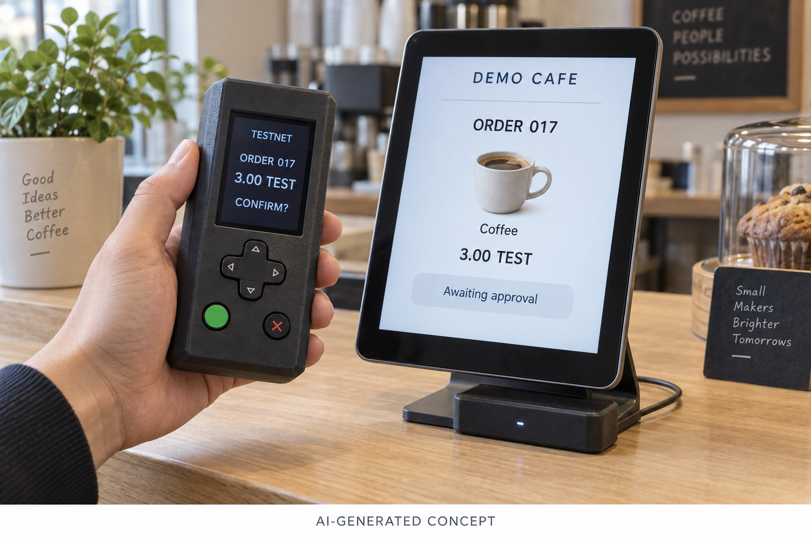
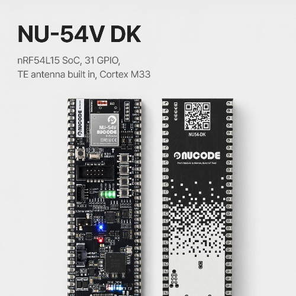

# 가까이에서 확인하고, 내 기기로 승인하기: NU-54V DK로 만드는 코인 결제 지갑

누코더스 2기 · 메이커 트랙 · 1주차 제품 기획

## 1. 이번 12주에 만들어보고 싶은 경험

키오스크에서 메뉴를 고르고, 손에 든 작은 기기로 결제를 확인한다. 카드 결제처럼 익숙한 장면에 ‘내 기기에서 내용을 확인하고 직접 승인한다’는 경험을 더해보고 싶다.

이번 프로젝트에서 탐구할 것은 무선 통신과 센서, 화면, 사용자 입력을 하나의 흐름으로 연결하는 일이다. 기기가 가까이 있다는 사실과 사용자가 결제를 원한다는 의사를 어떻게 구분해서 다룰지도 직접 만들어보며 확인하려 한다.

## 2. 만들 제품 한 줄 정의

**NU-54V DK를 이용해, 키오스크 가까이에서 주문 내용을 확인하고 버튼이나 제스처로 승인하는 휴대형 코인 결제 지갑을 만든다.**

휴대 기기와 주문용 키오스크를 한 세트로 구성한다. 첫 목표는 테스트넷의 한 가지 자산으로 주문부터 결제 결과 확인까지 시연하는 것이다. 현재는 제작 전 기획 단계이며, 이번 글의 동작 설명은 구현 목표다.

*AI로 생성한 제품 예상 이미지입니다. 실제 제작품 사진이 아니며, 외형·화면·표시 금액은 콘셉트를 설명하기 위한 예시입니다.*

## 3. 왜 직접 만들려고 하나

내가 실험하고 싶은 것은 지갑의 송금 기능에 머무르지 않는다. 주문한 장소에서 결제 내용을 받고, 내 손에 있는 화면으로 확인한 다음, 물리적인 동작으로 승인하는 경험이다. 이를 위해서는 지갑과 키오스크 양쪽의 흐름을 함께 조정할 수 있어야 한다.

예를 들어 키오스크에서 음료를 고르면 지갑에 주문과 금액, 수신처가 표시된다. 두 화면의 확인 정보를 대조하고, 버튼으로 선택하거나 기기를 움직여 의사를 표현한다. 가까이 가져가는 것만으로 결제가 승인되지는 않도록 설계할 예정이다.

12주 동안은 직접 만든 시연용 키오스크에서 이 경험을 완성하는 데 집중한다. 일반 매장의 카드 단말기와 호환되는 제품을 목표로 잡지는 않는다.

## 4. 센서에서 주문 완료까지

**입력은 IMU와 버튼, 처리는 NU-54V DK, 출력은 작은 디스플레이와 BLE 통신, 초기 전원은 USB**로 구성한다. 휴대형 케이스를 만들 때 배터리와 충전·보호 회로를 검토한다.

사용 흐름은 ‘주문 선택 → 기기 연결 및 근접 확인 → 지갑 화면에서 내용 확인 → 사용자 승인 → 서명 전달 → 결제 결과 확인’이다. 개인키를 외부에 전달하지 않고 기기 안에서 서명하는 구조를 목표로 한다. 키오스크 측 소프트웨어는 서명을 이용한 결제 요청을 처리하고, 결과를 확인한 뒤 주문 완료를 표시한다.

거리 측정에는 nRF54L15가 지원하는 Bluetooth Channel Sounding을 검토한다. 다만 양쪽 기기와 소프트웨어의 지원이 필요하므로, 키오스크에도 호환 보드를 연결해 먼저 실험할 계획이다. 실제 동작 거리와 안정성은 보드로 검증해야 한다. [Nordic Channel Sounding 안내](https://www.nordicsemi.com/Products/Wireless/Bluetooth-Low-Energy/Channel-Sounding)

승인 전에 멀어지거나 연결 상태가 불확실해지면 진행을 막고 세션을 종료하도록 설계한다. 이미 전달된 서명이나 전송된 결제가 통신 단절만으로 취소되는 것은 아니다.

## 5. NU-54V DK와 함께 사용할 것들

핵심 보드는 **NUCODE의 NU-54V DK**다. nRF54L15 기반의 이 보드를 BLE 통신, 센서 입력, 화면 제어와 서명 처리의 중심으로 사용할 예정이다. [NUCODE 공식 제품 페이지](https://nucode.store/product/nu-54v-dk-nucode-nrf54l15-ble-60-mcu-kcfcccemic/36/category/25/display/1/)

*사용 예정 보드인 NU-54V DK의 실제 제품 사진. 제조사 NUCODE 제공 이미지이며, 직접 촬영한 사진은 아닙니다.*

- **부품:** 소형 디스플레이, 6축 IMU, 선택·확인·취소 버튼, USB 전원, 3D 프린트 케이스. 휴대용 전원 구성은 미정이다.
- **키오스크:** PC 또는 태블릿의 주문 화면과, Channel Sounding을 지원하는 별도 BLE 보드.
- **개발 환경:** Zephyr 기반 펌웨어와 nRF Connect SDK를 우선 검토하고, NU-54V DK에서 동작하는 보드 설정과 버전을 확인할 예정이다.
- **Zephyr 사용 경험:** 사용해 본 적 없다. 기본 예제를 빌드하고 보드에 올리는 것부터 시작할 예정이다.
- **디버거:** 누코드 DAP 사용 가능 여부를 우선 확인하고 결정할 예정이다.
- **AI 활용:** 자료 정리, 개발 보조, 제품 예상 이미지 제작에 활용한다. 제스처 입력은 기본 동작부터 검증하고, 학습 기반 인식의 필요성은 이후 판단한다.

## 6. 12주 뒤 전시할 결과물

4주차인 9월 30일까지는 보드 개발 환경을 정리하고, 두 기기의 통신·거리 측정과 기초 입력이 동작하는지 확인한다. 서명 기능의 구현 가능성도 초반에 점검한다.

8주차인 10월 28일까지는 지갑 화면에서 주문을 확인하고, 버튼 승인으로 테스트넷 결제까지 이어지는 기본 흐름을 완성한다.

11주차인 11월 18일까지는 IMU 입력, 거리 이탈과 연결 오류 처리, 케이스를 다듬어 손에 들고 시연할 수 있는 형태로 만든다.

11월 25일 전시에서는 **메뉴 선택부터 지갑 승인, 테스트넷 결제 결과와 주문 완료까지 연결되는 한 세트**를 보여주고 싶다. 제작 과정과 실패했던 선택도 글과 영상으로 남길 예정이다.

## 7. 지금 가장 궁금한 것

첫째는 거리 측정이다. 키오스크 주변 환경이나 손으로 기기를 쥐는 방식에 따라 측정이 얼마나 달라지는지, 결제 흐름에 쓰기 적절한 조건을 정할 수 있는지 궁금하다.

둘째는 키 보관과 서명 구현이다. 칩의 보안 기능을 어떤 범위까지 사용할 수 있는지, 선택한 체인의 서명을 지원하는지 확인해야 한다. 이 단계의 결과물은 테스트넷용 시제품이며, 상용 하드웨어 지갑 수준의 보안을 검증했다는 의미는 아니다.

셋째는 제스처의 쓸모다. 기기를 집어 드는 평범한 동작과 의도적인 승인을 구분할 수 있을까? 버튼보다 불편하다면 제스처는 보조 입력으로 남겨도 좋다. 우선 완성할 것은 사용자가 주문을 확인하고, 자신의 의사로 승인을 마치는 흐름이다.

\#NUCODE #누코드 #NU54VDK #누코더스 #Nucoders
