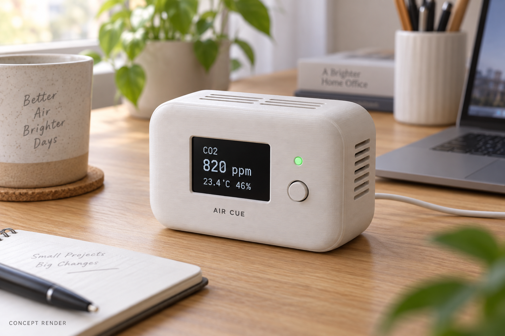

# NU-54V DK로 책상 위 환기 알림 기기 만들기: 12주 프로젝트의 시작

센서 측정에서 BLE 통신, 케이스 제작까지 — 누코더스 메이커 트랙 1주차 기획

## 1. 이번에 뚫어보고 싶은 것

이번 12주에는 센서 값을 읽는 예제를 넘어, 책상 위에 두고 계속 사용할 수 있는 물건을 만들어보고 싶다. 측정값을 화면에 띄우는 것과 사용자가 알아차릴 만한 신호로 바꾸는 것 사이에는 얼마나 많은 일이 있을까. 센서의 응답 속도, 통신이 끊겼을 때의 처리, 케이스 안에서 생기는 열까지 직접 확인하는 것이 이번 프로젝트의 목표다.

개발의 중심에는 NUCODE의 NU-54V DK를 둘 예정이다. nRF54L15 기반 보드로, 센서 데이터를 처리하고 Bluetooth LE로 전달하는 역할을 맡긴다. 이 글은 제작에 앞서 범위와 검증할 가정을 정리하는 계획서다. 아직 실습 결과나 측정 데이터는 없다. [보드 제품 정보](https://nucode.store/product/nu-54v-dk-nucode-nrf54l15-ble-60-mcu-kcfcccemic/36/category/25/display/1/)

*이미지 1. NU-54V DK 공식 제품 이미지. 출처: [NUCODE](https://nucode.store/product/nu-54v-dk-nucode-nrf54l15-ble-60-mcu-kcfcccemic/36/category/25/display/1/). 직접 촬영한 사진이 아니며, 실제 사용할 보드의 리비전은 확인할 예정이다.*

## 2. 만들 제품을 한 문장으로

**Air Cue는 책상 주변의 CO₂를 측정하고, 화면과 불빛으로 환기할 시점을 알려주는 작은 기기다.**

사용 장면은 단순하다. 책상에 올려두고 USB 전원을 연결한다. 평소에는 CO₂와 온습도를 표시하고, 설정한 조건이 지속되면 LED 색과 화면 상태를 바꾼다. 창문을 연 시점은 버튼으로 기록해, 이후 농도가 어떻게 바뀌는지 비교한다.

*이미지 2. Air Cue 제품 예상 이미지. OpenAI 이미지 생성 도구로 제작한 콘셉트이며, 실제 완성품이 아니다. 화면 수치는 예시이고 크기와 외형은 부품 배치 후 조정한다.*

## 3. 왜 직접 만들려고 하나

이 프로젝트에서 해결하고 싶은 것은 ‘환기를 생각하게 만드는 신호’다. 타이머는 정해진 시간이 지났다는 사실을 알려주지만, 지금 책상 주변의 CO₂ 변화는 측정하지 않는다. 스마트폰 앱도 외부 센서 없이는 이 값을 직접 얻을 수 없다.

완제품을 고르는 방법도 있다. 다만 이번에는 알림의 기준과 지속 시간을 직접 바꾸고, 버튼으로 남긴 환기 기록과 원시 데이터를 함께 보고 싶다. 특정 시판 제품에 기능이 없다고 단정하기보다, 내 사용 조건에 맞는 측정·알림·기록 흐름을 구현하는 데 의미를 두려 한다.

첫 버전은 CO₂ 변화에 집중한다. 미세먼지나 VOC 측정, 자동 창문 제어는 후속 과제로 남긴다.

## 4. 센서에서 사용자까지의 흐름

**센서: SCD41 → 처리: NU-54V DK → 출력: OLED·상태 LED·BLE → 전원: USB 기반 공급**

SCD41은 CO₂와 온습도를 읽을 수 있는 I²C 센서다. MCU에는 개발용 브레이크아웃 보드로 연결하고, 5초 주기의 새 측정값을 받아 화면과 BLE로 보낼 계획이다. 5초는 데이터 갱신 간격이며, 공기 변화에 대한 센서의 응답 시간과는 다르다. [SCD4x 데이터시트](https://sensirion.com/media/documents/48C4B7FB/67FE0194/CD_DS_SCD4x_Datasheet_D1.pdf)

알림은 임계값과 지속 시간으로 시작한다. 경계값 근처에서 색이 계속 바뀌지 않도록 진입과 해제 기준을 다르게 둔다. 기준값은 사용 실험을 위한 설정이며 건강이나 안전을 판정하는 기준으로 쓰지 않는다. 센서 데이터가 끊기면 정상 상태를 유지하는 대신 오류를 표시한다.

BLE로 보낸 데이터는 연결된 PC에서 CSV로 저장한다. PC 연결이 없어도 기기 자체의 측정과 알림은 동작하게 만들고 싶다.

## 5. 사용할 모듈과 기술 스택

필요한 부품은 NU-54V DK, SCD41 브레이크아웃, 소형 I²C OLED, 상태 LED와 저항, 버튼, 연결 케이블, 전원 부품, 통풍구가 있는 케이스다. 처음에는 보드에 있는 LED와 버튼으로 동작을 확인한다.

- **NU-54V 활용:** 센서 읽기, 알림 상태 관리, BLE 데이터 전송.
- **펌웨어:** C와 Zephyr를 우선 검토한다. SDK·툴체인 버전은 보드 예제가 실제로 빌드되고 다운로드되는 조합으로 고정한다.
- **Zephyr 경험:** 미정. 개인 경험 수준은 첫 환경 설정 기록과 함께 보완한다.
- **디버거:** 미정. 보유 보드의 리비전과 내장 DAP 지원을 확인한 뒤 정한다.
- **AI 부분:** 초기 버전은 사용하지 않는다. 측정과 기록이 안정화되면 환기 전후 패턴 분석을 확장 과제로 검토한다.

최신 Zephyr 문서에는 SCD41 드라이버가 안내되어 있다. 다만 NU-54V DK 보드 지원 PR은 조사 시점에 열려 있으므로, 설치할 SDK에도 같은 지원이 포함되어 있다고 가정하지 않겠다. [SCD41 드라이버 문서](https://docs.zephyrproject.org/latest/build/dts/api/bindings/sensor/sensirion,scd41.html) · [보드 지원 PR](https://github.com/zephyrproject-rtos/zephyr/pull/117771)

## 6. 12주 뒤 전시할 것

스터디 가이드의 일정에 맞춰 네 번의 도착점을 잡았다.

- **4주차까지, 9월 30일:** 개발환경을 재현할 수 있고, 실제 센서 값이 로그로 남는다.
- **8주차까지, 10월 28일:** 화면·LED·BLE가 함께 동작하고, 환기 버튼 기록을 CSV로 확인한다.
- **11주차까지, 11월 18일:** 케이스에 넣은 상태로 24시간 연속 동작과 연결 복구를 시험한다.
- **12주차, 11월 25일:** 실물 한 대, 환기 전후 기록, 재현 가능한 제작 문서를 전시한다.

매주 글에는 구현한 내용과 함께 실제 보드 사진, 로그나 배선 사진을 남길 예정이다. 일정이 밀리면 확장 기능을 줄이고 측정·표시·BLE의 기본 흐름부터 완성한다.

## 7. 가장 먼저 확인할 난관

첫째는 전원이다. SCD41의 순간 전류까지 고려해 보드 전원부가 충분한지 확인해야 한다. 필요하면 센서용 전원부를 따로 두고 I²C 신호 전압도 함께 맞출 계획이다.

둘째는 케이스다. 통풍구 위치와 보드 발열이 측정에 영향을 줄 수 있어, 케이스를 씌우기 전후의 데이터를 비교하려 한다. 온습도 수치도 배치와 보정 조건을 확인한 뒤 해석하겠다. [센서 설계 가이드](https://sensirion.com/media/documents/0D0C9129/623B1183/Sensirion_CO2_Sensors_SCD4x_design-in_guide.pdf)

멘토에게는 보드·SDK·디버거 조합과 센서 전원 설계부터 질문하고 싶다. 12주 뒤에는 ‘값이 한 번 나왔다’에서 멈추지 않고, 왜 그렇게 만들었는지와 어떤 조건에서 잘 동작하는지까지 설명할 수 있기를 바란다.

#NUCODE #누코드 #NU54VDK #누코더스 #Nucoders
