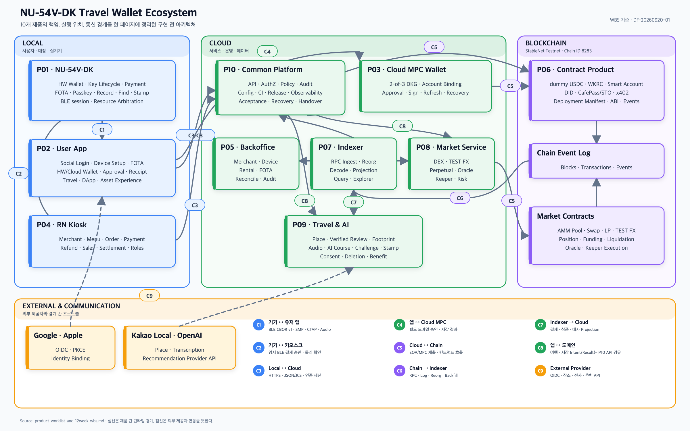

# 제품별 전체 작업 목록·우선순위·12주 WBS

작성 기준: `DF-20260920-01` · 구현 전 계획 · 상태 기준일 2026-09-20

이 문서는 현재 설계의 10개 제품 영역과 104개 구현 작업을 **제품 → 응집도 높은 작업 패키지 → 실행 작업 ID**로 다시 묶은 일정 기준이다. 104개 작업은 한 제품에 정확히 한 번만 배치했다. 다른 제품이 같은 결과를 사용하면 중복 작업으로 복사하지 않고 `선행 WBS`로 참조한다. 개인 배정과 공수는 아직 넣지 않았으며 `기기`, `앱·운영`, `체인·데이터`, `공동 통합`은 담당자 이름이 아닌 작업 흐름이다.

> 이 문서는 **구현 범위·일정·의존성·완료 증거의 기준 원장**이다. 매주 상태는 [관리용 CSV](product-worklist-and-12week-wbs.csv)에서 갱신하고, 회의에서는 이 문서의 제품표와 통합 관문을 함께 본다.

## 1. 전체 제품·통신 아키텍처

[확대용 SVG](../assets/diagrams/product-architecture-one-page.svg) · [PNG 원본](../assets/diagrams/product-architecture-one-page.png) · [다이어그램 생성 스크립트](../assets/diagrams/generate_product_architecture.py)

다이어그램은 10개 제품을 실행 위치에 따라 **Local, Cloud, Blockchain**으로 나누고, 외부 제공자와의 경계를 별도로 표시한다. 제품 상자는 담당 기능의 경계이고 `C1~C9`는 제품 사이의 런타임 통신·데이터 계약이다.

| 경계 | 연결 제품 | 통신·데이터 | WBS에서 확인할 내용 |
|---|---|---|---|
| C1 | P01 ↔ P02 | BLE CBOR v1, SMP, CTAP, Audio | 등록·설정·FOTA·패스키·녹음 전송과 재연결 |
| C2 | P01 ↔ P04 | 임시 BLE 결제 승인 | 주문과 기기 표시값 일치, 물리 승인·거절·세션 종료 |
| C3 | P02/P04 ↔ P10 | HTTPS, JSON/JCS, 인증 세션 | 계정·기기·주문·결제·환불 API와 멱등성 |
| C4 | P02 ↔ P03 | 별도 모바일 승인, MPC 결과 | DKG 계정 연결, 승인·거절, threshold 서명·복구 |
| C5 | P03/P10/P08 ↔ P06·시장 계약 | EOA/MPC 거래 제출, contract call | nonce·gas·서명 주체·실패 결과와 재조회 |
| C6 | Blockchain → P07 | RPC, log, backfill, reorg | canonical ingest, confirmation, decoder·rollback |
| C7 | P07 → P05/P08/P09/P10 | typed projection·reader | 결제·상품·대사·혜택·여행 데이터 보정 |
| C8 | P02 ↔ P08/P09, P10 API 경유 | intent·result, audio·review·course | 시장·여행 기능의 요청, pending/unknown/result 표시 |
| C9 | 외부 제공자 ↔ P02/P09/P10 | OIDC, 장소·전사·추천 API | 계정 연결, provider 오류, 동의·보관·삭제 |

## 2. 제품 분리와 범위

| 제품 | 제품 경계 | WBS 패키지 | 구현 작업 | 핵심 완료 결과 |
|---|---|---:|---:|---|
| P01 | NU-54V-DK 펌웨어·주변 부품 | 11 | 18 | 실기기 지갑, BLE, FOTA, 패스키, 녹음, 찾기, 자원 중재 |
| P02 | 유저 앱·소셜 로그인·기기 설정 | 4 | 8 | RN 앱, Google/Apple, 두 지갑, 승인·영수증 UI |
| P03 | Cloud MPC Wallet | 4 | 5 | 2-of-3 DKG·서명·refresh·복구와 모바일 별도 승인 |
| P04 | RN 키오스크·매장 운영 | 5 | 11 | 메뉴·주문·결제·환불·매출·정산·권한 |
| P05 | 백오피스·대여·운영 신뢰 | 4 | 5 | 가맹점·기기·대여·FOTA·결제 예외·감사 |
| P06 | StableNet 토큰·스마트계정·자격·x402 | 5 | 15 | dummy USDC/WKRC, Smart Account, DID/STO, x402 |
| P07 | Indexer·조회 프런트엔드 | 6 | 6 | canonical ingest, decoder/projection, 조회·업무 보정 |
| P08 | DEX·FX·Perpetual 서비스 | 7 | 12 | AMM/LP, TEST FX, Perpetual/keeper와 앱 경험 |
| P09 | 여행·기록·추천·혜택 | 5 | 10 | 음성 AI, 장소·후기·발자취, 코스·챌린지·스탬프 |
| P10 | 공통 기반·검증·릴리스 도구 | 6 | 14 | 계약·환경·CI, 수용 시험, 관측·복구·인수 |

**합계: 10개 제품, 104개 작업.** 세부 작업의 원문·입력·산출물·수용 증거는 [104개 구현 인계 카드](preimplementation-task-handoffs.md)를 따른다.

## 3. 응집도와 중복 방지 원칙

- 같은 상태와 저장소를 함께 변경하고 같은 실패 복구를 공유하는 작업을 하나의 상위 패키지로 묶었다.
- 화면만 같고 권한·서명 주체가 다른 작업은 분리했다. 예: 소셜 로그인, 모바일 승인키, HW 서명, MPC 서명.
- 컨트랙트 실행, Indexer 관측, 업무 확정, 앱 표시는 각각 별도 제품의 완료 증거로 남긴다.
- 기기 설정과 유저 앱 제품은 UI에서 만나지만 기기 프로토콜 구현은 P01, 앱 탐색·표시는 P02에 둔다.
- 스탬프 원장/표시는 여행·혜택 P09, 대여·반납과 권한 정리는 백오피스 P05에 둔다.
- 녹음 캡처·BLE 전송은 P01, 전사·AI·삭제는 P09에 둔다.
- 각 행의 `taskRefs`가 104개 권위 작업을 정확히 한 번 포함하도록 자동 검산했다.

## 4. 우선순위 기준과 먼저 진행할 순서

| 우선순위 | 의미 | 주 실행 구간 |
|---|---|---|
| C0 · 즉시 착수 | 다른 작업을 열어 주는 기반·실기 위험 제거·첫 수직 경로의 선행 작업 | 1~3주 |
| C1 · 첫 종단 경로 | 실제 NU EOA 결제와 로그인/지갑/조회처럼 4주차 관문을 만드는 작업 | 2~5주 |
| C2 · 필수 확장 | FOTA·패스키·녹음·MPC 복구·운영·상품·여행 등 8주차까지 첫 연결할 작업 | 3~9주 |
| C3 · 통합·출시 | 전 기능 회귀·실패 복구·성능·백업·릴리스·운영 인수 | 8~12주 |

모든 C0~C3 작업은 12주 범위다. 우선순위는 삭제 순서가 아니라 **착수와 의존성 해소 순서**다. 실행은 다음 순서로 연다.

1. **공통 계약·환경과 실제 보드부터 연다.** `WBS-P10-01~03`, `WBS-P01-01`, `WBS-P06-01`, `WBS-P07-01~03`이 다른 제품의 기준을 만든다.
2. **앱·키오스크 shell을 동시에 연다.** `WBS-P02-01~02`, `WBS-P04-01`로 실제 기기/체인 결과를 받을 화면과 계정을 준비한다.
3. **한 주문의 수직 경로를 먼저 완성한다.** `WBS-P01-02~05` → `WBS-P04-02~03` → `WBS-P07-03~05`를 연결해 4주차 M2를 통과한다.
4. **기기·지갑·매장 수명주기를 붙인다.** FOTA, 패스키, 녹음/찾기, MPC, 환불/정산, 대여/반납을 6~8주차에 연결한다.
5. **온체인 상품과 여행 경험을 병렬 확장한다.** Smart Account, DEX/FX/Perp, DID/STO/x402와 여행·AI·챌린지를 8주차까지 첫 연결한다.
6. **9주차부터 새 기능보다 실패·복구·대사·권한·삭제를 우선한다.** 10주차 RC, 11주차 수용 시험, 12주차 릴리스·인수로 닫는다.

핵심 의존 경로는 아래 다섯 줄로 관리한다. 한 줄의 앞 작업이 지연되면 연결된 관문과 후속 제품의 실제 통합 날짜를 함께 조정한다.

| 의존 경로 | 작업 순서 | 목표 관문 |
|---|---|---|
| 첫 실제 결제 | P10 계약·환경 → P01 지갑/BLE → P06 토큰 → P07 ingest → P04 주문·대사 → P02 영수증 | M2 · 4주 |
| 실기기 수명주기 | P01 FOTA·패스키·녹음 → P05 대여·반납 → P10 기기 수용 시험 | M6 · 11주 |
| Cloud Wallet | P02 소셜 계정 → P03 DKG·승인·서명·복구 → P10 지갑 수용 시험 | M6 · 11주 |
| 온체인 상품 | P06 계약 → P07 decoder/projection → P08 DEX·FX·Perpetual → P10 온체인 수용 시험 | M6 · 11주 |
| 여행·혜택 | P04 결제 → P07 보정 → P09 후기·발자취·AI·스탬프 → P10 여행 수용 시험 | M6 · 11주 |

## 5. 제품별 전체 작업 WBS

이 절의 표는 한 행에서 **작업 범위 → 계획 → 선행 결과 → 완료 증거**를 순서대로 읽도록 열 수를 줄였다. 일정은 작업량 추정이 아니라 실행 창이며, 선행 작업이 끝나기 전에도 mock 개발은 가능하지만 실제 통합 완료로 판정하지 않는다.

### P01 · NU-54V-DK 펌웨어·주변 부품

> **제품 완료 결과:** 실기기 지갑, BLE, FOTA, 패스키, 녹음, 찾기와 자원 중재가 함께 동작한다. **실행 창:** W1–W7 · **최종 관문:** M4 · **통신 경계:** C1, C2

| WBS / taskRefs | 작업 패키지와 구현 범위 | 계획 | 선행 WBS | 완료 증거 |
|---|---|---|---|---|
| `WBS-P01-01` / `HW-01` | **실기기 bring-up과 자원 기준선** — 보드 리비전·핀·SDK·Zephyr target을 확인하고 빌드/플래시, Flash/RAM, 기본 LED·버튼·로그·BLE 기준선을 측정한다. | **C0** · 기기 · W1 · M0 | 없음 | 실물 사진, 재현 빌드/플래시 로그, pin·Flash·RAM 보고서 |
| `WBS-P01-02` / `HW-02` | **보호 키와 HW 지갑 수명주기** — secure service에서 키 생성·보관·주소·서명·초기화와 zeroization을 구현한다. | **C0** · 기기 · W1–W3 · M2 | `WBS-P01-01`, `WBS-P10-01` | 실기기 생성/초기화/서명, 키 비반출·잘못된 요청 거절 증거 |
| `WBS-P01-03` / `HW-03` | **인증 BLE 등록과 세션** — 기기 등록, SAS 확인, 인증 세션, envelope·재연결·만료 처리를 구현한다. | **C0** · 기기 · W1–W2 · M1 | `WBS-P01-01`, `WBS-P10-01` | S25에서 등록·재연결·오류/만료 재현 로그 |
| `WBS-P01-04` / `HW-04` | **지갑 import와 기기 설정** — 앱에서 mnemonic/private key를 암호화 전송하고 기기 표시 확인·취소·재시도·민감정보 제거를 구현한다. | **C1** · 기기 · W2–W3 · M2 | `WBS-P01-02`, `WBS-P01-03`, `WBS-P02-01` | SAS 일치/불일치, import 성공·취소, 로그/메모리 정리 증거 |
| `WBS-P01-05` / `HW-05` | **결제 표시·물리 승인·EOA 서명** — 매장·금액·체인·수신처를 표시하고 버튼 승인/거절 후 EOA 거래를 서명한다. | **C1** · 기기 · W2–W4 · M2 | `WBS-P01-02`, `WBS-P01-03`, `WBS-P06-01` | 기기 표시값과 tx intent 일치, 승인/거절, 테스트넷 거래 해시 |
| `WBS-P01-06` / `HW-06` | **근접 모듈과 결제 세션** — 외부 peer 거리 신호를 보조 정보로 연결하고 unknown·이탈·연결 끊김을 결제 세션에 반영한다. | **C2** · 기기 · W3–W5 · M3 | `WBS-P01-03`, `WBS-P04-03` | 실측 거리/상태 로그와 근접값 단독 승인 금지 증거 |
| `WBS-P01-07` / `OTA-01`, `OTA-02` | **FOTA 부트·패키지 기반** — MCUboot 슬롯, 서명 이미지, trial/confirm/rollback과 배포 메타데이터를 구성한다. | **C1** · 기기 · W2–W4 · M2 | `WBS-P01-01`, `WBS-P10-03` | 정상/변조 이미지, trial boot, rollback, 버전 manifest |
| `WBS-P01-08` / `OTA-03`, `OTA-04` | **앱 FOTA와 호환 복구** — BLE 전송·진행률·재연결·중단 복구와 앱/프로토콜/키 저장 호환을 구현한다. | **C1** · 기기 · W4–W6 · M3 | `WBS-P01-07`, `WBS-P02-01` | 실기기 업데이트·전원/통신 중단·키/설정 보존 증거 |
| `WBS-P01-09` / `KEY-01`, `KEY-02`, `KEY-03` | **패스키 등록·인증·해제** — 통제 RP에서 CTAP 등록/인증, 물리 presence·PIN verification, 분실/반납 삭제를 연결한다. | **C2** · 기기 · W3–W6 · M3 | `WBS-P01-02`, `WBS-P01-03`, `WBS-P02-02` | S25/Chrome RP 등록·인증·실패·해제 증거 |
| `WBS-P01-10` / `REC-01`, `REC-02`, `FIND-01`, `FIND-02` | **녹음 전송과 기기 찾기** — 버튼 녹음·PCM frame·BLE gap 복구·폰 저장과 RSSI/버저 찾기·끊김 안내를 구현한다. | **C2** · 기기 · W3–W6 · M3 | `WBS-P01-03`, `WBS-P02-01` | 30분 녹음/재생·sequence/CRC·찾기 연결/단절 증거 |
| `WBS-P01-11` / `HW-07` | **동시 동작과 자원 중재** — 서명·import·FOTA·녹음·찾기·스탬프의 배타/동시 규칙과 메모리·전력 경합을 처리한다. | **C2** · 기기 · W5–W7 · M4 | `WBS-P01-05`, `WBS-P01-08`, `WBS-P01-09`, `WBS-P01-10` | 기능 조합별 허용/거절, crash/reboot, 배터리·자원 측정 |

### P02 · 유저 앱·소셜 로그인·기기 설정

> **제품 완료 결과:** 소셜 계정, HW/Cloud Wallet, 기기 설정, 승인·영수증·여행 UI가 하나의 앱 흐름으로 연결된다. **실행 창:** W1–W5 · **최종 관문:** M3 · **통신 경계:** C1, C3, C4, C8, C9

| WBS / taskRefs | 작업 패키지와 구현 범위 | 계획 | 선행 WBS | 완료 증거 |
|---|---|---|---|---|
| `WBS-P02-01` / `APP-01`, `AUTH-01` | **앱 골격·계정·권한 기반** — RN 앱 탐색, 한/영, 권한, 계정·매장 소속·역할 서버와 오류/재시작 상태를 구성한다. | **C0** · 앱·운영 · W1–W2 · M1 | `WBS-P10-01`, `WBS-P10-02` | S25 설치 빌드, 로그인 전/후 탐색, 역할 거부와 재시작 증거 |
| `WBS-P02-02` / `AUTH-02`, `AUTH-03`, `AUTH-04` | **Google·Apple 계정 수명주기** — 두 OIDC 제공자의 가입·로그인·연결·로그아웃·탈퇴·중복 계정을 구현한다. | **C1** · 앱·운영 · W1–W4 · M2 | `WBS-P02-01` | Google/Apple 실제 callback, token revocation, 계정 연결/탈퇴 증거 |
| `WBS-P02-03` / `APP-02` | **두 지갑·자산 선택 경험** — HW/Cloud 주소·잔액·가스·선택 signer를 분리해 표시하고 기기 상태를 연결한다. | **C1** · 앱·운영 · W2–W4 · M2 | `WBS-P02-01`, `WBS-P01-04`, `WBS-P03-02` | 두 주소/잔액 분리, 선택 signer와 승인 주체 표시 |
| `WBS-P02-04` / `APP-03`, `APP-04` | **송금·견적·승인·영수증 공통 UI** — 송금/결제 intent, pending/unknown/result 조회, 개인 결제·영수증·환불 기록을 공통 흐름으로 구현한다. | **C1** · 앱·운영 · W2–W5 · M3 | `WBS-P02-03`, `WBS-P04-03`, `WBS-P07-02` | 실거래 상태 재조회, 응답 유실 복구, 개인 이력/영수증 증거 |

### P03 · Cloud MPC Wallet

> **제품 완료 결과:** 2-of-3 DKG·승인·서명·refresh·복구를 전체 키 재조립 없이 수행한다. **실행 창:** W1–W8 · **최종 관문:** M4 · **통신 경계:** C4, C5

| WBS / taskRefs | 작업 패키지와 구현 범위 | 계획 | 선행 WBS | 완료 증거 |
|---|---|---|---|---|
| `WBS-P03-01` / `MPC-01` | **MPC 도입·신뢰·복구 기준선** — 2-of-3 참여자, 독립 KMS, 모바일 approval, 복구 custodian과 라이브러리 실행 경로를 검증한다. | **C0** · 체인·데이터 · W1–W2 · M1 | `WBS-P10-02` | 선택 revision, threat boundary, 참여자 격리·실행 spike |
| `WBS-P03-02` / `MPC-02` | **분산 키 생성과 계정 연결** — DKG·주소 생성과 소셜 계정/모바일 승인키 바인딩을 구현한다. | **C1** · 체인·데이터 · W2–W4 · M2 | `WBS-P03-01`, `WBS-P02-02` | 전체키 재조립 없는 DKG, 주소·epoch·계정 연결 증거 |
| `WBS-P03-03` / `MPC-03` | **MPC 승인·서명·결과** — 모바일 별도 승인 후 threshold 서명과 테스트넷 제출·결과 조회를 앱에 연결한다. | **C1** · 체인·데이터 · W3–W5 · M3 | `WBS-P03-02`, `WBS-P02-04`, `WBS-P07-03` | A/B threshold 서명, 모바일 승인 거부, tx/Indexer 결과 |
| `WBS-P03-04` / `MPC-04`, `MPC-05` | **복구·refresh·참여자 장애** — 기기 변경, share refresh/회전/철회, A/C 복구와 중단 세션·quorum 상실을 처리한다. | **C2** · 체인·데이터 · W5–W8 · M4 | `WBS-P03-03`, `WBS-P05-01` | old epoch 거절, 참여자 장애·timeout/unknown·독립 복구 감사 |

### P04 · RN 키오스크·매장 운영

> **제품 완료 결과:** 태블릿에서 메뉴·주문·NU 결제·환불·매출·정산을 매장 권한으로 처리한다. **실행 창:** W1–W8 · **최종 관문:** M4 · **통신 경계:** C2, C3

| WBS / taskRefs | 작업 패키지와 구현 범위 | 계획 | 선행 WBS | 완료 증거 |
|---|---|---|---|---|
| `WBS-P04-01` / `SHOP-01`, `SHOP-02` | **태블릿·매장·메뉴·주문 기반** — Android RN 키오스크, 매장 가입/로그인, 관리 모드, 메뉴·가격·품절·장바구니·주문을 구현한다. | **C0** · 앱·운영 · W1–W3 · M2 | `WBS-P02-01`, `WBS-P10-01` | 태블릿 설치, 매장 격리, 메뉴→주문 snapshot 증거 |
| `WBS-P04-02` / `PAY-01`, `PAY-02`, `PAY-03` | **EOA 견적·제출·주문 연결** — 환율·수수료·만료 견적, 서명 요청, 제출/재시도와 주문 payment attempt를 연결한다. | **C1** · 체인·데이터 · W2–W4 · M2 | `WBS-P06-01`, `WBS-P01-05`, `WBS-P07-02` | quote TTL/rounding, 멱등 제출, 주문·attempt·tx 연결 |
| `WBS-P04-03` / `PAY-04`, `PAY-05`, `SHOP-03` | **입금 대사와 NU 수직 결제** — Indexer 관측·2 block 확정·payment allocation과 키오스크 BLE 승인/영수증을 한 흐름으로 연결한다. | **C1** · 공동 통합 · W3–W5 · M2 | `WBS-P04-01`, `WBS-P04-02`, `WBS-P07-03` | NU 승인→StableNet→Indexer→paid→영수증 종단 증거 |
| `WBS-P04-04` / `SHOP-04` | **점주 환불 수명주기** — 원 결제·권한·서명자를 확인하고 부분/전체 환불의 제출·확정·오류를 구현한다. | **C2** · 앱·운영 · W4–W6 · M3 | `WBS-P04-03`, `WBS-P06-01` | 무권한 거절, 부분 환불, 응답 유실/지연 결과 재조회 |
| `WBS-P04-05` / `SHOP-05`, `SHOP-06` | **매출·정산·수취 권한** — 매출·수취·환불·정산 대조와 수취 주소 변경/환불 signer 권한 분리를 구현한다. | **C2** · 앱·운영 · W5–W8 · M4 | `WBS-P04-04`, `WBS-P05-01`, `WBS-P07-05` | 일 마감/보정, 주소 변경 승인, 점주 역할별 조회·서명 거절 |

### P05 · 백오피스·대여·운영 신뢰

> **제품 완료 결과:** 가맹점·기기·대여·반납·FOTA·결제 예외를 감사 가능한 운영 절차로 관리한다. **실행 창:** W2–W8 · **최종 관문:** M4 · **통신 경계:** C3, C7

| WBS / taskRefs | 작업 패키지와 구현 범위 | 계획 | 선행 WBS | 완료 증거 |
|---|---|---|---|---|
| `WBS-P05-01` / `OPS-01` | **운영자 권한·감사·관리 골격** — 가맹점·계정·기기·거래를 역할별로 조회/관리하고 typed command·audit를 남긴다. | **C1** · 앱·운영 · W2–W4 · M2 | `WBS-P02-01`, `WBS-P10-01` | 역할별 허용/거절, append-only 감사, 원 결과 조회 |
| `WBS-P05-02` / `OPS-02`, `STAMP-03` | **가맹점·대여·FOTA 운영** — 가맹점 승인, 기기 대여/반납, 잔액 회수·접근 해제, FOTA campaign을 연결한다. | **C2** · 앱·운영 · W4–W7 · M4 | `WBS-P05-01`, `WBS-P01-08`, `WBS-P04-03` | 대여→지급→반납, import/new 지갑 분기, staged FOTA 증거 |
| `WBS-P05-03` / `STAMP-04` | **반납 후 권한·늦은 효과 정리** — 미확정 거래, passkey, DID/스마트 계정, BLE 권한과 복구 package 확인 후 재대여 gate를 처리한다. | **C2** · 공동 통합 · W6–W8 · M4 | `WBS-P05-02`, `WBS-P01-09`, `WBS-P06-02` | 늦은 자산/unknown 거래, 권한 철회, reset hold·재대여 조건 증거 |
| `WBS-P05-04` / `OPS-03` | **결제 예외·Indexer 지연·대사** — 부분/초과/중복/지연 지급과 reorg·Indexer stale을 대사 queue와 운영 화면에서 처리한다. | **C2** · 앱·운영 · W5–W8 · M4 | `WBS-P05-01`, `WBS-P04-03`, `WBS-P07-04` | 예외 분류·재처리 멱등성·수동 결정 audit와 보정 증거 |

### P06 · StableNet 토큰·스마트계정·자격·x402

> **제품 완료 결과:** StableNet에서 dummy USDC/WKRC, Smart Account, DID/CafePass, x402 계약을 실행한다. **실행 창:** W1–W8 · **최종 관문:** M4 · **통신 경계:** C5, C6

| WBS / taskRefs | 작업 패키지와 구현 범위 | 계획 | 선행 WBS | 완료 증거 |
|---|---|---|---|---|
| `WBS-P06-01` / `TOKEN-01`, `TOKEN-02`, `TOKEN-03` | **네트워크·dummy USDC·WKRC 기반** — chain 8283, 단위·가스·주소 gate와 dummy USDC 배포/권한, WKRC/native·wrapped 경계를 구성한다. | **C0** · 체인·데이터 · W1–W3 · M2 | `WBS-P10-02` | 배포 manifest, address/codeHash/ABI/block, 단위·가스 golden vector |
| `WBS-P06-02` / `SMART-01`, `SMART-02`, `SMART-03` | **EOA→스마트 계정 전환** — Kernel/ERC-7579·ERC-4337 stack, Bundler와 별도 주소·사용자 선택 전환·앱 결과를 구현한다. | **C2** · 체인·데이터 · W4–W7 · M4 | `WBS-P04-03`, `WBS-P06-01`, `WBS-P07-03` | UserOp 실행, EOA/SA 주소·자산 분리, 내부 실패·allowance 표시 |
| `WBS-P06-03` / `DID-01`, `DID-02`, `DID-03` | **DID 자격 발급·검증·철회** — did:web issuer, did:key holder, VC 발급/제시/검증/상태 철회와 앱 자격 관리를 구현한다. | **C2** · 체인·데이터 · W4–W7 · M4 | `WBS-P02-04`, `WBS-P06-01` | 발급·제시·current status·철회 경쟁·앱 결과 증거 |
| `WBS-P06-04` / `STO-01`, `STO-02`, `STO-03` | **제한형 CafePass 테스트 발행물** — DID 자격 기반 발행·보유·전송 제한과 앱 결과를 구현한다. | **C2** · 체인·데이터 · W5–W8 · M4 | `WBS-P06-03`, `WBS-P07-04` | 적격/부적격 transfer, 철회 후 거절, 권리 없음 표시 |
| `WBS-P06-05` / `X402-01`, `X402-02`, `X402-03` | **x402 유료 AI 코스** — 402 challenge, EIP-3009 승인·지급 검증, entitlement·재조회·공급 실패 환불과 앱 사용 흐름을 구현한다. | **C2** · 체인·데이터 · W5–W8 · M4 | `WBS-P06-01`, `WBS-P07-04`, `WBS-P09-04` | 1 dUSDC 지급, 중복 재시도 1효과, 결과 재조회/실패 환불 |

### P07 · Indexer·조회 프런트엔드

> **제품 완료 결과:** 체인 이벤트를 canonical하게 수집하고 앱·운영·시장·여행용 projection을 제공한다. **실행 창:** W1–W9 · **최종 관문:** M5 · **통신 경계:** C6, C7

| WBS / taskRefs | 작업 패키지와 구현 범위 | 계획 | 선행 WBS | 완료 증거 |
|---|---|---|---|---|
| `WBS-P07-01` / `INDEX-01` | **체인·배포 계약 등록** — StableNet RPC와 활성 deployment registry를 indexer source로 구성한다. | **C0** · 체인·데이터 · W1–W2 · M1 | `WBS-P10-02` | RPC capability, 등록/미등록 주소 gate, source revision |
| `WBS-P07-02` / `INDEX-02` | **SDK·조회 schema 정합화** — 기존 SDK/Indexer 요청·응답, 정수 금액, 이벤트 변환과 typed reader를 맞춘다. | **C0** · 체인·데이터 · W1–W3 · M2 | `WBS-P07-01` | contract tests, amount/unit golden vector, 오류 schema |
| `WBS-P07-03` / `INDEX-03` | **canonical ingest·backfill·reorg** — cursor, raw block/log, 중복 제거, 2-block confirmation, backfill과 reorg rollback을 구현한다. | **C0** · 체인·데이터 · W2–W4 · M2 | `WBS-P07-01`, `WBS-P06-01` | 중복/reorg fixture, 재시작 cursor, full backfill 결과 |
| `WBS-P07-04` / `INDEX-04` | **확장 계약 decoder·projection** — 스마트계정·DEX·FX·Perp·STO·DID·x402 ABI와 versioned projection을 등록한다. | **C2** · 체인·데이터 · W4–W8 · M4 | `WBS-P07-03`, `WBS-P06-02`, `WBS-P06-03` | 구/신 decoder 공존, quarantine, 계약별 이벤트/조회 증거 |
| `WBS-P07-05` / `INDEX-05` | **앱 조회·탐색기·상태 관측** — 거래 상세, confirmation/reorg/stale, explorer link와 권한 안전 reader를 앱에 제공한다. | **C1** · 체인·데이터 · W3–W8 · M4 | `WBS-P07-02`, `WBS-P07-03`, `WBS-P02-04` | 앱 실제 조회, stale/unknown 표시, cursor generation 거절 |
| `WBS-P07-06` / `INDEX-06` | **원장·혜택·여행 보정 전파** — 관측 변경을 결제 원장·매출·스탬프·verified review·추천 입력에 멱등 보정한다. | **C2** · 공동 통합 · W6–W9 · M5 | `WBS-P07-04`, `WBS-P07-05`, `WBS-P05-04`, `WBS-P09-03` | reorg/decoder 보정 후 업무·혜택·여행 projection 일치 |

### P08 · DEX·FX·Perpetual 서비스

> **제품 완료 결과:** DEX·TEST FX·Perpetual의 견적, 실행, 오라클·keeper와 앱 경험을 완성한다. **실행 창:** W4–W8 · **최종 관문:** M4 · **통신 경계:** C5, C7, C8

| WBS / taskRefs | 작업 패키지와 구현 범위 | 계획 | 선행 WBS | 완료 증거 |
|---|---|---|---|---|
| `WBS-P08-01` / `DEX-01`, `DEX-02` | **AMM 상품·pool·swap/LP 실행** — dummy USDC/WKRC pool, quote·slippage·allowance, swap과 유동성 공급/회수를 구현한다. | **C2** · 체인·데이터 · W4–W6 · M3 | `WBS-P06-01` | integer/rounding·stale quote·slippage·LP 실행 증거 |
| `WBS-P08-02` / `DEX-03` | **DEX 앱 경험** — 견적·승인·swap/LP·이력과 pending/revert/reorg 상태를 앱에 연결한다. | **C2** · 앱·운영 · W5–W8 · M4 | `WBS-P08-01`, `WBS-P02-04`, `WBS-P07-05` | 앱 입력→서명→실행→Indexer 결과 종단 증거 |
| `WBS-P08-03` / `FX-01`, `FX-02` | **TEST FX 모델·교환 서비스** — 지정 통화 쌍, 가격 snapshot과 TEST FX 표시, 교환 실행을 구성한다. | **C2** · 체인·데이터 · W5–W7 · M4 | `WBS-P08-01` | 가격 근거·만료·교환 수량과 pool 효과 증거 |
| `WBS-P08-04` / `FX-03` | **FX 앱 경험** — FX 견적·승인·교환·기록과 만료/재견적을 앱에 연결한다. | **C2** · 앱·운영 · W6–W8 · M4 | `WBS-P08-03`, `WBS-P02-04` | 앱 견적→사용자 재승인→교환→이력 증거 |
| `WBS-P08-05` / `PERP-01`, `PERP-02` | **Perpetual 시장·오라클 기준** — TEST BTC/WKRC 시장, margin/leverage/funding/liquidation과 signed oracle stale guard를 구현한다. | **C2** · 체인·데이터 · W4–W6 · M3 | `WBS-P06-01` | 위험 golden vector, oracle age/stale 거절 증거 |
| `WBS-P08-06` / `PERP-03`, `PERP-04`, `PERP-06` | **포지션·펀딩·청산 실행** — 포지션 개설/축소/종료, funding, liquidation keeper lease와 중복/장애 복구를 구현한다. | **C2** · 체인·데이터 · W5–W8 · M4 | `WBS-P08-05` | 3배/증거금 경계, funding, 단일 청산 효과, keeper 복구 |
| `WBS-P08-07` / `PERP-05` | **Perpetual 앱 경험** — 시장·주문·포지션·PnL·펀딩·청산 이력과 실패 상태를 앱에 연결한다. | **C2** · 앱·운영 · W6–W8 · M4 | `WBS-P08-06`, `WBS-P02-04`, `WBS-P07-05` | 앱 실제 포지션 수명주기와 Indexer 결과 증거 |

### P09 · 여행·기록·추천·혜택

> **제품 완료 결과:** 음성 기록, 장소·후기·발자취, AI 코스, 챌린지·스탬프를 결제 근거와 연결한다. **실행 창:** W3–W9 · **최종 관문:** M5 · **통신 경계:** C7, C8, C9

| WBS / taskRefs | 작업 패키지와 구현 범위 | 계획 | 선행 WBS | 완료 증거 |
|---|---|---|---|---|
| `WBS-P09-01` / `REC-03` | **전사·AI 회의 기록** — 폰에 저장된 음성을 전사·요약하고 원음/텍스트/결과 내보내기·삭제를 연결한다. | **C2** · 앱·운영 · W4–W7 · M4 | `WBS-P01-10`, `WBS-P02-01` | audio manifest→전사→요약 연결, 공급자 실패·삭제 fanout 증거 |
| `WBS-P09-02` / `TRIP-01`, `TRIP-02` | **장소 검색·verified 후기** — Kakao 장소, 위치 권한, 맛집 검색과 결제 출처가 있는 후기/노출 정책을 구현한다. | **C2** · 앱·운영 · W3–W6 · M3 | `WBS-P02-01`, `WBS-P04-03` | 권한 허용/거절, place snapshot, verified/일반 후기 구분 |
| `WBS-P09-03` / `TRIP-03`, `TRIP-04` | **여행 모드·발자취·데이터 수명주기** — 결제/위치 발자취, session·배경 동의, 장소 식별·보관·삭제를 구현한다. | **C2** · 앱·운영 · W4–W8 · M4 | `WBS-P09-02`, `WBS-P02-04`, `WBS-P07-05` | 여행 session, 100m/5분 규칙, 동의 철회·삭제/restore seal |
| `WBS-P09-04` / `AI-01`, `AI-02` | **근거 있는 AI 코스** — 결제·후기·위치 입력, 코스 제약/평가 corpus와 생성·근거·수정·저장/apply를 구현한다. | **C2** · 앱·운영 · W5–W8 · M4 | `WBS-P09-02`, `WBS-P09-03` | 20개 평가 corpus, 존재 장소/근거, user apply revision |
| `WBS-P09-05` / `AI-03`, `STAMP-01`, `STAMP-02` | **챌린지·스탬프·보상** — 따라하기 방문/결제 증명과 스탬프 발급·사용·취소 원장, 앱·기기 표시를 구현한다. | **C2** · 공동 통합 · W6–W9 · M5 | `WBS-P09-04`, `WBS-P04-03`, `WBS-P07-06` | 중복 발급 금지, 환불 debt, 챌린지 완료/미완료·기기 표시 |

### P10 · 공통 기반·검증·릴리스 도구

> **제품 완료 결과:** 공통 계약·환경·CI·관측·수용 시험·복구·릴리스 인수를 전체 제품에 적용한다. **실행 창:** W1–W12 · **최종 관문:** M7 · **통신 경계:** C3, C5, C7, C8, C9

| WBS / taskRefs | 작업 패키지와 구현 범위 | 계획 | 선행 WBS | 완료 증거 |
|---|---|---|---|---|
| `WBS-P10-01` / `BASE-01`, `BASE-02`, `BASE-03` | **요구·데이터·연결 계약 기준선** — 15개 요구를 화면/시나리오에 연결하고 공통 ID·상태·HTTP/BLE envelope를 runtime 작업으로 고정한다. | **C0** · 공동 통합 · W1–W2 · M1 | 없음 | 계약 예제, 상태/권한/멱등성 contract test와 소비자 확인 |
| `WBS-P10-02` / `BASE-04`, `BASE-05`, `BASE-06` | **재사용·환경·지원 행렬** — 기존 네 저장소 차이, secretRef 환경, 보존 정책과 두 지갑/기능/서명 지원 행렬을 고정한다. | **C0** · 공동 통합 · W1–W2 · M1 | `WBS-P10-01` | pinned revision, 호환 gap, 비밀 없는 환경 manifest, 지원/거절표 |
| `WBS-P10-03` / `RELEASE-01` | **CI·재현 빌드·시험 도구** — 펌웨어·앱·서비스·계약·Indexer 재현 빌드와 fixture/배포 manifest 검사기를 구성한다. | **C0** · 공동 통합 · W1–W3 · M2 | `WBS-P10-02` | clean build, artifact digest, CI 결과, synthetic fixture 실행 |
| `WBS-P10-04` / `VERIFY-01`, `VERIFY-02` | **두 지갑·기기 수용 시험** — 소셜/Cloud MPC/대여와 지갑·FOTA·패스키·녹음·찾기의 정상/실패/공존 시험을 수행한다. | **C3** · 공동 통합 · W8–W11 · M6 | `WBS-P01-11`, `WBS-P02-04`, `WBS-P03-04`, `WBS-P05-03` | 실기기/실계정 수용 결과, 실패·복구 로그, 교차 검토 |
| `WBS-P10-05` / `VERIFY-03`, `VERIFY-04`, `VERIFY-05` | **매장·온체인·여행 수용 시험** — 매장/환불/정산/운영, 9개 온체인 영역·DEX, 여행/혜택을 종단 시험한다. | **C3** · 공동 통합 · W8–W11 · M6 | `WBS-P04-05`, `WBS-P06-05`, `WBS-P08-07`, `WBS-P09-05`, `WBS-P07-06` | 카페·테스트넷·앱 정상/실패/복구 evidence index |
| `WBS-P10-06` / `RELEASE-02`, `RELEASE-03` | **관측·백업·릴리스·인수** — RPO/RTO 복구, 관측/경보, release/rollback과 전체 증거·설치·운영 인수를 마친다. | **C3** · 공동 통합 · W10–W12 · M7 | `WBS-P10-04`, `WBS-P10-05` | 복구 drill, release manifest, 운영 runbook, 15요구 evidence index |

## 6. 12주 실행 계획

| 주 | 공동 목표 | 기기 흐름 | 앱·운영 흐름 | 체인·데이터 흐름 | 주 종료 조건 |
|---:|---|---|---|---|---|
| 1 | 실행 기반과 실기 불확실성 제거 | NU bring-up·자원 측정·BLE 골격 | RN 앱/키오스크 골격·계정/역할 | StableNet·dummy token·Indexer source·MPC spike | M0: 보드 flash, 앱/키오스크 실행, RPC·빌드 재현 |
| 2 | 인증된 연결과 데이터 기준선 | secure wallet·인증 BLE·FOTA slot | Google/Apple 연결 시작·메뉴/주문 | 토큰 배포·SDK schema·raw/canonical ingest | M1: 인증 BLE, 배포 manifest, Indexer 원 이벤트, 주문 snapshot |
| 3 | 서명 가능한 제품 조각 연결 | import·표시/승인·오디오/패스키 spike | 두 지갑 화면·소셜 수명주기·장소/후기 | EOA quote/submit·MPC DKG·Indexer reorg | 기기 서명과 주문 attempt가 같은 ID로 추적됨 |
| 4 | 첫 실제 카페 결제 관문 | HW EOA 승인·FOTA 기반·근접 연결 | 키오스크 BLE 결제·영수증·개인 이력 | 2-block 대사·MPC 주소·Smart/DID/Perp 기반 | M2: NU→StableNet→Indexer→키오스크 영수증 1건 |
| 5 | 운영 수명주기와 확장 기능 | 앱 FOTA·패스키·녹음/찾기·중재 | 환불·백오피스·대여·여행 모드 | MPC 서명·DEX/Perp 실행·x402/AI 기반 | 핵심 기능별 첫 정상 실행과 오류 상태 확보 |
| 6 | 기기·매장·여행 핵심 완성 | FOTA 중단 복구·패스키/녹음/찾기 완료 | 매출/정산·음성 AI·위치/후기/발자취 | Smart Account·DID/STO·FX·Perp 실행 | M3: 기기 부가기능, 환불/정산, 여행 core 앱 연결 |
| 7 | 확장 상품과 복구 연결 | 동시 동작·반납/권한 해제 보완 | DEX/FX/Perp·자격/x402 화면·AI 코스 | MPC refresh/복구·keeper·확장 decoder | 전 제품의 첫 통합 증거를 evidence index에 등록 |
| 8 | 전체 범위 첫 통합 | 기기 전체 기능과 대여 재검증 | 백오피스·여행 챌린지·스탬프 통합 | 9개 온체인 영역·DEX·Indexer 조회 완료 | M4: 15개 요구 모두 실제 대상과 1회 연결 |
| 9 | 실패·보정·현장 회귀 | 전원/BLE/FOTA/자원 경합·배터리 | 카페 흐름·권한·삭제·환불/혜택 보정 | reorg/nonce/gas/oracle/keeper/MPC 장애 | M5 준비: critical/high 결함과 데이터 불일치 제거 |
| 10 | 릴리스 후보와 복구 훈련 | 실기기 장시간·반납 재대여 | 계정 탈퇴·개인정보 삭제·운영 대응 | backfill/rebuild·백업/복구·체인 manifest | M5: RC build, RPO/RTO drill, 출시 차단 이슈 목록 |
| 11 | 전체 수용 시험과 수정 | VERIFY-02 및 기기 결함 수정 | VERIFY-01/03/05·사용 가이드 | VERIFY-04·온체인/Indexer 결함 수정 | M6: 5개 수용 suite 통과 또는 명시적 미통과 증거 |
| 12 | 릴리스·시연·인수 | 펌웨어 release/rollback·하드웨어 인수 | 앱/키오스크/백오피스 패키지·운영 인수 | 계약/ABI/Indexer release·복구 문서 | M7: 15요구 evidence index, 최종 시연, 설치/운영 인계 |

## 7. 통합 관문

| 관문 | 기한 | 판정 주제 | 반드시 남길 증거 |
|---|---:|---|---|
| M0 | 1주 | 실행 가능 기반 | 실물 보드 flash·로그, S25/태블릿 앱 실행, StableNet RPC와 재현 build |
| M1 | 2주 | 연결 기준선 | 인증 BLE, dummy token manifest, Indexer 원 이벤트, 계정/주문 골격 |
| M2 | 4주 | 첫 실제 결제 | NU 승인→EOA 제출→2-block Indexer→paid→키오스크 영수증 |
| M3 | 6주 | 핵심 제품 완성 | FOTA/패스키/녹음/찾기, 환불/정산, MPC 서명, 여행 core의 앱 연결 |
| M4 | 8주 | 전 범위 첫 통합 | 15개 요구 각각 실제 기기/계정/테스트넷/앱의 첫 증거 |
| M5 | 10주 | 릴리스 후보 | 카페 현장 회귀, 장애·보정·권한·삭제·성능·복구 기준 통과 |
| M6 | 11주 | 수용 판정 | VERIFY-01~05 결과와 남은 출시 차단 이슈의 소유/해결 기록 |
| M7 | 12주 | 릴리스·인수 | 재현 artifact, 운영/복구 문서, evidence index, 최종 시연 |

관문을 통과하지 못해도 증거 없이 완료 처리하지 않는다. 해당 WBS를 `blocked` 또는 `in_progress`로 유지하고, 후속 작업 중 mock으로 진행할 부분과 실제 통합을 기다릴 부분을 분리한다.

## 8. 주간 관리 방식

각 WBS 행은 [CSV](product-worklist-and-12week-wbs.csv)에서 관리한다. 매주 최소한 `status`, `assignee`, 실제 시작/종료, evidence 링크, blocker를 갱신한다. 현재 CSV는 계획 기준만 담아 `status=planned`, `assignee` 공란이다.

상태는 다음 다섯 개만 사용한다.

- `planned`: 선행 결과 또는 담당 배정을 기다림.
- `in_progress`: 구현/시험 중이며 완료 증거가 아직 없음.
- `blocked`: 외부 입력이나 선행 실패로 진전할 수 없고 blocker가 기록됨.
- `ready_for_review`: 코드·실행 증거가 있고 다른 흐름 담당자의 검토를 기다림.
- `done`: 실제 대상에서 정상·관련 실패/복구를 실행하고 버전·증거·교차 검토를 모두 남김.

주간 회의는 제품별 진행률 합계보다 다음 네 가지를 본다.

1. 이번 주 관문을 막는 선행 WBS와 해제 날짜.
2. 앱·기기·체인에서 같은 ID와 상태가 연결됐는지.
3. 실제 실행 증거가 없는 `완료` 표시가 있는지.
4. 다음 2주에 필요한 계정·부품·주소·데이터·검토자의 준비 여부.

## 9. 완료와 변경 관리

- 문서 작성, 코드 존재, 화면 mock, 계약 배포 중 하나만으로는 `done`이 아니다.
- 일정 변경은 WBS 행의 주차·선행·관문을 함께 바꾸고 taskRefs를 삭제하지 않는다.
- 작업 분리/병합 시 104개 taskRef가 정확히 한 번 존재해야 한다.
- 범위 추가는 15개 요구 중 어느 항목을 충족하는지와 기존 관문에 미치는 영향을 먼저 기록한다.
- 실제 담당자와 공수는 세 사람의 주력 분야·주당 시간·기존 코드 숙련도를 받은 뒤 CSV의 `assignee`와 별도 추정 열에 추가한다.

## 10. 기준 문서

- [구현 진입 설계 동결](design-freeze-checkpoint.md)
- [104개 작업 구현 인계 카드](preimplementation-task-handoffs.md)
- [구현 순서·착수 조건·완료 증거](implementation-sequence.md)
- [12주 완료 범위](../twelve-week-completion-scope-v3.md)
- [3인 작업 분류 참고안](../three-person-delivery-plan.md)
