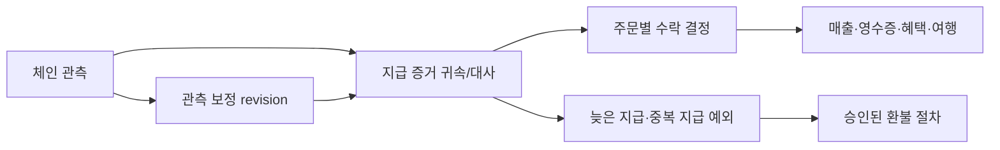

# 결제·환불·반납의 책임과 상태 전이 설계

상태: **상세 설계 제안, 구현 미착수**. 기존 [API 계약](critical-dtos.md), [저장 작업](storage-operations.md), [보안 연결](security-api-integration.md)을 구체화한다. 12주·15개 요구사항·104개 작업 범위를 유지하며 개인 배정·공수는 보류한다. 논리 서비스 책임을 구분한 것이며 별도 서버/저장소 개수를 확정하지 않는다.

이번 문서는 정상 절차를 반복하기보다 **동시에 발생하는 지급, 관측 보정, 초기화 후 복구**의 판단 책임을 다룬다. 아래 신규 정책은 제안이며 사용자 확정이나 현재 API 구현을 의미하지 않는다. 기존 DTO/DDL에 표현이 부족한 항목은 마지막 변경 목록에 남긴다. 특히 현재 스키마가 아래 모든 상태 조합을 충분히 전달한다고 간주하지 않는다.

[설계 검토 사례 12개](commerce-lifecycle-cases.json) · [기존 작업 순서](../planning/implementation-sequence.md)

후속: LC-GAP-01~03의 [API·이벤트·저장 계약 후보](commerce-contract-changes.md)를 작성했다. 해당 항목은 구체 변경안 작성·정책/통합 검토 대기로 진전했으며, 기존 DTO/DDL 병합과 제품 구현은 아직 하지 않았다. 아래 미반영 항목 설명은 기존 계약 기준이다.

LC-GAP-04~05의 [반납 복구·장치 증거 설계 후보](return-recovery-design.md)도 연결했다. 기기 실행 허가·증거 접수·재대여 gate를 분리하며 늦은 자산 복구 정책과 하드웨어 보호 profile은 미확정이다.

## 1. 제품별 책임과 사실의 기준

| 구성요소 | 책임지는 사실/행위 | 다른 구성요소에 맡기는 판단 |
|---|---|---|
| NU Zephyr 펌웨어 | 실제 기기에 표시한 승인 내용, 물리적 승인, 키 사용, 인증된 세션, 초기화 실행/증거 | 주문 가격·입금 확정·환불 한도·매출 결정 |
| 유저 앱 | 지갑 선택, 승인 요청 전달, 기기 설정, 기록/결과 표시, 중단 후 조회 복구 | 서명 결과를 곧바로 결제 완료로 판정하지 않음 |
| RN 키오스크 | 매장 로그인·주문·메뉴 관리, 결제 진행, 환불 업무 요청 | 점주 로그인만으로 자금 서명 권한을 얻지 않음 |
| 계정·권한 경계 | 계정/매장 소속, 현재 권한, 목적별 capability, 철회 revision | 지갑 주소 통제 증명과 계정 소속을 동일시하지 않음 |
| 주문·결제 대사 | 주문 snapshot, 지급 증거의 귀속·수락, 중복/늦은 지급 예외 | Indexer의 관측만으로 사용자 승인·주문 귀속을 추론하지 않음 |
| 거래 중계·Indexer | 정확한 intent의 제출, receipt/log·정규성·확정 정책 관측, 재조회 | 체인 실행 성공과 주문 수락을 분리 |
| 환불 경계 | 한도 예약, 업무 승인, 환불별 실행/확정/보정 | 점주 HW/MPC signer가 실제 자금 서명 수행 |
| 기기 등록·대여 경계 | 현재 rental/binding, 반납 점검 revision, clearance, 재대여 가능 여부 | 초기화 API 호출이나 운영자 체크를 실제 삭제 증거로 취급하지 않음 |
| 백오피스·후속 소비자 | 예외 조회/재검증 요청, 매출·영수증·혜택·여행 projection | 원지급·환불·초기화 성공을 수동으로 만들어 넣지 않음 |

서버의 여러 논리 책임이 같은 DB에 있어도 체인 제출·MPC·기기 초기화는 DB transaction과 원자적으로 실행되지 않는다. 안전한 intent/작업 참조를 먼저 저장하고 외부 결과를 재관측한다. 기존 TX-01~16과 보호된 보안 adapter 경계를 유지한다.

## 2. 하나의 성공 상태로 합치지 않을 상태 축

| 상태 축 | 현재 계약/저장 상태 | 해석 |
|---|---|---|
| 주문 | `awaiting_payment / paid / cancelled / expired / fulfilled` | 주문 처리 이력. 환불됐다고 fulfilled 사실을 삭제하지 않음 |
| 제출 | `prepared / submitted / unknown / observed / failed` | 중계/조회 상태. observed만으로 receipt 성공·확정·주문 수락을 증명하지 않음 |
| 지급 배정 | `pending / accepted / exception / invalidated` | 특정 증거가 어느 주문에 귀속되고 유효하게 수락됐는지 |
| 환불 | `requested / authorized / signing / submitted / unknown / confirmed / rejected / failed` | 환불 업무·지급의 진행 |
| 환불 예약 DB | `active / consumed / released` | 한도 회계. API의 RefundReservation.state와 일대일 동일 enum이 아님 |
| 대여 | `assigned / active / return_requested / return_pending / returned` | 임대 관계 종료 여부. returned는 검증된 초기화와 binding 철회 뒤 |
| 반납 점검 | `pending / eligible_for_reset / reset_confirmed / completed` | 점검·초기화·서버 종료의 진행 |

기존 API-019는 execution/canonicality/confirmation을, API-030은 order/paymentSummary를, API-035는 attempt/observation/exception을 따로 반환한다. UI는 최신 원천 revision과 observedAt을 확인한다. `Operation.succeeded`는 그 operation.kind의 완료일 뿐 원주문 결제·환불·반납 모두의 성공을 뜻하지 않는다.

## 3. 주문 취소·다중 지급의 전이

### 3.1 일반 수락과 취소의 원자 경계

1. API-029가 가격·수취 snapshot을 고정한다. 견적/intent도 원주문과 선택 signer에 연결한다.
2. 서명/제출은 API-018의 접수 결과와 API-019 관측으로 추적한다. BLE 연결 종료나 intent 만료가 이미 만들어진 EOA 서명을 무효화하지는 않는다.
3. 대사는 receipt 성공, 자산/수취/금액/지급 주체, 귀속 증거, canonicality, 확정 정책을 확인한다.
4. **제안:** TX-04에서 order revision과 수락 결정을 함께 직렬화한다. 취소/만료가 먼저 저장됐으면 늦은 지급은 exception으로 남기고 자동 paid 전환하지 않는다. 수락이 먼저 저장됐으면 API-031 취소를 거절하고 환불 절차로 안내한다.
5. `awaiting_payment → paid → fulfilled`는 주문 경계가 변경한다. accepted 관측이 보정되면 3.3을 따른다.

### 3.2 서로 다른 attempt가 모두 지급된 경우

`payment_evidence`의 고유성은 **한 증거가 두 주문에 쓰이는 것**을 막는다. 서로 다른 두 증거가 같은 주문에 수락되는 문제는 별도다.

**제안: 자동 수락은 최초로 업무 transaction에서 확정된 한 지급에 한정한다.** 체인에서 가장 먼저 발생한 거래나 가장 먼저 화면에 나타난 거래를 뜻하지 않는다. 불명확한 순서를 타임스탬프로 재정렬해 기존 결과를 뒤집지 않는다.

- 대사 transaction은 evidence 귀속과 order별 기존 수락 결정을 함께 검사한다. 두 작업이 동시에 실행되어도 하나만 일반 매출/혜택의 원천이 된다.
- 후속 지급은 자기 attempt·payer·asset에 귀속된 exception으로 보존한다. 다른 고객 주문이나 최초 payer의 잔액으로 합치지 않는다.
- 예외 지급의 반환은 그 지급별 환불 원천/목적지 증명과 승인을 통해 처리한다. 원주문 가격을 넘는 매출/스탬프를 만들지 않는다. 자동 환불 정책은 미확정이다.
- 분할 지급 합산·부분 지급 자동 충족은 이번 제안의 기본값이 아니다. 지원 여부는 D08에서 정하며, 원래 범위를 이미 제외한 것으로 간주하지 않는다.

### 3.3 수락 이후 체인 관측이 바뀐 경우

`accepted → invalidated` 보정은 귀속 ID를 삭제하지 않는다. 동일 증거가 다시 정규 체인에서 유효해지면 같은 귀속에서 `invalidated → accepted`로 복원할 수 있다. 동일 관측 revision은 한 번만 반영한다.

**제안:** 주문을 자동 `awaiting_payment`로 되돌려 결제를 재촉하지 않는다. paid/fulfilled 이력은 보존하되 **현재 지급 확인 필요 표시와 추가 결제/혜택 사용 제한**을 별도 전달한다. 복원 또는 재검증 후 제한을 해제한다. 이미 제공한 상품과 사용한 혜택은 보정 이력으로 남긴다. 다른 지급을 승격하려면 이전 수락과 대체 관계가 명시된 별도 결정이 필요하다.

기존 OrderView만 읽으면 이 상황을 표현할 수 없다. paymentSummary의 상태 vocabulary·사용 가능한 동작·수락 결정 revision을 타입화하는 것이 후속 설계 변경 항목이다. 운영 화면 역시 주문의 과거 상태와 현재 지급 유효성을 함께 표시해야 한다.

## 4. 환불 진행과 한도 회계의 결합

### 4.1 상태 조합의 의미

| 환불 업무 상태 | 예약 DB 상태 | 공개 RefundReservation.state | 한도 처리 |
|---|---|---|---|
| requested / authorized | active | reserved | 예약액 포함 |
| signing | active | signing | 예약액 포함 |
| submitted | active | submitted | 예약액 포함 |
| unknown | active | unknown | 예약액 포함; 시간 경과만으로 해제 금지 |
| confirmed | consumed | confirmed | 예약액 감소와 완료액 증가를 같은 transaction에서 처리 |
| rejected / failed, 더는 실행될 수 없음 확인 | released | released | 예약액 해제 |
| rejected / failed처럼 보이나 유효 서명 잔존 | active | unknown | 공개 실패로 확정하지 않고 unknown으로 조정·조회 |

이 표는 DTO와 DB 사이의 adapter 설계다. 세 enum을 같은 이름으로 덮어쓰지 않는다. `failed`는 단순 timeout에 쓰지 않는다. EOA 서명이 이미 외부에 전달된 경우 애플리케이션 기한 만료만으로 실행 가능성이 사라졌다고 판정하지 않는다. 서명 미생성 증거 또는 선택한 체인/profile에서 실행 불가능함을 입증하는 근거가 필요하다.

### 4.2 환불 확정 뒤 reorg가 발생하면

**제안 전이:** `confirmed/consumed → unknown/active`.

TX-05의 동일 환불 balance 잠금/조건부 갱신 안에서 다음을 한 번에 반영한다.

- 관측 revision 대조 후 환불 완료액에서 해당 금액을 빼고 예약액에 되돌린다. 두 합계의 합은 변하지 않아 새로운 환불 여유가 생기지 않는다.
- 원환불 ID·서명·transactionRef·목적지를 보존하고 보정 이벤트를 기록한다.
- 새 자금 이동을 자동 생성하지 않고 기존 거래의 재포함/실패를 추적한다.
- 재확정 시 `unknown/active → confirmed/consumed`로 같은 금액을 다시 이동한다. 중복/역순 이벤트는 이중 증감하지 않는다.
- 원지급 자체도 invalidated라면 추가 환불 승인을 보류하고 원지급·환불을 각각 관측한다. 이미 외부로 지급된 환불 사실은 삭제할 수 없다.

원지급 보정 때문에 `policy_refundable`을 예약+완료보다 작게 즉시 덮어쓰면 기존 DDL 제약과 충돌한다. **제안:** 기존 한도 snapshot은 유지하고 추가 승인 보류/예외 원장을 별도로 관리한다. 이에 대한 저장 필드는 아직 설계 변경 목록에 있다.

UI는 “환불 실패”나 “다시 환불” 대신 “환불 거래 재확인 중”을 표시한다. 정산 마감 후 보정은 새 정산 revision에 연결한다. 혜택/영수증도 원환불 ID와 변경 revision 기준으로 갱신한다.

## 5. 반납: 초기화 가능과 반납 완료의 분리

### 5.1 초기화 전 준비

- 신규 여행 지갑: 회수 대상 자산·가스·미확정 거래·스마트 계정 권한·패스키·영수증 귀속을 점검한다.
- import 지갑: 외부 접근 증명과 기기 안 사본/자격 정리를 점검한다. 무관한 외부 자산을 전부 이체하거나 외부 권한을 일괄 철회하지 않는다.
- anonymous 신규 지갑은 필요한 영수증/혜택 귀속을 키 삭제 전에 완료한다. claim ticket을 내보낸 것만으로 키 삭제 후 claim 가능하다고 간주하지 않는다.
- **제안:** 유효한 반납 점검에 들어가면 해당 rental/binding의 새 일반 서명·FOTA·새 녹음 시작을 제한한다. 회수/필요한 권한 해제 동작은 점검에 결합해 허용하고, 실행 뒤 점검 revision을 갱신한다. 이미 제출한 거래의 조회·동기화는 계속한다.
- 이 제한은 플랫폼/펌웨어의 동작 제한이다. 외부 지갑·제3자의 송금·이미 유출된 서명을 체인에서 차단한다는 뜻이 아니다. 늦게 들어온 자산의 회수 가능성은 별도 복구 정책으로 정해야 한다.

### 5.2 정상 전이와 원자 책임

| 단계 | 대여 / 점검 | 담당과 조건 |
|---|---|---|
| 사용 | active / 없음 또는 이전 점검 | 현재 binding을 검증한 앱·기기 |
| 반납 신청 | return_requested / pending | 대여 경계가 반납 의도 기록 |
| 점검·외부 처리 대기 | return_pending / pending | API-046 원천 재조회; 회수·권한 정리·외부 접근 증거 |
| 초기화 가능 | return_pending / eligible_for_reset | 최신 필수 점검 모두 passed/not_applicable, clearance 생성 |
| 초기화 확인 | return_pending / reset_confirmed | 장치 신원에 결합된 실제 초기화 증거 검증 |
| 반납 종료 | returned / completed | TX-07에서 clearance 소비·binding 철회·대여 종료·재대여 가능 전환·outbox |

초기화 전에 점검을 무효화하는 변경이 생기면 pending으로 되돌려 새 revision/clearance를 만든다. 초기화 후 증거 확인 단계는 새 키를 만들거나 같은 초기화를 반복하는 경로가 아니다.

### 5.3 초기화는 끝났는데 앱/통신이 끊겼다면

복구 시작은 API-091 조회다. 일반 BLE 소유 세션이 사라졌더라도 **같은 반납 건의 완료 증거 제출·상태 조회만 가능한 별도 경로**가 필요하다. 그 경로로 지갑 서명·신규 binding·녹음 자료 열람을 허용하지 않는다.

**제안: 초기화 실행 권한과 완료 증거 접수 권한의 유효성을 분리한다.**

- clearance 기한이 지났으면 새로운 초기화를 시작할 수 없다.
- 기한 안에 시작/실행된 동일 reset job의 검증 가능한 증거가 늦게 도착한 경우에는 완료 접수 검토를 할 수 있다. 폰 시각이나 사용자의 주장만으로 실행 시점을 증명하지 않는다.
- 기기에서 보존 가능한 비밀이 아닌 job ID·단조 증가 세대·서버 challenge 결합, 신뢰 가능한 실행 허가/증거 방식이 필요하다. 구체 인코딩·저장 영역·기한 판정 수단은 IF-14/HW-02에서 설계한다.
- 증거에는 원래 device/rental/binding/checklistRevision/clearance 및 초기화 세대가 결합되어야 한다. 구세대 증거로 현재 대여를 해제할 수 없다.
- 서버가 이미 TX-07을 완료했다면 재요청은 현재 권한을 확인한 뒤 같은 완료 결과를 돌려준다. 재초기화·중복 철회·중복 혜택 처리를 하지 않는다.
- 초기화 실행 사실/범위를 확인할 수 없으면 return_pending 및 기기 격리 상태를 유지한다. 초기화 증거의 재취득은 기존 지갑 키를 복원하는 것이 아니다.

늦은 접수 예외가 허용되는지 판정할 안전한 증거가 아직 없으므로 **현재 API-047의 만료/최신 revision 검사를 바로 완화하지 않는다.** 후속 프로토콜 설계가 완료되기 전에는 이 복구가 구현 가능하다고 표시하지 않는다.

## 6. 재시도와 화면 복구 계약

| 상황 | 다시 읽을 원천 | 허용할 동작 | 자동으로 하면 안 되는 동작 |
|---|---|---|---|
| 결제 제출 응답 유실 | API-019 + API-035 + API-030 | 같은 intent/tx 추적, 권한 확인 후 같은 결과 재조회 | 새 nonce/새 주문/새 결제 생성 |
| 늦은·중복 지급 | 원 attempt의 exception + 주문 수락 결정 | 운영 예외 조회, 승인된 환불 | 다른 payer에게 합산·자동 주문 제공 |
| 환불 응답 유실/보정 | API-038 + API-019 + 예약 원장 | 같은 refund 조회, 보정 표시 | unknown 예약 해제·다시 지급 |
| 기기 초기화 후 앱 재시작 | API-091 + 결합된 장치 증거 | 제한된 완료 복구 | 자동 새 지갑 생성·재초기화·바로 재대여 |
| 권한 철회 후 늦은 관측 도착 | 원 거래 관측/업무 원장 | 내부 대사 계속, UI 접근 권한 재검사 | 관측 폐기·이전 capability로 민감 정보 반환 |

임의의 timeout 숫자나 재시도 횟수를 여기서 확정하지 않는다. 외부 동작이 발생했는지 불명확한 상태와 새 실행이 가능한 상태를 구분하며, 운영 경고 기준은 D19에서 정한다.

## 7. 후속 설계 변경 목록

다음은 신규 제품 요구사항이 아니라 기존 설계를 연결하기 위한 미결정/미반영 항목이다. 기존 API/DDL·107개 API 수는 이번 작업에서 변경하지 않는다.

| ID | 설계 항목 | 기존 작업·결정 | 현재 제안과 남은 확인 |
|---|---|---|---|
| LC-GAP-01 | 주문별 수락 결정·다중 지급 예외 | PAY-04, OPS-03 / D08 | 최초 업무 수락 1건 제안. 분할 지급·늦은 지급·예외 환불 정책은 미확정. order별 동시성 제약과 예외별 환불 balance를 구체화해야 함 |
| LC-GAP-02 | 지급 확인 필요·재확정의 조회 타입 | PAY-04, INDEX-06, SHOP-03 / D02,D08 | PaymentSummary.state 타입, accepted evidence/decision revision, 가능한 동작·확인 사유의 명세 반영 필요 |
| LC-GAP-03 | 환불 보정·추가 승인 보류 | SHOP-04, SHOP-05, INDEX-06 / D08 | refunded confirmed와 reservation의 원자 환원 규칙 제안. refund 이벤트 revision·조회 사유·보류 저장 계약 필요 |
| LC-GAP-04 | 초기화 후 완료 복구 권한/증거 | HW-02, HW-03, STAMP-03, STAMP-04 / D03,D09 | 별도 완료 복구 경로 제안. 기기 신원/세대·실행 기한 증거·기한 후 접수 검증·adapter 저장을 구체화해야 함 |
| LC-GAP-05 | 반납 중 작업 제한·늦은 자산 회수 | HW-07, STAMP-03, STAMP-04 / D03,D09 | rental별 제한 제안. 외부 송금 통제 한계와 신규 여행 지갑의 삭제 후 회수 정책은 미확정 |

LC-GAP-01~03은 후속 계약 후보에서 구체화했다. 다음 설계는 LC-GAP-04~05의 장치 증거/반납 프로토콜을 정리한다. 제품 구현, SDK 설치, 계약 배포, 실제 거래는 이 문서 작성에 포함하지 않는다.
