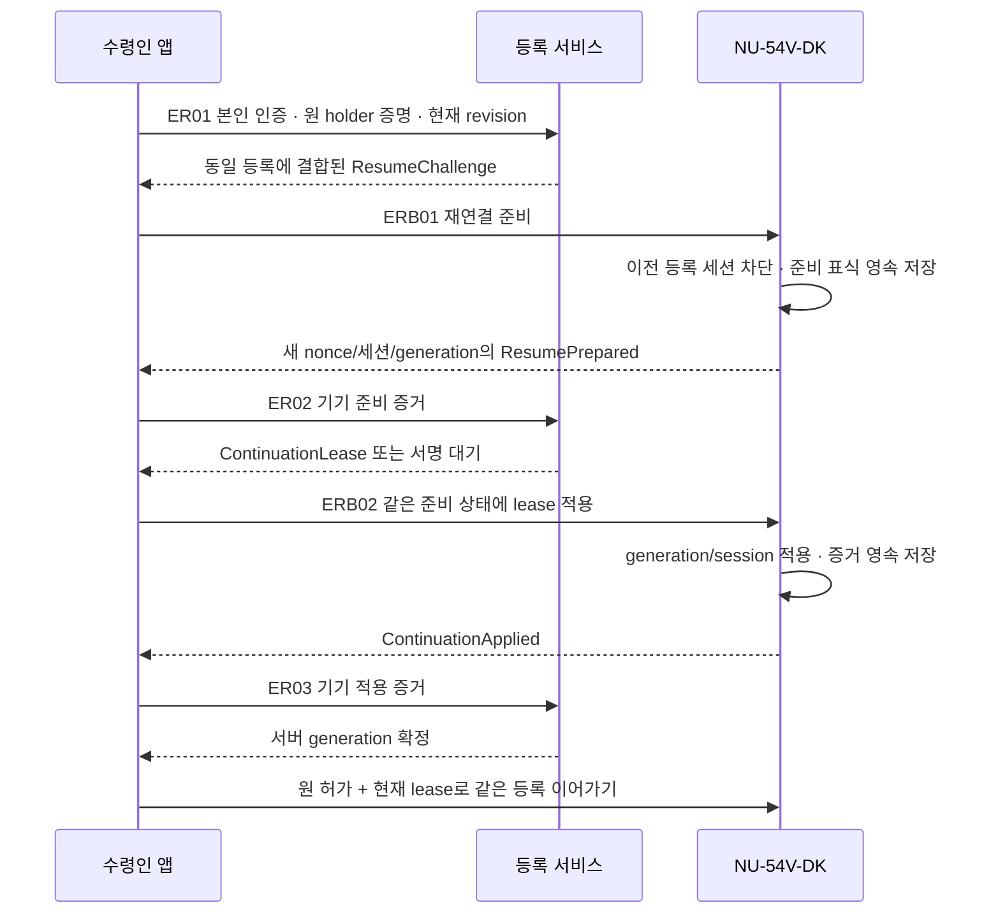

# 등록 세션 복구·동의 철회와 공동 채택 기준

작성: 2026-09-18. **상세 설계 후보·기준 미병합·구현 보류.** 등록 이후 통신 세션 복구와 기술적 등록 승인 철회를 HTTP 별칭 5개/BLE 별칭 3개에 연결했다. 서명 메시지 6개, 저장 매핑 후보 7개, 원자 처리 매핑 8개, 공동 채택 기준 12개와 미실행 사례 18개를 정리한다.

[계약·저장·수용표 원본](enrollment-continuity-adoption.json) · [설계 검증기](validate_enrollment_continuity.py) · [이전 등록 인증 계약](lifecycle-bootstrap-contracts.md) · [기존 저장 설계](lifecycle-storage-design.md)

현재 기준 API 110개·BLE 34개·업무 테이블 61개·SQL 마이그레이션 7개는 변경하지 않았다. 이번 메시지 명세는 필수 서명 문맥을 정리한 것이며, 실행 가능한 wire 스키마나 선택된 암호 profile이 아니다.

## 1. 복구 범위: 같은 사람·같은 키·같은 등록

수령인이 재로그인하고 **원래 등록용 holder 키를 계속 보유한 경우**에 통신 세션을 다시 연결한다. 원 admission/rental/binding/account/device/epoch와 원 서명 허가 내용은 바꾸지 않는다. 원 AdmissionPermit·ActivationPermit에 새 세션용 ContinuationLease를 함께 검증하는 변경안이다.

운영자에게 수령인 또는 holder 키를 바꾸는 권한을 주지 않는다. 앱 재설치 등으로 원 holder 키까지 잃었으면 소셜 로그인만으로 대체 키를 승인하지 않는다. 그 경우에는 기존 예약을 유지하고 지원·별도 복구 설계가 필요하다. 이 설계는 키 분실 복구가 아니다.

등록이 이미 active라면 이 경로로 원 증거를 확인할 수는 있지만, 지갑을 다시 만들거나 다른 소유자로 재등록할 수 없다. 일반적인 활성 지갑의 기기 연결은 해당 소유자 세션 계약을 따른다.

## 2. 세대 번호를 둔 재연결

transport generation은 기기 epoch와 다르다. 같은 소유권·같은 기기 epoch 안에서 어떤 등록 통신 세션을 사용할 수 있는지 구분한다. 새 generation은 이전 값에 1을 더한 값으로 고정하고, admission+이전 generation마다 후속 작업을 하나만 둔다.

ER01은 현재 수령인 인증과 원 holder 서명을 확인한다. 서명은 method/path/admissionId/요청 digest와 신선한 client nonce에 결합한다. 다른 멱등 키로 재요청하더라도 같은 이전 generation에 두 후속 작업을 만들지 않는다.

기기는 ERB01을 받으면 원 admission·기기 epoch·binding·holder와 서버 challenge를 검증한다. 이전 세션을 무효화하고 새 준비 상태를 영속 저장한 뒤 증거를 낸다. 준비 중에는 stage/activate를 수행하지 않는다. 새 기기 nonce·bootNonce·client nonce·세션과 원 문맥 digest를 증거에 포함한다.

ER02는 기기 증거와 현재 동의 revision을 다시 확인한 후 정확한 준비 상태에 결합된 lease를 예약한다. 서명 완료 시에도 현재 권한을 확인한다. ERB02는 같은 영속 준비 상태에서만 lease를 적용하고 적용 증거를 저장한다. ER03은 그 증거로 서버 generation을 확정한다.

기기에는 적용됐지만 서버 응답이 유실될 수 있다. 이때 새 예약을 만들지 않고 같은 적용 증거를 다시 제출한다. 서버 확인 전에는 서버 승인이 필요한 등록 mutation을 보류한다. 만료나 재부팅을 이유로 진행 중인 generation을 지우고 다음 값을 임의 발급하지 않는다. 실제 재부팅·세션 신선성 규칙은 보호 저장 능력이 확인된 profile에서 정해야 한다.

## 3. 원 허가를 유지하는 호환 변경

기존 LB01/LB02 요청에는 원 permit 외에 현재 ContinuationLease를 붙일 수 있어야 한다. **복구된 세션에서는 lease가 필수**이며 원 holder의 현재 세션 증명, 기기에 저장된 generation/boot/session, 원 binding 문맥을 모두 확인한다. 기기 증거에도 사용한 generation을 연결한다.

원 허가 안의 옛 sessionId를 새 값으로 고쳐 재서명하지 않는다. 원 등록 문맥은 업무 이력으로 유지하고 새 lease가 허용하는 통신 세션을 별도 검증한다. 이 구분을 지원하지 않는 펌웨어·서버는 새 경로를 사용할 수 없다. capability 문자열만으로 신뢰를 인정하거나 원 bearer 허가 방식으로 자동 강등하지 않는다.

새 준비 표식이 기기에 적용되기 전에 옛 허가가 실행됐을 수 있다. 서버의 세션 변경이나 철회만으로 그 실행을 없던 일로 처리하지 않는다. 기기가 보고한 실제 단계와 영속 증거로 대사하며, 불명확하면 예약을 유지한다.

## 4. 예약 후 동의 철회

이 문서의 철회는 **기술적인 등록 작업 승인**에 한정한다. 개인정보 처리 동의, 지갑 소유권, 이미 발행된 블록체인 서명, 환불·반납 정책을 함께 변경하는 기능이 아니다.

예약 전에는 기존 EB05를 사용한다. 예약 후 ER04는 현재 수령인의 요청으로 등록 승인 revision을 증가시키고 이후 등록·활성화·resume 및 해당 서명 결과 전달을 차단한다. 이미 소비된 consent 이력과 admission 예약은 보존한다. 같은 철회를 다른 멱등 키로 요청해도 새 revision을 끝없이 만들지 않는다.

철회와 등록/복구/활성화는 같은 권한·기기·초대·동의 잠금 경계에서 경쟁한다. 다만 실제 차단 상태는 **enrollment 작업 전용 권한 scope**에 적용한다. 전역 기기 또는 지갑 gate를 막아서 이미 활성화된 지갑 소유권이나 다른 기능까지 중단시키지 않는다.

기기에는 정확한 admission/binding/epoch와 동의 revision에 결합된 HoldInstruction을 보낼 수 있다. ERB03은 그 등록 계열의 stage/activate/resume만 제한하고, 제한을 영속 저장한 후 HoldApplied를 반환한다. 현재 등록 단계도 함께 보고한다. 이 증거는 제한 적용 확인이지 삭제·초기화·이전 활성화의 취소 증거가 아니다.

| 철회 시점·상태 | 서버가 보장하는 것 | 보장할 수 없는 것 |
| --- | --- | --- |
| 아직 예약 전 | 철회가 먼저 확정되면 API045 예약 거절 | 이미 먼저 확정된 예약의 자동 취소 |
| 예약 후, 기기와 연결됨 | 새 등록 권한 차단, 기기의 등록 전용 제한 증거 확인 | 이미 수행된 활성화의 소급 취소 |
| 예약 후, 기기 연결 불가 | 서버의 새 승인 차단과 원 예약 보존 | 이전 허가가 기기에서 실행되지 않았다는 단정 |
| 이미 active | 이후 재등록 변경 차단과 상태 대사 | 소유권 제거·자동 자산 이동·자동 초기화 |

운영자는 제한된 권한으로 정확한 기기 hold 증거를 전달할 수 있다. 그렇다고 resume·수령인 교체·철회 발급 권한을 얻지 않는다. 진행이 불명확한 기기는 재사용 재고로 되돌리지 않는다. 활성 대여는 기존 반납 절차가 필요하고, staged/unknown 상태의 안전한 반납·초기화는 별도 지원 계약이 필요하다. 철회 후 재동의도 단순한 상태 토글로 허용하지 않는다.

## 5. 요청·증거·조회 계약

| ID | 경로 | 현재 권한 |
| --- | --- | --- |
| ER01 | POST /v1/rental-admissions/{admissionId}/resume-challenges | 정확한 수령인 + 원 holder 증명 |
| ER02 | POST /v1/rental-admissions/{admissionId}/continuations | 정확한 수령인 + 원 holder + 기기 준비 증거 |
| ER03 | POST /v1/rental-admissions/{admissionId}/recovery-evidence | continuation은 수령인+원 holder, hold 증거는 제한된 운영자 전달도 가능 |
| ER04 | POST /v1/rental-admissions/{admissionId}/authorization-withdrawals | 정확한 수령인의 현재 기본 인증 |
| ER05 | GET /v1/rental-admissions/{admissionId}/recovery | 현재 parent 권한에 따른 제한된 상태/결과 |

BLE는 enrollment.resume.prepare, enrollment.resume.apply, enrollment.authorization.hold다. HTTP 계약 버전 후보는 enrollment-continuity-v1-draft이며, BLE 버전은 enrollment-continuity-ble-v1-draft다. requestId, mutation의 멱등 키, no-store 응답과 원 요청 digest를 유지한다.

서명 메시지 6개는 ResumeChallenge, ResumePrepared, ContinuationLease, ContinuationApplied, HoldInstruction, HoldApplied다. JSON에 각 issuer/purpose와 필수 서명 문맥을 기록했다. 서명 대기·검증 대기는 기존 PendingResponse/LW01 설계를 사용하되 parent는 원 admission으로 고정하고 action별 권한을 검사한다.

ER05는 운영자에게 최소 상태만 공개한다. lease는 수령인과 원 holder에 대한 별도 결과 권한이 필요하다. 제한 전달 운영자는 정확한 HoldInstruction만 받을 수 있고, 같은 조회 경로에 있다는 이유로 continuation 결과를 받지 못한다. GET은 새 서명·generation·철회를 생성하지 않는다.

## 6. 논리 자원 7개의 저장 매핑

| 논리 자원 | 새 물리 후보 | 중요한 제약 |
| --- | --- | --- |
| EnrollmentInvitation | enrollment_invitations | 초대의 성공한 점유는 한 번, secret은 verifier hash로 저장 |
| RecipientConsent | recipient_enrollment_consents | 원 동의/소비 이력과 현재 등록 승인 revision 분리 |
| EnrollmentProof | enrollment_proofs | 실제 검증된 원 동의 증거를 API045와 함께 소비 |
| DeviceConfigurationInventory | device_configuration_inventories | 오래된 verified_empty는 현재 권한이 아님, 설정 revision 재검사 |
| LifecycleWork | lifecycle_work_items | parent/action/outcome별 작업 하나, 오래된 worker는 fence로 반영 거절 |
| EnrollmentContinuation | enrollment_continuations | admission+이전 generation 유일, 원 문맥·첫 lease 불변 |
| AdmissionWithdrawal | admission_authorization_withdrawals | 철회 revision과 노출/확인 상태 보존, 예약 해제와 분리 |

이 표는 기존 저장 후보에 추가할 매핑이다. 신규 SQL 파일을 만들거나 DB에 적용하지 않았다. 새 표의 컬럼 타입·FK/유일 제약은 기존 물리 설계와 함께 확정해야 한다.

원자 변경은 registryWrites, existingCandidateWrites, existingSqlWrites, sharedWrites의 합으로 명시했다. ECT03은 continuation row뿐 아니라 lifecycle_admissions/current head의 generation/session과 작업·멱등 결과를 함께 갱신한다. ECT01/02/04의 pending 작업도 lifecycle_work_items에 함께 기록한다. API045 확장 ECT07은 기존 대여·binding·기기 예약과 초대·동의·증거 소비를 한 경계에 둔다.

새 증거를 기존 binding_active나 cancel_prepared로 이름만 바꿔 저장하지 않는다.

| 메시지 | lifecycle_evidence.kind 변경안 | typed owner |
| --- | --- | --- |
| ResumePrepared | enrollment_resume_prepared | continuation_id |
| ContinuationApplied | enrollment_continuation_applied | continuation_id |
| HoldApplied | enrollment_hold_applied | withdrawal_id |

owner에서 원 admission/device/binding/epoch/context를 해석하고 정확한 purpose/generation/동의 revision을 검증해야 한다. permit의 owner/purpose도 continuation과 withdrawal로 확장하되 원 admission permit을 덮어쓰지 않는다.

## 7. 함께 채택해야 하는 조건

각 조건은 ‘문서에 명시됨’과 ‘실제 동작 증거 확보’를 구분한다. 모두 공동 채택 전이며 실제 시험은 not_run이다.

| ID | 영역 | 필요한 수용 기준 |
| --- | --- | --- |
| ECA-01 | 버전 | 원 permit+continuation을 양측이 함께 검증, 구형 조합 거절 |
| ECA-02 | 권한 | 원 holder와 현재 수령인 확인, 소셜 로그인만으로 키 교체 불가 |
| ECA-03 | 세대 | 후속 세대 하나와 영속 준비/적용 증거, 경쟁·재부팅 검증 |
| ECA-04 | 철회 | 향후 승인 차단과 기존 실행 가능성을 분리 |
| ECA-05 | 저장 | 새 자원 7개의 무결성·공유 gate·전체 commit 집합 |
| ECA-06 | 작업 | parent별 권한과 worker fence, 결과 유출/중복 반영 방지 |
| ECA-07 | 설정 이력 | import와 초기화의 경쟁에서 오래된 빈 상태 증거 거절 |
| ECA-08 | 이행 | 옛 writer 전환, 기본값으로 eligible/generation 생성 금지 |
| ECA-09 | 데이터 | 초대 secret 보호·증거/키 참조·삭제/보존 정책 별도 결정 |
| ECA-10 | 펌웨어 | 기기 generation/표식/hold의 전원 중단·antirollback 검증 |
| ECA-11 | 정책 | RR-DEC-01 유지, holder 분실의 미지원 경로 노출 |
| ECA-12 | 기준 | 기존 API/BLE/SQL 보존과 실제 채택 범위 확인 |

전체 제품 범위 15개, 3명·12주·앱 연동 완료 목표는 유지한다. 위 조건은 관련 기능을 삭제하는 목록이 아니라 구현 전에 연결해야 할 설계/실행 증거 목록이다. 개인별 역할이나 작업량을 배정하지 않았다.

## 8. 검증 범위와 다음 단계

로컬 검증은 새 메시지/경로/자원 참조, 원자 변경 집합, 기존 논리 자원 누락 여부, 증거 kind/typed owner, 원본 8개 파일 해시와 미답변 정책 보존을 확인한다. 암호 동작·실제 세션·SQL 경쟁·기기 전원 중단을 시험한 것은 아니다. wire JSON Schema나 정상/거절 payload fixture 검증이라고 주장하지 않는다.

원 holder 분실, 철회 후 재승인, staged/unknown 등록의 안전한 회수는 추가 설계가 필요하다. profile과 보드 능력도 개발 단계에서 검증한다. 이번에는 기준 병합·SQL 실행·제품 구현 없이 설계 파일만 작성했다.

**다음 작업:** 등록·반납 전체 흐름의 정상/중단 시나리오와 이번 변경안들의 공동 채택 범위를 종단 수용 명세로 통합한다.
