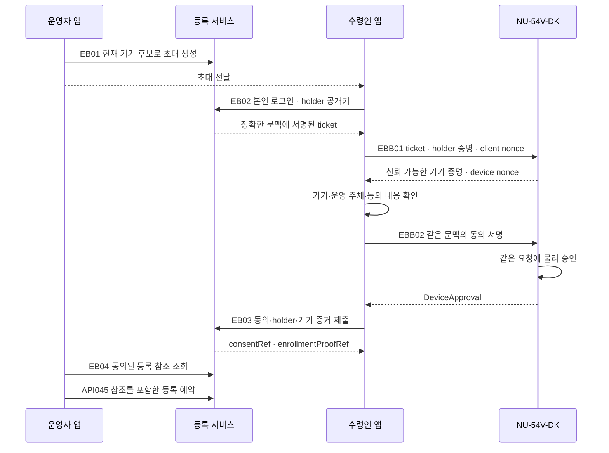

# 기기 등록 인증·수령인 동의·미설정 지갑 반납·대기 응답

작성: 2026-09-18. **설계 후보이며 기준 명세·SQL에 병합하거나 제품을 구현하지 않았다.** HTTP 별칭 9개, BLE 명령 별칭 3개, 기존/후보 응답의 대기 처리 연결 17개를 정리한다. 이 숫자는 서비스에 등록된 endpoint 수가 아니다. 현재 기준 API 110개/BLE 34개를 유지한다.

[계약·규칙](lifecycle-bootstrap-contracts.json) · [스키마](lifecycle-bootstrap-contracts.schema.json) · [예제](lifecycle-bootstrap-contracts.examples.json) · [설계 검증기](validate_lifecycle_bootstrap.py)

앞선 [등록·취소 계약](rental-admission-cancel.md)과 [저장 설계](lifecycle-storage-design.md)의 미완성 입력·응답을 보완한다. 이전 원본은 보존하고 차이를 BC-D01..04로 기록한다. 암호 알고리즘/profile, 실제 기기 보호 기능을 이 문서만으로 확정하지 않는다.

## 1. 운영자 초대와 수령인 동의는 별개다

운영자가 기기의 등록 후보를 조회하고 초대를 만든다. 초대에는 기기·재고 권한 범위·현재 등록 후보 digest와 유효기간이 고정된다. QR/초대 코드는 수령인의 앱을 같은 요청에 연결하는 수단이다. 그 코드를 갖고 있다는 이유로 동의·소유권·등록 권한을 주지 않는다.

수령인은 자신의 앱에 로그인하고 초대를 연다. 서버는 로그인 세션에서 accountId를 결정한다. 운영자가 입력한 accountId나 요청 body의 accountId로 수령인 인증을 대신하지 않는다. 앱에서 이번 등록용 holder 키를 준비하고, 서버는 다음 문맥에 결합된 서명 ticket을 발급한다.

- 정확한 기기·현재 epoch·gate/binding revision과 등록 후보
- 재고 권한 범위, 수령인 계정, holder 공개키 thumbprint
- 등록 세션·challenge·서버 nonce·만료 시각
- 수령인이 확인할 동의 문구 버전과 digest

초대·challenge 발급만으로 기기를 예약하지 않는다. 여러 recipient challenge가 존재하더라도, 모든 증거를 검증한 첫 동의만 잠금 아래에서 초대를 점유한다. 다른 수령인은 이미 점유된 초대에 동의를 덮어쓸 수 없다.

## 2. 앱과 기기가 같은 등록을 승인했는지 확인

기기는 서버의 신뢰 root로 ticket을 검증하고, 받은 holder 공개키에서 thumbprint를 재계산해 대조한다. 앱은 서버가 신뢰한 기기 신원/출고 기록에 따라 기기 서명을 검증한다. 상대가 함께 전달한 키를 그대로 신뢰하는 구조가 아니다.

EBB01은 ticket·client nonce를 받아 device nonce와 인증된 임시 공개키를 반환한다. EBB02는 같은 살아 있는 세션에서 ticket/hello digest, 양측 nonce, 계정·기기·동의 문맥에 결합된 holder 서명을 검증하고 기기 물리 승인을 받는다. 기기가 승인한 digest와 서버가 받는 동의 digest가 같아야 한다.

실제 key agreement·전송 암호화·transcript 인코딩·화면 확인 방식은 선택된 profile에서 정해야 한다. 이 메시지 구조만으로 BLE 보안을 검증했다고 주장하지 않는다. 지원하지 않는 profile이나 불명확한 기기 신원은 거절한다. 기기 재부팅/세션 손실이 등록 예약 전에 발생하면 새 handshake가 필요하다.

## 3. API045의 빠진 증거 참조와 동시 요청

이전 API045 후보 body에는 holder thumbprint/sessionId가 있지만 `enrollmentProofRef`가 없었다. **BC-D01은 이 필드를 필수로 추가한다.** 클라이언트가 적은 식별자만으로 신뢰를 만들지 않는다.

서버는 recipientConsentRef와 enrollmentProofRef를 조회해 같은 초대·수령인·holder·기기·세션·현재 후보에 결합됐는지 확인한다. 요청의 accountId/holder/session 값은 그 결과와 같아야 하는 주장값이다. 초대·동의·증거·등록 근거의 소비와 새 admission/rental/binding 예약은 같은 원자 경계에 둔다. 다른 멱등 키로도 한 동의를 두 번 사용하지 못한다.

EB04에서 현재 초대 생성 운영자에게는 동의가 끝난 수령인의 accountId, holder thumbprint, sessionId, 두 참조를 최소한으로 제공한다. 이 공유는 동의 문구에 포함한다. 동의 전이거나 경쟁 중인 다른 수령인의 계정 정보를 보여주지 않으며, ticket·서명 증거·초대 secret을 GET 응답으로 돌려주지 않는다.

EB05 철회는 등록 예약 전까지만 적용한다. 철회와 API045가 같은 잠금 아래에서 경쟁하고 먼저 확정된 상태를 따른다. 이미 소비된 초대의 철회 요청으로 예약을 해제하거나 다른 수령인을 배정하지 않는다. 예약 후 동의 철회나 holder/session 교체는 별도 복구 계약이 필요하며 다음 설계 대상으로 남긴다.

## 4. 출고 기기 신뢰의 입력

FG01은 일반 대여 운영자에게 허용하지 않는다. 별도의 provisioning 검증 권한이 다음 참조를 검증해 제출해야 한다.

| 입력 | 검증할 내용 |
| --- | --- |
| provisioningManifestRef | 신뢰된 제조/운영 provisioning 기록과 기기 신원 |
| inventoryScopeId | 해당 재고를 등록할 권한 |
| challengeId·attestationObjectRef | 신뢰된 provisioning 절차가 발급한 신선한 challenge에 대한 기기 증거 |
| historyWatermarkRef | 오래된 백업으로 되감기지 않은 등록·소비 이력 기준 |
| proofProfileId | 해당 증거를 검증할 지원 profile |

모든 참조는 서버가 실제 기록으로 해석해야 한다. 기기가 보내는 ‘미사용=true’, 빈 DB, 재설치한 펌웨어는 genesis 근거가 아니다. 한 번 등록되거나 소비된 기기에는 새 genesis를 발급하지 않는다.

FG01은 이 검증 결과의 접수 계약이다. 신뢰 root 최초 등록, 출고 challenge 발급 및 실제 attestation 수집 절차가 이미 구현돼 있다는 뜻은 아니다. 실제 공급자/보드 profile이 선정되기 전에는 verified를 임의로 만들어내지 않고 검증 보류·격리한다.

## 5. 지갑을 설정하지 않은 기기의 반납

API046 후보를 BC-D02에서 아래 두 분기로 바꾼다. 서버의 설정 이력과 기기의 현재 증거가 일치해야 하며 클라이언트 선택이 판정 결과가 아니다.

| walletDisposition | 입력 | 적용 |
| --- | --- | --- |
| configured | new_travel/imported, configurationRevision, 필요한 외부 접근 증거 참조 | 기존 자산·복구 점검 적용 |
| unconfigured | configurationRevision, emptyStateEvidenceRef | 검증된 미설정 상태에 한해서만 존재하지 않는 지갑의 복구/잔액 점검 생략 |

미설정 증거를 얻는 경로도 연결했다. WC01은 현재 소유자에게 정확한 rental/binding/epoch/configurationRevision과 기한에 결합된 challenge를 발급한다. WCB01에서 기기가 보호된 설정 이력을 검사하고 긍정적인 EmptyStateEvidence 또는 오류를 돌려준다. WC02는 기기 서명과 서버 설정 이력을 대조해 참조를 저장한다.

긍정적인 미설정 판정은 다음 조건을 모두 요구한다.

- 이번 binding에서 지갑이 설정된 적이 없음
- 현재 지갑 키 슬롯과 import staging이 검증 가능하게 비어 있음
- 미해결 생성/import/서명·설정 작업이 없음
- 신뢰 가능한 기기 profile로 위 상태를 확인함

키가 일부 남았거나, 설정한 키를 나중에 삭제했거나, 이력을 확인할 수 없으면 이 분기를 이용하지 않는다. 기존 configured 이력의 복구 절차 또는 격리로 이어진다. NULL wallet_origin은 미설정 증거가 아니다.

설정/import writer와 반납 점검·commit은 같은 기기/binding/configuration gate를 사용한다. WC02 이후 설정이 바뀌면 revision이 달라지므로 이전 빈 상태 증거로 초기화할 수 없다. API046뿐 아니라 실제 reset commit에서도 현재 revision을 재확인한다.

지갑이 없어도 녹음·패스키·세션·스탬프 등 개인정보가 있을 수 있다. **전체 개인정보 목록 점검·삭제 profile·물리 승인·초기화 증거·완료 ACK·정리 증명은 유지**한다. 보존할 기기 신원과 복구 표식도 실제 profile에서 명시해야 한다. 신규 여행 지갑의 RR-DEC-01 미답변을 이 경로로 우회하지 않는다.

## 6. 서명·검증 대기 응답

서명이나 검증 작업을 영속 접수했지만 결과가 아직 없을 때 버전이 명시된 `202 PendingResponse`를 제안한다. 다음 정보만 제공한다.

- workId와 서버가 고정한 parentKind/parentId/action
- 원 요청 digest·businessOutcomeId·work/domain revision
- pending_signing 또는 pending_verification
- 원 작업 조회 안내와 Retry-After
- 초기화 허가의 비가역 발급 장벽 여부

pending 응답에는 결과 URL이나 사용할 permit을 주지 않는다. LW01은 같은 work를 조회하며 ready가 돼도 해당 signer/verifier 하위 작업이 끝났다는 의미다. 예를 들어 reset evidence 검증이 끝났어도 완료 ACK 서명이 대기 중이면 앱은 반납 후속 처리를 기다린다. 실제 성공 표시는 원 parent 상태와 기기 확인을 따른다.

resultRouteId는 등록된 설계 매핑 중 원 결과를 확인할 경로 ID만 허용한다. 임의 URL이나 공개 다운로드를 반환하지 않는다. GET 경로가 있는 경우 원 보호된 조회를 사용하고, 원 mutation의 멱등 재조회가 필요한 경우 동일 business key/payload를 명시적으로 재사용한다. polling이 새 요청을 자동 실행하지 않는다.

LW01 인증은 논리 envelope에서 두 가지로 구분한다.

| 분기 | 필수 확인 |
| --- | --- |
| primary | 현재 본인/운영 권한과 저장된 정확한 parent 관계 |
| relay | 저장된 authorityId의 신뢰된 서명·상태·만료·현재 revision·등록 holder 키와 sender proof |

relay sender proof는 **GET method, 정확한 경로/workId, 계약 버전, authorityId, 신선한 nonce**에 결합한다. ID를 아는 것만으로 조회할 수 없다. 조회 허용은 저장된 원 parent/action에 따라 결정한다. 중계 권한으로 초기화 실행 허가나 다른 사용자의 등록 결과를 조회할 수 없고 API020의 일반 operation 조회로 우회하지 않는다. 실제 HTTP 헤더 인코딩은 profile 채택 때 확정한다.

RT01은 서명 대기 중이어도 발급 장벽이 이미 기록됐으면 취소할 수 없다. 기다리는 사이 기기의 prepare 세션/bootNonce/기한이 끝났다면 서명 결과가 생겨도 전달하지 않고 blocked 상태로 처리한다. 원 장벽을 지우거나 새 reset grant를 자동 발급하지 않는다.

## 7. 호출 목록과 저장 영향

| ID | 경로 | 목적 |
| --- | --- | --- |
| EB01 | POST /v1/devices/{deviceId}/enrollment-invitations | 운영자 초대 생성 |
| EB02 | POST /v1/enrollment-invitations/{invitationId}/recipient-challenges | 수령인·holder·기기 문맥 ticket |
| EB03 | POST /v1/enrollment-invitations/{invitationId}/consent-evidence | 동의와 기기 승인 검증 |
| EB04 | GET /v1/enrollment-invitations/{invitationId} | 권한별 최소 진행 조회 |
| EB05 | POST /v1/enrollment-invitations/{invitationId}/revocation | 예약 전 철회 |
| FG01 | POST /v1/ops/device-genesis-verifications | 출고 검증 접수 |
| LW01 | GET /v1/lifecycle-work/{workId} | 원 권한에 종속된 작업 조회 |
| WC01 | POST /v1/devices/{deviceId}/configuration-inventory-challenges | 설정 이력 확인 challenge |
| WC02 | POST /v1/devices/{deviceId}/configuration-inventories | 검증된 미설정 증거 참조 |

BLE 별칭은 enrollment.bootstrap.hello, enrollment.bootstrap.approve, wallet.configuration.inspect 세 개다. 모두 기존 카탈로그 미등록이다.

대기 응답 연결 대상은 API046, RT01/03/05, API047, RT06, API045, RL02/03, RC01/02/03, EB02/03, FG01, WC01/02의 17개다. 이 버전의 pending envelope와 각 원 경로의 ready 응답을 함께 지원하도록 채택해야 한다. 기존 스키마에 202를 자동 추가한 것은 아니다.

새 논리 자원은 EnrollmentInvitation, RecipientConsent, EnrollmentProof, DeviceConfigurationInventory, LifecycleWork다. 현재 lifecycle 저장 후보에 물리 테이블을 만들었다고 표시하지 않는다. 초대 점유·동의/증거 소비는 기존 공통 gate 아래에서 예약과 원자적으로 처리하고, 실제 물리 매핑과 FK/유일 제약은 후속 통합 대상으로 기록한다.

## 8. 검증과 남은 항목

로컬 검증은 정상 형태 36개·거절 형태 13개, endpoint/응답 참조, 원본 설계 8개의 해시 보존을 확인한다. 암호·동의 UX·물리 승인·실제 빈 키 슬롯·전송 보안을 검증한 결과는 아니다. 런타임 사례 22개는 모두 not_run이다.

현재 확정한 것은 요청과 책임의 설계안이다. root/profile과 실제 보드 능력, 예약 후 holder/session 복구, 동의 철회의 후속 처리, 새 논리 자원의 물리 저장 및 버전·권한 채택은 남아 있다. 제품 구현이나 정책 선택은 수행하지 않는다.

**다음 설계:** 등록 예약 후 세션 복구·동의 철회 규칙과, 새 논리 자원의 저장/권한/버전 통합 수용표.
