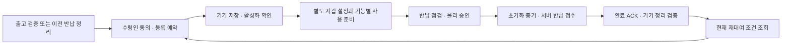

# 기기 등록·반납·재대여 종단 수용 명세

작성: 2026-09-18. **설계 통합 문서이며 실제 종단 시험 결과가 아니다.** 사용자 흐름 16개에 기존 검토 사례 107개를 빠짐없이 연결했다. 중복 연결은 허용하지만 원 사례의 수와 출처는 보존한다. 모든 런타임 상태는 not_run이고 실제 실행 증거는 비어 있다.

[종단 명세·사례 대응 JSON](lifecycle-journey-acceptance.json) · [참조/누락 검증기](validate_lifecycle_journeys.py)

이번 범위는 기기 대여 수명주기다. 지갑 생성/import·Cloud MPC·실제 결제·DEX·여행 서비스 등 전체 15개 요구사항의 통합 완료를 대신하지 않는다. 3명·12주·앱 연동 완료 목표와 기존 WBS 104개/세부 작업 320개는 유지하며 역할·공수는 배정하지 않는다. 기준 API/BLE/SQL은 변경하지 않았다.

## 1. 완료 상태를 구분한다

| 상태 | 확인한 사실 | 아직 뜻하지 않는 것 |
| --- | --- | --- |
| 기기 활성화 | 원 대여/binding의 기기 적용과 서버 확인 | 지갑 생성/import·모든 기능 설정 완료 |
| 지갑 사용 준비 | 별도 키 통제·설정·권한 조건 충족 | 결제 또는 온체인 확정 완료 |
| 서버 반납 접수 완료 | 원 reset evidence 검증·이전 대여/binding 종료 | 기기 정리와 재대여 가능 |
| 기기 정리 확인 | 정확한 ACK/표식/epoch의 cleanup 검증 | 다른 관리/FOTA 제한 해제 |
| 재대여 조건 충족 | 같은 시점의 현재 상태가 등록 조건을 만족 | 향후 API045 요청에 대한 자동 허가 |

반납 취소는 원 대여 사용 상태로 돌아가는 것이고, 등록 승인 철회는 이후 등록 mutation을 막는 것이다. 둘 다 기기를 자동으로 비우거나 재사용 재고로 돌리는 명령이 아니다.

## 2. 테스트 판정과 화면 표시를 분리한다

- **passed:** 정상 대조군과 필요한 장애 분기를 실제 실행해 각 기대값과 증거가 맞는 경우다. 부정 테스트 한 개가 통과했다고 전체 흐름을 passed로 바꾸지 않는다.
- **blocked:** 필요한 정책·profile·계약·환경이 없다. 결과를 지어내거나 테스트 통과로 처리하지 않는다.
- **failed:** 실행된 동작이 기대값과 다르거나, 정상 전제에서 이유 없이 대기/격리하거나, 권한 누출·중복 부작용이 발생했다.
- **not_run:** 실제 실행 증거가 없다. 이 문서의 모든 흐름이 현재 여기에 해당한다.

부정 테스트에서 ‘정책 미결정 때문에 안전하게 거절했다’는 결과는 그 테스트의 통과 조건이다. 사용자의 화면에는 보류/거절로 표시해야 한다. 이를 위해 JSON의 `testPassWhen`과 `uiOracle.userVisibleSuccessWhen`을 분리했다. 정상 흐름 완료, 하위 서명/검증 작업 완료, 안전한 보류는 서로 바꿔 쓸 수 없다.

## 3. 흐름별 수용 카드

각 카드의 경로는 설계 후보 별칭을 포함한다. 호출 가능한 endpoint나 구현된 기능이라는 뜻이 아니다. 사례 ID는 원 문서의 not_run 사례를 가리키며 검증 결과를 의미하지 않는다.

### LJ-01 · 출고 기기 최초 등록

전제: 신뢰된 출고 신원·현재 virgin 증거와 rollback되지 않은 이력; 현재 운영자 재고 권한·수령인 계정.

진행:

1. FG01에서 출고 증거 검증
2. RL-01 현재 후보 조회 후 EB01 초대
3. 수령인 EB02/EBB01/EBB02/EB03 동의
4. API045 예약, LB01/RL02 저장 확인, LB02/RL03 활성화

정상 대조군의 필수 결과: **신뢰된 출고 표본이 같은 수령인 active binding까지 완료**.

화면 완료 표시: **기기 등록 완료** — 원 rental/binding 활성화가 서버와 기기 증거로 확인됨; 지갑 설정 완료와 별도.

금지 결과: 이력 없음/재설치를 출고 증거로 인정; 운영자 확인만으로 기기·수령인 승인 생략.

연결: FG01, RL-01, EB01, EB02, EBB01, EBB02, EB03, API-045, LB01, RL-02, LB02, RL-03 / 원자 처리 LST-T05, LST-T06, ECT06, ECT07.

원 사례: RLC-T03, BC-T07, BC-T10, LST-R19.

열린 선행 조건: trusted_genesis_profile, root_and_device_profile.

실행 상태: **not_run**.

### LJ-02 · 반납 완료 기기 재등록과 동시 예약

전제: 원 기기의 최신 cleanup 검증 및 현재 eligible 근거; 다른 제한·활성/대기 대여 없음.

진행:

1. RL-01 후보를 두 운영자가 읽음
2. 서로 다른 요청으로 같은 근거의 API045 동시 시도
3. 성공한 원 예약만 기기 저장·활성화
4. 실패자는 최신 상태 조회

정상 대조군의 필수 결과: **반납/정리 완료 표본을 다음 수령인의 active binding으로 등록**.

화면 완료 표시: **기기 등록 완료** — 새 원 rental/binding 활성화 확인; 후보 조회/예약만으로 완료 금지.

금지 결과: 오래된 조회로 두 번째 예약; 서버 반납 완료만으로 cleanup 우회.

연결: RL-01, API-045, API-091, LB01, RL-02, LB02, RL-03 / 원자 처리 LST-T04, LST-T05, ECT07.

원 사례: RLC-T01, RLC-T02, RLC-T20, RRR-T14, RRR-T15, LST-R04, LST-R05, LST-R06, LST-R25.

실행 상태: **not_run**.

### LJ-03 · 초대·수령인 동의·권한 바꿔치기 거절

전제: 현재 초대와 기기/후보/수령인/holder 문맥.

진행:

1. 현재 수령인 세션으로 EB02 ticket 요청
2. 초대 유출/다른 accountId/holder/device proof/다른 후보를 각각 대입
3. EB03 중복·경쟁 동의 및 EB05와 API045 경쟁
4. 동의/proof 두 참조가 같은 원 예약에 소비됐는지 확인

정상 대조군의 필수 결과: **정상 초대/동의 증거가 한 번만 예약에 소비**.

화면 완료 표시: **수령인 동의 확인** — 현재 exact consent/proof 검증 및 참조 확정; 기기 활성화 완료를 뜻하지 않음.

금지 결과: 초대 코드 소유만으로 등록; 서버 검증 참조 없는 holder/session 문자열 신뢰.

연결: EB01, EB02, EB03, EB04, EB05, EBB01, EBB02, API-045 / 원자 처리 ECT06, ECT07.

원 사례: BC-T01, BC-T02, BC-T03, BC-T04, BC-T05, BC-T06, BC-T08, BC-T09, RLC-T08.

열린 선행 조건: consent_text_and_profile.

실행 상태: **not_run**.

### LJ-04 · 예약·저장·활성화 응답 유실

전제: 원 동의와 한 admission 예약; 단계별 영속 기기 증거.

진행:

1. API045 응답을 유실하고 같은 멱등 키로 재조회
2. LB01/RL02/LB02/RL03 경계에서 각각 응답 유실
3. RL04/LW01과 원 증거로 같은 예약을 복구
4. 활성화 후 wallet configuration 상태를 별도 확인

정상 대조군의 필수 결과: **응답 유실 후 같은 admission이 active까지 복구**.

화면 완료 표시: **기기 등록 완료** — 동일 admission의 ActivationReceipt 검증 및 서버 active 확인.

금지 결과: timeout을 예약 해제로 처리; active binding을 곧바로 configured wallet로 표시.

연결: API-045, LB01, RL-02, LB02, RL-03, RL-04, LW01 / 원자 처리 LST-T05, LST-T06, LST-T12, ECT07.

원 사례: RLC-T04, RLC-T05, RLC-T06, RLC-T07, LST-R07, LST-R08, BC-T22.

실행 상태: **not_run**.

### LJ-05 · 원 holder의 등록 세션 복구

전제: 원 수령인 기본 인증과 원 holder 키; 원 admission/epoch/immutable context 보존.

진행:

1. ER01 두 재연결 요청을 경쟁시킴
2. ERB01 준비 표식 후 재부팅/중단 주입
3. ER02/ERB02/ER03으로 원 lease/증거를 재전달
4. 이전 세션/이전 generation으로 stage/activate 시도

정상 대조군의 필수 결과: **원 holder가 같은 admission의 새 세션 generation으로 확인 완료**.

화면 완료 표시: **등록 연결 복구 완료** — 기기 적용 증거로 현재 continuation generation이 서버에서 확정; 원 등록 완료와 별도.

금지 결과: 소셜 로그인만으로 holder 교체; 원 permit 내용을 바꿔 새 예약처럼 처리.

연결: ER01, ER02, ER03, ER05, ERB01, ERB02, LB01, LB02 / 원자 처리 ECT01, ECT02, ECT03.

원 사례: ECR-01, ECR-02, ECR-03, ECR-04, ECR-05, ECR-06, ECR-07, ECR-10, BC-T21.

열린 선행 조건: continuation_profile, holder_loss_recovery_unselected.

실행 상태: **not_run**.

### LJ-06 · 예약 후 등록 승인 철회

전제: 현재 원 수령인과 정확한 consent/admission; 기기 연결됨/불명확/이미 active를 각각 준비.

진행:

1. ER04와 서명/복구/활성화를 경쟁시킴
2. 같은 철회를 다른 키로 재시도
3. 가능한 경우 ERB03과 ER03 hold proof 전달
4. 운영자 제한 전달과 수령인 전용 권한을 비교

정상 대조군의 필수 결과: **현재 수령인의 철회로 서버 등록 승인 차단 및 연결된 기기의 hold 증거 확인**.

화면 완료 표시: **등록 승인 철회 접수** — 서버 enrollment 승인 revision이 withdrawn으로 확정. device unknown이면 기기 제한 미확인 표시를 유지; hold 증거 확인 전 기기 반영 완료 표시 금지.

금지 결과: 전역 지갑 권한 철회나 자동 wipe; device unreachable을 미실행으로 단정; 철회 완료를 재대여 가능으로 표시.

연결: ER04, ER05, ER03, ERB03 / 원자 처리 ECT03, ECT04.

원 사례: ECR-08, ECR-09, ECR-11, ECR-12, ECR-13, ECR-14.

열린 선행 조건: renewed_authorization_unselected, uncertain_admission_return_path.

실행 상태: **not_run**.

### LJ-07 · 설정된 지갑 반납의 자산·복구 점검

전제: configured wallet과 실제 원천/키 통제 이력; new_travel과 imported를 별도 표본으로 준비.

진행:

1. API046 configured 분기에서 현재 원천/외부 접근 증거 확인
2. new_travel 필수 복구 조건 미결정 표본은 새 commit 거절
3. imported의 무관한 외부 자산 이체 없이 기기 사본 범위 점검
4. 미확정 거래/노출된 서명/자격/개인 데이터 확인 후 허용된 표본만 다음 단계

정상 대조군의 필수 결과: **정책/자산/외부 접근 조건이 충족된 configured 표본에서 초기화 준비 완료**.

화면 완료 표시: **반납 사전 점검 완료** — 현재 선택된 정책/자산/외부접근/개인정보 조건 충족으로 실제 prepare 허용; 보류/거절은 완료 아님.

금지 결과: RR-DEC-01을 임의 선택; import 지갑 전체 자산 sweep 강제; 다른 Cloud Wallet 소유권 철회.

연결: API-046, RT-01, API-091 / 원자 처리 LST-T01, LST-T02.

원 사례: RRR-T01, RRR-T02, RLC-T21.

열린 선행 조건: RR-DEC-01, wallet_setup_and_external_access_evidence, pending_transaction_policy.

실행 상태: **not_run**.

### LJ-08 · 미설정 지갑 증거와 개인 데이터 반납

전제: 보호된 configuration 이력과 현재 기기 상태; 미설정/잔여 import/과거 설정 후 삭제/unknown 표본.

진행:

1. WC01/WCB01/WC02로 현재 재고 증거 확보
2. 빈 상태 검증 후 import와 reset commit 경쟁
3. API046 unconfigured 분기 점검
4. 녹음/패스키 등 개인 데이터 삭제 profile을 전체 반납 흐름에 적용

정상 대조군의 필수 결과: **검증된 미설정 표본의 전체 개인 데이터 반납 준비 완료**.

화면 완료 표시: **반납 사전 점검 완료** — 현재 verified_empty와 전체 개인정보 점검/profile 조건 충족; unknown/material_present는 완료 아님.

금지 결과: NULL wallet_origin을 증거로 사용; 지갑이 없다는 이유로 다른 개인정보 삭제 생략.

연결: WC01, WC02, WCB01, API-046, RT-01, RB01, RB02 / 원자 처리 LST-T01, LST-T02, ECT08.

원 사례: BC-T11, BC-T12, BC-T13, BC-T14, LST-R24, ECR-16.

열린 선행 조건: configuration_inventory_profile, erase_profile.

실행 상태: **not_run**.

### LJ-09 · 초기화 발급 전 취소와 양측 제한 해제

전제: checking/prepared, grant가 한 번도 발급되지 않음; 다른 FOTA/관리 제한도 별도 표본으로 준비.

진행:

1. RC01을 다른 키 두 개로 호출
2. CB01/RC02에서 준비 무효화와 release permit 확인
3. CB02 응답 유실 후 같은 release receipt로 RC03 재시도
4. 재요청/오래된 취소/새 반납 job을 각각 확인

정상 대조군의 필수 결과: **never-issued 취소가 양측 제한 해제까지 완료, 원 대여 보존**.

화면 완료 표시: **반납 취소 완료** — 정확한 기기 ReleaseReceipt 검증 + 서버 own return fence 해제 + 원 job aborted; 다른 제한 별도 표시.

금지 결과: 취소된 반납을 eligible 재고로 전환; 다른 제한 해제; 잃어버린 표식을 깨끗함으로 간주.

연결: RC-01, RC-02, RC-03, RC-04, CB01, CB02 / 원자 처리 LST-T07, LST-T08, LST-T09.

원 사례: RLC-T10, RLC-T12, RLC-T13, RLC-T14, RLC-T15, RLC-T16, RLC-T17, RLC-T18, RLC-T19, RLC-T22, RLC-T23, LST-R09, LST-R11, LST-R12, LST-R13.

실행 상태: **not_run**.

### LJ-10 · 초기화 발급 장벽·만료·취소 경쟁

전제: 현재 prepare/물리 승인/정책 점검; 발급 reservation 이전과 이후를 구분.

진행:

1. RT01과 RC01 동시 실행
2. 발급 예약 뒤 signer 중단/응답 유실
3. 서명 대기 동안 prepare 만료/재부팅
4. 원 결과 재조회와 취소 시도를 비교

정상 대조군의 필수 결과: **발급 정상 표본에서 신선한 원 grant 전달; 경쟁 표본은 단일 승자**.

화면 완료 표시: **초기화 허가 준비됨** — 신선한 동일 prepare에 전달 가능한 원 grant bytes 확인; 실제 삭제나 반납 완료를 뜻하지 않음.

금지 결과: 서명 bytes 없음으로 grantIssued=false 복원; 만료된 prepare에 늦은 grant 전달.

연결: RT-01, RC-01, RB02, LW01, API-091 / 원자 처리 LST-T02, LST-T07, LST-T11.

원 사례: RRR-T03, RRR-T04, RRR-T16, RLC-T09, RLC-T11, BC-T15, LST-R01, LST-R10.

실행 상태: **not_run**.

### LJ-11 · 기기 초기화 중 전원 중단

전제: 기기가 동일 grant를 영속 수락한 저널; 실제 erase/epoch 보호 profile.

진행:

1. RB02 수락 후 각 삭제 checkpoint에서 전원 중단
2. 동일 job 저널로만 재개
3. 이전 세대/손상 저널/삭제 미완료 상태를 주입
4. 보호 증거를 만들어 원 작업에 연결

정상 대조군의 필수 결과: **지원 profile의 정상/복구 가능 중단 표본에서 동일 job reset 증거 생성**.

화면 완료 표시: **초기화 증거 준비됨** — 동일 job의 실제 완료 reset evidence가 기기에서 생성됨; unknown/incomplete/격리는 완료 아님.

금지 결과: 새 job을 자동 발급; 실기 없이 삭제/antirollback 통과 처리.

연결: RB02, RB04, API-047 / 원자 처리 LST-T03, LST-T12.

원 사례: RRR-T05, RRR-T12, LST-R18.

열린 선행 조건: real_device_power_loss_evidence, erase_profile.

실행 상태: **not_run**.

### LJ-12 · 초기화 후 중계 권한·기존 증거 복구

전제: 원 job/grant/암호문 보존; 독립적인 현재 기본 인증으로 제한 중계 권한 발급.

진행:

1. RT02/03과 RB03로 제한 중계 세션 구성
2. RB04 원 암호문을 얻고 RT04 challenge 후 API047 제출
3. 만료된 clearance/교체된 authority/새 proof 멱등 재시도
4. job/rental/nonce/proof 바꿔치기와 wallet sign 시도

정상 대조군의 필수 결과: **현재 제한 relay로 원 증거 접수, 원 ACK 획득**.

화면 완료 표시: **서버 반납 접수 완료** — 원 reset evidence 검증과 rental 반환 확인; cleanup/재대여 완료 아님.

금지 결과: 평문 증거 공개; expired authority로 새 권한 bootstrap; ciphertext에 새 challenge를 넣어 순환 구성.

연결: RT-02, RT-03, RT-04, RB03, RB04, API-047 / 원자 처리 LST-T10, LST-T12, LST-T03.

원 사례: RRR-T06, RRR-T08, RRR-T09, RRR-T10, RRR-T17, RRR-T18, LST-R15, LST-R23.

실행 상태: **not_run**.

### LJ-13 · 서버 반납 완료→ACK→정리 검증

전제: 원 reset evidence가 검증됨; 서버완료/기기정리 상태 분리.

진행:

1. API047 성공 뒤 ACK 응답 유실
2. RT07 원 ACK를 얻고 RB05 전달
3. RT05/RB06/RT06에서 새 cleanup challenge/proof
4. 표식 없음/옛 proof/다른 제한 상태를 비교

정상 대조군의 필수 결과: **서버 완료부터 기기 정리 검증과 현재 재대여 조건까지 진행**.

화면 완료 표시: **기기 정리 확인** — 정확한 현재 cleanup proof 확인; 재대여 조건 충족 표시는 다른 모든 gate까지 통과한 현재 조회일 때만.

금지 결과: serverReturnCompleted를 곧바로 eligible로 표시; marker 없음으로 정리 완료 추론.

연결: API-047, RT-07, RB05, RT-04, RT-05, RB06, RT-06, API-091 / 원자 처리 LST-T03, LST-T04, LST-T11, LST-T12.

원 사례: RRR-T11, RRR-T12, RRR-T13, LST-R04, LST-R05, LST-R14.

실행 상태: **not_run**.

### LJ-14 · 다음 대여자 격리와 이전 소유자 조회

전제: 정리 후 새 수령인으로 다음 대여/epoch 존재.

진행:

1. API091 역사 조회와 현재 조회 비교
2. 이전 holder/job/cleanup proof로 BLE/HTTP 재시도
3. 조회 직후 API045와 새 binding 변경 경쟁
4. 이전 계정이 다음 수령인 상태를 읽는지 검사

정상 대조군의 필수 결과: **다음 수령인 정상 사용과 이전 수령인의 제한된 역사 조회 병행**.

화면 완료 표시: **새 대여 활성 상태** — 새 원 소유자 활성화 증거 확인; 이전 사용자는 허용된 원 이력만 표시.

금지 결과: 옛 cleanup proof로 current gate 개방; 서로 다른 시점의 상태를 섞어 eligible 추론.

연결: API-091, API-045, RT-06, RB03, RB05, ER05 / 원자 처리 LST-T04, LST-T05, ECT05.

원 사례: RRR-T07, RRR-T14, RRR-T15, LST-R20, LST-R25.

실행 상태: **not_run**.

### LJ-15 · 비동기 작업·객체·백업 복구

전제: typed work/immutable outcome/authority watermark 기록; staging/검증/서명/link/apply를 구분.

진행:

1. 객체 staging과 signed link 경계에서 중단
2. GC와 reference 생성, 오래된 worker와 새 worker 경쟁
3. 캐시 만료/중복 outbox/서명 bytes 충돌 주입
4. DB를 오래된 backup으로 복구하고 current device evidence 대조

정상 대조군의 필수 결과: **정상 worker는 원 결과를 반영하고 복구 가능한 중단 표본은 같은 결과 회수**.

화면 완료 표시: **작업 결과 확인** — 하위 work ready만으로 성공 금지; 원 parent/action의 실제 완료 조건이 충족된 경우에만 해당 업무 성공 표시.

금지 결과: outbox나 work ready를 거래 권한으로 사용; 옛 backup에서 virgin/open/grant false 생성; 일반 result URL로 보호 결과 노출.

연결: LW01, RT-07, RL-04, ER05, API-091 / 원자 처리 LST-T11, LST-T12, ECT08.

원 사례: LST-R02, LST-R03, LST-R16, LST-R17, LST-R21, LST-R26, BC-T16, BC-T17, BC-T18, BC-T19, ECR-15, ECR-18.

실행 상태: **not_run**.

### LJ-16 · 지원하지 않는 조합과 권한 경계

전제: 버전/profile/실제 보드 tuple; 정상/구형/누락/미지원 조합 각각 준비.

진행:

1. 서버·앱·펌웨어 버전 조합과 capabilities 비교
2. 지원되지 않는 holder/profile/proof/frame/저장 기능 요청
3. 운영자에게 owner/continuation 권한이 없는지 검사
4. API046 준비 및 signing 기존 writer 우회 차단 확인

정상 대조군의 필수 결과: **지원 tuple 대조 표본은 허용, 미지원 tuple은 거절**.

화면 완료 표시: **해당 기능 사용 가능** — 선택된 지원 tuple과 해당 기능의 실제 현재 사전조건 확인; 미지원 거절은 사용 가능 아님.

금지 결과: legacy bearer/owner 세션으로 자동 downgrade; mock 성공을 실기 tuple 증거로 표시.

연결: API-046, EBB01, ERB01, ERB02, ERB03, LW01 / 원자 처리 LST-T01, ECT01, ECT04.

원 사례: BC-T20, LST-R22, ECR-17, RRR-T02.

열린 선행 조건: selected_full_compatibility_tuple.

실행 상태: **not_run**.

## 4. 107개 원 사례의 추적 범위

| 출처 | 원 사례 수 | 이 문서의 연결 |
| --- | --- | --- |
| return-route-contracts | 18 | 반납 허가·중계·정리·세대 격리 |
| rental-admission-cancel | 23 | 등록·취소·경쟁·응답 유실 |
| lifecycle-bootstrap-contracts | 22 | 동의·출고·미설정·대기·권한 |
| lifecycle-storage-design | 26 | 저장/서명/객체/백업/전원 중단 |
| enrollment-continuity-adoption | 18 | 세션 복구·철회·generation |
| **합계** | **107** | **16개 사용자 흐름에 연결, 실행은 0회** |

검증기는 원 사례→흐름과 흐름→원 사례의 양방향 참조가 일치하는지 확인한다. 여러 흐름에서 같은 사례를 재사용해도 원 사례 수를 부풀리지 않는다. 이는 참조 누락 검증이며 기능/보안 시험이 아니다.

## 5. 실제 시험 때 남길 증거

각 실행은 runId와 journeyId를 가진다. JSON의 runManifestTemplate은 빈 양식이다. boardModel만 NU-54V-DK로 고정하고, 실제 기기 식별 참조·펌웨어 digest·Zephyr/SDK/board target·앱/서버 build·DB/HTTP/BLE 버전·proof/erase profile은 실제로 선택하고 실행했을 때 기록한다.

공통 증거는 다음과 같다.

1. 정확한 실행 버전 조합과 정책 참조
2. 권한 있는 서버의 실행 전/후 상태·revision·멱등 결과
3. 순서가 보존된 HTTP/BLE 문맥·digest 추적
4. 기기의 영속 표식·서명 증거 또는 확인 불가 사유
5. 중단을 주입한 위치와 동일 작업 재시도 결과
6. 추가 대여·grant·해제·개인정보 누출이 없었다는 검증

스크린샷 하나나 API 200 응답만으로 완료를 증명하지 않는다. 기기 전원 중단·삭제·antirollback 사례는 실기 증거가 필요하다. 저장해도 되는 참조·메타데이터로 증거를 구성하고 니모닉/private key, 실제 bearer secret, 사적인 녹음 원문을 시험 보고서에 넣지 않는다. 보존/삭제 기간은 미선정 정책을 따른다.

## 6. 함께 채택할 묶음 5개

| 묶음 | 포함 내용 | 선행 |
| --- | --- | --- |
| LJP-01 | 버전·DTO·원 권한·불변 증거/continuation 공동 계약 | 원본 후보 검토 |
| LJP-02 | 기존/신규 저장·모든 gate writer·유일성·FK·이행 | LJP-01 |
| LJP-03 | Zephyr 기기 profile·인증 frame·저널/표식/generation | LJP-01 |
| LJP-04 | 사용자/운영 화면과 완료·대기·미지원 표시 | LJP-01/02/03 |
| LJP-05 | 실제 종단 실행 증거·복구 검증·출시 판단 | LJP-02/03/04 |

이는 기술적 채택 의존성이다. 개인별 업무 배정이나 실행 허가가 아니다. 문서의 부분 채택은 가능하더라도 미지원/미검증 경로를 실행 가능으로 만들지 않는다. 신규 writer만 공유 gate를 사용하고 옛 writer가 이를 우회하는 상태로 운영하면 안 된다. 실제 운영 전에는 각 묶음의 호환 조건과 증거를 충족해야 한다.

## 7. 남은 항목을 숨기지 않는다

| ID | 항목 | 현재 영향 |
| --- | --- | --- |
| LJG-01 | 신규 여행 지갑의 복구 정책 RR-DEC-01 | 사용자 선택 전 파괴적 반납 분기 보류; 안전한 거절 조건만 명시 |
| LJG-02 | 원 holder 분실·철회 후 재승인 | 기존 설계는 안전한 보류까지, 성공 복구 경로는 추가 설계 |
| LJG-03 | staged/unknown 등록의 안전한 회수 | 자동 재대여 금지, 실제 지원/reset 완료 경로 필요 |
| LJG-04 | 실제 출고 root·암호/삭제/영속 profile | 선정과 실기 증거 필요 |
| LJG-05 | 최종 wire/SQL/권한/화면 공동 채택 | 후보를 그대로 구현 완료로 간주할 수 없음 |

LJG-01을 이번 작업에서 선택하지 않았다. 안전한 거절 테스트의 설계가 해당 제품 기능의 완성을 대신하지 않는다. 전체 15개 요구사항의 다른 영역도 이 명세의 실행 결과로 인정하지 않는다.

## 8. 이번 검증의 한계와 다음 작업

원본 설계 8개와 WBS 파일 보존, 107개 사례의 참조 누락/출처, 경로·원자 단위·기존 task 연결, 묶음 의존성, 빈 실행 manifest와 not_run 상태를 검사한다. 실제 서버/앱/BLE/기기나 DB를 실행하지 않는다.

**다음 작업:** 이번 대여 수명주기의 미완성 항목과 전체 15개 요구사항의 설계 상태를 함께 점검해 다음 상세 설계 우선순위를 정리한다. 제품 구현은 계속 보류한다.
