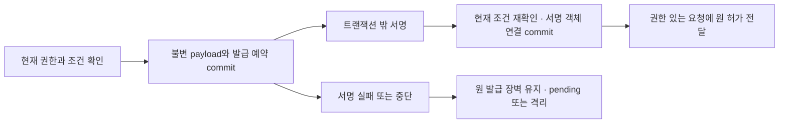

# 반납·재등록·취소의 저장 경계와 장애 복구

작성: 2026-09-18. **설계 후보이며 구현·SQL 실행·기준 병합은 하지 않았다.** 신규 테이블 후보 14개, 원자 처리 경계 12개, 펌웨어 영속 영역 4개, 이행 단계 8개와 미실행 장애 사례 26개를 정리한다. 기존 업무 테이블 61개와 마이그레이션 SQL 7개는 그대로 보존한다. schema_migrations 관리 테이블은 업무 테이블 수에서 제외한다.

[구조·제약·전체 변경 집합](lifecycle-storage-design.json) · [설계 검증기](validate_lifecycle_storage.py) · [이전 등록·취소 계약](rental-admission-cancel.md) · [반납 HTTP/BLE 계약](return-route-contracts.md)

## 1. 저장 책임과 현재 기준

서버는 현재 대여/binding과 기기 세대, 실행 허가 이력, 취소 표식, 검증 증거, 재대여 근거를 보관한다. 기기는 초기화 진행 저널·최소 완료 표식·등록/활성화 증거·취소 표식을 보호된 영속 영역에 보관한다. 서버의 완료 상태만으로 기기 삭제나 제한 해제를 추정하지 않는다.

서버 권한의 잠금 기준은 앞서 제안한 `approval_authorization_gates`를 공유한다. 새 lifecycle head는 현재 기기 상태의 포인터이며, reuse gate는 재등록 근거다. 둘을 독립된 권한 저장소로 만들어 나중에 동기화하지 않는다. 공유 gate 자체도 아직 물리 SQL에 적용되지 않은 후보이므로 함께 채택해야 한다.

SQL에는 키 참조·암호문 위치·digest·검증 상태를 보관한다. 니모닉, private key, MPC 전체키, 평문 녹음이나 사용자 토큰을 일반 테이블·감사 로그·outbox에 넣지 않는다. 초기화 증거 객체는 승인 객체와 저장 adapter를 공유할 수 있지만, 기존 approval_protected_objects의 kind 제약에는 lifecycle 종류가 없으므로 별도 namespace와 메타데이터를 제안한다.

## 2. 테이블 후보와 제약

아래는 실행할 DDL이 아니라 저장 사전이다. `?`는 nullable 제안이며 나머지는 필수다. cross-row 검증은 단순 CHECK로 해결했다고 간주하지 않는다. 다형 owner 참조는 실제 이행안에서 타입별 FK 또는 동등한 무결성 경계를 정해야 한다. epoch의 정확한 표현 범위도 기기 profile 선정 전 확정하지 않는다.

| 후보 테이블 | 책임 | 기본 키 |
| --- | --- | --- |
| device_lifecycle_heads | Current device lifecycle | device_id |
| device_fence_reasons | Return and other restriction reasons | device_id, reason_kind, reason_id |
| lifecycle_reset_jobs | ResetJob | job_id |
| lifecycle_permits | Immutable server permits | permit_id |
| lifecycle_evidence | Verified and pending device evidence | evidence_id |
| lifecycle_objects | Protected lifecycle bytes | object_id |
| lifecycle_reuse_gates | ReenrollmentGate | device_id, epoch |
| lifecycle_genesis_records | Trusted factory eligibility | genesis_id |
| lifecycle_admissions | Rental admission reservation | admission_id |
| lifecycle_binding_states | Ownership availability before wallet setup | binding_id |
| lifecycle_cancellations | Single cancellation lineage | cancel_id |
| lifecycle_relay_authorities | Restricted recovery relay | authority_id |
| lifecycle_challenges | Single-use issue/submission freshness | challenge_id |
| lifecycle_outcomes | Durable business idempotency | outcome_id |

기기당 현재 활성/대기 대여는 기존 rentals의 유일 제약과 동일 head/gate 아래에서 보호한다. 과거 admission의 active 이력을 영원한 ‘현재 점유’로 취급하는 유일 제약을 만들지는 않는다. 반납을 완료한 과거 이력과 현재 기기 점유는 구분한다.

`lifecycle_cancellations`의 jobId는 모든 상태에서 유일하다. 다른 멱등 키, 완료 후 재요청, 격리 후 재시도로 취소 작업을 교체하지 않는다. `grant_issued`, 취소 표식, 소비된 genesis/재대여 근거는 timeout이나 응답 캐시 TTL로 삭제하지 않는다.

## 3. 기존 구조와 다른 네 지점

**지갑 설정 전 binding:** 기존 device_bindings.wallet_origin은 NOT NULL이고 new_travel/imported만 허용한다. 새 등록은 지갑 설정 전에도 예약되어야 하므로 nullable 변경과 lifecycle_binding_states를 함께 제안한다. NULL은 ‘미설정’이지 어느 지갑 방식의 기본값이 아니다. 기존 미철회 소유자 유일 제약은 예약 때부터 적용하되, 서명 권한 판정은 lifecycle active와 실제 지갑 설정/권한까지 확인해야 한다. `revoked_at IS NULL`만 보는 옛 writer는 전환 후 사용할 수 없다.

**기존 clearance의 consumed_at:** 현재 CHECK는 소유자 승인과 reset evidence가 있어야 consumed_at을 기록하도록 한다. 이를 초기화 허가 발급 시점으로 바꾸지 않는다. 새 permit/ResetJob에 발급 장벽을 따로 저장하고 모든 commit 경로가 확인하게 한다. 원 증거를 검증한 뒤에만 기존 evidence 기반 consumed 의미를 적용한다.

**서명·검증을 기다리는 응답:** 실제 signer/verifier는 DB 트랜잭션 밖에서 동작한다. 발급 결정이나 증거 접수를 먼저 영속 저장하고, 서명/검증이 완료될 때까지 pending 상태를 유지해야 한다. 기존 nullable permit 응답은 활용하되, RT01 등 pending 형태가 부족한 응답에는 명시적인 계약 변경이 필요하다. 이번 저장 설계가 이전 응답 스키마를 자동으로 변경한 것은 아니다.

**지갑 미설정 기기의 반납:** 현재 walletOrigin 두 값만으로는 표현할 수 없다. 임의로 new_travel로 채우지 않는다. 별도 DTO·삭제 profile이 마련되기 전 해당 파괴적 반납 경로는 사용 가능하다고 표시하지 않는다. 이는 전체 제품 범위의 삭제가 아니라 확인된 후속 설계 항목이다.

## 4. 함께 저장할 변경과 잠금 순서

각 처리의 전체 commit 집합은 JSON의 `candidateWrites + existingWrites + commonWrites`다. 본문에서 언급한 기존 대여/binding 변경을 새 테이블 목록 밖에 빠뜨리지 않는다. 공통으로 적용되는 gate revision, 감사 기록, 멱등 결과, outbox도 같은 경계에 둔다. 실제로 변경할 행만 쓰되, DB가 여러 개라면 이 원자성을 자동으로 가정하지 않는다.

잠금 순서는 기존 승인 설계에 lifecycle 순위 15를 끼워 넣는 **변경 제안**이다. 모든 관련 writer를 동시에 전환해야 한다.

| 순위 | 대상 |
| --- | --- |
| 0 | 공유 approval_authorization_gates, 서버가 계산한 key 정렬 |
| 10 | 기존 session/membership/wallet/device binding 권한 행 |
| 15 | devices → rentals → JSON에 명시한 lifecycle 테이블 순서, 각각 PK 정렬 |
| 20–50 | 기존 commerce → approval operation → grant/challenge → nonce/dispatch 순서 |
| 60 | 기존 감사·outbox·멱등 등 기반 저장 |

필요한 gate 목록은 서버가 정한다. 잠근 뒤 재계산한 목록에 누락이 있으면 전체 목록으로 트랜잭션을 재시작한다. 아직 행이 없는 경우 상위 scope gate와 유일 제약으로 생성 경쟁을 보호한다. 서명, 암호 객체 I/O, 기기 통신, 외부 검증을 수행하면서 DB 잠금을 계속 유지하지 않는다.

| ID | 원자 처리 | 연결 경로 |
| --- | --- | --- |
| LST-T01 | 반납 점검·제한·준비 기록 | API-046, RB01 |
| LST-T02 | 초기화 허가 발급 결정 | RT-01 |
| LST-T03 | 기존 초기화 증거·반납 완료 | API-047 |
| LST-T04 | 정리 확인 | RT-06 |
| LST-T05 | 대여 예약 | API-045 |
| LST-T06 | 등록·활성화 증거 | RL-02, RL-03 |
| LST-T07 | 단일 취소 intent | RC-01 |
| LST-T08 | 취소 준비 무효화 확인 | RC-02 |
| LST-T09 | 양측 취소 완료 | RC-03 |
| LST-T10 | 중계 자격·challenge | RT-02, RT-03, RT-04, RT-05 |
| LST-T11 | 서명 객체 연결과 중계 권한 활성화 | RT-07, RL-04, RC-04, API-091 |
| LST-T12 | 증거 접수와 검증 예약 | API-047, RT-06, RL-02, RL-03, RC-02, RC-03 |

T03의 반납 완료는 rental 반환 시각·기존 binding 철회·새 epoch·정리 대기 gate를 함께 기록한다. wallet binding 철회는 원 대여에 결합된 권한만 대상으로 하며, import 지갑의 무관한 외부 자산/소유권이나 Cloud Wallet을 철회하지 않는다. 기존 rental 유일 제약의 슬롯이 비어도 cleanup 전에는 새 admission을 만들 수 없다.

T04에서 해당 반납의 정리가 끝나도 다른 관리/FOTA/분실 제한이 있으면 전체 등록 허가는 계속 닫힌다. 제한은 이유별로 저장하고 자기 작업이 만든 이유만 해제한다. 보호된 증거 전달과 복구 명령은 held gate 아래의 별도 제한 권한으로 처리하며, 이를 위해 전역 gate를 open으로 바꾸지 않는다.

T05는 새 rental, 예약 binding, admission, 소비한 등록 근거, permit 발급 기록을 함께 만든다. T06은 기기 저장 증거와 활성화 증거를 각각 검증해 같은 예약을 진전시킨다. 기기는 활성화했지만 서버 확인이 유실된 경우에도 다른 사용자를 배정하지 않는다.

T07–09는 취소 표식 생성, 기기 준비 무효화 확인, 기기 제한 해제 확인을 나눈다. T09 전까지 서버의 반납 제한을 유지한다. 완료 후 원 rental/binding을 유지하고 job을 aborted로 만들지만 재대여 근거는 생성하지 않는다.

## 5. 허가 발급과 증거 검증의 중단 경계

초기화 T02는 signer를 부르기 전에 불변 payload·발급 예약·grant_issued 장벽을 저장한다. 이 시점부터 실제 bytes가 아직 없더라도 취소할 수 없다. 이전 문서의 ‘발급’을 저장 관점에서 보수적으로 구체화한 것이다. 서명 실패를 미발급으로 되돌리지 않는다.

T11이 서명 결과를 원 payload/profile과 대조하고 첫 signed object를 연결한다. 서명 알고리즘이 같은 입력에 항상 같은 bytes를 낸다고 가정하지 않는다. 첫 연결 후 다른 결과 bytes는 덮어쓰지 않고 격리한다. 중계 authority는 **현재 권한·만료·작업/epoch 재확인 + signed object 연결 + pending_signing→active**를 모두 T11에서 처리한다. T10은 pending 발급 예약까지만 담당한다. GET은 서명하거나 새 허가를 만들지 않는다.

원 허가 bytes는 signed object 연결 commit 전에는 외부로 전달하지 않는다. signer 작업 알림이나 outbox 메시지는 권한 그 자체가 아니다. 이미 발급됐거나 외부로 나갔을 수 있는 권한은 이후 gate 변경으로 회수됐다고 주장하지 않는다.

증거는 T12에서 현재 제출 권한과 암호 객체를 확인해 pending row·검증 작업·멱등 결과를 저장한다. 필요하면 challenge도 이 접수 결과와 함께 소비한다. 외부 검증이 끝나면 T03/T04/T06/T08/T09가 현재 gate와 정확한 증거 문맥을 다시 검사하고 검증/반영 revision과 업무 변경을 함께 저장한다. ‘접수됨’은 ‘삭제 완료’나 ‘활성화 완료’가 아니다.

## 6. 펌웨어 영속 영역과 객체 수명

- **LST-F01 Reset journal**: exact original job/grant/context; erase progress; previous/next epoch; protected reset evidence. 영속화 경계: acknowledging execution acceptance; irreversible erase steps checkpoint before advancing. 복구: Same job only; missing or inconsistent history requires quarantine, never infer complete.
- **LST-F02 Completion/cleanup marker**: job/commit/completion handle/ACK digest; next epoch; cleanup profile and marker digest. 영속화 경계: removing detailed reset journal. 복구: Retain identity needed for fresh cleanup challenges; no marker means not clean.
- **LST-F03 Admission state**: exact recipient/holder/session/context; staged binding/permit digest; activation permit digest and immutable receipts. 영속화 경계: BindingReceipt or ActivationReceipt response. 복구: Power loss preserves exclusive lineage; device activation may precede server evidence. No another owner.
- **LST-F04 Cancellation tombstone**: job/cancel/binding/epoch/fence context; invalidated prepare state; prepared/released receipt and permit digests. 영속화 경계: prepared proof; restriction release and release receipt as one recoverable durable transition. 복구: Never reopen prepared grant acceptance. Reset/FOTA cannot discard protection metadata without selected migration profile.

이 영역은 실제 플래시 파티션이나 Zephyr API를 선정한 결과가 아니다. 전원 중단과 antirollback 보장을 지원하는지 실기에서 확인한 뒤 profile을 선택해야 한다. ‘메모리가 비었다’는 사실만으로 미실행·미등록·정리 완료를 판단하지 않는다.

암호 객체는 먼저 보호 저장소에 staging한 뒤 메타데이터를 연결한다. 링크 전에 중단된 객체는 권한을 부여하지 않는다. GC는 단순 시간 기준으로 지우지 않고, 객체 registry와 영속 upload lease를 통해 신규 참조 생성/삭제와 경쟁을 조정해야 한다. 이 adapter 역시 후속 구현·검증이 필요하다.

일반 응답 캐시와 영속 멱등 이력을 분리한다. 캐시가 사라져도 원 operation, 불변 payload/digest, 발급·취소·소비 이력을 유지한다. unresolved 작업의 증거·허가를 재시도보다 먼저 삭제하지 않는다. 실제 보존 기간, 암호키 회전·삭제와 개인정보 삭제 정책은 미선정이며 무기한 보관으로 임의 확정하지 않는다.

## 7. 이행과 복구

| 단계 | 작업 | 통과 조건 |
| --- | --- | --- |
| LST-M01 inventory | Freeze hashes and classify current device/active rental/binding/reset evidence and open work; preserve unknowns. | No generated grant, epoch, consent, genesis or cleanup evidence. |
| LST-M02 expand | Add proposed tables and FK/index design to new future migration; plan nullable wallet_origin and all dependent reader updates. | No existing seven SQL files edited or executed. |
| LST-M03 coordinate | Quiesce incompatible reset/admission/approval writers; shared gate ownership/lock ordering and contract version routing adopted together. | No eventual dual-write for gates, tombstones or uniqueness. |
| LST-M04 backfill | Verified evidence-backed current heads; independent immutable history preserved; unknown devices/quarantined holds; CAS cursor checks concurrent revision. | No default eligible, active, virgin or grant_issued=false for uncertain history. |
| LST-M05 shadow | Read-only projections compare lineage/rental/binding/gate; no shadow writer or signing. | Mismatch blocks cutover; signed object retention recoverable. |
| LST-M06 rehearse | Future crash/restore/power-loss/competing writer tests with chosen profiles and firmware; validate restore authority generation. | Runtime cases remain not_run until evidence attached. |
| LST-M07 cutover | Switch compatible writers under gates; enforce durable unique constraints/typed FKs and deny old bypass DTOs. | Explicit implementation authorization required; old readers cannot treat reserved binding active. |
| LST-M08 rollback_restore | Hold writes first; never rollback monotonic consumed/grant/cancel history. Restore trusted latest watermark and compare device evidence before unhold. | Old backup is not authority; without external durable latest watermark stay quarantined. |

백업 복구는 특히 보수적으로 처리한다. 오래된 DB에는 실제 발급된 grant나 완료된 취소 표식이 없을 수 있다. 해당 백업만으로 false/open/virgin 상태를 만들지 않는다. DB와 함께 되감기지 않은 신뢰 가능한 최신 watermark/authority generation 및 기기 증거와 대조하기 전까지 관련 gate를 보류한다. 그런 외부 기준을 아직 제공할 수 없다면 격리를 유지한다.

이행 단계는 실제 migration 파일이나 실행 기록이 아니다. 제품 구현을 시작하라는 사용자 지시와 엔진/profile 선택, 호환 writer·증거가 마련된 뒤 별도로 실행한다.

## 8. 검증 범위와 다음 작업

검증기는 후보 테이블 기본 키/필드, 원자 단위의 전체 write 집합, API/BLE 참조, 잠금 순서, 이행 의존성, 원본 설계 9개와 SQL 7개의 SHA-256 보존을 확인한다. 실행 가능한 DDL 검사, 실제 트랜잭션 격리·성능·암호·전원 중단 시험은 아니다. 장애 수용 사례 26개는 모두 not_run이다.

복구 정책 RR-DEC-01은 미답변 상태를 유지한다. 새 저장 설계로 개인 백업, 키 복구 방식, 초기화 허용 정책을 결정하지 않는다. Zephyr는 확정됐지만 SDK/board target·보안 profile은 미선정이다.

**다음 설계:** 등록 bootstrap·수령인 동의·출고 증거의 입력 계약, 지갑 미설정 기기의 반납 분기, 서명/검증 준비 중 응답을 보완한다. 이어서 이번 저장 후보와 HTTP/BLE·권한·화면의 공동 채택 조건을 정리한다.

## 부록: 테이블별 상세 사전

### device_lifecycle_heads

필드: `device_id:app_id` · `epoch:decimal-string` · `binding_revision:revision` · `lifecycle_revision:revision` · `active_rental_id:app_id?` · `active_binding_id:app_id?` · `pending_admission_id:app_id?` · `current_reset_job_id:app_id?` · `state:unprovisioned|reserved|active|returning|awaiting_cleanup|quarantined` · `authority_gate_key:text` · `restore_generation:revision`

저장 제약:

- PK device_id; FK devices(id), authority_gate_key -> approval_authorization_gates(gate_key)
- epoch is exact unsigned integer encoding, no floating point; concrete storage bound awaits device profile

트랜잭션 책임:

- Head is current lineage pointer, not independent authorization authority. All writers lock shared rank-0 gate before head; missing head denies; revision monotonic, no epoch inference from firmware version.

### device_fence_reasons

필드: `device_id:app_id` · `reason_kind:return|fota|security|administrative` · `reason_id:app_id` · `binding_id:app_id?` · `epoch:decimal-string` · `revision:revision` · `state:held|released` · `release_evidence_id:app_id?`

저장 제약:

- PK device_id,reason_kind,reason_id; released history retained

트랜잭션 책임:

- Release only exact reason owned by operation; effective shared gate stays held while any blocking reason remains. Purpose-specific recovery commands may operate under held gate; never make global gate open for cleanup. Existing revoke/scope conditions still apply.

### lifecycle_reset_jobs

필드: `job_id:app_id` · `device_id:app_id` · `rental_id:app_id` · `binding_id:app_id` · `previous_epoch:decimal-string` · `next_epoch:decimal-string?` · `checklist_revision:revision` · `fence_revision:revision` · `prepare_digest:hash32?` · `owner_approval_ref:app_id?` · `grant_issued:boolean` · `commit_id:app_id?` · `phase:checking|prepared|commit_issued|device_started|evidence_pending|completed|aborted|quarantined` · `cancel_id:app_id?` · `completion_handle:app_id?` · `revision:revision`

저장 제약:

- PK job_id; UNIQUE commit_id WHERE nonnull; UNIQUE completion_handle WHERE nonnull
- Composite references require matching device/rental/binding lineage, not independent valid IDs

트랜잭션 책임:

- grant_issued never true->false; no terminal downgrade; one nonterminal reset lineage per current device enforced under head lock + unique active slot. Issuance reservation is conservative grant-issued barrier even before signing finishes; cancel forbidden thereafter.

### lifecycle_permits

필드: `permit_id:app_id` · `owner_kind:reset|admission|cancellation|relay|challenge` · `owner_id:app_id` · `purpose:execute|completion_ack|admission|activation|cancel_prepare|cancel_release|relay_authority|cleanup_challenge` · `context_digest:hash32` · `payload_object_id:app_id` · `signed_object_id:app_id?` · `proof_profile_id:app_id` · `issuance_state:reserved|signed|quarantined` · `issued_revision:revision`

저장 제약:

- PK permit_id; UNIQUE owner_kind,owner_id,purpose
- Explicit owner-kind discriminator; service validates typed owner FK when physical mapping selected

트랜잭션 책임:

- Immutable canonical payload authorized before signer starts; payload object reference + issuance reservation committed. Signature worker cannot change context; first durable signed object fixes digest; later alternate bytes quarantined, never overwrite. No response/outbox emits permit bytes before signed link commit; missing bytes never rolls back grant barrier.

### lifecycle_evidence

필드: `evidence_id:app_id` · `device_id:app_id` · `owner_kind:reset|admission|cancellation` · `owner_id:app_id` · `kind:reset|cleanup|binding_staged|binding_active|cancel_prepared|fence_released` · `ciphertext_digest:hash32` · `semantic_digest:hash32?` · `object_id:app_id` · `profile_id:app_id` · `identity_key_ref:app_id` · `verification_state:pending|valid|invalid|quarantined` · `verified_input_revision:revision?` · `revision:revision`

저장 제약:

- PK evidence_id; UNIQUE owner_kind,owner_id,kind,ciphertext_digest

트랜잭션 책임:

- Digest dedup is not authority. Validate full parent context, expected purpose, signer and protected envelope. Challenge-specific cleanup proofs can differ for same result; append evidence, apply semantic business effect once. Recheck current gates after external verification; verified flag alone grants nothing.

### lifecycle_objects

필드: `object_id:app_id` · `object_version:app_id` · `kind:payload|permit|device_evidence|replay_result` · `store_ref:opaque-text` · `digest:hash32` · `byte_length:positive-integer` · `key_ref:opaque-text` · `state:linked|delete_pending|deleted|missing` · `retention_class:text` · `revision:revision`

저장 제약:

- PK object_id; UNIQUE store_ref; immutable object version/digest/length once linked

트랜잭션 책임:

- Separate namespace from approval_protected_objects whose kind enum excludes lifecycle payloads. Reuse protected-store adapter only, not false FK to existing unsupported kinds. Stage encrypted bytes before SQL link; no public URL or wallet secrets. GC must serialize reference creation/deletion via shared object registry and durable upload lease, not just age scan.

### lifecycle_reuse_gates

필드: `device_id:app_id` · `epoch:decimal-string` · `return_job_id:app_id` · `completion_handle:app_id` · `reset_evidence_id:app_id` · `cleanup_evidence_id:app_id?` · `state:awaiting_cleanup|eligible|consumed|quarantined` · `consumed_admission_id:app_id?` · `revision:revision`

저장 제약:

- PK device_id,epoch; UNIQUE return_job_id; consumed state requires consumed_admission_id

트랜잭션 책임:

- Derived entitlement under same authority device gate, not a shadow authorization lock. Only valid current cleanup opens eligible; admission consumes once; historical eligible never current permission. Cancelled returns create no reuse gate.

### lifecycle_genesis_records

필드: `genesis_id:app_id` · `device_id:app_id` · `identity_ref:app_id` · `virgin_attestation_ref:app_id` · `epoch:decimal-string` · `inventory_scope_ref:app_id` · `state:verified|consumed|quarantined` · `consumed_admission_id:app_id?` · `revision:revision`

저장 제약:

- PK genesis_id; UNIQUE device_id

트랜잭션 책임:

- Only trusted provisioning verification creates record. Never reconstruct from missing rentals/reset records; retain consumed history through restore; no user supplied self-asserted virgin state.

### lifecycle_admissions

필드: `admission_id:app_id` · `device_id:app_id` · `rental_id:app_id` · `binding_id:app_id` · `account_id:app_id` · `basis_kind:factory_genesis|returned_device` · `basis_id:app_id` · `expected_epoch:decimal-string` · `expected_gate_revision:revision` · `expected_binding_revision:revision` · `recipient_consent_ref:app_id` · `enrollment_proof_ref:app_id` · `holder_thumbprint:hash32` · `enrollment_session_id:app_id` · `context_digest:hash32` · `state:reserved|activation_issued|active|quarantined` · `revision:revision`

저장 제약:

- PK admission_id; UNIQUE rental_id; UNIQUE binding_id; UNIQUE basis_kind,basis_id
- Device exclusivity through current head and rentals one_active_rental; historical active admissions remain history, not eternal partial unique device constraint

트랜잭션 책임:

- Admission reservation consumes basis and creates assigned rental plus reserved binding atomically; no timeout release. Positive matching device evidence advances state; no automatic second admission on lost activation.

### lifecycle_binding_states

필드: `binding_id:app_id` · `device_id:app_id` · `rental_id:app_id` · `admission_id:app_id` · `epoch:decimal-string` · `state:reserved|activation_issued|active|revoked|quarantined` · `wallet_configuration:unconfigured|configured` · `revision:revision`

저장 제약:

- PK binding_id; FK device_bindings(id); composite lineage verified with matching keys
- Binding state active is necessary, never sufficient, for wallet signing

트랜잭션 책임:

- Proposed device_bindings wallet_origin nullable until actual wallet setup; NULL means unconfigured, never inferred new_travel/imported. Existing unique owner index reserves ownership even while unusable. All old signing readers must join this state and actual wallet authority; selecting revoked_at IS NULL alone is unsafe.

### lifecycle_cancellations

필드: `cancel_id:app_id` · `job_id:app_id` · `device_id:app_id` · `binding_id:app_id` · `epoch:decimal-string` · `original_fence_revision:revision` · `context_digest:hash32` · `state:intent_recorded|release_issued|completed|quarantined` · `prepared_evidence_id:app_id?` · `released_evidence_id:app_id?` · `commit_block:boolean` · `revision:revision`

저장 제약:

- PK cancel_id; UNIQUE job_id across every state; commit_block true
- No delete-and-reinsert to replace cancelled job lineage

트랜잭션 책임:

- Create only never-issued grant under shared locks. Keep server fence held until exact release evidence committed. Retain tombstone after completion; new return needs new job.

### lifecycle_relay_authorities

필드: `authority_id:app_id` · `job_id:app_id` · `device_id:app_id` · `epoch:decimal-string` · `holder_thumbprint:hash32` · `actor_ref:app_id` · `actions:action-set` · `expires_at:timestamp` · `authorization_revision:revision` · `state:pending_signing|active|revoked|expired` · `signed_object_id:app_id?`

저장 제약:

- PK authority_id; actions nonempty; signed object linked
- active requires signed_object_id; pending authority cannot authorize relay

트랜잭션 책임:

- Exact historical relationship or scoped operator plus primary auth required on issuance; restricted relay does not unlock owner signing. Renewal appends new authority with current proof, never edits original evidence AAD.

### lifecycle_challenges

필드: `challenge_id:app_id` · `kind:authority_issue|submission|cleanup` · `owner_ref:app_id` · `holder_thumbprint:hash32` · `action:text` · `payload_digest:hash32` · `expires_at:timestamp` · `state:issued|consumed|expired` · `outcome_id:app_id?`

저장 제약:

- PK challenge_id; consumed requires outcome_id

트랜잭션 책임:

- Challenge consumption and authoritative business result commit together. Verification pending consumes challenge only with durable pending outcome; later apply uses reserved submission lineage and rechecks gates. Fresh retry challenge may map same business outcome without repeating effects.

### lifecycle_outcomes

필드: `outcome_id:app_id` · `actor_namespace:text` · `action:text` · `entity_id:app_id` · `business_key:text` · `business_digest:hash32` · `owner_id:app_id` · `state:pending|complete|rejected|quarantined` · `result_object_id:app_id?` · `revision:revision`

저장 제약:

- PK outcome_id; UNIQUE actor_namespace,action,entity_id,business_key

트랜잭션 책임:

- Durable lineage outlives ordinary response-cache TTL; current authorization before replay. Same key new payload conflicts; current-state projection separated from immutable original outcome. Does not store plaintext tokens/keys.

