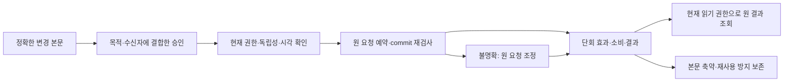

# 관리 승인·복구 증거의 필드와 수명

관리 승인·복구 증거가 무엇을 증명하고 언제 소비·만료·보존되는지를 구체화한다. 기존 TR 기록의 보완 명세이며 새로운 공개 API·키 형식·실제 정책 선택이 아니다.

## 설계 경계

- 관리 권한 증거만 다룬다. 지갑 seed/private key/MPC share, 사용자 자금 서명, RR-DEC-01의 선택은 이 증거에 포함하지 않는다.
- 논리 필드의 의미와 검사 순서를 정한다. 서명 suite, 직렬화/정규화, 길이·크기 제한, 시계 오차·유효기간·보존 기간·승인 수는 기존 선택 필드에서 확정해야 한다.
- 서명 유효성, 승인자의 실제 독립 통제, 현재 권한, 원 요청 결과는 서로 다른 근거다. 앱 로그인·전송 성공·BLE 근접·버튼 입력만으로 관리 승인을 만들지 않는다.
- 검증 결과는 영구 권한이 아니다. 새 효과가 확정되는 경계에서 현재 anchor/grant/fence·승인 철회·소비 상태를 다시 검사한다. 별도 저장소 간 원자성을 가정하지 않는다.

## 증거가 연결되는 흐름

도표는 논리 흐름이다. 외부 저장소를 포함한 분산 원자성이나 자동 복구가 구현됐다는 의미가 아니다.

## 필수 논리 필드

조건부 필드는 적용되는 연산에서 필수다. 선택하지 않은 suite·wire 인코딩·시간/보존 수치를 임의 기본값으로 채우지 않는다.

### TE-01 · EvidenceEnvelope

기존 기록: TR-04

| 필드 묶음 | 의미·조건 |
|---|---|
| schemaVersion / evidenceType | 수신자가 지원하는 명시적 버전·증거 종류. 알 수 없는 필수 의미는 거절 |
| evidenceId / domain / environment / deployment / audience | 충돌 없는 증거 식별과 management-trust 용도·정확한 수신 범위 |
| command / changeId / requestScope / requestId / caseId | 승인 대상 연산과 원 요청의 상위 범위. caseId는 복구일 때 필수 |
| subjectDigest / policyDigest / verifierProfileVersion | 승인 본문과 선택 정책·검증 해석의 고정 식별 |
| issuerPrincipal / controllerBindingRef / keyId / keyVersion / keyPurpose | 현재 등록된 발행자·통제 주체·용도별 키 |
| anchorEpoch / grantRevision / fenceRevision / challengeId | 기대 신뢰·권한·제한 버전과 서버가 해당 작업에 발급한 도전값 |
| issuedAt / notBefore / expiresAt / proof | 발급 시각·허용 구간·무결성 증명. proof를 제외한 의미 필드 전체에 결합 |

키 ID나 evidenceId만 서명하지 않는다. domain-separated 전체 정규화 본문을 검증하고 issuer·purpose·audience를 신뢰 레지스트리와 대조한다. 필수 필드 누락·모순·중복 필드 해석 차이는 거절한다.

### TE-02 · ApprovedSubject

기존 기록: TR-02, TR-04, TR-05

| 필드 묶음 | 의미·조건 |
|---|---|
| operationClass / command / exactTarget | 키 교체·권한 변경·복구·제한 해제 등을 구분하고 대상 identity를 고정 |
| oldAnchorDigest / expectedRevisions / targetEpoch | 현재 anchor·grant·fence와 목표 신뢰 버전 |
| newKeySetDigest / purposeScopes / newKeyProofRefs | 변경될 공개 키 집합·용도·범위와 해당 challenge에 결합한 PoP |
| recoveryCaseDigest / independentPolicyDigest / incidentScope | 복구에서만 필수: 사전 복구 근거와 사건 범위 |
| consumerCohortDigest / releaseAssessmentRef | 제한 해제 시 필수: 현재 적용 대상과 별도 해제 검토 |

요청자 식별·정확한 본문·새 키·범위·목표 버전이 달라지면 새 본문/승인이다. 감사 메모 추가는 승인 본문을 바꾸지 않는 별도 append 기록으로만 허용한다.

### TE-03 · ApprovalSet

기존 기록: TR-04

| 필드 묶음 | 의미·조건 |
|---|---|
| subjectDigest / policyDigest / evidenceRefs | 동일 본문·정책을 승인한 증거 집합 |
| controllerBindingRevision / requesterController | 별칭과 공유 통제를 합친 현재 독립성 근거와 요청자 통제 주체 |
| eligibleApprovals / exclusionReasons | 유효·현재·독립인 승인과 제외된 근거의 식별 |
| evaluatedAtInterval / expectedCurrentRevisions | 검사 시각 오차 구간과 commit에서 재검사할 버전 |

승인 수는 정책으로 선택한다. 동일 통제자·동일 키를 여러 표로 계산하지 않고 요청자의 자기 권한 상승 승인은 제외한다. 필요한 독립 승인을 확보하지 못하면 보류한다. 서명 수와 실제 통제자 수를 혼동하지 않는다.

### TE-04 · ChallengeAndConsumption

기존 기록: TR-01, TR-04, TR-05

| 필드 묶음 | 의미·조건 |
|---|---|
| challengeId / generation / purpose / subjectDigest / requesterScope | 발급된 challenge의 고유 세대·단일 목적·원 요청 결합 |
| notBefore / expiresAt / issuedUnderPolicy | challenge 유효기간과 발급 시 정책 |
| state / reservedBy / consumeRevision | issued / reserved / consumed / retired, 한 원 요청만 소유 |
| outcomeIdentity / consumptionReceipt / protectedCheckpointRef | 동일 작업 결과와 원자적 소비 근거·복원 검증 |

challenge·bootstrap ticket·recovery case는 단회 효과에 연결한다. 여러 승인자가 같은 작업 challenge를 승인하는 것은 허용되지만, 다른 requestId로 소비하지 못한다. reserved/unknown을 시간 초과만으로 해제하지 않는다.

### TE-05 · VerificationReceipt

기존 기록: TR-04, TR-07

| 필드 묶음 | 의미·조건 |
|---|---|
| evidenceDigest / subjectDigest / verifierVersion / policyDigest | 정확히 무엇을 어떤 해석으로 검증했는지 |
| checkedAtInterval / anchorGrantFenceRevisions / controllerBindings | 관측 시점의 신뢰·권한·제한과 독립성 근거 |
| checks / decision / reason / proofSourceRefs | 검사별 결과와 원 증거 참조. 서명 검사·현재 권한 검사를 구분 |
| receiptIntegrityRef / auditSequence | 영수증 자체의 변조 탐지·순서 근거 |

영수증은 과거 검사의 기록이다. 이것만으로 재실행·새 권한을 허용하지 않는다. compromise 이후 서명만 보고 발급 시각의 진실성을 복원하지 않는다.

### TE-06 · OriginalOutcomeAndTombstone

기존 기록: TR-01, TR-05, TR-07

| 필드 묶음 | 의미·조건 |
|---|---|
| identity / subjectDigest / requestGeneration | 환경·배포·trusted requester scope·command·parent·requestId의 원 결과 |
| effectState / commitReceipt / auditRef | pending / unknown / committed / rejected_before_effect. 실제 commit 근거 |
| committedRevisions / admissionAfterCommit | 발생한 신뢰 변경과 그때의 제한 상태 |
| payloadRetentionClass / minimalTombstone / generationSealRef | 결과 본문과 재사용 방지 기록의 독립 보존 |

같은 identity+다른 digest는 conflict, 같은 digest는 현재 읽기 권한으로 원 결과만 조회한다. 조회는 당시 결과와 지금의 제한 상태를 분리해서 표시한다. 본문 pruned/unknown은 새 실행의 허가가 아니다.

### TE-07 · EvidenceRetentionAssessment

기존 기록: TR-07

| 필드 묶음 | 의미·조건 |
|---|---|
| recordClass / selectedRetentionPolicy / allowedProjection | 원 증거·감사·dedupe·checkpoint·비밀의 구분 |
| openIncident / unresolvedEffects / restoreReplayDependencies | 진행 중 사건·미확정 효과·복원/재생성 의존성 |
| plannedDeletion / minimalRetainedProof / generationSeal | 삭제 대상·최소 남길 근거·이전 세대 영구 거절 근거 |
| reviewAuthority / expectedRevision / deletionOutcome | 현재 권한이 승인한 삭제 계획과 결과 |

법정 보존 기간을 임의 확정하지 않는다. 식별자·해시도 연결 가능 정보로 취급한다. 보존 정책과 폐기 안전성을 모두 확인해야 삭제하며, 보존 제한 때문에 안전한 재사용 방지가 불가능하면 해당 세대를 폐쇄하고 쓰기를 보류한다.

## 유효성·소비 규칙

- **ER-01 · 검증 순서**: 형식/허용 버전·수신 범위 → 선택된 신뢰 경로와 목적 → 본문/서명/PoP → 시각 구간 → 현재 권한/독립성/철회 → 원 요청/소비 상태 → commit 직전 버전 재검사 순이다. 원 결과 조회는 별도 현재 읽기 권한 경로이며 만료 승인 재검증으로 새 효과를 내지 않는다.
- **ER-02 · 만료 경계와 시계 불확실성**: trusted now가 [earliest, latest]이면 notBefore ≤ earliest이고 latest < expiresAt인 경우만 새 효과를 허용한다. issuedAt ≤ notBefore < expiresAt와 선택된 최대 수명을 검사한다. 시간 근거 없음·역행·만료 경계 겹침은 보류한다. 클라이언트 시각과 issuedAt 주장만 신뢰하지 않는다.
- **ER-03 · 검사 후 상태 변경**: 승인 시 유효했어도 commit 전에 권한/정책/anchor/fence가 바뀌면 새 효과를 멈추고 정확한 새 revision으로 재검토한다. 철회된 승인자는 제외하며, 남은 유효 독립 승인 수가 정책을 만족해야 한다. 회수할 수 없는 외부 효과가 이미 발생했다면 현재 제한을 유지하고 원 사건으로 조정한다.
- **ER-04 · 단회 소비와 응답 유실**: 원 요청 예약·consume·신뢰 변경·감사/outcome을 하나의 논리 효과로 결합한다. 별도 저장소 작업이 불명확하면 reserved/unknown으로 격리하고 원 요청 ID로 조회한다. lease 만료나 새 requestId로 우회하지 않는다. 완료된 효과를 재실행하지 않는 조회는 승인 만료 후에도 현재 read 권한으로 가능하다.
- **ER-05 · 복구와 해제의 구분**: 복구는 사전 등록되고 현재도 신뢰 가능한 독립 recovery 정책/증거로만 진행한다. TMC-06 완료는 recovered_restricted이며 fence를 낮추지 않는다. TMC-07 해제에는 별도 본문·challenge·현재 해제 승인·소비자 검증이 필요하다. 복구 승인이나 키 PoP를 재사용해 자동 해제하지 않는다.
- **ER-06 · 최초 등록 증거**: bootstrap은 TE envelope만으로 신뢰를 만들지 않는다. TR-01의 대상 bundle 밖 OOB fingerprint/policy·설치/virgin evidence와 독립 checkpoint를 검증한다. 비어 있는 DB나 새 키의 자기 서명은 대체 근거가 아니다.
- **ER-07 · 결과 축약과 세대 폐쇄**: 본문 보관 기간 종료 뒤에도 최소 identity/digest/소비 상태/commit 참조를 보호한다. tombstone을 삭제하려면 그 요청 세대를 모든 신규 효과 검증 경로에서 다시 수용하지 않을 보호된 generation seal과 restore 검증이 먼저 필요하다. 오프라인 peer는 재합류 검증 전 쓰기 불가다. 세대 정책이 미선택이면 자동 삭제하지 않는다.
- **ER-08 · 복원과 증거 모순**: 백업에 소비 기록이 없다는 것은 미소비 증거가 아니다. 보호된 checkpoint/세대 seal과 대조하고 불일치·외부 결과 충돌은 격리한다. unknown 결과를 committed로 확정하려면 원 효과의 권위 있는 commit 증거가 필요하다. 당시 승인 유효와 commit 이전 검사가 증명되지 않으면 성공으로 추측하지 않는다.
- **ER-09 · 비밀과 표시**: 관리 화면에는 case/request 식별·본문 요약·공개 키 fingerprint·만료·승인 충족 여부·현재 제한·원 결과를 권한별로 표시한다. 비밀 키·mnemonic·share·bootstrap/recovery 비밀 원문은 기록/화면/분석 로그에 남기지 않는다. 승인 proof 자체도 접근 통제하며 전체 export는 별도 권한이다.

## 주요 시간 순서

| 사례 | 흐름과 결과 | 연산 |
|---|---|---|
| ES-01 · 승인 대기 중 만료 | 준비 → expiresAt 도달 → 새 교체 거절. 기존 anchor가 정상인 경우 그 상태 유지. 새 challenge/승인은 재검토 뒤 발급. | TMC-03 |
| ES-02 · 서명 확인 직후 철회 | 서명 확인 → approver grant 철회 → commit 재검사 실패. 과거 검증 영수증으로 권한 활성화 불가. | TMC-02, TMC-03 |
| ES-03 · commit 완료 후 응답 유실 | 단회 소비+commit → 응답 유실 → 승인 만료 → 현재 read 권한으로 원 결과 조회. 복구는 재실행하지 않으며 recovered_restricted 유지. | TMC-06, TMC-08 |
| ES-04 · 외부 저장소 결과 불명 | 원 요청 예약 → 외부 반영 결과 unknown → 승인 만료 → 원 요청 증거 조정만 수행. 효과가 없었다는 권위 있는 근거 없이는 예약 해제/새 복구 불가. 이후 새 효과가 필요하면 새 현재 승인 검토. | TMC-06, TMC-08 |
| ES-05 · 복구 승인으로 해제 시도 | 복구 완료 → 같은 승인/challenge로 resume → command/subject/소비 불일치로 거절. 별도 해제 검토 후 새 요청. | TMC-06, TMC-07 |
| ES-06 · 응답 본문 삭제 뒤 재시도 | 원 결과 본문 보관 종료 → tombstone만 유지 → 원 상태/commit 참조만 반환. 본문 없음은 새 실행 조건이 아니다. | TMC-08 |
| ES-07 · tombstone 삭제와 백업 복원 | 보호된 generation seal 확인 → 최소 기록 폐기 → 오래된 백업 복원 → seal/checkpoint 불일치로 격리. 해당 세대 요청을 fresh로 재수용하지 않는다. | TMC-08, TMC-04 |
| ES-08 · 같은 recovery case를 다른 ID로 제출 | case 예약/소비 → 다른 requestId로 재제출 → case의 원 소유 요청으로 연결하거나 conflict. key/epoch를 바꿔 재사용 불가. | TMC-06 |

## 보존과 삭제

| 기록 | 규칙 | 기존 정책 입력 |
|---|---|---|
| RT-01 · 원 승인·감사 증거 | 선택된 감사/사건 보존 정책과 접근 제한. 진행 중 사건·미확정 효과·복원 의존성이 있으면 삭제 안전성 검토가 필요하다. 정책 미선택은 무제한 수집 허가가 아니다. | TP-06 |
| RT-02 · 결과 본문·화면 캐시 | 캐시는 권위 근거가 아니다. 본문은 최소화/축약할 수 있지만 미확정 효과 조정에 필요한 증거를 먼저 없애지 않는다. 현재 read 권한을 매 조회 검사한다. | TP-06 |
| RT-03 · 재사용 방지·checkpoint | 본문과 별개로 보호한다. 이전 세대의 신규 쓰기를 영구 거절하는 독립 근거와 복원 검증이 있을 때만 개별 tombstone 축약/폐기를 허용한다. 보호 저장소/세대 식별 구현은 미확정이다. | TP-03 |
| RT-04 · 비밀·민감 식별 증거 | 비밀 원문은 이 기록에 저장하지 않는다. 신원/통제자 근거는 최소 참조와 제한된 별도 저장소로 분리하고 로그/진단에서 제거한다. 해시를 익명 정보로 단정하지 않는다. | TP-06 |

## 미선택 입력

- TP-01: OOB 및 최초 설치 증거 발급·검증 주체 — 미선택.
- TP-02: suite·정규화·검증 크기 한도·독립 통제 판정·승인 수 — 미선택.
- TP-03: 소비/세대 seal/checkpoint 보호 저장과 외부 저장소 조정 — 미선택.
- TP-04: 사전 독립 복구 채널과 분실/침해 정책 — 미선택.
- TP-05: 시간 근거·오차 한도·증거/키 수명·현재성 — 미선택.
- TP-06: 보관 기간·삭제 권한·사건 보존·결과 축약 — 미선택.

## 검증 범위

유한 설계 모델은 만료 경계·현재 권한 변경·독립 승인·중복 소비·응답 유실·보관 종료·복원 불일치를 검사한다. 암호 검증과 독립 신원/시계/저장소 증거는 합성 입력이다. 단일 순서 모델은 실서비스 동시성이나 분산 commit을 입증하지 않는다. 테스트의 승인 수와 시각은 예제이며 정책 선택이 아니다.

[검증 기록](trust-evidence-validation.json) · [구조화 명세](management-trust-evidence.json) · [상위 신뢰 설계](management-trust-lifecycle.md)

다음은 각 증거의 발급자·검증자·보관 책임과 운영 화면에서의 제출/거절/재검토 절차를 기존 백오피스 화면에 연결한다. 실제 관리자 배정이나 정책 선택 없이 역할 수준에서 명세한다.
