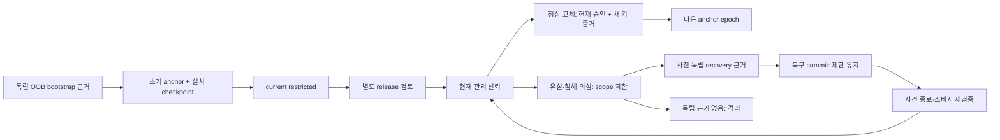

# 관리 신뢰의 최초 등록·키 교체·복구

관리 신뢰의 최초 등록·권한 변경·키 교체·분실/침해 복구와 소비자 재동기화의 논리 설계. 실제 관리자·키·복구 주체를 선정하거나 등록하지 않는다.

## 신뢰와 키의 범위

- 관리 trust anchor, 운영자/workload identity, FOTA 릴리스 키, 기기 identity, DID issuer 키, HW wallet/Cloud MPC signer를 서로 다른 용도·scope로 식별한다.
- 이 설계의 복구는 관리 신뢰만 대상으로 한다. 사용자 mnemonic/private key/share export, 신규 여행 EOA 백업 선택, 자산 sweep 권한을 추가하지 않는다.
- 승인자 수/주체·서명 suite·보호 저장소·복구 채널·키 유효기간은 D02/D05/D19의 미선택 입력이다. 참여 인원 3명을 승인 threshold로 자동 해석하지 않는다.
- 권한 상승의 요청자와 승인자는 분리한다는 기존 TrustChangeRequest 조건을 유지한다. alias 계정/같은 통제 주체를 독립 승인 수로 중복 계산하지 않는다.
- 새 권한·root·manifest는 자기 자신의 관리 신뢰 근거가 될 수 없다. 현재 등록된 관리 신뢰 또는 사전 설정된 독립 bootstrap/recovery 근거가 필요하다.
- TMC 연산은 보호된 운영 service command 후보이며 공개 registry 관리 API를 새로 등록하지 않는다. PRC rollout API와 별도의 trust lifecycle이다.

| 용도 | 역할 | 부여하지 않는 권한 |
|---|---|---|
| KD-01 · management_anchor | 관리 신뢰 버전·허용 관리 주체를 검증 | 사용자 지갑 서명·복구·자산 이동 |
| KD-02 · operator_and_workload | 현재 scope의 관리 명령·worker 업무 | 자기 권한 상승·다른 workload 가장 |
| KD-03 · firmware_release | 선정 이미지/릴리스의 무결성·발행 권한 | profile activation 또는 trust root 교체 |
| KD-04 · device_identity | own peer/boot/session의 기기 증거 | 관리 정책 승인·사용자 자금 서명 자동 허용 |
| KD-05 · credential_issuer | 등록 자격 profile의 발급/상태 검증 | 관리자 등록·다른 issuer 자격 철회 |
| KD-06 · wallet_signer | 별도 사용자 승인/복구 계약의 HW·MPC 자금 서명 | 관리 trust 복구 요청만으로 export/서명 |

## 최초 등록·정상 교체·복구의 분리

교체 준비 상태는 기존 anchor의 활성 상태와 별개다. 대기 교체의 승인만 만료됐고 기존 신뢰가 유효하면 원 상태를 유지한다. 반면 침해·복구 실패는 제한을 유지한다.

## 최초 관리 신뢰 등록

1. 선정된 보호 배포 경로로 초기 public anchor fingerprint·environment·deployment identity·scope·policy digest·승인 evidence를 전달한다. 같은 서버가 제공한 fingerprint만 다시 읽어 일치시키는 것을 독립 확인으로 간주하지 않는다.
2. bootstrap 허용 여부는 외부/보호 설치 기록·현재 최고 epoch·virgin 상태를 함께 검사한다. DB가 비었거나 backup에서 복구됐다는 이유만으로 최초 등록을 다시 허용하지 않는다.
3. 초기 승인자는 아직 등록되지 않은 새 root에 의존하지 않는 사전 bootstrap policy로 식별한다. quorum·독립 통제·정확한 bundle digest·유효기간·일회성 challenge 조건을 충족해야 한다.
4. 새 관리 키는 선정 방식의 proof-of-possession을 제출한다. PoP는 키 통제를 확인할 뿐 관리자 승격 권한을 만들지 않는다.
5. bootstrap ticket 소비 + 초기 AnchorVersion + TrustPrincipal/GrantRevision + 설치/epoch checkpoint + audit/outcome을 지정 원자 경계로 commit한다. 별도 저장 장치와의 원자성이 미입증이면 중간 상태는 격리하고 재검증한다.
6. 응답 유실은 원 bootstrap request/ticket의 결과 조회로 복구한다. 같은 request/digest에 대해 초기 관리자 추가 생성이나 epoch 재설정을 하지 않는다.
7. 설치 흔적/epoch가 모순되거나 신뢰된 virgin 근거가 없으면 신규 관리 동작을 보류한다. 물리 버튼·소셜 로그인·SQL 수정만으로 bootstrap을 대체하지 않는다.

## 정상 키 교체

- 일반 운영자/workload 키 교체는 기존 등록 principal·현재 승인권·purpose·scope·새 키 PoP·expected grant revision에 결합한다. 동일 주소/subject라는 주장만으로 키 통제권을 바꾸지 않는다.
- scope/role/purpose가 커지는 교체는 별도의 권한 상승으로 분류하고 독립 승인한다. key rotation 이벤트에 권한 상승을 숨기지 않는다.
- 관리 anchor의 정상 교체는 현재 신뢰 기준의 승인과 새 anchor의 키 통제 증거를 같은 immutable change digest에 묶는 안이다. quorum 수와 suite는 미선택이며 단순히 두 서명이 있으면 충분하다고 판정하지 않는다.
- anchor epoch는 선택된 연속성 규칙대로 다음 버전으로 이동한다. 소비자는 마지막 신뢰 checkpoint부터 각 교체 연결을 검증한다. 중간 연결이나 recovery checkpoint가 없으면 최신 root 문자열을 믿지 않는다.
- 준비된 새 키는 current가 되기 전 관리 명령을 실행하지 않는다. commit 시 anchor/grant head·approval validity·fence·restore assessment·감사 저장을 재검사한다.
- 교체 시 old key를 신규 명령용 active로 계속 인정할지/얼마나 overlap할지는 명시 profile에만 따른다. 미선택 overlap은 두 키 자동 동시 허용을 뜻하지 않는다.
- old key/public metadata는 과거 증거 검증용으로 보존할 수 있으나, 현재 권한으로 재사용하지 않는다. 침해된 키로 과거 서명이 검증된다는 사실만으로 그 기록의 사실성/시점을 입증하지 않는다.

참고: [The Update Framework Specification](https://theupdateframework.github.io/specification/latest/#update-the-root-role) — TUF는 별도 경로로 받은 신뢰 root에서 출발하며 root 갱신에 이전/새 root의 승인과 연속 버전 검증을 요구한다. 관리 anchor 정상 교체의 연속성·이전 신뢰와 새 키 증거 분리에 참고했다. 본 설계의 recovery authority·업무 권한·복구 절차는 별도 제안이다. TUF 전체 채택/호환·최초 신뢰 문제의 자동 해결·NU 기기 지원·root 전체 침해 복구 보장을 주장하지 않는다.

## 유실·침해 후 복구

1. 유실과 침해 의심은 별도 사건으로 기록한다. 침해 의심 범위의 신규 mutation/signing 권한은 현재 제한 권한으로 먼저 차단하며 원 기록·외부 노출을 보존한다.
2. 원 관리 경로의 승인 능력이 사라졌다면 정상 rotation으로 위장하지 않는다. 신뢰 붕괴 전에 별도로 고정한 recovery authority·scope·one-time case·독립 승인 근거가 있는지 확인한다.
3. 사전 복구 근거가 없거나 그것까지 침해됐으면 원격 self-service recovery를 거절하고 해당 기능을 격리한다. 재프로비저닝은 별도 out-of-band 신뢰 확립과 원 데이터/자산 경계 검토 없이는 수행하지 않는다.
4. recovery request는 current environment/incident/anchor checkpoint·정확한 새 key/purpose/scope·서명/PoP·challenge·승인 집합·expected revision을 고정한다. 타 환경의 recovery ticket이나 social-login 재인증을 대신 쓰지 않는다.
5. 복구 commit은 current authentic checkpoint/restore 검토와 case 단회 소비, 새 anchor/grant version, 관련 old key 권한 차단, 감사/outcome을 묶는다. 기존 security fence는 낮추지 않는다.
6. 복구 성공 후 recovered_restricted 상태로 둔다. 새 관리 키의 등록 성공만으로 PRC activation, worker 실행, 지급 서명, 기기 재대여가 자동 재개되지 않는다.
7. 현재 별도 재개 권한·사건 종료 근거·consumer 적용/호환/준비 확인으로 명시 action만 단계적으로 재개한다. 과거 grant를 통째로 복원하거나 실패한 요청을 전부 재실행하지 않는다.
8. 이미 외부에 제공된 signed transaction/정보는 관리 키 철회로 회수되지 않는다. 원 operation observation과 제한된 현재 read projection을 유지한다.
9. 현재 root 또는 같은 검증 경계 전체가 침해되면 정상 서명 연속성만으로 복구 정당성을 보장할 수 없다. 사전 독립 recovery checkpoint/채널의 보존·진위도 확인해야 하며 실패 시 격리한다.

## 소비자·오프라인·저장소 복구

- 서버·앱·기기는 자기 environment/deployment와 key purpose에 맞는 anchor/checkpoint를 가진다. 서명 검증 keyId는 policy와 동일 purpose에 바인딩하며 다른 키 유형으로 알고리즘을 자동 교체하지 않는다.
- 연결되지 않은 소비자는 철회를 즉시 알 수 없다. cache/lease/clock을 검증할 수 없거나 허용 최신성 밖이면 새 민감 행위를 보류하고 원 결과 조회도 현재 reader 권한 범위에서 처리한다.
- 새 anchor 적용 보고는 own peer/boot/checkpoint/report digest에 결합한다. 기존 준비/적용 ACK를 새 신뢰 버전용으로 재사용하지 않는다.
- trust head/권한 revision 변경은 관련 PRC readiness와 신규 mutation admission을 재평가하게 한다. 기존 rollout의 profileSetDigest가 같아도 stale trust evidence로 신규 commit하지 않는다.
- 원 요청의 operationClass/profile/digest/epoch를 보존하며 결과 조회는 현재 원천·읽기권으로 투영한다. old credential metadata를 보존하는 일과 old grant 활성 유지가 다르다.
- DB restore가 grant/epoch/fence의 rollback을 만들 수 있다. 보호 checkpoint 또는 독립 검증 가능한 최신성 근거와 대조할 수 없으면 복구된 저장소를 current로 선언하지 않는다.
- anti-rollback 기록을 같은 롤백 가능한 DB에만 복제한 것을 독립 보호라고 주장하지 않는다. 보드/보호 저장/profile 검증은 아직 없다.

## 논리 기록

| ID | 기록 | 키 | 내용 |
|---|---|---|---|
| TR-01 | BootstrapEvidence | environment+deployment+bootstrapTicketId | OOB anchor fingerprint·policy digest·승인 주체/독립성·virgin/install evidence·expiry·consumption/outcome |
| TR-02 | TrustAnchorVersion | environment+deployment+anchorEpoch | public key/purpose set·previous digest·policy digest·rotation/recovery linkage·proofRefs·validity |
| TR-03 | ManagementKeyBinding | principal+purpose+keyVersion | public key identifier·PoP/challenge·issuer/anchor version·current grant scope·key state·compromise incident |
| TR-04 | TrustApprovalEvidence | changeId+immutableDigest+approverIdentity | current approval entitlement·distinct controller evidence·scope·expiry·expected anchor/grant/fence revisions |
| TR-05 | TrustRecoveryCase | environment+recoveryPolicyId+caseId | precommitted recovery anchor·incident·requested scope/key digest·challenge·approvals·single-use consumption·outcome |
| TR-06 | ConsumerTrustCheckpoint | environment+peerBinding+bootEpoch | last trusted anchor/digest·max observed epoch·profile·durability/protection evidence·apply report |
| TR-07 | TrustRestoreAssessment | environment+restoreAttemptId | backup identity·protected/external checkpoint·grant/fence replay evidence·unresolved sources·restriction decision |

기존 TrustPrincipal·TrustGrantRevision·TrustChangeRequest와 연결할 추가 논리 기록이다. SQL 테이블·기기 보호 저장소를 구현하거나 검증한 것으로 보지 않는다.

## 반드시 유지할 조건

- **TI-01**: 초기 신뢰는 대상 bundle 밖에서 확인한다. 빈 DB/자기 서명/new root PoP만으로 bootstrap하지 않는다. (TR-01, TR-02)
- **TI-02**: 권한 상승 요청자·승인자와 승인 key/control identity를 중복 계산하지 않으며 quorum을 단순 서명 개수로 대체하지 않는다. (TR-04)
- **TI-03**: 승인한 exact digest/scope/expected revisions와 commit 값이 동일해야 한다. 변경된 본문은 재승인 대상이다. (TR-04, TR-02)
- **TI-04**: 새 키 PoP와 키를 관리자 권한에 연결할 권한은 별도이다. 목적·scope가 바뀌면 단순 키 교체로 처리하지 않는다. (TR-03)
- **TI-05**: 이전 root의 권한·새 root의 증거·연속 epoch를 모두 확인한 정상 교체와 독립 recovery path를 혼용하지 않는다. (TR-02, TR-05)
- **TI-06**: 현재 grant/fence/anchor/approval expiry가 과거 승인 snapshot보다 우선한다. 결과 재조회가 revoked grant를 복구하지 않는다. (TR-02, TR-04)
- **TI-07**: bootstrap ticket/recovery case는 단회 commit한다. 결과 불명·cache 만료·다른 relay를 재사용 허가로 보지 않는다. (TR-01, TR-05)
- **TI-08**: 복구 후 기본 상태는 제한 유지이며 이전 fence/epoch를 낮추지 않는다. 기능 재개는 별도 현재 근거가 필요하다. (TR-05, TR-06)
- **TI-09**: rollback된 DB/기기 snapshot의 epoch·grant를 current로 추정하지 않는다. 독립 checkpoint 검증 불가 시 새 민감 동작은 격리한다. (TR-06, TR-07)
- **TI-10**: 관리 키 침해·복구가 사용자 signer/backup/asset 권한을 생성하지 않는다. 원 거래 관측은 현재 업무 권한으로 별도 유지한다. (TR-03, TR-05)

## 보호된 운영 명령 후보

등록된 공개 HTTP/BLE 명령이 아니다. 실제 관리 채널과 키 보관 방식은 선정 전이다.

### TMC-01 · bootstrap.commit

- 현재 권한: 사전 OOB bootstrap policy의 독립 승인 집합
- 조건: 환경·deployment·virgin/install 근거·anchor bundle·ticket·PoP·승인·audit/outcome을 묶고 단회 commit
- 기록: TR-01, TR-02, TR-03, TR-04

### TMC-02 · principal.change

- 현재 권한: 현재 명시된 grant-change 관리 권한+권한 상승의 독립 승인
- 조건: request/review/activate 단계 구분. key binding·scope diff·현재 grant revision; signer PoP만으로 권한 부여 금지
- 기록: TR-03, TR-04

### TMC-03 · anchor.rotate

- 현재 권한: 현재 anchor policy의 승인+새 anchor key 증거
- 조건: 정상 연속 epoch+현재 승인권+immutable digest. 실패/키 유실 시 TMC06 우회 승인 금지
- 기록: TR-02, TR-03, TR-04, TR-06

### TMC-04 · trust.restrict

- 현재 권한: 현재 scope의 명시된 제한/철회 권한
- 조건: 권한 축소만. 관련 PRC-07 fence/등록 상태와 연결하며 재개 권한을 포함하지 않음
- 기록: TR-03, TR-07

### TMC-05 · recovery.prepare

- 현재 권한: 사전 설정된 recovery authority의 요청/증거 제출 권한
- 조건: 원 incident·case·anchor checkpoint·scope/key digest·challenge 고정; 새 root 활성화 아님
- 기록: TR-05, TR-07

### TMC-06 · recovery.commit

- 현재 권한: precommitted recovery policy의 현재 유효한 독립 승인 집합
- 조건: case 단회 소비·새 trust head·old authority 차단·현재 fence 보존·audit/outcome. recovered_restricted 유지
- 기록: TR-02, TR-03, TR-04, TR-05, TR-07

### TMC-07 · trust.resume

- 현재 권한: 현재 별도의 제한 해제/재개 권한+bootstrap release 또는 incident closure 검토
- 조건: 같은 bootstrap/recovery digest 승인만 재사용하지 않음. 최초 등록은 bootstrap release 검토, 사건 복구는 incident closure를 요구하고 현재 consumer/readiness/호환·fence revision별 명시 action만 재개
- 기록: TR-04, TR-05, TR-06, TR-07

### TMC-08 · trust.result

- 현재 권한: 현재 observer 또는 exact original-request scoped recovery read proof
- 조건: 원 outcome과 현재 trust/fence/consumer 상태를 분리한 projection. 활성화/새 grant 발급 없음
- 기록: TR-01, TR-02, TR-03, TR-04, TR-05, TR-06, TR-07

## 상태 전이

| ID | 전이 | 조건 | 연산 |
|---|---|---|---|
| TT-01 | uninitialized → current_restricted | 신뢰된 bootstrap commit | TMC-01 |
| TT-02 | current → rotation_prepared | 정상 교체 증거 준비; active trust는 원 head 유지 | TMC-03 |
| TT-03 | rotation_prepared → current | 현재 조건 재검사 후 다음 anchor epoch commit | TMC-03 |
| TT-04 | any_initialized → restricted | 침해 의심·명시 scope 제한 | TMC-04 |
| TT-05 | restricted → recovery_prepared | 사전 독립 복구 근거로 원 case 준비 | TMC-05 |
| TT-06 | recovery_prepared → recovered_restricted | 현재 recovery 승인·단회 case commit; 자동 resume 없음 | TMC-06 |
| TT-07 | current_restricted / recovered_restricted / restricted → current | 별도 현재 재개 근거와 consumer 준비 충족 | TMC-07 |
| TT-08 | any → same | 원 결과 조회·응답 유실 복구 | TMC-08 |
| TT-09 | rotation_prepared → current | 대기 교체 승인만 만료/철회되고 원 head/권한은 여전히 유효: pending change를 hold/abort, 원 current 유지 | TMC-03 |
| TT-10 | any_initialized → quarantined | restore/epoch 증거 모순 또는 현재성 불명 | TMC-04 |
| TT-11 | recovery_prepared → restricted | 복구 증거 만료/승인 상실: 원 제한 유지, 자동 정상화 없음 | TMC-06 |

원 요청의 pending/committed/unknown outcome과 현재 trust admission·개별 key 상태는 별도 축이다. 응답 유실 때문에 anchor를 되돌리거나 원 case를 재소비하지 않는다.

## 원자성·중복 요청

- 검증된 서명 evidence는 exact digest와 verifier/profile version에 결합한다. commit 시 current anchor/grant/fence/approval/ticket/restore revision을 재검증한다.
- 변경 request identity는 environment+trusted requester scope+command+parent+requestId이다. 같은 identity의 다른 digest는 충돌, 같은 digest는 현재 읽기/변경 권한으로 원 outcome만 반환한다.
- bootstrap ticket/recovery case/approval challenge 단회 소비와 key/grant/anchor 전이는 같은 지정 논리 경계다. 외부 HSM·protected storage·DB 전체의 원자성을 가정하지 않는다.
- 외부 store commit이 불명하면 unknown outcome을 원 case에 연결하고 새 case/key를 만들어 우회하지 않는다. public trust 상태와 private key 생성/보관의 수명은 별도 원천으로 대사한다.
- 변경에 필요한 audit 기록이 남지 않으면 새 trust/grant 활성화를 완료 처리하지 않는다. 단, 로컬 긴급 잠금은 audit 서비스 장애 때문에 풀리지 않으며 durable 전달/기록 불명 상태로 따로 추적한다.

## 기존 관리 연산과의 연결

- **TM-01** (PCP-01, PCP-03): 기존 current trust가 author/activator 권한을 판정한다. target profile 안의 새 root/role을 현재 authority로 읽지 않는다.
- **TM-02** (PCP-02, PCP-05): peer identity 키 교체 후 own binding/boot/challenge를 재검증. 예전 device 보고가 새 identity의 준비/적용을 대신하지 않는다.
- **TM-03** (PCP-04): 원 request/result 조회도 현재 observer scope로 투영; 침해된 관리자 토큰에 과거 protected response를 재전달하지 않는다.
- **TM-04** (PCP-06, PCP-07): abort/restrict는 현재 scope의 축소 행위. trust.resume 권한으로 확대하거나 commit된 rollout을 없애지 않는다.

## 화면 표시

| 상태 | 문구 후보 |
|---|---|
| bootstrap_unverified | 초기 관리 신뢰를 확인하지 못해 설정 변경을 보류했어요. |
| rotation_pending | 새 키를 준비했습니다. 적용 확인 전에는 기존 허용 범위만 사용할 수 있어요. |
| recovered_restricted | 관리 키 복구를 확인했습니다. 기능 재개는 별도 확인이 필요해요. |
| trust_quarantined | 신뢰 정보를 확인할 수 없어 해당 기능을 제한했어요. 확인 가능한 원 기록은 보존합니다. |

공개 필드: requestRef, trustChangeKind, originalOutcome, currentAnchorEpoch, currentGrantRevision, securityRestriction, ownConsumerSyncState, safeNextAction

복구 secret/private key·share·다른 관리자의 credential·불필요한 fingerprint 목록은 반환하지 않는다. 일반 사용자에게 승인자 토폴로지와 사건 상세를 노출하지 않는다.

## 아직 선택할 입력

| ID | 선택 내용 | 기존 선택 필드 |
|---|---|---|
| TP-01 | bootstrap의 out-of-band 신뢰 출처·초기 승인자 독립 통제·설치 evidence 형식 | PF-D02-02, PF-D19-04 |
| TP-02 | 관리 key purpose별 suite·keyId·PoP/challenge·정규화·승인 수/독립성 규칙 | PF-D02-02, PF-D19-04 |
| TP-03 | anchor/checkpoint/boot counter·최대 관측 epoch의 보호 저장과 restore 판정 경로 | PF-D05-01, PF-D05-02, PF-D19-04 |
| TP-04 | 사전 recovery authority·독립 복구 증거·비밀 보관/분실·격리 절차 | PF-D19-02, PF-D19-04 |
| TP-05 | 관리 key/grant 유효시간·rotation overlap·cache/lease·철회 전달 한계 | PF-D02-04, PF-D19-04 |
| TP-06 | 감사·사건 기록 보존, DB restore 검증과 현재 fence/grant 복원 기준 | PF-D19-02, PF-D19-03, PF-D19-04 |

모든 selection은 null이다. 독립 승인·복구 정책은 설계 후보이며 실제 관리자 배정이나 approval threshold를 확정하지 않았다.

## 검증과 다음 단계

유한 설계 예제로 자기 신뢰 등록·중복 승인·본문 변경·stale 권한·복구 replay·fence rollback·기기 checkpoint 불일치를 검사한다. 실제 암호 서명, HSM/기기 보호 저장, 외부 recovery 채널, 운영자 신원이나 분산 commit을 검증한 결과는 아니다.

[검증 기록](management-trust-validation.json) · [구조화 설계](management-trust-lifecycle.json) · [관리 연산 매핑](profile-control-adoption-map.md) · [기존 신뢰 registry 설계](security-integration-design.md)

bootstrap/rotation/recovery의 증거 객체에 필수 binding·발급/검증 책임·만료/단회 사용/보존·불명 결과 처리의 구체 명세를 붙인다.
