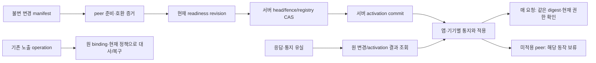

# 설정 적용·부분 갱신·중단·복구 계약

선택된 설정과 계약 묶음의 준비·부분 적용·활성화·중단·복구를 위한 논리 설계. 현재 선택값·배포·API 등록·활성화는 수행하지 않는다.

## 핵심 경계

- 계약 채택은 API/BLE/schema/ACL/reader/storage 문서를 함께 고정하는 설계 행위이며 제품 배포와 다르다.
- 미선택 값은 manifest로 옮겨 적어도 활성화할 수 없다. 필요한 action slice의 선택 기록·호환·runtime evidence가 별도로 필요하다.
- 중앙 activation CAS는 서버의 단일 원자 경계이다. 앱·기기·외부 공급자·체인 전체의 동시 원자 변경을 보장하지 않는다.
- 기존 DI-01~08와 OC-01~26을 대체하지 않는다. 아래 PRC 별칭은 관리용 논리 연산이며 HTTP 경로·API 번호·BLE 명령이 등록된 것이 아니다.
- 작업/담당자/공수는 추가 배정하지 않는다. 기존 BASE-03/05·HW-07·OTA-04·RELEASE/VERIFY 작업의 설계 입력이다.

## 준비와 활성화의 차이

관리 화면의 준비 완료, 서버 활성화 완료, 기기 적용 완료, 특정 사용자 행위 허용은 서로 다른 상태다. 상태 한 개를 enabled=true로 합치지 않는다.

## 채택 manifest

| 영역 | 고정할 내용 |
|---|---|
| identity | changeId, changeRequestDigest, environmentId, scopeSelector, profileSetDigest, contractBundleDigest, cohortPlanRevision |
| contractBundle | API/BLE schema digests, ACL + operationClass + typed reader/dispatch digests, screen behavior and recovery mapping digest, logical storage + migration compatibility plan digest, compatible producer/consumer version matrix digest, DI/OC adoption dispositions + immutable baseline checkpoint |
| selection | decisionRecordRefs, selectedFieldRefs, actionVariants, crossConstraintEvidenceRefs, runtimeCapabilityEvidenceRefs |
| activation | expectedHeadRevision, expectedSecurityFenceRevision, expectedReadinessRevision, activationPolicyRef, activationRequestId, notBefore, expiresAt, expectedPeerRegistryRevision |
| cohort | requiredConsumerRoles, authenticatedPeerBindings, peerIncarnationEvidencePolicyRef, requiredCapabilities, optionalObserverRoles, readerRetentionRules |

정규화·서명·신뢰 root 형식은 D02/D05/D19 profile 선정 뒤 고정. 텍스트 SHA 일치만으로 발행 권한·기기 attestation을 증명하지 않는다.

비밀 값·seed·key share·복구 암호를 넣지 않는다. public identifier도 현재 관리/조회 권한 범위에 따라 투영한다.

## 저장할 논리 기록

| ID | 기록 | 논리 키 |
|---|---|---|
| PR-01 | ImmutableChangeManifest | environmentId + changeId |
| PR-02 | PreparationEvidence | changeId + peerBinding + bootEpoch + challengeId |
| PR-03 | ReadinessSnapshot | scopeSelector + cohortPlanRevision + readinessRevision |
| PR-04 | ActivationRecord | scopeSelector + monotonicallyIncreasingHeadRevision |
| PR-05 | ParticipantAppliedReport | activationRecordRef + peerBinding + bootEpoch |
| PR-06 | OriginalOperationBinding | environmentId + operationClass + operationId |
| PR-07 | ScopedSecurityFence | scope + monotonicallyIncreasingFenceRevision |

### PR-01 · ImmutableChangeManifest

같은 idempotency scope에서 다른 requestDigest는 충돌; 본문 변경은 새 changeId/version

필드: requestDigest, profileSetDigest, contractBundleDigest, scopeSelector, cohortPlanRevision, sourceCheckpointRef

### PR-02 · PreparationEvidence

ACK는 설치·검증 준비를 보고할 뿐 활성화/서명 권한을 부여하지 않음. 앱 보고와 하드웨어 attestation 보증 수준을 구분

필드: manifestDigest, capabilityDigest, actionVariants, evidenceRevision, issuedAt, expiresAt, authenticationProofRef

### PR-03 · ReadinessSnapshot

필수 peer 변경·reboot·증거 만료/철회는 readiness를 새 revision으로 재평가. 과거 ready를 sticky flag로 재사용하지 않음

필드: requiredPeerEvidenceRefs, missingOrRejectedPeers, evaluatedFenceRevision, expiresAt, peerRegistryRevision

### PR-04 · ActivationRecord

현재 authority/head/fence/readiness CAS와 activation record/outbox를 한 지정 저장 경계에서 commit

필드: changeId, profileSetDigest, contractBundleDigest, cohortPlanRevision, readinessRevision, fenceRevision, effectiveTime, originalActivationRequestId, peerRegistryRevision

### PR-05 · ParticipantAppliedReport

실제 수신·적용 보고. 서버 head commit과 별개이며 미보고 peer는 적용 완료로 집계하지 않음

필드: localProfileDigest, capabilityDigest, reportRevision, observedAt

### PR-06 · OriginalOperationBinding

head 변경 후에도 원 binding을 보존; 재조회가 새 서명·nonce·지급·생성으로 바뀌지 않음

필드: originalProfileSetDigest, activationHeadAtCreation, canonicalRequestDigest, peerContext, exposureRef, typedRecoveryReaderRef

### PR-07 · ScopedSecurityFence

일반 profile retired와 보안 철회를 분리. 완화는 별도 현재 권한/근거; rollback으로 fence revision을 내리지 않음

필드: reason, affectedActionModes, issuerAuthorityRef, effectiveAt, releaseConditions

실제 테이블·DDL·인덱스·저장 엔진은 이 문서에서 적용하지 않는다. 아래 CAS/원자성은 구현에서 입증해야 하는 요구사항이다.

## 필수 참여자와 준비 증거

- cohort는 전 기기 목록이 아니라 선택된 환경/매장/행위의 필요한 producer·verifier·writer 조합이다. 무관한 offline 단말을 필수 peer로 포함하지 않는다.
- 필수 역할 누락·상충 digest·만료/실패 ACK를 optional 성공 수로 대체하지 않는다. 다수결로 활성화하지 않는다.
- cohort plan과 manifest는 불변이다. 필수 peer identity/role/scope를 바꾸면 새 plan revision을 담은 새 changeId로 준비한다. 같은 peer의 reboot는 원 plan의 incarnation 정책 안에서 새 boot challenge/증거와 readiness revision을 요구한다.
- 동일 역할의 교체 peer는 새 binding/boot epoch로 등록·준비·적용 확인을 한다. 기존 peer의 ACK를 상속하지 않는다.
- 현재 활성 cohort에 새 peer가 합류해도 그 peer의 증거가 없으면 새 peer의 해당 행위만 보류한다. 기존 peer의 유효성은 별도 평가한다.
- 활성화 후 필수 backend capability가 상실되면 해당 capability에 의존하는 신규 동작을 제한하고 원 작업 관측·조회는 가능한 신뢰 경로로 보존한다.
- 기기 ACK의 최신 boot 여부를 서버가 항상 즉시 알 수 있다고 가정하지 않는다. 세션/lease와 행위 직전 handshake로 재확인하고 관측 불능 구간을 숨기지 않는다.

## 활성화 조건

1. 현재 change scope의 활성화 권한
2. 원 manifest와 모든 digest 검증 및 해당 action slice 선택값 완전성
3. 선정 계약·producer/consumer 호환 및 각 mode의 실제 capability 근거
4. 필수 peer/역할·boot/session·challenge·기한이 현재 cohort plan과 일치; registry의 현재 peer identity/incarnation revision도 원자 검증한다.
5. 현재 security fence가 해당 신규 동작을 허용
6. expected head/fence/readiness/cohort revision이 commit 직전 동일
7. activation request의 idempotency digest 일치; 동일 원 결과는 새 head를 만들지 않음

peer 재등록/boot 관측 갱신과 활성화가 경합하면 registry revision 검증을 activation CAS와 같은 검증 경계에 둔다. 외부 registry라면 동일성이 입증된 lease/barrier profile이 없을 때 활성화 보류. 원격 기기의 관측되지 않은 재부팅까지 즉시 탐지한다고 주장하지 않는다.

## 부분 적용과 요청 수락

- **serverCommit**: 서버 head가 바뀐 사실만 commit으로 기록한다. allParticipantsApplied 표시는 해당 필수 적용 보고가 모였을 때 별도 집계하며 실제 동시 적용을 뜻하지 않는다.
- **clientGate**: 앱/기기는 activation receipt의 원 digest·scope·generation을 검증한 후 로컬 값을 적용한다. receipt는 사용자 결제/서명 권한 자체가 아니다.
- **operationGate**: 신규 effect는 해당 경로에 참여하는 peers의 profileSetDigest·contractBundleDigest·scope·action variant와 현재 head/fence를 비교한다. 최신이라는 문자열이나 일부 필드 일치로 통과하지 않는다.
- **onlineCutover**: online_coordinated 모드는 검증 가능한 현재 authority/lease 및 원 context binding 없으면 새 효과를 보류한다. 서버가 검증 전에 기기가 서명할 수 있는 구현이라면 즉시 차단 보장을 주장하지 않는다.
- **oldRequests**: 늦은 old-head 요청은 새 effect로 수락하지 않는다. 이미 노출된 원 operation이면 PR-06과 현재 continuation policy로 조회/대사/제한 재개를 평가한다.
- **ackLost**: commit 통지/peer report 유실은 원 ActivationRecord/적용 digest 재조회 및 동일 report 멱등 재전송으로 복구한다. head 재활성화나 intent 새 생성으로 복구하지 않는다.

### 오프라인과 철회 한계

- **online_coordinated**: 신규 payment/signing/merchant mutation 등의 online profile 후보. 현재 head/fence를 검증할 수 있는 경로/선정 lease가 없으면 신규 효과 보류. lease를 허용하면 발급 직후 철회와 만료 사이 관측 지연이 존재한다. 즉시 철회가 필요한 action profile은 online 재확인을 요구해야 한다.
- **bounded_local**: 오프라인 패스키/로컬 녹음 등은 별도 선택한 offline policy·수명·로컬 물리/사용자 확인·허용 범위가 있을 때만 평가. 현재 오프라인 policy 미선택. 서버 철회의 즉시 적용을 보장하지 않으며 오프라인 event를 온라인 지급/영수증/원장 권한으로 승격하지 않는다.

외부 체인에 유효하게 서명·전파된 거래나 외부로 공개된 데이터는 서버의 설정 변경만으로 회수할 수 없다. 앱 내부의 새 요청 차단과 원 거래의 외부 실행 가능성을 분리해 표시한다.

## 상태와 전이

unknown은 요청 응답의 관측 상태이다. 알려진 서버 commit을 unknown으로 덮어쓰거나 이를 새 활성화 근거로 쓰지 않는다. securityState는 phase와 독립이다.

- coordinatorPhase: proposed, staging, prepared, active, aborted, rejected, superseded
- participantPhase: not_seen, prepared, applied, incompatible, expired
- requestOutcome: pending, committed, not_committed, unknown
- securityState: allowed, restricted, revoked

### PT-01 · proposed → staging

- 계기: 원 manifest 준비 시작
- 조건: 현재 authoring 권한·scope·digest·선정 action slice; 새 profile 활성화와 구분
- 효과: immutable manifest와 peer challenge 발급; old head 유지

### PT-02 · staging → prepared

- 계기: 필수 준비 증거 수집
- 조건: 모든 required peer의 현재 binding/boot/challenge/기한/기능 일치
- 효과: readiness snapshot 생성; head 미변경

### PT-03 · prepared → staging

- 계기: 준비 증거 만료·동일 peer reboot
- 조건: 원 cohort plan의 identity/role은 같으나 readiness 증거가 현재가 아님
- 효과: readiness revision 증가, stale ACK 제외; old head 유지

### PT-04 · prepared → active

- 계기: 명시 활성화 commit
- 조건: activationConditions 전체·현재 head/fence/readiness CAS
- 효과: ActivationRecord+scope head+outbox 원자 기록; consumer 적용은 별도

### PT-05 · proposed|staging|prepared → aborted

- 계기: 활성화 전 취소
- 조건: 현재 권한·원 change; commit이 안 된 사실을 현재 저장 경계에서 확인
- 효과: staging 폐기 표식; profile/원 증거와 old head 보존

### PT-06 · proposed|staging|prepared → rejected

- 계기: 호환/선택/권한 검토 거절
- 조건: 검증 가능한 거절 사유·원 revision
- 효과: 사유 기록; 부분 구성으로 자동 활성화 금지

### PT-07 · active → superseded

- 계기: 후속 변경 commit
- 조건: 후속 변경이 자신의 준비/현재 CAS를 충족
- 효과: 새 head는 증가; 이전 operation binding/reader 보존

### PT-08 · active → active

- 계기: peer 적용 보고·유실 보고 재전송
- 조건: 원 activation/peer/boot/digest·현재 scoped report 권한
- 효과: participant 상태만 멱등 갱신, head 재활성화 없음

### PT-09 · any → same

- 계기: 보안 제한/철회
- 조건: 현재 restriction authority·scope·단조 fence revision
- 효과: coordinator phase와 독립인 securityState 갱신; 영향을 받는 신규 동작 제한

### PT-10 · any → same

- 계기: 응답 유실 후 원 결과 조회
- 조건: current read/recovery proof·원 change/request identity
- 효과: 서버의 원 상태와 현재 head/보안 상태 투영; 활성화 재실행 없음

### PT-11 · aborted|rejected → same

- 계기: 늦은 준비 ACK
- 조건: 원 terminal change는 재개 불가
- 효과: 과거 관측만 보존하거나 거절; 새 변경은 새 changeId

### PT-12 · superseded → same

- 계기: 늦은 적용 보고
- 조건: old activation의 관측임을 식별
- 효과: 현재 head를 바꾸지 않고 원 peer 관측만 기록

## 관리용 논리 연산

PRC 별칭은 후보 명칭이다. 기존 110개 API/26개 OC 또는 BLE catalog에 새 경로를 등록하지 않았다. 모든 요청은 기존 공통 envelope·현재 관리 scope·canonical digest·오류/멱등 정책을 사용하도록 후속 wire 설계에 연결한다.

### PRC-01 · 변경 제안/준비 (mutation)

- 입력: requestId, idempotencyKey, manifest, expectedScopeRevision
- 결과: changeId, manifestDigest, phase, readinessRevision
- 조건: 원 idempotency+digest 충돌 검사; 준비는 활성화 아님

### PRC-02 · peer 준비 증거 제출 (mutation)

- 입력: changeId, peerBinding, bootEpoch, challengeId, manifestDigest, evidenceRef
- 결과: evidenceRef, readinessRevision, acceptedOrRejected
- 조건: 등록 peer의 인증된 보고; 같은 report 동일 결과, 다른 본문 충돌

### PRC-03 · 활성화 요청 (mutation)

- 입력: changeId, activationRequestId, expectedHeadRevision, expectedFenceRevision, expectedReadinessRevision, cohortPlanRevision, expectedPeerRegistryRevision
- 결과: activationRecordRef, headRevision, requestOutcome
- 조건: 동일 request digest 멱등; unknown은 조회로 복구; current CAS 실패는 새 head 없음

### PRC-04 · 원 변경/활성화 결과 조회 (read)

- 입력: changeId, originalRequestRef, readProofRef
- 결과: phase, originalActivationRef, currentHeadRevision, securityState, scopedParticipantSummary
- 조건: 현재 읽기권만; 과거 activation 성공을 현재 실행 허가로 제시하지 않음

### PRC-05 · peer 적용 보고 (mutation)

- 입력: activationRecordRef, peerBinding, bootEpoch, localProfileDigest, capabilityDigest, reportId
- 결과: reportStatus, localApplyState
- 조건: participant observation만; 보고 하나로 전 cohort 실행 허용하지 않음

### PRC-06 · 활성화 전 중단 (restriction)

- 입력: changeId, requestId, expectedScopeRevision
- 결과: abortedOrAlreadyCommitted, originalActivationRef
- 조건: commit과 같은 경계에서 serialize; alreadyCommitted이면 원 기록 반환, head 제거하지 않음

### PRC-07 · scope 제한/철회 (restriction)

- 입력: scope, reason, affectedActionModes, requestId, expectedFenceRevision
- 결과: fenceRevision, effectiveRestrictions
- 조건: 현재 제한 권한으로 단조 기록; 완화는 별도 review/활성화 조건 없이는 허용하지 않음

## 되돌리기와 보존

- 활성화 전 abort는 해당 staging을 중지하며 아직 현재인 old head를 덮어쓰지 않는다. 이미 commit됐을 수 있으면 먼저 원 결과 조회; timeout을 미commit으로 간주하지 않는다.
- 활성화 이후 예전 content가 필요해도 더 큰 headRevision의 새 변경으로 채택한다. 이전 head 숫자를 복원하거나 보안 fence를 낮추지 않는다.
- 현재 evidence·보안 제한·reader/저장 호환을 다시 검사한다. 취약하거나 지원이 끊긴 old profile은 이전에 성공했다는 이유로 재활성화하지 않는다.
- profile rollback은 firmware downgrade/DB destructive down migration이 아니다. 각각 FOTA/저장 migration 계약과 별도 가역성 증거가 필요하다.
- 부분 migration은 expand/compatible reader→전환→관측→별도 정리 순서를 설계한다. new writer가 쓴 데이터가 있으면 단순 역변환·삭제로 복구하지 않는다.
- reader 폐기는 잔존 operation·exposure·늦은 증거·보관/복구 참조가 해소됐다는 근거가 있어야 한다. 모르면 읽기 adapter/격리 상태를 유지하며 오래됐다는 이유만으로 지우지 않는다.
- 기존 서명된 payload·체인 전파·외부에서 공개된 정보는 rollout abort/rollback으로 회수되지 않는다. 원 노출 대사/확인 절차를 유지한다.

## 계약 채택 순서

| 단계 | 입력 | 결과 |
|---|---|---|
| AD-01 · 계약 변경표 작성 | DI01~08·OC01~26·GA 행위 분기와 실제 선택 필드 | 변경/유지/미해결을 구분한 compatibility manifest |
| AD-02 · 단일 계약 묶음 검토 | HTTP/BLE/schema/ACL/dispatch/reader/화면/저장 매핑 | 서로 같은 version/digest의 검토 가능한 checkpoint 후보 |
| AD-03 · 과거 읽기/원 실행 복구 검토 | 원 operation·key/asset/source binding·늦은 증거·정리 정책 | 폐기하지 않을 reader와 continuation 경계 |
| AD-04 · 선정 환경 증거 연결 | 필수 peer 역할·실기/native/provider capabilities·offline policy | 구현 단계에서 충족해야 할 readiness 증거 목록 |
| AD-05 · 준비와 활성화 분리 | immutable manifest·cohort plan·current CAS | staging에서는 old head 유지, 활성화는 별도 기록 |
| AD-06 · 부분 적용·원 결과 재조회 검토 | 늦은 ACK·reboot·중복 요청·오프라인·응답 유실 | 영향 action만 hold, original operation 보존 |
| AD-07 · 제한·후속 복귀·보존 종료 검토 | security fence·새 head·저장/reader 호환 | rollback 대신 검증된 후속 변경, 과거 노출/증거 보존 |

모든 단계는 미실행 계획이다. 선택된 schema·ACL·reader·저장 매핑을 함께 바꾸는 채택 변경표를 먼저 만든 뒤 실제 기준 반영 여부를 별도 기록한다.

## 화면 표시

응답 필드: changeId, coordinatorPhase, headRevision, localApplyState, readinessState, requestOutcome, affectedActionAvailability, publicReason, nextSafeAction

| 관측 상태 | 문구 후보 |
|---|---|
| prepared | 새 설정을 준비했습니다. 아직 사용 설정은 바뀌지 않았어요. |
| active_partial | 서버 설정이 변경됐습니다. 이 기기의 적용 확인이 필요해 해당 기능을 대기하고 있어요. |
| unknown | 설정 변경 결과를 확인하고 있어요. 다시 활성화하지 않고 원 요청을 조회합니다. |
| restricted | 해당 기능 사용이 제한됐습니다. 확인 가능한 기존 내역은 계속 볼 수 있어요. |

일반 사용자에게 다른 peer 목록·키 위치·운영자 권한·타 매장 정보를 반환하지 않는다. 관리 projection은 현재 scope 권한으로 제한한다.

화면 연결: U05, U06, K01, K03, O01, O02, O03, O04, D01, D02

작업 연결: BASE-03, BASE-05, HW-07, OTA-04, VERIFY-02, RELEASE-01, RELEASE-02, RELEASE-03

행위 조건 연결: GA-03, GA-05, GA-07, GA-10, GA-11, GA-19, GA-20, GA-22, GA-26, GA-27, GA-28, GA-40, GA-41, GA-49

## 남은 고정값

- 관리 신뢰 root/서명 형식
- cohort 범위·lease 수명·offline 허용 action
- 동일 scope 중첩·선정 데이터 저장 원자 경계
- 실제 native 적용/재시작·backend health/peer attestation 증거
- schema/ACL/ABI/물리 migration 채택값

## 검증과 범위

설계 판정표는 필수 peer 누락·오래된 ACK·경합·응답 유실·부분 적용·보안 철회·후속 복귀 반례를 검사한다. 실제 분산 합의·암호·기기 재부팅 탐지·DB 원자성을 실행 검증한 결과가 아니다.

[검증 기록](profile-adoption-validation.json) · [구조화 계약](profile-adoption-protocol.json) · [설정 필드](selection-profile-contract.md) · [행위별 조건](selection-action-gates.md) · [기존 통합 묶음](../planning/integration-adoption-matrix.md)

재현: `python3 content/specifications/render_profile_adoption.py --check`, `python3 content/specifications/validate_profile_adoption.py`.

다음은 각 관리 연산의 권한·오류·멱등 결과를 기존 API/BLE/저장 매핑에 연결한 채택 변경표를 작성하는 것이다. 구현과 실제 활성화는 계속 보류한다.
