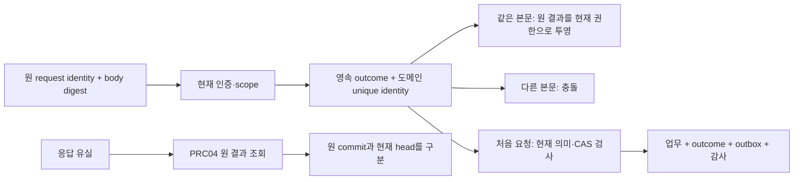

# 관리 연산의 권한·오류·중복 요청·저장 연결

PRC-01~07의 관리 권한·오류·멱등 결과·BLE relay·논리 저장 변경을 기존 설계에 연결한다. 후보 경로는 실제 카탈로그/서버/기기에 등록하지 않는다.

관리 권한을 기존 점주·펌웨어 배포·감사 조회 권한에서 자동으로 유도하지 않는다. 원 결과 조회와 새로운 변경 실행도 분리한다. 모든 경로·권한·BLE 명령은 후보이며 실제 등록은 0개다.

## 권한 경계

- TrustPrincipal·TrustGrantRevision의 현재 환경·scope·key version·유효시간·상태를 서버에서 해석한다. 요청자가 보낸 role/owner/profileId는 권한 근거가 아니다.
- profile author, activator, restriction issuer, observer, peer reporter는 별도 entitlement다. 동일 사람이 여러 권한을 가질 수 있지만 하나의 권한을 다른 권한으로 자동 확대하지 않는다.
- target manifest 안의 새 신뢰 root/권한 목록이 자기 자신의 준비/활성화 권한을 발급할 수 없다. 이미 고정된 관리 신뢰 기준 또는 별도로 수립한 bootstrap 근거로 검증한다. bootstrap 입력 미정은 실행 보류다.
- 선정되지 않은 root/SDK/physical backend에 대한 자동 승인 또는 비밀 초기 설정을 수행하지 않는다. 현재 선택값 0개를 유지한다.
- read 권한은 현재 scope의 제한 projection만 허용한다. prepare/report/activate/abort/restrict에 대한 변경 권한으로 전환되지 않는다.
- 현재 권한과 revision을 commit 직전 재검사한다. 사전 검증된 digest만 저장 lock 안에서 신뢰하고, 외부 registry이면 일관성 barrier/lease 근거가 없을 때 commit 보류다.

## 관리 권한 후보

| ID | 권한 이름 | 주체와 범위 | 허용 경계 |
|---|---|---|---|
| PCP-01 | profile_change_author | 현재 관리 principal의 environment+change scope+allowed profile kinds | 제안/준비 생성만; activation/restriction 권한 없음 |
| PCP-02 | profile_peer_prepare_report | 등록 peer 또는 명시된 증거 relay; own peer/boot/challenge/report 범위 | relay actor 인증과 원 peer 증거 인증 모두 필요; relay가 peer 권한을 소유하지 않음 |
| PCP-03 | profile_change_activate | 현재 관리 principal의 activation scope+action variant+current grant revision | author/firmware operator/store owner만으로 자동 충족되지 않음 |
| PCP-04 | profile_change_read | 현재 관리 observer 또는 exact change/request read capability | current read projection; 원 요청자의 이전 권한 snapshot만으로 허용하지 않음 |
| PCP-05 | profile_peer_apply_report | 등록 peer 또는 명시된 relay의 원 activation/own boot/own digest 범위 | 단일 peer 적용 보고만; global head/다른 peer 상태 변경 금지 |
| PCP-06 | profile_change_abort | 현재 change scope에 명시된 preactivation abort 권한 | author 권한과 같게 배정할 수 있으나 명시 grant 필요; active head 삭제 권한 없음 |
| PCP-07 | profile_scope_restrict | 현재 environment/scope/action-mode 제한 issuer | restriction을 줄이는 해제/rollback 권한을 포함하지 않음 |

## 연산별 연결

| 관리 연산 | 후보 HTTP | 권한 | 저장 경계 |
|---|---|---|---|
| PRC-01 | POST /v1/profile-rollouts | PCP-01 | TX-PC-01 |
| PRC-02 | POST /v1/profile-rollouts/{changeId}/preparations | PCP-02 | TX-PC-02 |
| PRC-03 | POST /v1/profile-rollouts/{changeId}/activations | PCP-03 | TX-PC-03 |
| PRC-04 | GET /v1/profile-rollouts/{changeId} | PCP-04 | READ-PC |
| PRC-05 | POST /v1/profile-rollouts/{changeId}/applied-reports | PCP-05 | TX-PC-05 |
| PRC-06 | POST /v1/profile-rollouts/{changeId}/abort | PCP-06 | TX-PC-06 |
| PRC-07 | POST /v1/profile-restrictions | PCP-07 | TX-PC-07 |

### PRC-01

- 입력: changeId, immutableManifest, expectedScopeRevision, requestId
- 결과: changeId, phase, manifestDigest, readinessRevision, operationRef
- 읽기: PR-01, PR-03, PCS-09
- 쓰기: PR-01, PR-03, PCS-09
- 조건: 원 manifest/changeId·author scope·선정 action slice; 준비 실패가 old head를 바꾸지 않음

### PRC-02

- 입력: peerEvidence, peerBinding, bootEpoch, challengeId, reportId
- 결과: reportOutcome, readinessRevision, ownPreparationStatus
- 읽기: PR-01, PR-02, PR-03, PCS-10
- 쓰기: PR-02, PR-03, PCS-09
- 조건: 원 peer 증거·manifest·cohort·현재 incarnation·report digest. 변경 종료 후 늦은 보고는 관측 또는 거절이며 phase 부활 금지

### PRC-03

- 입력: activationRequestId, expectedHeadRevision, expectedFenceRevision, expectedReadinessRevision, expectedPeerRegistryRevision, cohortPlanRevision
- 결과: originalActivationRef, committedHeadRevision, currentHeadRevision, requestOutcome
- 읽기: PR-01, PR-03, PR-07, PCS-08, PCS-10
- 쓰기: PR-04, PCS-08, PCS-09
- 조건: 현재 authority/head/fence/registry/readiness/cohort CAS; ActivationRecord+head+outcome+outbox+required audit 원자 기록

### PRC-04

- 입력: originalRequestRef?, readProofRef?
- 결과: phase, originalRequestOutcome, originalActivationRef?, currentHeadRevision, currentFenceRevision, scopedReadinessSummary
- 읽기: PR-01, PR-03, PR-04, PR-05, PR-07, PCS-08, PCS-09
- 쓰기: 도메인 쓰기 없음
- 조건: 현재 read projection; 과거 success를 현재 활성/적용 success로 표시 금지; 없는 결과를 activation 재실행으로 복구 금지

### PRC-05

- 입력: activationRecordRef, peerBinding, bootEpoch, localProfileDigest, capabilityDigest, reportId
- 결과: reportOutcome, ownLocalApplyState
- 읽기: PR-01, PR-04, PR-05, PCS-10
- 쓰기: PR-05, PCS-09
- 조건: own peer의 원 activation 기록을 관측; old apply 보고로 current head 복원하지 않음

### PRC-06

- 입력: requestId, expectedScopeRevision
- 결과: abortedOrAlreadyCommitted, originalActivationRef?, currentHeadRevision
- 읽기: PR-01, PR-04, PCS-08, PCS-09
- 쓰기: PR-01, PCS-09
- 조건: abort/activate를 같은 serialization boundary로 대조; 응답 timeout만으로 commit 없음 판정 금지

### PRC-07

- 입력: scope, reason, affectedActionModes, requestId, expectedFenceRevision
- 결과: fenceRevision, effectiveRestrictions, deliveryState
- 읽기: PR-07, PCS-08
- 쓰기: PR-07, PCS-09
- 조건: 현재 issuer scope에서 restriction의 합집합/강화만; fence/outcome/outbox/audit 원자 기록. 이미 서명된 거래/오프라인 peer 즉시 차단을 보장하지 않음

## 중복·권한 변경·응답 유실

- **identity**: environmentId, serverResolvedPrincipalScope, logicalOperation, parentChangeOrScope, requestId
- **digest**: canonical immutable request body digest; actor/scope는 서버에서 확정하고 normalized_digest에 원 expected revision·manifest·peer binding도 포함한다.
- **newRequest**: 최초 요청은 현재 mutation 권한과 semantic checks 후 outcome reservation/업무 commit을 같은 지정 경계로 묶는다. partial outcome만 남으면 원 operation 조회로 복구한다.
- **sameBody**: 원 요청의 논리 결과를 현재 읽기/변경 권한에 맞게 재투영한다. 이전 응답의 bearer·peer 목록·보호 payload를 그대로 replay하지 않는다.
- **differentBody**: 같은 identity + 다른 digest는 IDEMPOTENCY_CONFLICT 후보 오류. 새 requestId로 바꿔 expected revision 충돌이나 이미 노출된 원 작업을 우회하지 않는다.
- **afterPrivilegeLoss**: mutation 재요청은 현재 mutation 권한이 없으면 거절한다. 별도로 유효한 read/recovery 증명이 있으면 PRC-04로 제한 metadata만 조회 가능하다.
- **cacheExpiry**: idempotency_records.expires_at은 응답 cache 수명이지 실행 결과/중복 방지 기록의 삭제 허가가 아니다. 원 outcome/tombstone은 변경·늦은 요청·노출·복구 보존 규칙에 따라 유지한다.
- **prunedHistory**: 원 outcome 존재 여부/원 request digest를 신뢰할 수 없으면 과거 mutation을 새 요청으로 실행하지 않는다. 원 request의 제한 관측 또는 hold로 처리한다.
- **getSideEffects**: PRC-04는 domain head/phase/fence/activation/outcome을 변경하지 않는다. 보안 replay 탐지·접근 감사 metadata 기록 여부는 읽기 계약과 구분한다.
- **peerSemanticIdentity**: 전송 요청 idempotency와 별개로 preparation은 environment/change/peer/boot/challenge/reportId, applied 보고는 environment/activation/peer/boot/reportId를 도메인 unique identity로 둔다. relay가 바뀌거나 새 HTTP requestId로 재전송해도 같은 증거는 재소비하지 않고, 같은 semantic identity의 다른 digest는 충돌한다.

### 결과 투영

- **operator**: changeId, phase, originalRequestOutcome, originalActivationRef, currentHeadRevision, currentFenceRevision, permittedReadinessSummary, publicError
- **peer**: ownPeerBinding, ownBootEpoch, ownPreparationStatus, ownAppliedDigest, neededPublicAction
- **user**: featureAvailability, publicReason, safeNextAction
- **never**: private key/seed/share/backup secret, 다른 tenant/peer의 비공개 토폴로지, 원 사용자의 bearer/access token, 타 scope의 상세 권한/존재 여부
- **unknown**: 원 commit을 확인할 수 없는 상태와 commit 실패를 구분한다. originalRequestOutcome=unknown은 현재 업무 head를 바꾸는 값이 아니다.

## 기존 API에서 연결할 부분

| 기존 API | 재사용 의도 | 채택 전에 필요한 조건 |
|---|---|---|
| API-020 | 원 operation 결과 조회 골격 | profile_rollout_control whitelist/현재 observer ACL/typed reader/projection 채택 전에는 profile 결과를 반환하지 않음 |
| API-107 | 큰 보호 manifest/evidence 읽기 경로 후보 | rollout 결과의 owner/scope/retention reader를 명시 등록하기 전 generic resultRef로 접근 우회 금지 |
| API-049 | firmware release metadata 참조 | firmware_release_operator는 PCP-03 권한을 대체하지 않음 |
| API-050 | release 철회 event와 restriction 연동 후보 | 철회가 임의 profile activation rollback·device downgrade를 만들지 않음 |
| API-101 | 원 release 호환 정보 조회 | release_read는 peer 집합·management manifest 전체 조회 권한 아님 |
| API-023 | terminal identity/session 검토 입력 | store_terminal_manage는 자기 단말 준비 범위와 global activate 권한을 분리 |
| API-088 | 감사 조회 | ops_audit_read는 보이는 audit projection만; activation/abort/restrict 권한 없음 |

API-020/107이 있다는 사실만으로 관리 결과 조회가 지원되는 것은 아니다. 새로운 operationClass와 typed reader·현재 ACL·투영이 함께 채택되기 전에는 기존 경로로 우회하지 않는다.

## BLE 준비·적용·상태 후보

### PCB-01 · profile.prepare

- 기존 검토 대상: session.open, session.confirm, device.info
- 입력: changeId, manifestDigest, peerBinding, challengeId, capabilityRequirements
- 결과: ownBootEpoch, ownPreparationEvidence, evidenceLevel, expiresAt
- 조건: 검증된 기존 관리 신뢰와 인증 BLE session·own scope·선정 물리 확인. 준비만 하며 active pointer/키를 변경하지 않는다.

### PCB-02 · profile.apply

- 기존 검토 대상: session.confirm, device.settings.update, fota.status
- 입력: activationReceipt, profileSetDigest, contractBundleDigest, peerBinding, expectedLocalRevision
- 결과: ownBootEpoch, localAppliedDigest, localRevision, reportId
- 조건: 서버 activation receipt의 발행자·scope·digest·유효성·현재 gate를 검증. 일반 owner settings/update 권한을 서버 활성화 권한으로 확장하지 않는다.

### PCB-03 · profile.status

- 기존 검토 대상: session.confirm, device.info, fota.status
- 입력: originalChangeRef, ownActivationRef?, projection
- 결과: ownBootEpoch, localProfileDigest, lastApplyOutcome, publicAvailability
- 조건: own 기기의 현재 허용 projection만. 결과 조회는 새 apply/reset/sign를 실행하지 않는다.

앱이 서버에 전달하는 relay와 원 기기 증거는 별도다.

- app/키오스크의 HTTP caller 권한과 원 device evidence 인증을 따로 확인한다. relay 서명만으로 device 준비·적용을 증명하지 않는다.
- PRC-02/05는 evidence의 device identity/boot/challenge/manifest/report digest·선정 anti-replay 조건을 대조한다. 증명 수준은 앱 보고/기기 인증/attestation을 구분하며 없는 보장을 표시하지 않는다.
- 프로세스/전원 중단 후 local digest와 journal outcome을 조회한다. local pointer 원자성·flash durability·boot epoch 보호는 별도 선택·실기 검증 대상이다.
- BLE link 단절은 서버 abort/기기 rollback/체인 취소를 의미하지 않는다. 전달 실패를 원 상태 unknown으로 두고 읽기부터 복구한다.
- 신규 명령의 role/version/schema/MTU/분할/최대크기/lease/키보호 방식은 후속 profile 선정 때 고정. 기존 fota.apply/device.settings.update를 임의 overload하지 않는다.
- device evidence의 semantic identity·digest 기록과 challenge 소비/readiness 변경을 같은 논리 경계로 처리한다. HTTP caller/requestId가 달라져도 원 device report를 중복 적용하지 않는다.

## 논리 저장 매핑

| ID | 자원 | 기존 참조 후보 | 추가로 필요한 물리 계약 |
|---|---|---|
| PR-01 | ImmutableChangeManifest | protocol_profiles | immutable manifest body/digest + lifecycle metadata는 별도 row/CAS. 본문 수정 금지, lifecycle phase는 versioned metadata로 변경 가능. protocol_profiles.state(draft/enabled/revoked)를 rollout phase 전체로 재사용 금지 |
| PR-02 | PreparationEvidence | 새 매핑 필요 | peer identity/incarnation/challenge·manifest/report digest·evidence 만료·인증 수준·UNIQUE replay identity |
| PR-03 | ReadinessSnapshot | 새 매핑 필요 | cohort/readiness revision·required peer set·evaluated registry/fence revision·기한의 원자 snapshot |
| PR-04 | ActivationRecord | 새 매핑 필요 | scope별 증가하는 head와 immutable activation record·원 request outcome·outbox의 commit 경계 |
| PR-05 | ParticipantAppliedReport | 새 매핑 필요 | own peer/boot/activation binding·멱등 report·과거 적용 관측과 현재 적용 상태 분리 |
| PR-06 | OriginalOperationBinding | operations | operations.kind+reader discriminator에 profile binding을 추가하는 후보. generic succeeded는 전체 peer 적용 완료가 아님 |
| PR-07 | ScopedSecurityFence | 새 매핑 필요 | scope/action mode별 단조 fence + 현재 issuer/원 request binding; activation head와 일관성 검사 |
| PCS-08 | ProfileScopeHead | 새 매핑 필요 | scope overlap 해석·head CAS·current profile digest·grant/fence/readiness/registry 검증의 저장 경계 |
| PCS-09 | ProfileRequestOutcome | idempotency_records, operations | scope 포함 영속 요청 identity/digest·원 commit metadata/tombstone·cache expiry와 독립인 중복 방지 |
| PCS-10 | CurrentPeerIncarnation | 새 매핑 필요 | TrustPrincipal의 identity와 연결하되 별도 boot/session/registry revision·재등록·증거 freshness를 관리 |

공통 기반: operations, protocol_profiles, idempotency_records, audit_events, outbox. 이 표의 참조는 실제 컬럼·제약조건·트랜잭션 구현을 뜻하지 않는다.

- activation+scope head+request outcome+outbox+필수 감사는 같은 논리 commit; 아직 물리 SQL로 증명하지 않음
- 정규화/서명 증거 검증을 lock 밖에서 수행하더라도 authority/fence/registry/expiry/head는 commit 직전 현재 값으로 대조
- outbox 전달은 중복 가능. consumer는 eventId/aggregate revision으로 dedup하고 원 activation/current head를 확인; 메시지 수신이 activation 권한 아님
- 별도 저장소의 registry/보안 fence를 atomic하다고 가정하지 않음. 증명된 snapshot/lease/barrier가 없으면 해당 mutation hold
- 기존 61개 테이블의 존재를 새 자원 10개가 저장/검증된 근거로 사용하지 않음

## 오류와 재시도

| 오류 후보 | 판정 단계 | 재시도 처리 | 규칙 |
|---|---|---|---|
| INVALID_INPUT | envelope/digest/known discriminator | correct_request | 기본 형식 오류만, 내부 schema/비밀 값 반사 금지 |
| UNAUTHORIZED | authentication | authenticate | 인증 부재/유효하지 않은 증명; 원 bearer 재전달 금지 |
| FORBIDDEN | current authority/projection | no_automatic_retry | scope 부재·권한 철회. 존재하지 않는 객체와 보이지 않는 객체는 선택된 opaque projection으로 통일 |
| POLICY_UNSELECTED | choice check | wait_for_selection | 해당 action slice에 필요한 선택만 공개; 자동 권장값 채우기 금지 |
| UNSUPPORTED_PROFILE | schema/reader/capability | wait_for_compatible_profile | 최신 schema로 추정 parse 금지 |
| IDEMPOTENCY_CONFLICT | same request identity | do_not_change_key_to_bypass | 다른 body 또는 원 expected revisions 변경. 새 오류 별칭 후보, canonical 등록 전 |
| REVISION_CONFLICT | head/fence/registry/readiness CAS | read_current_then_review | 새 request 자동 발급/재활성화 금지 |
| AUTHORITY_HELD | current security fence | restricted_read_only_if_authorized | 과거 성공/원 author가 현재 활성 권한을 대신하지 않음 |
| SOURCE_STALE | peer/challenge/expiry | refresh_evidence | 기한 지난 ACK를 다시 제출해 현재 ready로 만들지 않음 |
| RESULT_PENDING | original commit not yet resolved | read_original | timeout/missing reply는 abort나 실패 확정 아님 |
| ALREADY_APPLIED | duplicate commit/result | read_original_and_current | 원 activation metadata와 현재 head를 구분; 전체 기기 적용 완료라는 뜻 아님 |

기본 envelope 형식→인증→현재 scope/projection→허용된 객체 해석→identity/digest→semantic/current CAS. 인증/권한 실패 시 상세 missing peer/profile/fence 값을 노출하지 않는다. 이미 적용된 요청의 확인도 현재 read/mutation 권한에 맞춘다.

## 함께 채택할 묶음

- candidate route + operationClass discriminator
- current scoped ACL + trust source
- request/response/error schema + canonical digest rules
- typed operation reader + safe projection
- logical uniqueness/CAS/outcome retention/outbox mapping
- authenticated BLE evidence relay + local journal policy
- screen retry/recovery behavior + negative examples

보존하는 기준:

- API 110개·권한 정책 60개·BLE 명령 34개는 원본 유지
- OC 후보 26개·PRC 관리 별칭 7개는 서로 다른 목록
- SQL 61개 테이블·7개 migration 미수정
- 기존 사용자 결정·owner/effort·실행 상태 미변경

아직 기준 채택 전인 이유:

- 정책·management trust profile·wire codec/limit·lease와 proof suite 미선정
- 물리 저장/registry 일관성·기기 journal/ACK 신뢰 수준 미검증
- API020/107 typed reader 및 BLE 신규 command schema 미채택

## 검증과 다음 설계

정상·권한 변경·중복/충돌·보고 relay 변경·결과 cache 만료·읽기 분리를 유한 설계 예제로 검사한다. 실제 인증/서명/DB 원자성/기기 통신 시험은 아니다.

[검증 결과](profile-control-validation.json) · [구조화 매핑](profile-control-adoption-map.json) · [부분 적용·복구 원칙](profile-adoption-protocol.md) · [행위 조건](selection-action-gates.md)

이 mapping의 요청/응답과 error projection에 정상·권한 변경·충돌·결과 불명 예제를 붙이고, 관리 신뢰 bootstrap/갱신과 물리 저장 채택 조건을 구체화한다.
