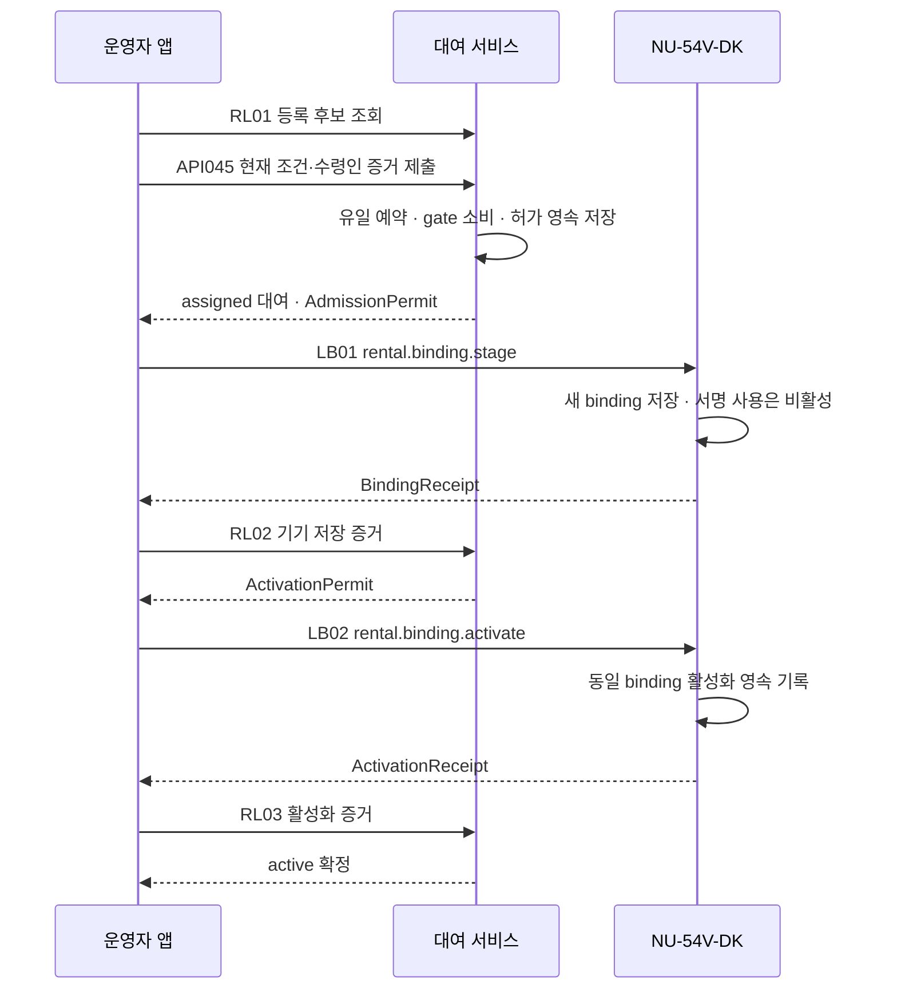
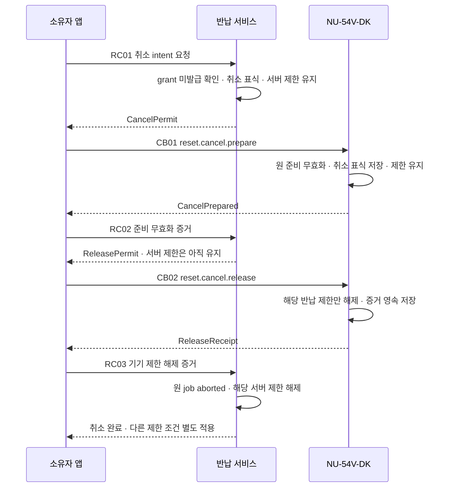

# 대여 등록과 초기화 허가 발급 전 반납 취소

작성: 2026-09-18. **설계 후보·기준 미병합·제품 구현 보류.** 기존 API045의 변경안과 미등록 HTTP 경로 8개, 미등록 BLE 메시지 쌍 4개를 정리했다. 현재 API 110개/BLE 34개/SQL 61개 테이블·7개 마이그레이션은 변경하지 않는다.

[계약·원칙·수용 사례](rental-admission-cancel.json) · [스키마](rental-admission-cancel.schema.json) · [예제](rental-admission-cancel.examples.json) · [검증기](validate_rental_admission_cancel.py)

앞선 [반납 호출 설계](return-route-contracts.md)의 RA11 재대여와 RA05 취소에 대한 후속 계약이다. 이전 문서의 ‘미설계’ 표기는 당시 상태로 보존한다. 이번 후보를 작성했다고 기존 버튼을 실행 가능으로 변경하지 않는다.

## 1. 대여 등록: 조건 조회와 실제 허가를 구분

API045는 기존의 deviceId/accountId 두 필드만으로 등록하는 계약에서, **현재 기기 조건·등록 근거·수령인 동의·등록 세션 증거를 확인하는 요청**으로 변경하는 제안이다. 요청 revision이 일치해도 권한이나 기기 증거가 없으면 등록하지 않는다.

| 등록 근거 | 서버가 확인할 내용 | 사용할 수 없는 대체 근거 |
| --- | --- | --- |
| factory_genesis | 신뢰할 수 있는 출고 신원·승인된 재고 기록·현재 미등록 보안 상태 증거·한 번도 등록되지 않은 이력 | 기록 없음, 펌웨어 재설치, epoch가 0처럼 보임 |
| returned_device | 해당 기기의 최신 반납 완료 job·정리 증거·완료 handle·nextEpoch·현재 eligible gate | 오래된 화면, 다른 기기/대여의 증거, 서버 반납 접수만 완료 |

두 경우 모두 현재 운영자에게 해당 기기/재고에 대한 권한이 있어야 한다. 수령인의 accountId를 아는 것으로 동의를 대신하지 않는다. recipientConsentRef와 enrollmentProofRef를 서버가 실제 인증된 수령인·holder 공개키·기기·등록 세션에 연결해 검증한다. 동의 발급 및 등록용 세션 bootstrap 상세는 아직 채택 선행 조건이다.

RL01 조회는 후보 snapshot을 제공한다. API045는 mutation 시점에 다시 잠금을 잡고 다음을 확인한다.

- 현재 epoch, gateRevision, bindingRevision, candidateDigest가 조회 근거와 일치
- 동일 기기에 활성 또는 대기 대여/binding이 없음
- 격리·반납·정리·기타 금지 조건 없음
- 서버에서 재조회한 genesis 또는 반납 근거가 유효
- 현재 운영자 권한, 수령인 동의, 등록 holder 증명이 유효

AdmissionContext의 expected revision은 최초 예약 근거다. 예약으로 변경된 revision과 혼동하지 않도록 reservationRevision을 별도로 기록하며, 진행 상태는 AdmissionView.revision으로 조회한다. epoch는 이 계약에서 임의로 증가시키지 않는다.

## 2. 예약 → 기기 저장 → 활성화

API045의 201은 예약 레코드 생성이다. 기기 사용 완료를 의미하지 않는다. 후보 요청의 이전 rental 응답은 새 admission 응답으로 변경되므로, 기준 채택 시 클라이언트 버전 전환이 필요하다. 오래된 두 필드 요청을 최신 등록의 우회 경로로 남기지 않는다.

등록 허가는 정확한 device/epoch/rental/binding/recipient/holder thumbprint/session에 결합한다. 기기는 서버 신뢰와 공개키 증명, 현재 미등록 상태, 등록 근거를 검증한다. 허가 파일을 가진 것만으로 등록할 수 없다. 실제 BLE 등록 세션은 상호 인증·키 전달·신선성 규칙을 포함한 선택된 profile이 필요하며, 기존 owner 세션을 임의로 격하하거나 재사용하지 않는다.

RL02는 기기가 저장한 binding 증거를 검증한 후 activation 허가를 저장한다. LB02 이후 앱 연결이 끊기면 **기기는 활성화됐지만 서버는 확인을 기다리는 상태**일 수 있다. 이때에도 예약을 유지하고 같은 증거를 다시 제출한다. 서버 승인이 필요한 서명·결제 경로는 서버 active 확인 전 사용하지 않는다. 만료/통신 실패만으로 예약을 해제하고 다른 사용자를 배정하지 않는다.

지갑 생성, 니모닉 import, passkey 등록은 이 등록 허가에 포함하지 않는다. 각 기능의 별도 권한·동의·기기 상태 조건을 따른다. 등록 실패의 운영자 강제 초기화나 예약 강제 회수는 이번 계약에 없으며, 증거가 없으면 안전하게 대기/격리한다.

## 3. 반납 취소: 원 대여 사용으로 돌아가기

취소 대상은 **초기화 실행 허가가 한 번도 발급되지 않은 checking/prepared job**이다. grantIssued가 true였으면 유효기간이 지났거나 기기가 받지 않은 것처럼 보여도 취소할 수 없다. 기기가 이미 실행 허가를 받은 저널이 있으면 역시 거절한다.

RC01과 초기화 허가 발급 RT01은 같은 기기/job/fence 잠금 경계에서 경쟁한다. RT01이 먼저 기록되면 RC01을 거절한다. RC01이 먼저 기록되면 영속 취소 표식으로 RT01 및 새 준비 문맥 발급을 차단한다. 앱의 뒤로 가기·연결 해제는 취소가 아니다.

**job당 취소 작업은 하나뿐이다.** 같은 멱등 키는 원 결과를 반환한다. 다른 멱등 키로 요청해도 새 cancelId나 허가를 만들지 않고 CANCELLATION_PENDING과 보호된 원 작업 참조를 돌려준다. 완료·격리 후에도 해당 job의 취소 표식을 교체하거나 지우지 않는다.

CancelContext는 취소 시작 시 원 job/rental/binding/epoch/fence revision에 고정한다. 취소 진행 revision과 원 문맥 revision은 별개다. 기기는 새 binding/epoch/fence에 이전 취소 허가를 적용하지 않는다.

CB01은 준비 문맥과 과거 준비 세션을 무효화하되 기기의 반납 제한을 유지한다. 준비 기록이 이미 없더라도 현재 신원/epoch와 실행 허가 미수신 이력을 긍정적으로 증명해야 한다. 기록 손실을 ‘초기화를 시작하지 않음’의 증거로 쓰지 않는다.

CB02는 같은 취소 표식·준비 무효화 증거·서명된 해제 허가에 맞는 **해당 job의 반납 제한 사유만** 해제한다. FOTA, 관리, 분실 등 다른 제한은 유지한다. ReleaseReceipt를 영속 저장하므로 응답 유실 후에도 같은 증거로 RC03을 재시도한다. 서버는 그 증거를 검증할 때까지 반납 제한을 유지한다.

RC03 완료 후 job은 aborted지만 원 대여와 binding은 유지된다. 키 삭제나 epoch 변경, 기기의 미등록 전환은 없다. 따라서 **취소된 반납은 재대여 가능 재고가 아니다.** 다시 반납하려면 새 job과 최신 점검·기기 준비가 필요하다.

## 4. HTTP·BLE 연결표

모든 이름은 논리 설계 식별자다. RL/RC/LB/CB는 미등록 후보이며 실제 서비스가 아니다. HTTP 버전은 `rental-lifecycle-v1-draft`, BLE 버전은 `rental-ble-v1-draft`다.

| ID | 메서드·경로 | 핵심 결과 |
| --- | --- | --- |
| RL01 | GET `/v1/devices/{deviceId}/rental-admission` | 권한 있는 운영자의 현재 등록 후보 |
| API045 | POST `/v1/rentals` | 단일 예약과 AdmissionPermit |
| RL02 | POST `/v1/rental-admissions/{admissionId}/binding-evidence` | 검증된 기기 저장 증거와 ActivationPermit |
| RL03 | POST `/v1/rental-admissions/{admissionId}/activation-evidence` | 서버 active 확정 |
| RL04 | GET `/v1/rental-admissions/{admissionId}` | 원 등록 진행·허가 유실 복구 |
| RC01 | POST `/v1/return-jobs/{jobId}/cancellations` | 단일 취소 intent와 CancelPermit |
| RC02 | POST `/v1/return-cancellations/{cancelId}/prepared-evidence` | ReleasePermit, 서버 제한 유지 |
| RC03 | POST `/v1/return-cancellations/{cancelId}/release-evidence` | 취소 완료와 해당 서버 제한 해제 |
| RC04 | GET `/v1/return-cancellations/{cancelId}` | 원 취소 진행·허가 유실 복구 |

| BLE ID | 명령 | 요청 → 기기 서명 증거 |
| --- | --- | --- |
| LB01 | rental.binding.stage | AdmissionPermit → BindingReceipt |
| LB02 | rental.binding.activate | ActivationPermit → ActivationReceipt |
| CB01 | reset.cancel.prepare | CancelPermit → CancelPrepared |
| CB02 | reset.cancel.release | ReleasePermit → ReleaseReceipt |

등록 조회의 수령인과 취소 조회의 운영자는 안전한 상태만 받으며 허가 필드는 null이다. 취소는 현재 원 대여 소유자 인증이 필요하고 운영자에게 자동 승계되지 않는다. 모든 재조회·멱등 결과 전달에도 현재 권한을 검사한다. GET은 새 허가나 예약을 생성하지 않는다.

서명 증거는 purpose, 고정 context, 선행 허가/증거 digest를 결합한다. 실제 byte encoding, 키 보관, 서명 알고리즘, 세션 nonce·freshness, antirollback 및 증거 보존 기간은 미선정 profile의 채택 조건이다. 스키마의 proof 필드는 그 검증을 대신하지 않는다.

## 5. 장애·경쟁 시 보존할 원칙

| 상황 | 처리 |
| --- | --- |
| 두 운영자가 같은 기기 예약 | 잠금과 활성/대기 유일성으로 하나만 성공 |
| 오래된 eligible 화면 | mutation 시 current revision/근거를 다시 확인하여 거절 |
| API045/기기 저장/활성화 응답 유실 | 같은 예약·증거·허가를 복구, 다른 소유자 배정 금지 |
| RT01과 RC01 동시 요청 | 동일 원자 경계에서 한쪽만 성공 |
| 다른 키로 RC01 중복 요청 | 같은 job의 단일 취소 작업으로 귀결 |
| 기기 제한 해제 응답 유실 | 기기 영속 ReleaseReceipt 재전달; 서버는 확인 전 제한 유지 |
| 취소 표식 손상/삭제 여부 불명 | 대기 또는 격리, timeout으로 해제하지 않음 |
| 이전 취소 허가가 새 반납/대여 후 도착 | job·binding·epoch·fence 불일치로 거절 |
| 다른 제한 사유가 남음 | 반납 제한만 제거, 일반 사용 가능으로 단정하지 않음 |
| 이전에 서명/전송 허가가 외부로 나감 | 취소/fence가 이미 노출된 권한을 취소했다고 간주하지 않음 |

반납 취소는 이전 결제나 승인 작업을 재제출하거나 되살리지 않는다. 잠금 순서는 기존 승인 저장 설계의 공통 gate 경계를 따르며 여러 서비스의 DB가 자동으로 한 트랜잭션에 참여한다고 가정하지 않는다. 구체 저장 테이블·동시성 제약·outbox 및 장애 복구 매핑은 다음 설계에서 연결한다.

## 6. 검증과 남은 설계

로컬 검증은 정상 형태 36개·거절 형태 12개, 유한 모델 사례 29개, 원본 8개 파일의 해시와 경로 연결을 확인한다. 모델은 실제 구현이 공통 잠금·영속성을 제공한다는 전제하에 규칙을 점검하며 동시성 구현 검증이나 암호 증명은 아니다. 실제 기기·서버 수용 사례 23개는 전부 not_run이다.

출고 증거와 등록 holder bootstrap, 수령인 동의 발급, 실제 기기의 보호 저장·antirollback, profile과 버전 협상, 기존 경로/화면/권한 병합은 남아 있다. RR-DEC-01 복구 정책은 미답변이며 이 설계로 결정하지 않는다. Zephyr 구현 착수나 개발환경 설치도 수행하지 않는다.

**다음 작업:** 반납·재등록·취소의 논리 저장 자원, 공통 gate 원자 경계, 장애 복구와 물리 저장 이행 매핑.
