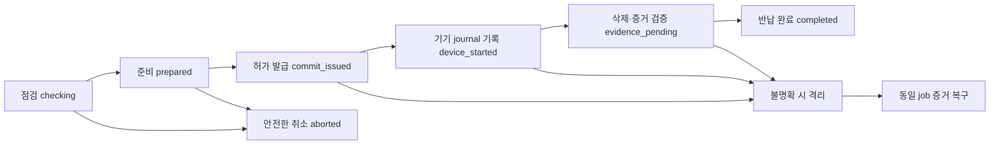

# 반납·초기화 복구와 장치 증거 설계

**상세 설계 제안, 구현 미착수.** [수명주기 설계](commerce-lifecycle-design.md)의 LC-GAP-04~05를 다룬다. NU 펌웨어는 Zephyr 기반으로 유지한다. MCU의 특정 보안 저장·단조 카운터·시계·attestation 기능이 이미 구현/검증됐다고 가정하지 않는다.

[프로토콜 경계·검토 사례 원본](return-recovery-contract.json) · [기존 IF-02/07/14](implementation-interfaces.md) · [기존 반납 DTO](critical-dtos.md)

후속 [요청·응답과 권한 계약 후보](return-protocol-contracts.md)에서 메시지 8개 묶음을 구체화했다. 기존 API/BLE 병합 전이며 복구 정책·암호 profile·실기 검증은 미확정 상태를 유지한다.

이번 후보는 기존 ResetClearance, DeviceResetEvidence, API-046/047/091, BLE device.reset.prepare/confirm을 바로 변경하지 않는다. 현재 107개 API·34개 BLE 논리 명령·61개 참조 SQL 테이블은 유지한다. 아래 새 경로는 식별용 제안이며 실제 endpoint/명령 번호가 아니다.

## 1. 먼저 구분할 세 가지 사실

1. **초기화 시작 승인:** 최신 반납 조건과 사용자 물리적 승인을 확인했다.
2. **기기 초기화 실행:** 기기가 승인된 작업을 내구 기록하고 삭제·검증을 진행했다.
3. **반납 종료:** 서버가 장치 증거를 검증하고 binding 철회·대여 종료·재대여 조건을 반영했다.

서버 승인 시각은 기기가 삭제를 시작한 시각의 증거가 아니다. 기기 서명 역시 그 펌웨어가 보고한 내용의 출처를 확인하는 수단이다. 기기 신원/부트/저장 보호가 신뢰되지 않으면 서명만으로 물리적 삭제나 외부에 키 사본이 없음을 보장할 수 없다. 증거에서 주장하는 삭제 범위는 해당 장치의 통제된 저장 영역으로 한정한다.

## 2. 서버와 기기 사이의 상태 모델

| 서버 reset job | 의미 | 다음에 허용할 동작 |
|---|---|---|
| checking | 자산·권한·기록 점검 중 | 필요한 회수/정리 후 재점검, 안전하게 반납 신청 취소 |
| prepared | 점검 snapshot과 기기 준비 증거 확보, 실행 허가 미발급 | 물리적 승인 후 온라인 commit 요청 또는 안전한 취소 |
| commit_issued | 실행 허가 발급 기록은 있으나 기기 수신/내구 기록 여부가 불명확할 수 있음 | 같은 job 조회, 조건을 만족하는 동일 grant 재전달; 신규 job·사용 재개 금지 |
| device_started | 동일 job의 내구 journal 기록과 시작 증거 검증 | 같은 job 계속 실행/복구; 새 물리 승인으로 다른 작업 생성 금지 |
| evidence_pending | 삭제 보고/재부팅 증거 수집 또는 서버 검증 대기 | 증거 재취득·재접수, 원반납 건 상태 조회 |
| completed | 증거 검증과 TX-07 완료 | 같은 완료 결과 재조회, 재대여 허가 절차 |
| aborted | 실행 허가가 발급되지 않은 단계에서만 안전하게 취소 | 기기/서버 제한 해제 동기화 후 일반 사용 |
| quarantined | 실행 여부·세대·증거·삭제 범위를 안전하게 판정할 수 없음 | 제한된 진단·동일 job 증거 복구; 일반 사용/재대여 금지 |

기존 rental.state/ReturnChecklist.state를 이 job enum으로 바꾸지 않는다. rental은 return_pending, checklist는 pending/eligible_for_reset/reset_confirmed인 동안 job의 상세 진행을 따로 가진다. 둘 중 하나만 보고 “초기화 완료”를 표시하지 않는다.

`quarantined`는 이전 사실을 삭제하는 상태가 아니다. lastKnownPhase·commitId·journalDigest·검증 실패 이유를 보존한다. 다시 증거가 확보되면 서버가 같은 job의 입증된 단계로 복구한다. completed 이후 늦은 구증거는 원래 결과 조회만 수행하며 현재 대여에 상태 전이를 적용하지 않는다.

job의 `grantIssued`는 한 번 true가 되면 되돌리지 않는다. 격리를 거쳐도 true인 job은 checking/prepared/aborted로 복귀할 수 없다. 허가 발급 전 격리된 job만 해당 준비 단계로 복구할 수 있다.

## 3. 제안 프로토콜: 준비 → 온라인 commit → journal → 증거 접수

### 3.1 점검과 기기 준비

API-046의 점검은 rental/device/binding/walletOrigin, pending 거래/환불, 자산·권한·claim 상태의 revision을 포함한다. 필수 점검을 만족하기 전에는 실행 허가를 만들지 않는다.

기기 prepare는 새 device challenge·bootNonce·sessionId·현재 deviceEpoch·eraseProfileId를 생성/표시하고, 삭제할 항목을 사용자에게 보여준다. 물리적 승인 증거는 이 준비 내용과 서버 점검 snapshot에 결합한다. recovery 준비 레코드는 비밀/원음/니모닉이 아닌 최소 참조만 보관한다.

서버 commit 직전에는 최신 binding·checklist·반납 제한 revision을 다시 검사한다. 점검 뒤 자산 회수나 권한 변경이 있었다면 예전 점검으로 진행하지 않는다. 계정 로그인과 물리적 기기 승인은 서로 대체하지 않는다.

### 3.2 초기화 승인 기한의 의미

**후보 정책:** clearance.expiresAt은 새 온라인 commit을 수락할 서버 기한으로 명시한다. 이 해석은 현재 계약에 아직 병합하지 않는다. 기기 실행 시각을 clearance 기한 안으로 증명했다고 주장하지 않는다.

commit 시 서버는 허가 발급 레코드와 반납 제한을 먼저 내구 저장한 후 grant를 내보낸다. 동일 요청에는 동일 job/commit의 결과를 제공한다. grant에는 device challenge·boot/session·deviceEpoch·eraseProfile·점검 revision이 결합된다.

기기는 grant를 받은 순간 해당 challenge가 현재 부트/세션에서 유효한지, 로컬 준비 시점부터의 짧은 상대시간 제한을 넘지 않았는지 검사한다. 폰이 준 UTC를 기기 신뢰 시계로 쓰지 않는다. 상대시간/부트 식별/재시작 처리를 실제 보드에서 검증하기 전에는 이 경로를 구현 가능으로 확정하지 않는다. 구체 허용 시간은 미선정이다.

기기가 검증된 grant와 작업 상태를 내구 journal에 기록하기 **전에는 키를 삭제하지 않는다.** journal 수락 후 전원이 끊겼다면 같은 job의 실행 재개는 최초 grant의 반복 사용으로 새 삭제를 시작하는 것이 아니다. 진행 기록에 따른 동일 삭제 작업의 복구다.

### 3.3 commit 응답 유실과 취소 금지

commit_issued에서 서버가 응답을 보냈는지, 기기가 받았는지 모르면 pending을 유지한다. 서버 timeout만으로 grant를 취소하고 일반 사용을 재개하면 지연 도착한 grant가 뒤늦게 삭제를 실행할 수 있다.

- 같은 boot/session/challenge가 유효하고 기기에 accepted journal이 없으면 **동일 grant** 재전달을 검토할 수 있다. 새 job/grant를 자동 생성하지 않는다.
- boot/session이 바뀌었고 accepted journal도 없다면 예전 grant를 재사용하지 않는다. 기본 처리는 격리다. 새로운 허가가 필요하면 기존 허가가 더는 실행될 수 없음과 현재 상태를 먼저 증명하는 별도 복구 설계가 필요하다.
- accepted journal이 있으면 그 job을 재개한다. 다른 rental이나 새 binding에 같은 journal을 적용하지 않는다.
- 서버 반납 종료 전에는 새 binding 발급을 제한한다. 기기도 서버의 완료/다음 등록 허가를 확인하기 전 새 지갑 생성·import를 허용하지 않는다.

### 3.4 완료 증거와 재접수

기기는 삭제 범위 검증과 부팅 상태 확인 뒤 job에 결합된 증거를 만든다. 동일 증거의 재전송은 동일 사건이며 추가 resetCounter 증가나 재삭제를 일으키지 않는다.

후속 API-047 후보는 아래를 구분해야 한다.

- 새 초기화 시작에는 유효한 준비/commit 절차가 필요하다.
- 이미 발급·수락된 동일 job의 **완료 증거 접수**는 원래 clearance의 만료만으로 자동 거절하지 않는다. 저장된 commit·물리 승인·기기 journal/세대·증거의 결합을 검증한다.
- 이것은 만료된 clearance로 새 초기화를 허용하는 예외가 아니다. 증거가 부족하면 pending/격리 상태를 유지한다.
- TX-07은 같은 원반납을 기준으로 증거 수락, clearance 소비, 이전 binding 철회, rental returned, outbox를 원자 반영한다. 초기화 실행은 이 transaction 밖에서 이미 일어났을 수 있다.
- 예전 checklist 이후의 변경은 분류한다. commit 이후 새로운 외부 입금 같은 업무 사건은 별도 예외로 보존하고, 이미 삭제된 기기에 과거 키를 요구해 재점검하지 않는다. 반면 다른 binding/세대가 나타난 모순은 자동 완료 대신 격리한다.

초기화 증거와 자산 회수 결과를 같은 성공 boolean으로 묶지 않는다. 반납 종료 후에도 기존 거래·환불의 대사는 계속한다.

## 4. 장치 증거에 포함할 것과 보관하지 않을 것

| 후보 필드 | 의미 |
|---|---|
| evidenceVersion, jobId, commitId | 해석 버전과 최초 승인/실행 사건 |
| deviceId, deviceIdentityKeyId | 신뢰 등록된 기기와 검증 키 참조 |
| rentalRef, previousBindingRef, checklistRevision | 공개 방송하지 않는 원반납 귀속 참조 |
| previousDeviceEpoch, nextDeviceEpoch | 이전 대여 상태와 초기화 후 세대. 보호/회복 방식 미검증 |
| bootNonce, prepareChallengeDigest, grantDigest | 최초 준비·허가·journal의 결합 |
| eraseProfileId, firmwareMeasurementRef | 어떤 저장 범위/펌웨어가 어떤 검증 절차를 수행했는지 |
| journalDigest, bootState, eraseResult | 내구 작업 기록과 미설정 부팅·삭제 결과 |
| deviceProof | 위 필드 전체의 정규화된 서명 증거. 알고리즘/인코딩은 미선정 |

기기 신원 키는 고객 지갑 키·패스키 자격과 분리된 신뢰 경계다. 기기 신원 키를 보존한다고 고객 자격을 남겨도 되는 것은 아니다. 키 프로비저닝/교체·부트 검증·디버그 접근·counter rollback 보호·journal 원자성은 IF-02/14의 실기 검증 항목이다.

삭제 profile에는 고객 wallet 키 및 파생 키, passkey 자격, owner BLE bond/session, 승인/서명 큐, 대여자 설정·개인 metadata·캐시를 포함할 범위를 명시한다. MCUboot/FOTA 저장 영역이나 시스템 로그에도 고객 비밀이 복제되지 않았는지 검토한다. 실제 flash 덮어쓰기/암호학적 삭제 방식은 저장 구조를 확인한 뒤 선택한다.

기기 안 passkey 삭제와 외부 서비스 계정의 등록 수단 정리는 별개다. 반납 전 대체 로그인 수단과 필요한 서비스별 자격 정리를 점검하며, 로컬 삭제 성공을 외부 서비스의 등록 철회 성공으로 표시하지 않는다.

삭제 후에는 기기 신원과 **동일 job의 제한된 복구 정보**만 남기는 제안이다. 고객 private key·mnemonic·MPC 조각·일반 owner token·원음/전사·서명된 자금 이동 payload는 복구 journal에 남기지 않는다. 장치 증거가 다른 환경에 생성된 고객 키 사본까지 삭제됐음을 증명하지는 않는다.

## 5. 초기화 뒤 복구 전용 권한

현재 device.reset.confirm은 owner BLE 역할에 속한다. 이 역할은 초기화 뒤 사라지므로, 기존 owner 세션을 남겨서 증거를 읽는 방식은 사용하지 않는다.

**제안 역할 reset_recovery_relay:** 기기와 서버가 검증하는 원job·기기 세대·서버 challenge에 묶인 단기, 목적 제한 relay다. 기존 BLE 카탈로그에는 아직 없는 역할이다.

- 가능한 동작: 해당 job의 비공개 상태/증거를 **서버 검증 경로로 중계**하고 서버 완료 ACK를 기기에 전달한다.
- 불가능한 동작: 키/주소 목록 조회, 일반 서명, import/create, passkey 인증, 원음/기록 조회, 새 초기화 승인, 새 대여 생성.
- 앱/운영자가 전달을 도울 수 있어도 서버 기록의 기존 owner 물리 승인을 대체하지 못한다. 운영자에게 초기화 승인권을 추가하지 않는다.
- 로그인 가능한 이전 사용자는 현재 계정/원job 연결로, 운영자는 제한된 복구 역할로 중계를 요청한다. credential 재발급이 필요하면 현재 권한과 job 결합을 재검증한다. 소유자 인증을 복원할 수 없다고 기기 ID만으로 전체 사용자 기록을 반환하지 않는다.
- 기기 증거 본문은 서버 수신자에 암호화하고 relay 인증/기기 서버 신뢰를 확인하는 경로가 필요하다. BLE 광고에는 이전 rental/binding/사용자 ID를 넣지 않는다. 누구나 전역 고유 복구 표식을 수집하도록 설계하지 않는다.
- 현재 API-091의 운영자 projection은 허용된 job 진행만 표시하며 고객 자산·영수증·개인 증거는 제외한다.

서버 완료 ACK는 job·새 deviceEpoch·accepted evidence digest에 결합하고 기기가 신뢰된 서버로부터 왔는지 검증한다. ACK를 받으면 민감 귀속 참조가 있는 복구 증거를 정리하고 최소 완료 표식/보호된 세대만 보존한다. ACK 유실이면 같은 ACK를 재조회한다. 다음 대여자에게 이전 증거를 노출하지 않는다.

기기 ACK 확인 전 서버는 rental을 returned로 기록할 수 있지만 **재대여 가능은 별도 gate**다. 서버 완료와 기기 증거 정리/새 등록 준비를 모두 확인한 뒤에만 재대여한다. 기존 TX-07의 returned와 재대여 가능을 동시에 취급하는 부분은 후속 계약에서 이 두 단계로 분리해야 한다.

## 6. 반납 중 기능 제한 표

| 동작 | checking/prepared | commit_issued 이후 완료 전 | 완료·정리 후 |
|---|---|---|---|
| 일반 송금·결제·passkey 인증·새 import/create | 반납 제한 적용 확인 후 거절 | 거절 | 이전 대여 권한으로 거절, 새 등록 절차 필요 |
| 자산 회수·필요 권한 해제 | 사용자 승인·점검에 결합해 허용, 실행 뒤 재점검 | 새 실행 금지; 이미 발생한 결과만 관측 | 외부 복구 경로/별도 검증된 환불 목적지 |
| 녹음 | 새 시작 거절, 진행 녹음은 종료·전송·누락 표시 | 거절 | 새 대여 설정 후 가능 |
| FOTA | 진행 중이면 반납 prepare 대기, 새 업데이트 시작 거절 | 거절 | 새 운영 허가/호환 규칙 적용 |
| 찾기 | 키를 사용하지 않는 제한된 반응, 소유권 검증·중재 적용 | 기본 거절; 복구 진단 표식만 허용 | 새 소유권 규칙 적용 |
| 스탬프·영수증 | 필요한 귀속·동기화·내보내기 완료 확인 | 새 발급/사용 명령 금지, 서버 원장 관측 계속 | 이전 사용자는 앱의 적법한 기록 조회 가능 |
| 거래·환불 관측/대사 | 계속 | 계속 | 계속 |
| 반납 취소 | grant 미발급 증명·양측 제한 해제 동기화 후 가능 | timeout 취소 금지 | 이미 끝난 반납을 취소해 키를 복구하지 않음 |

반납 제한은 앱 화면의 disabled 버튼만으로 적용하지 않는다. 서버의 binding/fence revision과 펌웨어의 해당 대여 세션 정책을 함께 적용하고, 오프라인 기기에 적용 여부를 확인하지 못하면 초기화 준비를 완료로 표시하지 않는다. 회수 후에도 pending/서명 잔존 위험이 있으면 clearance를 발급하지 않는다.

## 7. 늦은 자산과 지연 환불

반납 점검은 현재 잔액 0만 확인해서는 안 된다. 제출 불명확 거래, 아직 실행 가능한 서명, 진행 중 환불, 계정 권한, 후속 정산 지급 대상까지 연결한다. 가스 잔액 회수 순서도 별도 점검한다.

- **import 지갑:** 원래 외부 지갑 접근을 확인한다. 기기 사본을 삭제해도 외부 signer로 늦은 자산을 관리할 수 있는지 사용자가 검증해야 한다. 그 외부 키를 운영자가 보관하지 않는다.
- **신규 여행 EOA:** 키가 기기에만 있고 완전히 삭제되면 그 주소의 늦은 입금을 다른 주소에서 자동 회수할 수 있다고 가정하지 않는다. Cloud Wallet은 별도 signer/주소이므로 자동 복구 수단이 아니다.
- **반납 이후 새 환불:** 원지급 귀속에 근거한 고객 권한과 별도로 검증한 회수 목적지를 결합해 새로운 refund intent를 만든다. ReceiptOwnership만으로 목적지 통제가 증명되지는 않는다. 현재 대여자의 주소로 보내지 않는다.
- **이미 서명된 환불:** 목적지를 조용히 변경할 수 없다. 같은 거래를 추적하며 실행 가능성이 남으면 새로운 환불을 중복 지급하지 않는다.

사용자 선택 대기: 개인 암호화 복구 백업을 추가할지, 복구 수단이 없으면 초기화를 보류할지. 백업은 기존 키 비반출 원칙을 변경하므로 이번 설계에서 자동 채택하지 않는다. 구현을 진행하기 위해 사용자가 자산 손실을 수락했다고 추정하지 않는다.

답변 전 후보 설계에는 `lateAssetRecovery=unresolved`로 남긴다. 이것은 구현 완료 조건을 면제하는 것이 아니다. 제한된 안정화 대기 시간이나 현 잔액 0도 미래 입금 가능성을 없애지 못한다. 예외 상태·고객 안내·보류 기기 운영은 D03/D09의 결정에 연결한다.

## 8. 기존 계약에서 바꿔야 할 지점

| 변경 ID | 범위 | 구체 변경안 |
|---|---|---|
| RR-01 | API-046·ResetClearance | 점검/fence/회수 상태·준비 증거 결합, 새 commit의 만료 의미, 복구 수단 미결정 표현 |
| RR-02 | 새 논리 online commit 경로 | owner 물리 승인·현재 준비·기한·job/세대 결합, commit_issued 내구 기록과 동일 결과 재조회 |
| RR-03 | BLE prepare/confirm + 복구 전용 역할 | boot/session-bound 허가, accepted journal 뒤 삭제, owner 역할 소멸 후 제한된 증거 중계 |
| RR-04 | API-047·DeviceResetEvidence | 새 시작과 완료 접수 분리, 만료 후 동일 job 검증, 서버/기기 원자성 경계 |
| RR-05 | API-091·운영 화면 | job/lastKnownPhase/격리 사유·재대여 gate 조회, owner/운영자 projection 분리 |
| RR-06 | IF-02/07/14·저장 계약 | ResetJob, DeviceResetJournal, RecoveryRelayGrant, ReenrollmentGate의 논리 저장·검증·삭제 수명주기 |

RR-02는 아직 API 번호/HTTP path가 없고 RR-03의 복구 명령도 BLE 카탈로그에 병합하지 않았다. 기존 107/34 카탈로그가 이 후보까지 구현한다고 해석하지 않는다.

다음에 확정할 설계: 사용자 선택에 따른 늦은 자산 복구 정책, NU에서 가능한 장치 신원/세대·journal 보호 방식, recovery relay의 인증/암호화 profile, commit·완료·재대여 gate의 요청/응답 타입. 실기 검증은 개발 단계에 수행하고, 지금은 검증할 조건과 미결정을 기록한다.
