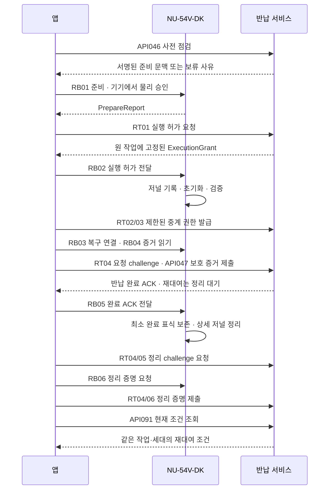

# 반납 HTTP·BLE 경로와 재대여 조건 조회 설계

작성: 2026-09-18. **설계 후보이며 기준 명세에 병합하지 않았다.** 제품 구현, SQL 변경, 암호 검증, 기기 시험은 미수행이다. HTTP 10개 경로(기존 3개·미등록 제안 7개), BLE 6개 메시지 쌍(기존 2개·미등록 제안 4개)을 연결한다. 현재 카탈로그는 API 110개·BLE 34개다.

[계약 목록](return-route-contracts.json) · [JSON Schema](return-route-contracts.schema.json) · [검증 예제](return-route-contracts.examples.json) · [검증 스크립트](validate_return_routes.py)

## 1. 완료의 의미

서버가 유효한 초기화 증거를 접수하면 기존 대여는 반납 완료로 기록할 수 있다. 그러나 **완료 ACK를 기기가 처리하고, 정리 증명까지 서버가 검증해야 재대여 조건을 충족한다.** 앱의 화면 표시 자체는 새 대여를 허가하지 않는다.

위 흐름은 선택되지 않은 복구 정책이나 암호 profile을 대신 결정하지 않는다. 신규 여행 지갑의 필수 복구 조건이 미결정이면 준비 문맥·새 실행 허가를 발급하지 않는다. 기존 import 지갑의 외부 자산 전체 이체를 강제하지 않는다.

## 2. HTTP 경로

HTTP 논리 envelope 버전은 `return-http-v1-draft`다. 요청 ID, 변경 요청의 멱등 키, 인증 정보를 포함하고 응답은 `no-store`다. 표의 RT 이름은 카탈로그 ID가 아니다.

| ID | 메서드·경로 | 권한과 결과 |
| --- | --- | --- |
| API046 | POST `/v1/rentals/{rentalId}/return-checks` | 현재 소유자 점검; 운영자는 안전한 상태 조회만. 준비 문맥은 소유자에게만 조건부 제공 |
| API047 | POST `/v1/rentals/{rentalId}/complete-return` | holder에 결합된 제한 중계 권한으로 원 초기화 증거 제출; ACK 또는 대기/격리 |
| API091 | GET `/v1/rentals/{rentalId}?projection=return` | 원 대여 소유자/허용 운영자에게 반납 projection. 현재 상태의 일관된 조건 조회 |
| RT01 | POST `/v1/return-jobs/{jobId}/commits` | 현재 소유자·기기의 신선한 준비/물리 승인에 결합된 실행 허가 |
| RT02 | POST `/v1/return-jobs/{jobId}/relay-challenges` | 현재 기본 인증으로 holder 공개키와 목적을 제출 |
| RT03 | POST `/v1/return-jobs/{jobId}/relay-authorities` | 일회 challenge 소유 증명을 검증해 제한된 중계 권한 발급 |
| RT04 | POST `/v1/return-jobs/{jobId}/request-challenges` | 현재 중계 권한·sender proof를 검증해 개별 제출용 challenge 발급 |
| RT05 | POST `/v1/return-jobs/{jobId}/cleanup-challenges` | 완료 ACK와 작업에 결합된 정리 challenge |
| RT06 | POST `/v1/return-jobs/{jobId}/cleanup-results` | 정리 증명 검증 후 재대여 gate 판정 |
| RT07 | GET `/v1/return-jobs/{jobId}` | 최소 진행 상태; 별도 ACK 중계 권한이 있을 때만 ACK도 반환 |

API091의 **기본 조회 응답 rental/checklist/lastResetState는 유지**한다. 새 projection은 명시적으로 요청할 때만 사용한다. 반납 작업이 없는 정상 대여는 `view:null`이며 GET으로 작업을 만들지 않는다. 명시한 jobId가 없거나 다른 대여에 속하면 비공개 오류로 처리한다. 이전 대여 소유자에게 새 사용자의 binding이나 지갑 정보를 노출하지 않는다.

API046의 walletOrigin은 클라이언트가 결정하지 않는다. 저장된 대여에서 읽어 일치 여부를 확인한다. externalAccessProof는 기존 `ProofReference`로 유지하며 서버가 원 소유자·대여·유효성·profile에 연결된 증거를 조회한다.

## 3. BLE 메시지와 복구 연결

| ID | 명령 | 입력 → 출력 |
| --- | --- | --- |
| RB01 | `device.reset.prepare` | 서명된 준비 문맥 → PrepareReport. 삭제 없음 |
| RB02 | `device.reset.confirm` | ExecutionGrant → 저널/증거 대기 상태, 준비된 경우 보호 증거 |
| RB03 | `reset.recovery.open` | RelayAuthority·HolderKey·holderProof·기기 challenge → 인증된 복구 세션 |
| RB04 | `reset.evidence.read` | 원 jobId → 보호 증거 또는 대기/없음 |
| RB05 | `reset.completion.ack` | 원 CompletionAck → 반영/이미 반영/정리 대기 |
| RB06 | `reset.cleanup.prove` | 서명된 정리 challenge → 보호된 CleanupProof |

논리 envelope `return-ble-v1-draft`는 command/sessionId/requestId/sequence/payload를 갖는다. 이는 GATT UUID, MTU, fragmentation, AEAD, 실제 byte encoding을 확정한 wire 규격이 아니다.

RB03 전 인증되지 않은 연결에서는 임시 discovery handle과 신선한 기기 challenge만 제공한다. 전달된 HolderKey를 실제 공개키로 해석해 thumbprint를 재계산하고, 서버가 서명한 authority의 holderKeyThumbprint와 대조한 뒤 holder 서명을 검증한다. 서버에 등록했다는 사실이나 keyId 문자열만으로 기기가 키를 신뢰하지 않는다. 서명 transcript에는 기기/서버 신원, 작업, authority, epoch, 세션 nonce가 결합된다. 기기 인증과 암호화된 세션 성립도 필요하며 실제 profile에서 완성해야 한다.

기존 owner 세션을 초기화 후 그대로 연장하지 않는다. evidence_relay는 보존된 원 저널의 previousEpoch에 결합하고, completion_cleanup은 확인된 nextEpoch에 결합한다. 새 대여나 더 최신 세대가 있으면 이전 작업의 BLE 명령을 거절한다.

## 4. 증거와 재시도: 원 후보에서 변경하는 부분

**RR-DELTA-01은 기존 [반납 프로토콜 후보](return-protocol-contracts.md)의 ProtectedEvidence 인증 문맥 서술을 변경하는 미병합 제안이다.** 원 문서는 보존하며 이 변경과 호출 순서를 함께 채택해야 한다.

기기가 만드는 불변 증거 암호문은 원 job/commit/device/previousEpoch/nextEpoch/eraseProfile/verifier 수신자/증거 종류에 결합한다. 매번 바뀌는 relay authority와 HTTP challenge는 이 암호문의 AAD에 넣지 않는다. 매 제출의 holder proof가 현재 authority·requestChallenge·원 암호문 digest·업무 식별자를 함께 보호한다. 따라서 암호문 생성 후 RT04 challenge를 받을 수 있고, 중계 권한 교체 후에도 동일한 원 증거를 재제출할 수 있다.

RT04 자체는 현재 권한에 대한 client nonce·신선성·sender 서명을 검증한다. 그 이전의 서버 challenge를 요구하는 순환을 만들지 않는다. RT04가 발급한 challenge는 실제 API047/RT05/RT06 처리 시 현재 인증과 업무 결과에 함께 소비된다. 정확한 digest 정규화·인코딩·시계 허용 범위는 profile 선정 시 확정한다.

동일한 업무 멱등 키의 재시도는 새 sender proof와 새 challenge를 사용할 수 있다. 업무 digest는 일시적 인증 wrapper를 제외하되 원 증거 bytes/digest와 업무 정체성은 고정한다. 다른 payload로 같은 키를 쓰면 충돌이다. 원 ACK를 다시 읽더라도 현재 권한은 다시 검사한다.

## 5. 원자 처리와 화면 판정

실행 허가 발급은 현재 대여/기기/epoch/checklist/fence 조건을 잠그고, `grantIssued`·불변 grant·멱등 결과·outbox를 함께 기록한다. 기기는 동일한 준비 세션/bootNonce/로컬 경과시간/물리 승인에 맞는 grant만 받는다. 재부팅으로 준비가 사라졌다면 늦게 도착한 grant로 초기화를 새로 시작하지 않는다. 이미 저널에 기록된 작업의 복구는 별도다.

허가가 발급됐거나 수신 여부를 모르면 시간 초과만으로 취소하거나 fence를 해제하지 않는다. 만료된 clearance는 새 허가를 금지하지만, 원 기록과 현재 중계 권한에 따라 기존 유효 증거를 접수하는 복구까지 막지는 않는다.

API047이 증거를 검증하면 반납 완료와 이전 binding 철회를 기록해도 gate는 `awaiting_cleanup`이다. 기기는 ACK에 맞는 최소 완료 표식을 영속 저장한 뒤 상세 저널을 정리하고, 남은 정리 신원으로 새 challenge의 정리 증명을 만든다. 표식이 없다는 이유로 이미 깨끗하다고 판단하지 않는다.

현재 조회의 `Readiness`는 같은 authority 기준 읽기에서 job/gate/binding/device revision을 묶어 만든다. `eligible` 표시에는 다음 모두가 필요하다.

- 같은 jobId/jobRevision이며 phase가 completed
- 서버 반납 완료, 정리 검증 완료, 현재 기기 epoch 일치
- 활성 binding 없음, enrollmentState가 unprovisioned_ready
- job과 현재 gate가 모두 eligible

historical/unknown 조회는 readiness를 null로 준다. relay 조회도 readiness·소유자 점검 정보를 주지 않는다. 이전 화면의 eligible을 봤더라도 API045는 새 대여 시 현재 gate/epoch/binding을 다시 잠그고 revision을 확인해야 한다. 이 **등록 요청 계약의 상세 변경은 다음 설계 대상**이다.

## 6. 기존 화면과 오류

RA01/02/12는 보호된 조회·재연결, RA04는 점검→준비→commit→실행, RA06은 기존 증거 재전달, RA07은 ACK→정리 증명→조회에 연결했다. RA03/08/09/10은 원 외부 접근 확인·지원·기존 도메인/화면 이동이며 포괄적인 초기화 승인으로 취급하지 않는다. RA05 취소는 안전한 grant 발급 전 취소·양측 fence 해제 계약이 없으므로 비활성이다. RA11 재대여는 API045 변경안 채택 전 실행 가능으로 표시하지 않는다. 전체 RP01..08 및 RA01..12 매핑은 JSON에 있다.

오류 envelope는 입력, 현재 인증, 권한, 비공개 대상 부재, revision/멱등 충돌, 증거 검증, 요청 제한, 일시 장애를 구분한다. 오류가 발생했다고 원 실행 허가나 기기의 삭제 상태를 추정하지 않는다. API047/RB02 결과가 불명확하면 원 작업 상태·보호 증거를 조회하고 새로운 초기화를 발급하지 않는다.

## 7. 검증 범위와 다음 작업

로컬 검증은 허용 형태 33개·거절 형태 12개, 재대여 조건 논리 예제 11개, 원본 입력 10개의 SHA-256 일치 및 경로 참조를 확인한다. 런타임 수용 사례 18개는 **모두 not_run**이다. schema 통과는 인증·암호·경쟁 처리·플래시 삭제의 동작 증거가 아니다.

Zephyr는 확정되어 있지만 SDK/board target, 보호 저장/epoch/저널 능력과 proof/profile은 아직 미선정이다. RR-DEC-01의 개인 복구 백업 정책도 미답변 그대로 둔다. 다음은 API045의 초기 등록/반납 후 재등록 분기, grant 발급 전 취소와 fence 해제 계약이다. 반납 물리 저장·이행안도 후속으로 연결한다.
