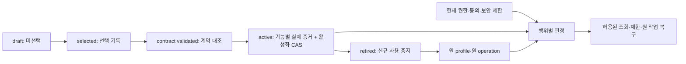

# 선택값 profile・적용 조건

20개 선택 영역을 82개 설정 객체로 나누고 16개 교차 제약을 정의했다. 모두 값이 비어 있는 논리 명세이며 제품 설정·wire schema·실제 활성 profile은 아니다.

## 적용 원칙

- 모든 필드 value=null이다. briefing의 권장안/수치/empty list/0을 자동 기본값으로 주입하지 않는다.
- requiredMembers는 의미상 최소 객체 형태이다. enum 집합·배열 원소·참조 타입·상한·정규화는 선택 후 versioned schema로 고정한다. 이 자료는 배포 가능한 JSON schema/ABI가 아니다.
- 빈 값과 의도적 disabled/not_applicable을 구분한다. disabled는 선택 기록·근거·적용 행위가 필요하고 필수 기능 완료로 계산하지 않는다.
- 금액은 asset identity와 atomic 정수 문자열, 기간/길이는 필드 단위에 따른 양의 정수로 고정한다. profile에는 private key/seed/share/backup 비밀을 담지 않고 접근통제된 public identifier만 둔다.
- D03 복구 참조는 RR 선택에 대한 연결이다. 일반 서명 gate에 RR 초기화 선택을 무조건 요구하지 않는다.
- 공동 검토 관계와 XC rule의 fieldRefs 전체를 모든 행위의 하드 선행 조건으로 쓰지 않는다. 현재 행위에 해당하는 피연산자와 rule 분기를 평가한다.

## 불변 profile과 현재 제한

현재 활성 profile은 0개다. lifecycle enum에 active가 있다는 이유로 활성화했다고 해석하지 않는다. 제안한 목표값이나 문서 검사를 실기 증거로 사용하지 않는다.

### profile 레코드

- identityFields: profileId, profileVersion, schemaVersion, environmentId, scopeSelector, contentDigest
- scopeSelectorFields: product, actorOrTenantScope, deviceOrClientProfile, chainAndAssetScope, purpose
- provenanceFields: decisionRecordRefs, evidenceManifestRef, compatibleReaderRefs, authoringAuthorityRef
- effectiveFields: effectiveFrom, expiresAt, supersedesVersion, activationRecordRef

각 값은 선택 기록·scope·version·evidence 참조에 묶인다. 비밀 자체를 profile에 넣지 않는다.

### 활성화·교체·실패 복구

- profile body는 불변; 값 변경은 새 version/digest이며 활성 head는 scope별 expected revision CAS로 교체한다.
- 소비자에게 적용되는 scopeSelector가 중첩되면 활성 집합을 하나로 해석하는 명시 우선순위/동일성 규칙이 없을 때 거절한다. 가장 최신 전역 profile로 추정하지 않는다.
- selection/contract validation/runtime capability/사용자 권한은 서로 다른 축이다. 모두 같은 enabled flag로 합치지 않는다.
- 필드 단위 completeness가 충족된 action slice만 활성화 증거를 얻는다. 독립 기능의 미선택 값 때문에 전체 기능을 막거나, 일부 통과로 다른 기능을 활성화하지 않는다.
- 새 효과/재개 commit 직전에 현재 activation head·security fence·resource revision을 다시 확인한다. 원 의도에 고정된 profile을 latest로 갈아끼우지 않는다.
- 보안 철회는 불변 body 삭제가 아니라 별도 scope/reason/revision fence로 기록한다. retired와 revoked를 구분한다.
- 기존 서명/전송 노출은 profile 폐기·BLE 단절로 사라지지 않는다. 같은 operation 관측·대사 없이 새 nonce/payout을 만들지 않는다.
- 원 버전 reader가 없으면 raw payload를 최신 schema로 해석하지 않고 제한된 상태/오류만 표시한다. 의미를 검증할 수 없는 결과로 업무 확정/환불/혜택을 만들지 않는다.
- 기기의 오프라인 즉시 철회는 보장하지 않는다. 검증된 lease/clock/expiry가 없는 상태에서 새 민감 동작을 허용하지 않는다.
- 서버·앱·기기 모두 같은 immutable profileSetDigest와 기능 범위를 확인한다. 부분 rollout은 호환 행렬과 action별 활성 증거 없이 활성 처리하지 않는다.

선택/활성화 응답 유실은 원 변경 요청과 profileVersion의 현재 적용 결과를 읽는다. 조회는 activation/version 교체를 재실행하지 않는다.

**원 작업에 고정할 식별자** — operationClass, originalProfileSetDigest, environmentId, parentRef, canonicalRequestDigest, idempotencyScope, actorOrCapabilityBinding, resourceRevision, securityFenceRevision, exposureRef

## 필드 명세

객체 내부의 enum 값·배열 원소·정규화·상한은 선정 profile에서 고정한다. 아래 목록만으로 네트워크 입력을 검증하거나 런타임 사용 가능으로 판정하지 않는다.

### PC-D01 · 앱·인증 대상

| 필드 ID | 선택 내용 | 최소 객체 멤버 |
|---|---|---|
| PF-D01-01 | 추가 지원 OS와 최소 버전 | supportedOs:array, minVersionByOs:object |
| PF-D01-02 | 키오스크 태블릿 모델·공유 기기 잠금 | modelIds:array, terminalLockPolicy:enum |
| PF-D01-03 | 설치/배포 경로 | channel:enum, distributionRef:string |
| PF-D01-04 | 언어와 번역 범위 | locales:array, fallbackLocale:string |

### PC-D02 · 연결 규칙·데이터 경계

| 필드 ID | 선택 내용 | 최소 객체 멤버 |
|---|---|---|
| PF-D02-01 | wire encoding과 정규화 | encoding:enum, canonicalizationRef:string, maxMessageBytes:positiveInteger |
| PF-D02-02 | API/BLE/profile 버전 정책 | apiVersion:string, bleVersion:string, proofVersion:string, compatibilityRef:string |
| PF-D02-03 | 권한 변경·원장·outbox의 저장 배치 | writerRegistryRef:string, transactionMappingRef:string, outboxSchemaRef:string |
| PF-D02-04 | 수명/만료 시계와 재시도 규칙 | clockSource:enum, maxSkewMs:nonnegativeInteger, expiryRulesRef:string, retryRulesRef:string |

### PC-D03 · 지갑 키·복구

| 필드 ID | 선택 내용 | 최소 객체 멤버 |
|---|---|---|
| PF-D03-01 | 파생 경로·가져오기 지원 형식 | importFormats:array, derivationPaths:array, keyTypes:array |
| PF-D03-02 | 기기 잠금/재인증·표시 확인 | lockRulesRef:string, recentAuthMaxAgeMs:positiveInteger, displayBindingRef:string |
| PF-D03-03 | 보호 키 backend·장치 신원/epoch | backendProfileRef:string, deviceIdentityRootRef:string, epochJournalRef:string |
| PF-D03-04 | 신규 여행 EOA 백업은 RR-DEC-01에서 별도 결정 | returnRecoverySelectionRef:string |

### PC-D04 · MPC 신뢰 구조

| 필드 ID | 선택 내용 | 최소 객체 멤버 |
|---|---|---|
| PF-D04-01 | 각 참여자의 실제 통제 주체 | participantRoles:array, controlDomains:array, threshold:positiveInteger |
| PF-D04-02 | 분산 ECDSA/DKG·refresh·복구 지원 revision | protocol:string, revision:string, capabilityEvidenceRef:string |
| PF-D04-03 | 소셜 계정 탈취/폰 분실/운영 중단의 허용 quorum | allowedQuorums:array, recoveryPolicyRef:string, outagePolicyRef:string |
| PF-D04-04 | 조각 저장·복구 인증·회전 방식 | shareStorageRefs:array, rotationPolicyRef:string, recoveryAuthRef:string |

### PC-D05 · FOTA 운영

| 필드 ID | 선택 내용 | 최소 객체 멤버 |
|---|---|---|
| PF-D05-01 | 실제 보드 revision/target·Zephyr SDK revision | boardModel:string, boardRevision:string, boardTarget:string, sdkRevision:string |
| PF-D05-02 | bootloader·slot·보호 키/설정 영역 | bootloaderRef:string, partitionMapRef:string, keyRegionRef:string |
| PF-D05-03 | rollback 허용 범위·이미지 확인 조건 | rollbackPolicyRef:string, bootConfirmationRef:string |
| PF-D05-04 | 업데이트 요청/강제/유예 UX와 릴리스 서명키 운영 | userDeferralPolicyRef:string, releaseAuthorityRef:string, signingKeyRef:string |

### PC-D06 · 패스키 호환 범위

| 필드 ID | 선택 내용 | 최소 객체 멤버 |
|---|---|---|
| PF-D06-01 | 대상 서비스·OS·브라우저·전송 조합 | rpIds:array, osBrowserTransportMatrixRef:string |
| PF-D06-02 | user presence와 user verification 방식 | userPresenceRef:string, userVerificationRef:string |
| PF-D06-03 | discoverable credential·동기화/백업 표시 정책 | discoverablePolicy:enum, backupFlagsPolicyRef:string |
| PF-D06-04 | 분실/반납 시 대체 로그인과 RP 자격 해제 | alternateLoginRef:string, credentialRemovalRef:string |

### PC-D07 · 녹음·찾기 목표

| 필드 ID | 선택 내용 | 최소 객체 멤버 |
|---|---|---|
| PF-D07-01 | 목표 길이/음질·허용 손실/지연 | durationSeconds:positiveInteger, sampleRateHz:positiveInteger, sampleBits:positiveInteger, channels:positiveInteger, codec:string, maxLossRuleRef:string |
| PF-D07-02 | 잠금화면/백그라운드 사용 조건 | foregroundPolicyRef:string, backgroundPolicyRef:string, permissionMatrixRef:string |
| PF-D07-03 | RAM buffer·마이크·LED/버저·전원 구성 | bufferBytes:positiveInteger, microphoneRef:string, alertOutputRef:string, powerProfileRef:string |
| PF-D07-04 | 거리 임계값/유효시간/측정 실패 UX | thresholdMm:positiveInteger, maxObservationAgeMs:positiveInteger, confidenceRuleRef:string, failureUxRef:string |

### PC-D08 · 결제·환불·정산

| 필드 ID | 선택 내용 | 최소 객체 멤버 |
|---|---|---|
| PF-D08-01 | 주문 가격 단위·환율 출처·반올림/견적 만료 | displayCurrency:string, rateSourceRef:string, roundingRuleRef:string, quoteTtlMs:positiveInteger |
| PF-D08-02 | 체인 확정 기준·reorg 보정 | finalityRuleRef:string, reorgRuleRef:string |
| PF-D08-03 | 원 allocation 환불 목적지/예외 증명 | recipientProofRef:string, refundDestinationRuleRef:string |
| PF-D08-04 | 환불 gas 부담·취소/부분환불 | refundGasPayer:enum, cancelPolicyRef:string, partialRefundRuleRef:string |
| PF-D08-05 | 매장 시간대·마감 후 correction | storeTimezone:string, closeBoundaryRef:string, correctionRuleRef:string |

### PC-D09 · 대여·혜택

| 필드 ID | 선택 내용 | 최소 객체 멤버 |
|---|---|---|
| PF-D09-01 | 적립 단위·사용 문턱·프로그램 중복 규칙 | programId:string, earningRuleRef:string, redemptionRuleRef:string, overlapRuleRef:string |
| PF-D09-02 | 부분환불 target 산식·소비 후 회수/면제 | refundTargetRuleRef:string, consumedBenefitRuleRef:string |
| PF-D09-03 | 반납 불명 거래·미회수 기기 보류 운영 | unknownExposureReturnRuleRef:string, quarantineRuleRef:string |
| PF-D09-04 | RR-DEC-01과 별도인 자격/위임 정리 | credentialCleanupRef:string, delegationCleanupRef:string |

### PC-D10 · 배포/시험 환경

| 필드 ID | 선택 내용 | 최소 객체 멤버 |
|---|---|---|
| PF-D10-01 | RPC chain identity·fork capability | rpcRef:string, chainId:positiveInteger, forkEvidenceRef:string |
| PF-D10-02 | 주소·bytecode/ABI digest·decimals·배포 block | assets:array, deploymentManifestRef:string |
| PF-D10-03 | mint 권한·faucet/gas 공급 | mintAuthorityRef:string, testGasSupplyRef:string |
| PF-D10-04 | Indexer endpoint·deployment identity·재시작 cursor | endpointRef:string, deploymentIdentity:string, initialCursorRef:string, replayPolicyRef:string |

### PC-D11 · 스마트 계정 전환

| 필드 ID | 선택 내용 | 최소 객체 멤버 |
|---|---|---|
| PF-D11-01 | account·EntryPoint·Bundler·SDK의 한 버전 조합 | accountRef:string, entryPointRef:string, bundlerRef:string, sdkRevision:string |
| PF-D11-02 | HW/Cloud signer와 복구 threshold | signerPolicyRef:string, recoveryQuorumRef:string |
| PF-D11-03 | 자산·allowance·위임 이전 범위 | migrationScopeRef:string, delegationScopeRef:string |
| PF-D11-04 | 실패한 이전 재조회/재개 UX | recoveryReaderRef:string, migrationIdempotencyRef:string |

### PC-D12 · DeFi·FX 상품

| 필드 ID | 선택 내용 | 최소 객체 멤버 |
|---|---|---|
| PF-D12-01 | 시험 token pair·pool/quote 모델 | assetPair:array, model:enum, poolOrQuoteProviderRef:string |
| PF-D12-02 | 유동성 공급·가격 원천·수수료 | liquiditySourceRef:string, priceSourceRef:string, feeRuleRef:string |
| PF-D12-03 | 슬리피지·견적 만료·라운딩 | slippageLimitBps:nonnegativeInteger, quoteTtlMs:positiveInteger, roundingRuleRef:string |
| PF-D12-04 | allowance 범위와 실행 취소 조건 | allowanceRuleRef:string, cancelRuleRef:string |

### PC-D13 · Perpetual 상품

| 필드 ID | 선택 내용 | 최소 객체 멤버 |
|---|---|---|
| PF-D13-01 | 기초 시장·담보·가격 source | marketId:string, collateralAssetRef:string, priceSourceRef:string |
| PF-D13-02 | 최대 leverage·initial/maintenance margin | maxLeverageRuleRef:string, initialMarginRuleRef:string, maintenanceMarginRuleRef:string |
| PF-D13-03 | funding 주기/상한·PnL rounding | fundingIntervalSeconds:positiveInteger, fundingCapRuleRef:string, pnlRoundingRef:string |
| PF-D13-04 | keeper 권한·oracle 장애·중단/청산 기준 | keeperAuthorityRef:string, oracleFailureRuleRef:string, liquidationRuleRef:string |

### PC-D14 · STO 범위

| 필드 ID | 선택 내용 | 최소 객체 멤버 |
|---|---|---|
| PF-D14-01 | 시험 권리 명세·발행 주체 | offeringId:string, issuerRef:string, rightsManifestRef:string |
| PF-D14-02 | 보유/전송 자격·발행량 | eligibilityRuleRef:string, supplyRuleRef:string, transferRestrictionRef:string |
| PF-D14-03 | 철회/만료·자격 장애 시 동작 | revocationRuleRef:string, expiryRuleRef:string, statusFailureRuleRef:string |
| PF-D14-04 | 앱 시험 표시와 실제 권리 유무 | environmentLabelRef:string, realRights:boolean |

### PC-D15 · DID 범위

| 필드 ID | 선택 내용 | 최소 객체 멤버 |
|---|---|---|
| PF-D15-01 | issuer/verifier registry·DID method | issuerRegistryRef:string, verifierRegistryRef:string, didMethod:string |
| PF-D15-02 | proof suite·holder binding | proofSuiteRef:string, holderBindingRef:string |
| PF-D15-03 | status/expiry·오프라인 허용 여부 | statusResolverRef:string, maxStatusAgeMs:positiveInteger, offlinePolicyRef:string |
| PF-D15-04 | 필드 최소화·소유자 저장·삭제/철회 구분 | disclosureFields:array, storagePolicyRef:string, deletionRevocationRulesRef:string |

### PC-D16 · x402 범위

| 필드 ID | 선택 내용 | 최소 객체 멤버 |
|---|---|---|
| PF-D16-01 | HTTP 자원·버전·mechanism·chain/asset | resourceId:string, protocolVersion:string, mechanismRef:string, chainId:positiveInteger, assetRef:string |
| PF-D16-02 | 고객 gas 부담을 실제 구현할 signer/submitter | signerRole:enum, submitterRole:enum, gasPayerRole:enum |
| PF-D16-03 | entitlement 가격/기한·새 생성 여부 | priceRuleRef:string, entitlementTtlMs:positiveInteger, retryChargingRuleRef:string |
| PF-D16-04 | 환불 주체·목적지·전달 후 환불 규칙 | refundAuthorityRef:string, refundDestinationRef:string, postDeliveryRefundRuleRef:string |

### PC-D17 · 위치·후기·실제 데이터

| 필드 ID | 선택 내용 | 최소 객체 멤버 |
|---|---|---|
| PF-D17-01 | 장소/후기 provider와 사용 조건 | placeProviderRef:string, reviewSourceRef:string, usageTermsRef:string |
| PF-D17-02 | 정밀도·수집 주기·목적별 동의 | precisionRuleRef:string, samplingIntervalSeconds:positiveInteger, consentPurposes:array |
| PF-D17-03 | 원음/전사/위치/후기 보관·삭제 범위 | retentionByPurposeRef:string, deletionScopeRef:string |
| PF-D17-04 | 실제 구매 데이터 확보·검증 방식 | purchaseEvidenceRef:string, testEvidenceLabelRef:string |

### PC-D18 · 추천·챌린지 기준

| 필드 ID | 선택 내용 | 최소 객체 멤버 |
|---|---|---|
| PF-D18-01 | 입력 제약·경유지·이동/영업시간 기준 | constraintsSchemaRef:string, travelTimeSourceRef:string, openingHoursSourceRef:string |
| PF-D18-02 | AI/지도/전사 제공 경로·비용/지연 | aiProviderRef:string, mapProviderRef:string, transcriptionProviderRef:string, costLimitRef:string |
| PF-D18-03 | 표본 구성·제약 통과·유용성 기준 | evaluationSetRef:string, constraintAcceptanceRef:string, usefulnessRubricRef:string |
| PF-D18-04 | 방문/결제 challenge와 환불 후 혜택 | challengeEvidenceRuleRef:string, rewardRuleRef:string, refundEffectRef:string |

### PC-D19 · 운영·수용 목표

| 필드 ID | 선택 내용 | 최소 객체 멤버 |
|---|---|---|
| PF-D19-01 | 동시 사용자/단말·응답/배터리/녹음 목표 | loadProfileRef:string, latencyTargetRef:string, batteryTargetRef:string, recordingTargetRef:string |
| PF-D19-02 | 서비스별 RPO/RTO와 복구 리허설 | rpoByServiceRef:string, rtoByServiceRef:string, rehearsalPlanRef:string |
| PF-D19-03 | 목적별 보관기간·삭제 SLA·외부 backup 만료 | retentionScheduleRef:string, deletionSlaRef:string, backupExpiryRef:string |
| PF-D19-04 | 운영 역할·긴급 접근·릴리스키 회전 | operatorRolesRef:string, emergencyAccessRef:string, releaseKeyRotationRef:string |
| PF-D19-05 | 실자산 운영 단계의 별도 출시 조건 | launchStage:enum, launchEvidenceRef:string |

### PC-RR-DEC-01 · 신규 여행 EOA의 늦은 자산·반납 복구

| 필드 ID | 선택 내용 | 최소 객체 멤버 |
|---|---|---|
| PF-RR-DEC-01-01 | 신규 여행 EOA에 대한 선택 | policy:enum |
| PF-RR-DEC-01-02 | 백업 추가 시 생성 시점·사용자 단독 해독·보관 위치 | backupFormatRef:string, decryptionControlRef:string, storageLocationRef:string |
| PF-RR-DEC-01-03 | 독립 복구 확인과 분실 UX | independentRecoveryEvidenceRef:string, lossUxRef:string |
| PF-RR-DEC-01-04 | 미선택/미확인 시 초기화 보류 상태 | unselectedBehavior:enum |

## 교차 제약

참조 필드는 검토 영향 범위다. 특정 행위와 무관한 상품·제공자 설정까지 전역 필수값으로 요구하지 않는다.

### XC-01

OAuth/패스키/앱 native adapter의 OS·기종·배포 identity가 하나의 지원 행렬에서 일치해야 한다.

- 실패 처리: 해당 조합의 신규 인증/패스키만 보류; 다른 검증된 조합을 포괄 중단하지 않는다.
- 연결: PF-D01-01, PF-D01-02, PF-D01-03, PF-D06-01

### XC-02

codec·정규화·신뢰 registry·writer·시계·멱등 정책을 한 immutable profileSet으로 검토하며 unknown version을 추정 해석하지 않는다.

- 실패 처리: 새 요청 거절; 지원 가능한 원 버전 reader가 있으면 기존 결과만 현재 권한으로 조회.
- 연결: PF-D02-01, PF-D02-02, PF-D02-03, PF-D02-04

### XC-03

board/crypto backend가 EOA와 패스키의 각 키 유형·알고리즘·보호 영역을 지원한다는 별도 근거가 필요하다.

- 실패 처리: 미지원 key kind 생성/서명 거절; 같은 알고리즘 지원을 다른 키 유형 지원으로 간주하지 않는다.
- 연결: PF-D03-01, PF-D03-02, PF-D03-03, PF-D05-01, PF-D05-02

### XC-04

threshold는 participant 수 이내이며 allowed quorum마다 실제 control domain·프로토콜 지원·복구 정책이 일치해야 한다. 운영자 단독 quorum을 사용자 독립 복구로 표현하지 않는다.

- 실패 처리: 새 DKG/참여자 변경 보류; 원 operation 결과 조회/현 권한 제한은 별도.
- 연결: PF-D04-01, PF-D04-02, PF-D04-03, PF-D04-04

### XC-05

D03은 RR 선택을 참조한다. backup 정책이면 사용자 통제 백업과 독립 복구 증거가 필요; 보류 정책이나 미선택은 복구 없는 신규 여행 EOA 초기화를 허가하지 않는다.

- 실패 처리: 초기화·재대여 금지; 원 소유자 조회/검토와 격리 유지. import 지갑 전체 sweep으로 확장하지 않는다.
- 연결: PF-D03-04, PF-RR-DEC-01-01, PF-RR-DEC-01-02, PF-RR-DEC-01-03, PF-RR-DEC-01-04

### XC-06

실제 slot/image 크기·RAM 공존 예산·키 영역·저장 schema 전환을 대조한다. 숫자가 모두 입력되어도 보드 검증 증거 없이 FOTA 사용 가능으로 승격하지 않는다.

- 실패 처리: 새 설치 보류; 검증된 원 update의 recover path 외 임의 rollback/키 삭제 금지.
- 연결: PF-D05-01, PF-D05-02, PF-D05-03, PF-D05-04, PF-D07-01, PF-D07-03

### XC-07

녹음 byte 산술은 전송 지원 증거와 다르다. 거리 관측은 현재 peer/session/기기/시간/신뢰 profile에 결합하며 RSSI·오래된 거리·연결 여부를 승인으로 대체하지 않는다.

- 실패 처리: 녹음 시작/거리 의존 승인만 보류; 인증된 찾기 알림은 독립 gate로 평가.
- 연결: PF-D07-01, PF-D07-02, PF-D07-03, PF-D07-04

### XC-08

quote/intents는 environment+chain+asset+atomic amount+recipient+expiry를 고정한다. native/wrapped/dummy는 별도 자산이며 최초 결제 gas 고객 부담 조건을 보존한다.

- 실패 처리: 새 quote/서명 보류; 이미 전파한 원 거래를 취소 성공으로 표시하지 않는다.
- 연결: PF-D08-01, PF-D08-02, PF-D08-03, PF-D08-04, PF-D10-01, PF-D10-02, PF-D10-03

### XC-09

환불 가능액은 confirmed/reserved/unknown 노출을 함께 공제한다. 마감 뒤 보정·스탬프 target ruleVersion은 원 funding/effect identity를 유지한다.

- 실패 처리: 새 환불/혜택 효과 보류; 과거 사용/원장/관측 이력 보존.
- 연결: PF-D08-02, PF-D08-03, PF-D08-04, PF-D08-05, PF-D09-01, PF-D09-02

### XC-10

account/EntryPoint/Bundler/SDK/chain capability/Indexer event signature를 동일 deployment manifest로 고정한다. EOA를 자동 변환하거나 전체 자산을 이동하지 않는다.

- 실패 처리: 해당 스마트 계정 경로만 보류; 검증된 독립 EOA 경로는 별도 평가.
- 연결: PF-D10-01, PF-D10-02, PF-D10-04, PF-D11-01, PF-D11-02, PF-D11-03, PF-D11-04

### XC-11

상품별 가격·단위·rounding·노출/allowance·margin/keeper 규칙을 각각 고정한다. 관련 없는 상품 정책 미선택을 전체 시장 중단의 유일 이유로 삼지 않는다.

- 실패 처리: 선택된 상품/행위별 보류. 가격 장애 시 포지션 종료도 무조건 안전한 읽기로 취급하지 않는다.
- 연결: PF-D12-01, PF-D12-02, PF-D12-03, PF-D12-04, PF-D13-01, PF-D13-02, PF-D13-03, PF-D13-04, PF-D10-02

### XC-12

STO 권리·issuer·현재 자격 검증 profile이 일치해야 한다. credential 보유와 현재 challenge의 presentation 검증은 별도이고 폐기된 권한을 재사용하지 않는다.

- 실패 처리: 새 발급/이전/제시 보류; 과거 verification 기록은 현재 읽기권 내에서 조회.
- 연결: PF-D14-01, PF-D14-02, PF-D14-03, PF-D14-04, PF-D15-01, PF-D15-02, PF-D15-03, PF-D15-04

### XC-13

x402 mechanism의 signer/submitter/실제 gas payer가 고객 gas 우선 조건과 일치해야 한다. 더미 토큰의 증명/지급 mechanism 지원은 별도 검증한다.

- 실패 처리: 새 유료 지급 보류; 서버가 부담하는 mechanism을 고객 부담으로 표시하지 않는다.
- 연결: PF-D16-01, PF-D16-02, PF-D16-03, PF-D16-04, PF-D10-01, PF-D10-02, PF-D10-03, PF-D08-04

### XC-14

provider별 목적/동의/보관/삭제·출처 label과 AI/후기/챌린지 목적이 일치해야 한다. test 구매를 실구매로 바꾸지 않으며 철회가 삭제 범위 전체를 뜻하지 않는다.

- 실패 처리: 새 수집/처리/보상 보류; 동의 철회와 승인된 범위의 삭제는 독립 gate로 진행.
- 연결: PF-D17-01, PF-D17-02, PF-D17-03, PF-D17-04, PF-D18-01, PF-D18-02, PF-D18-03, PF-D18-04, PF-D19-03

### XC-15

생성 candidate는 요청의 base/content revision·generation 선택과 입력/동의/유료 entitlement에 결합한다. 적용은 현재 head CAS이며 결과 재조회가 재적용/재과금하지 않는다.

- 실패 처리: 새 생성/적용 보류 또는 재검토; 늦은 결과는 원 candidate만 보존.
- 연결: PF-D18-01, PF-D18-02, PF-D18-03, PF-D16-03

### XC-16

운영 role·서비스별 recovery·환경/실자산 출시 조건을 분리한다. 목표값/fixture 통과만으로 운영 검증 또는 실자산 출시를 활성화하지 않는다.

- 실패 처리: 선정 안 된 실행/출시만 보류. 필요한 제한·오류 관측은 범위 내 허용.
- 연결: PF-D19-01, PF-D19-02, PF-D19-03, PF-D19-04, PF-D19-05

## 다음 계약 채택에 필요한 결과

- 선택 필드별 실제 값·버전·근거와 scope를 기록한다.
- action/branch별 schema·권한·원자 저장·호환 reader를 함께 고정한다.
- 원 profile을 보존하는 재조회·재개와 현재 제한 검사를 검증한다.
- 구현 전환 뒤 대상 기기/앱/체인에서 실행 증거를 수집한다.

[행위별 gate·화면 연결](selection-action-gates.md) · [원 선택 카드](../planning/decision-briefing.md) · [구조화 명세](selection-profile-contract.json) · [설계 검사](selection-profile-validation.json)
