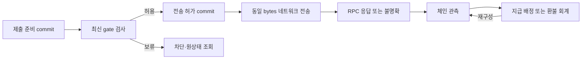

# 승인 증거·제출 저장 경계와 결제·환불 연결

2026-09-18 · **상세 설계 후보, 기준 명세 미병합·구현 미착수.** [지갑 API 후보](wallet-api-contracts.md)의 ApprovalBinding·SignatureProvenance·SubmissionDispatch를 기존 저장 모델과 연결한다. [결제·환불 후보](commerce-contract-changes.md)의 TX-04/05와 원지급별 환불 한도 규칙을 유지한다.

**승인 내용, 실제 서명 출처, 네트워크 전송, 체인 관측, 업무 원장은 각각 기록한다.** DB에 제출 요청을 저장했다고 결제가 끝난 것은 아니며, worker가 응답을 받지 못했다고 전송이 없었던 것도 아니다. 이 구분을 개인 송금·NU 키오스크 결제·점주 환불에 공통 적용한다.

[구조·참조·장애 사례 원본](signing-submission-storage-design.json) · [기존 저장 작업](storage-operations.md) · [기존 DDL](database/003_commerce_ledger.sql)

후속 [guest 결제·점주 환불 승인 계약](source-approval-contracts.md)에서 SS-A02/03의 actor·증거 전달을 HTTP/BLE 메시지에 연결했다. 기존 계약 병합 전 상태는 유지한다.

## 1. 기존 명세와 달라지는 지점

| 기존 기준 | 이번 후보가 추가로 요구하는 것 |
|---|---|
| transaction_intents의 source/profile/digest/review 참조 | 승인 주체 variant, 불변 signer/세대/권한 문맥, 원천 revision과 부모 operation 결합 |
| signing_sessions의 wallet/profile/digest | 검증된 NU 또는 MPC 서명 출처와 정확한 결과 결합. guest에 wallet row 강제 금지 |
| transaction_submissions의 chain/txHash 고유 | intent별 단일 수락 payload, 승인 증거 연결, 원천 간 재귀속 금지, 전송 허가와 시도 이력 |
| 공통 outbox/inbox | 작업 알림과 전송 허가를 구분. 중복 worker의 상태 갱신 방지와 동일 bytes 재시도 |
| walletId 중심 조회 | nonce 경쟁은 chain/payerAddress/nonce로 추적하되 개인·매장·guest 조회권은 합치지 않음 |
| 환불 reservation 상태 | 서명 가능성이 남은 거래의 예약 유지, 관측 철회 시 confirmed→reserved 복구 |

기존 SQL을 수정하거나 새 migration을 만들지 않는다. 아래 저장 자원은 논리 책임이며 자원 수를 신규 테이블 수로 해석하지 않는다. 실제 FK·고유 제약·저장 위치·원자성은 병합 단계에서 DDL과 서비스 계약으로 연결해야 한다.

## 2. 저장 자원과 보호 범위

| ID / 논리 자원 | 최소 저장 정보·키 | 기존 연결점·제약 |
|---|---|---|
| SS-R01 ApprovalBinding | intentId, 부모 operationId, source 종류/ID, actor variant, chain/payer, signer/profile/세대, 원천·권한 revision, payload/review digest, 기한 | transaction_intents. intentId마다 불변 snapshot 하나. 변경 시 새 검토 건 |
| SS-R02 SignatureProvenance | evidenceId, intentId, 승인 문맥 digest, 정확한 signed-payload 지문, 검증기/profile 버전, 장치/세대 또는 MPC session/epoch, 검증 시각·결과 | signing_sessions 또는 별도 device evidence adapter. EOA 주소 검증만으로 경로 증명을 만들지 않음 |
| SS-R03 SignedPayloadObject | 불변 객체 ID/버전, bytes digest, 길이, 접근 범위, 저장/정리 상태 | transaction_submissions.signed_payload_ref의 보호 저장. 일반 결과 다운로드 API와 분리 |
| SS-R04 SubmissionDispatch | submissionId, intentId, chain/txHash, payload/evidence 참조, sourceBinding, dispatch 상태·revision, permit 발급 사실, 허가 당시 gate revision | transaction_submissions + operation/outbox. 동일 intent의 수락 payload는 하나; txHash의 원 intent 귀속 유지 |
| SS-R05 DispatchAttempt | dispatchId, attemptId, worker lease/fence, 허가 ID, 시작/응답 시각, RPC 결과 분류 | 새 논리 worker 이력. 응답의 진위·체인 확정은 별도 관측 |
| SS-R06 AddressNonceTrack | chainId, 정규화 payerAddress, nonce, 내부 예약/intent·관측된 경쟁 tx 참조 | 주소 단위 실행 추적. 같은 슬롯에 경쟁 거래 이력을 남길 수 있어야 함; 외부 지갑 잠금 아님 |
| SS-R07 SourceExecutionGate | source 종류/ID, 현재 revision·보류 사유, 권한/대여/서명 제한의 서버 검증 참조 | 개인 binding, 주문/attempt, refund/balance/guard와 연결. snapshot과 최신 gate를 혼동하지 않음 |
| SS-R08 ObservationApplication | source/aggregate, 관측 ID·revision, 적용한 원장 revision, inbox/outbox 참조 | chain_observations, payment_allocations, refunds/reservations. 같은 관측 재적용은 회계 효과 없음 |

actor는 서로 다른 세 variant로 다룬다.

- **개인 송금:** 인증된 account와 wallet binding·승인 수단. 현재 API-017 후보의 ApprovalContext를 연결한다.
- **guest 결제:** order/attempt·terminal/device/session·제한 capability의 검증 참조. accountId와 walletId는 필수가 아니다. API-034의 기기 단독 결제를 유지한다.
- **점주 환불:** store·업무 승인 actor·원지급 allocation·refund/reservation·실제 매장 signer를 연결한다. 자산 조회권과 자금 승인권은 별개다.

이 variant를 기존 개인용 ApprovalContext schema에 억지로 넣지 않는다. guest/refund용 actor와 proof 수송의 전체 DTO는 다음 adapter 병합 대상으로 남긴다. 비어 있는 계정 ID나 가짜 wallet row로 타입을 맞추지 않는다.

### 서명 bytes와 증거 저장

서명된 거래에는 원시 키가 없어도 **그대로 제출할 수 있는 권한**이 담겨 있다. 일반 로그·analytics·outbox payload·백오피스 다운로드에 넣지 않는다. outbox에는 dispatchId와 안전한 revision만 넣고 worker가 제한된 저장 경로로 읽는다. mnemonic·private key·MPC share는 이 자원들에 저장하지 않는다.

외부 객체 저장을 쓴다면 보호 객체를 먼저 stage하고 digest/버전을 검증한 뒤 DB가 불변 참조를 commit하는 안이다. DB commit에 실패한 stage는 제한된 orphan 정리 대상이다. DB가 참조했는데 객체가 사라졌다면 `prepared`나 `permitted`를 성공으로 넘기지 않고 차단·복구한다. 재업로드는 원 bytes/digest로만 허용한다. 객체 저장과 DB를 단일 transaction으로 가정하지 않는다.

증거·payload 보관 기간, 법적 보존, 암호화 키 운영은 미정이다. 해결되지 않은 제출의 bytes를 단순 TTL로 지우고 “서명이 없으니 안전하게 취소됨”으로 판정하지 않는다. 보존 불가 시에도 최소 지문·원천·불명확 상태를 유지하고 예외 처리한다.

## 3. 원천별 adapter 책임

| ID / 경로 | 검토 생성·승인 근거 | 전송 전에 다시 확인할 것 | 실행 이후 반영 |
|---|---|---|---|
| SS-A01 개인 EOA 송금 / API-017→015 또는 BLE→018 | 현재 개인 binding·선택 지갑/주소·지원 signer·검토/승인 증거 | binding/epoch·현재 사용 제한·정확한 payload·nonce와 원 intent | 개인 송금/잔액 관측. 주문/환불 성공으로 자동 연결하지 않음 |
| SS-A02 NU 키오스크 결제 / API-034→payment.prepare/result→018 | attempt/device/session capability·수취/견적 snapshot·NU 물리 승인·선택 profile의 근접 조건 | 같은 order/attempt·세션/기한·payer·수취/자산/금액·기기 증거·주문 상태 | TX-04로 검증된 지급 evidence를 원 attempt에 배정. 늦은/중복 지급은 기존 정책 후보의 예외 처리 |
| SS-A03 점주 환불 / API-036→037→매장 signer→018 | 원 payment allocation·금액 예약·매장 자금 승인·목적지 snapshot·실제 signer 승인 | 현재 source hold/funding revision·활성 예약·원 refund·매장 권한/서명 세대·정확한 환불 payload | TX-05로 원 reservation 소진/confirmed 반영. 관측 철회는 confirmed→reserved 복구 |

API-018은 클라이언트가 보낸 sourceKind로 adapter를 고르지 않는다. 저장된 intent의 source를 해석한다. 동일 txHash를 다른 intent나 source에 연결하려는 요청은 현재 자원 권한을 확인한 뒤 충돌/비공개 거절한다. 중복 hash 응답으로 다른 고객의 operationId나 주문 정보를 반환하지 않는다.

점주 환불이 Cloud signer를 사용하더라도 개인 전용 API-015 후보로 바로 통과시키지 않는다. source-specific MPC 승인 문맥이 병합된 adapter가 필요하다. 지원 profile이 없으면 미지원으로 처리하고 개인 송금으로 환불 원장을 대신 완성하지 않는다.

## 4. 저장 변경 단위

아래 SS-T 번호는 기존 TX-04/05/13과 연결할 후보 설계 단위다. 새로운 개발 패키지나 서로 다른 DB를 뜻하지 않는다. 최초안은 원자 검사가 필요한 gate·intent·원장 예약·dispatch/outbox를 **하나의 논리 transaction 경계에서 검사할 수 있게** 배치한다. 실제로 다른 서비스/DB에 나누면 명시적 예약·fence·보상 프로토콜이 필요하며, 분리 배치에서 같은 보장을 했다고 가정하지 않는다.

### SS-T01 검토 snapshot 생성

현재 actor/source gate와 지갑·signer 상태를 확인한다. intent, ApprovalBinding, 부모 operation, 멱등 결과 참조를 함께 저장한다. 환불은 기존 SS-A03의 예약/승인 단계를 따르며 snapshot 생성이 예약 금액을 다시 증가시키지 않는다. 외부 RPC·MPC·NU 호출은 transaction 안에 넣지 않는다.

### SS-T02 승인 증거 수락

실제 verifier가 확인한 증거 결과를 원 intent·문맥 digest·정확한 서명 결과·신뢰 profile 버전에 연결한다. 서버가 검증한 참조인지 재확인하고 현재 gate/epoch와 대조한 뒤 증거 수락·operation 진행을 원자 기록한다. 동일 증거는 한 번만 수락한다. 다른 intent의 증거나 다른 세대의 결과를 재사용하지 않는다.

검증 시간과 저장 사이 권한/세대가 바뀌면 자동 수락하지 않는다. verifier 결과가 외부 시스템에 있으면 그 검증 참조의 불변성과 현재 profile 허용 여부를 확인해야 한다. 세션/증거를 검증했다는 boolean만 저장해 후속 결합을 생략하지 않는다.

### SS-T03 제출 준비 commit

API-018의 현재 제출 권한·원천 guard·증거·payload를 검사한다. SS-R03의 불변 객체가 준비됐는지 확인하고, source/intent 및 address/nonce 경쟁을 검사한 뒤 submission, dispatch=`prepared`, operation, 멱등 결과, outbox 알림을 함께 기록한다. 네트워크 호출은 아직 하지 않는다.

동일 intent/동일 bytes는 기존 결과로 수렴한다. 동일 intent/다른 bytes는 충돌이다. 같은 chain/txHash가 다른 intent에 이미 귀속되어 있으면 외부 자원 정보를 유출하지 않고 거절한다. 기존 txHash unique 제약만으로 이 정책 전체가 구현되는 것은 아니다.

### SS-T04 worker의 전송 허가 commit

worker가 outbox를 읽어도 바로 전송하지 않는다. 최신 서버 gate·source hold/권한 fence·예약 상태·payload 준비 상태를 확인하고 dispatch revision을 비교한 뒤 `permitIssued=true`, 불변 permitId, 당시 gate revision, dispatch=`permitted`, 최초 attempt를 원자 기록한다. 이후 동일 bytes를 전송한다.

**경쟁의 판정점은 이 commit이다.** 권한 철회/환불 hold가 먼저 저장되면 새 permit은 거절한다. permit이 먼저 저장되면 뒤의 철회로 이미 시작됐을 수 있는 외부 전송을 취소했다고 보장하지 않는다. 네트워크 호출 직전에 한 번 더 읽어도 읽기와 전송 사이 경쟁은 완전히 사라지지 않는다.

뒤늦은 hold/철회는 새로운 permit과 재전송 허가 발급을 중단하는 안전 우선안을 적용한다. 기존 attempt가 이미 전송했을 가능성은 관측으로 추적하며 예약을 유지한다. 현재 조건이 다시 허용될 때에도 자동 재전송 대신 원 dispatch의 조건을 재검사한다. 이 실행 시점 정책은 검토용 제안이며 D08 운영 정책이 확정된 것으로 표시하지 않는다.

### SS-T05 외부 전송 결과 기록

응답의 accepted/known/timeout/거절 분류를 append-only attempt 이력에 기록한다. 제출 요청의 hash와 RPC 응답 hash가 다르면 격리한다. 응답 유실·프로세스 중단은 전송 여부 불명확으로 남긴다. RPC의 성공/거절 응답은 체인 확정 또는 서명 폐기의 증거가 아니다.

lease/fence는 현재 worker의 **DB 상태 갱신 권한**을 구분한다. RPC가 fence를 검증하지 않으므로 이전 worker의 실제 전송을 막는다고 보장하지 않는다. 동일 permit/bytes의 중복 전송 가능성을 수용하고 하나의 논리 dispatch로 대사한다. fence가 지난 worker의 응답은 이력/관측 재료로 보존하되 최신 상태를 임의 덮어쓰지 않는다.

### SS-T06 관측 적용·보정

Indexer의 검증된 관측 ID/revision, 체인·tx/log, 원천 귀속을 확인한다. inbox 중복 확인, 관측 적용 checkpoint, TX-04 지급 배정 또는 TX-05 환불 회계, source revision, outbox를 같은 원자 변경으로 반영한다. 단순 이벤트 도착 순서나 block height가 크다는 사실만으로 최신이라고 판단하지 않는다. 역순/누락은 원 관측 상태를 재조회한다.

거래가 먼저 체인에서 관측되고 SS-T05 응답이 나중에 와도 허가/제출 기록을 역으로 지우지 않는다. 외부에서 제출된 동일 서명은 원 intent·증거에 맞으면 대사할 수 있지만, 임의 송금을 동일 금액이라는 이유로 환불에 붙이지 않는다.

## 5. 상태를 되돌리지 않는 기준

| dispatch 상태 | 의미 | 다음 행동 |
|---|---|---|
| prepared | 제출 준비 저장, 전송 허가 미발급 | gate 재검사 후 permit 또는 차단 |
| blocked | 현 조건상 새 허가/재전송 보류 | 사유 해소·기존 사실 조회; permitIssued 사실은 유지 |
| permitted | 내구 전송 허가 있음, 외부 호출 여부는 별도 | 동일 payload의 attempt 처리/관측 |
| broadcast_unknown | 네트워크 노출 여부 또는 결과 불명확 | 원 hash/nonce 관측, 조건을 만족하는 동일 dispatch 재시도만 검토 |
| submitted | 전송 수락/known 보고 확보, 아직 업무 성공 아님 | 체인·원천 조회 |
| observed | 검증된 체인 관측 있음 | 정규성/확정 정책·업무 적용, 후속 재구성 감시 |

`permitIssued`는 한 번 true이면 다시 false로 만들지 않는다. blocked에서 prepared로 복귀할 수 있는 것은 permit 미발급 건뿐이다. permit 발급 건의 차단 해제는 원 permit/dispatch 이력을 유지한다. 재구성으로 observed의 실행 관측이 철회돼도 “한 번도 전송 안 됨”으로 돌아가지 않는다.

별도로 `signatureExposure = not_requested / possible / verified`를 제안한다. 기기에 승인 요청을 전달했거나 MPC 서명 라운드를 허용한 순간부터 결과 유실 가능성을 고려해 possible로 둔다. not_requested는 우리 경로의 요청 이력일 뿐 외부에 키 사본·서명이 없다는 증거가 아니다. 서명 생성 여부 불명확과 네트워크 제출 여부 불명확을 합치지 않는다.

## 6. 환불 예약과 nonce를 언제 해제하는가

- UI 취소, 기한 만료, worker lease 만료, RPC에서 transaction을 못 찾음, 한 번의 전송 거절만으로 예약을 해제하지 않는다.
- 원 환불의 어떤 유효 서명도 나중에 실행될 수 없다는 근거를 선택한 profile/확정 정책에 따라 검토해야 한다. 증거가 없으면 active reservation을 유지하고 사유를 운영 화면에 표시한다.
- 서명 요청 전의 확실한 중단은 gate를 닫고 어떤 승인/전송도 허용되지 않은 상태를 원자 확인한 후 해제할 수 있다. 승인 요청과 중단의 경쟁이 불명확하면 이 경로를 쓰지 않는다.
- nonce가 다른 거래로 소비된 경우도 정규성·확정 정책과 모든 관련 서명/attempt를 대조한다. 재구성 가능성이 남거나 대체 여부가 불명확하면 자동 해제하지 않는다. EOA nonce 취소 거래를 자동 발행하는 기능은 이번 설계에 넣지 않는다.
- 내부 nonce 슬롯을 새 intent에 재사용할 때에도 기존 서명이 남는지 확인한다. 특히 동일 EOA를 외부 지갑에서 사용한 이력은 내부 walletId별 예약으로 차단할 수 없다.

환불 확정 q를 적용할 때 `reserved -= q`, `confirmed += q`와 reservation consumed, refund/reconciliation revision, outbox를 함께 변경한다. 관측 철회는 반대로 `confirmed -= q`, `reserved += q`와 reservation active를 함께 반영한다. cap=10, reserved=2, confirmed=6이면 available=2이고, 6의 확정 철회 뒤 reserved=8, confirmed=0, available=2다. 같은 관측 중복 도착은 금액을 다시 이동시키지 않는다.

원지급 무효화로 source가 보류돼도 기존 노출 금액보다 cap을 조용히 낮춰 제약을 깨뜨리지 않는다. source hold·예외·잠재 부족분을 별도로 보존한다. 실제 환불 해제 근거·확정 깊이·부분/늦은 지급 처리 정책은 D08과 연계한 미정 항목이다.

## 7. 잠금·복구·운영 경계

잠금/조건부 갱신 순서는 공통 rank로 정한다: **통제 gate → 원천 그룹(order/attempt/allocation/balance/refund 순) → 주소/nonce → intent/증거/dispatch → 멱등/inbox/outbox**. 여러 대상은 같은 rank에서 정규화 ID 순으로 처리한다. 실제 조회 계획·잠금 방식·분리 DB에서는 이를 다시 검증해야 하며, 이 순서표가 deadlock 부재의 실측 증거는 아니다.

MPC/기기 승인·RPC·외부 객체 작업은 긴 DB 잠금 밖에서 수행한다. 사전 검증과 commit 사이 바뀔 수 있는 값은 commit에서 revision/fence로 재확인한다. 외부 체인 상태는 DB lock으로 고정되지 않으므로 관측 시점/정책을 기록하고 사후 보정한다.

백오피스는 원천 ID·상태·차단 사유·예약 노출·관측 시각·시도 횟수·지원 가능한 조치를 보여준다. `성공으로 변경`, `서명 삭제됐다고 간주`, `예약 강제 해제` 버튼으로 증거를 대신하지 않는다. 재조회·제한된 재처리도 현재 권한과 원 기록으로 수행하며, 고객 서명 bytes·키·MPC share를 운영자에게 노출하지 않는다.

백업 복원 뒤에는 현재 철회/gate·outbox 처리·체인 관측·원천 원장을 재대사하기 전 신규 전송을 재개하지 않는다. 과거 unpublished outbox가 보인다는 이유만으로 다시 송금하지 않는다. 보존·재대사·운영 권한의 실제 RPO/RTO와 알림 임계값은 D19에서 정한다.

## 8. 설계 완료로 보는 범위와 다음 작업

이번 결과는 논리 자원 8개, 원천 adapter 3개, 저장 변경 단위 6개와 장애 사례를 연결한 **검토 가능한 후보**다. 기존 API/BLE/schema/DDL을 병합하거나 DB·RPC·기기 시험을 실행하지 않았다. 개인 API 후보의 schema 검증을 guest/refund adapter 구현 완료로 확대하지 않는다.

다음은 **guest 결제·점주 환불의 승인 문맥과 증거 전달 DTO를 개인 송금 계약에 맞춰 연결**하는 설계다. 그 뒤 source-specific 권한·저장 제약·화면 상태를 함께 병합할 수 있다. HW/Cloud 주소 관계, MPC 구성, 신규 여행 지갑의 복구 백업 질문은 계속 미선택이며 일반적인 진행 요청으로 확정하지 않는다.

## 9. 개발 단계 검토 사례

다음 20개는 기대 결과를 명시한 사례이며 실제 경쟁·장애 시험은 미실행이다.

| ID / 사건 | 입력 상황 | 기대 결과 |
|---|---|---|
| SS-C01 준비 commit 뒤 철회 | prepared 뒤 source hold가 먼저 commit | SS-T04에서 permit 거절; prepared의 outbox만으로 전송하지 않음 |
| SS-C02 허가 commit 뒤 철회 | permitIssued=true 이후 hold 저장, RPC 여부 불명확 | 새 재전송 허가 중단·기존 전송 가능성 관측·환불예약 유지 |
| SS-C03 프로세스 중단 | permit commit 뒤 RPC 호출 전후를 구별 못함 | 원 dispatch/hash 관측; not_sent로 가정해 새 거래 생성 금지 |
| SS-C04 worker lease 만료 | 이전 worker가 멈췄다가 나중에 같은 bytes 전송 | DB fencing으로 구세대 덮어쓰기 제한, 외부 중복 전송 가능성은 원dispatch 대사 |
| SS-C05 같은 intent 다른 key | 서로 다른 멱등키로 동일 intent/bytes 동시 접수 | 하나의 submission으로 수렴, 중복 outbox 효과 방지 |
| SS-C06 다른 intent 같은 txHash | 다른 고객이 공개 raw transaction을 복사해 제출 | 재귀속·다른 고객 operation 반환 금지; 권한 확인 후 비공개 충돌 |
| SS-C07 가스/nonce 변경 | 원 intent에 다른 bytes를 재시도 | 충돌; 기존 서명의 외부실행 가능성 유지, 새 검토 필요 |
| SS-C08 증거 바꿔 끼우기 | 같은 EOA 서명이나 다른 기기/MPC epoch 결과 사용 | 원 intent/context/profile/정확한 결과 증거 미일치 거절 |
| SS-C09 보호 객체 유실 | DB 참조는 있으나 bytes 또는 버전/digest 확인 불가 | 전송 차단·원 bytes 복구; 객체 없음으로 서명 폐기 판정 금지 |
| SS-C10 게스트 결제 | 계정 없이 attempt/device/session capability로 NU 서명 | 해당 원천 검증 후 허용 경로; 가짜 wallet/account 요구 금지 |
| SS-C11 환불 원천 보류 | API037 이후 fundingRevision 변경·원지급 무효화 | 최신 hold/예약/권한 재검사, 새허가 차단; 기존 노출 예약 유지 |
| SS-C12 원장 우회 송금 | 개인 송금 수취/금액이 환불과 같음 | 원 refund에 자동 귀속하거나 예약 소진하지 않음 |
| SS-C13 확정 관측 중복 | 환불 q confirmed 관측 같은revision 두 번 도착 | 한 번만 reserved→confirmed, 상태/revision/outbox 일관 |
| SS-C14 확정 철회 | 환불이 정규 블록에서 이탈 | confirmed→reserved, reservation active 및 원장/checkpoint/outbox 함께 복구 |
| SS-C15 역순 관측 | 철회 적용 후 오래된 confirmed 이벤트 도착 | 낮은revision 무시 또는 원천재조회; 이중 확정 금지 |
| SS-C16 외부 nonce 경쟁 | 같은import주소 외부지갑이 다른 거래 전송 | chain/address/nonce 관측; node not-found만으로 예약해제 금지 |
| SS-C17 UI 취소/기한 만료 | 서명 노출 possible 또는 verified인 환불 종료 요청 | 실행 불가능 근거 전까지 예약 유지; 사용자 화면 이탈과 자금해제 분리 |
| SS-C18 DB 백업 복원 | 과거 outbox 미처리·예전 gate 상태 복원 | 현재 철회/gate/체인/원장 재대사 전 신규송금 재개 금지 |
| SS-C19 관측 선도착 | 체인관측 뒤 늦은 RPC timeout응답 도착 | 검증된 관측을 오래된 worker응답으로 unknown으로 덮어쓰지 않음 |
| SS-C20 승인·취소 경쟁 | 환불 승인요청 전달과 서명 전 취소를 직렬 판정 못함 | 안전한 미서명 중단으로 간주하지 않고 possible·예약 유지 |
