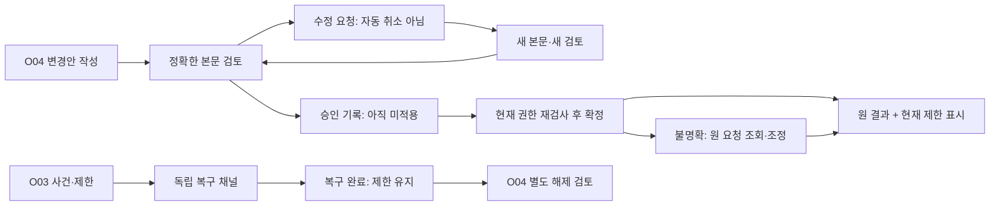

# 관리 증거의 운영 책임과 백오피스 승인 흐름

관리 증거의 발급·검증·보관 책임을 정의하고 기존 백오피스 O01~O04에 요청·승인·재검토·복구 결과 흐름을 연결한다. 역할은 논리 책임이며 3명의 개인 배정이나 실제 권한 등록이 아니다.

## 기존 설계와의 경계

- O04의 현재 계약은 API-088 감사 조회다. 아래 변경·승인 패널은 추가 설계 후보이며 API-088을 쓰기 경로로 전용하지 않는다. TMC-01~08도 아직 보호된 운영 명령 후보다.
- 역할 이름이 권한을 부여하지 않는다. 현재 environment/deployment/target/purpose 범위의 TrustPrincipal·TrustGrantRevision과 선택된 정책을 서버에서 검증한다. 로그인한 점주·FOTA 운영자·일반 감사 조회자는 관리 신뢰 승인자가 아니다.
- 화면 버튼과 서버 권한 검증을 분리한다. 버튼 비활성화는 안내이며 직접 호출·다른 탭·세션 재개에서도 동일한 현재 권한과 본문/revision 검사가 필요하다.
- 초기 신뢰나 정상 관리 경로가 깨진 때 일반 백오피스 로그인으로 복구 권한을 발급하지 않는다. 사전 독립 bootstrap/recovery 채널을 먼저 검증하고, 화면은 그 결과의 허용된 projection만 받는다.
- 승인 수·통제자 독립성·채널/인증 도구·보존 수치·키 suite는 미선택이다. 정책이 준비되지 않은 새 변경은 보류하며 독립적으로 허용된 조회·제한까지 일괄 차단하지 않는다.

## 역할과 권한의 구분

| 역할 | 수행 책임 | 자동 부여하지 않는 권한 |
|---|---|---|
| TOR-01 · 변경 요청자 | 현재 scope의 변경안·사유·공개 대상 diff 작성/제출 | 자기 권한 상승 승인, commit, 승인자 지정으로 권한 만들기 |
| TOR-02 · 독립 승인자 | 현재 승인권으로 정확한 TE-02 본문을 검토하고 TE-01 증거 발급 | 요청자와 같은 통제자의 독립 표 계산, 검토 중 본문 수정, 서비스 commit 가장 |
| TOR-03 · 신뢰 검증 서비스 | 선택된 verifier profile로 증거·현재 권한/시각/독립성을 검사하고 TE-03/05 생성 | 서명/PoP를 대신 생성, 검증 성공만으로 grant 활성화 |
| TOR-04 · 신뢰 변경 실행 서비스 | commit 직전 재검사와 CAS·단회 소비·원 결과/감사 기록 연결 | 브라우저 승인 수를 신뢰, 원 요청 불명확을 새 요청으로 재실행 |
| TOR-05 · 증거 보관 서비스 | 접근 통제된 불변 증거·결과·재사용 방지 기록 보관 및 승인된 폐기 실행 | 보관 담당이라는 이유로 승인/신뢰 복구, 소비 상태 수동 편집 |
| TOR-06 · 독립 최초 등록·복구 주체 | 사전 정책에 등록된 범위의 OOB 증거/복구 승인 제공 | 사건 발생 뒤 자기 자신을 복구자로 등록, 일반 운영자 세션으로 독립성 주장 |
| TOR-07 · 제한 담당 | 현재 명시된 범위의 제한 강화/철회 요청 | 제한 해제, 지갑 이동·초기화, 기존 서명 취소를 보장 |
| TOR-08 · 제한 해제 검토자 | 현재 별도 resume 권한으로 사건 종료 또는 bootstrap release와 소비자 준비 검토 | 복구 완료를 자동 정상화, 일반 승인권을 해제 권한으로 해석 |
| TOR-09 · 감사·원 결과 조회자 | 현재 허용된 범위의 감사/원 결과 조회; exact request read proof는 그 요청만 | 전역 검색·export·원 증거 전체 열람을 자동 부여, 조회로 변경 실행 |
| TOR-10 · 보존·삭제 검토자 | 선택 보존 정책과 진행 중 사건/복원 의존성을 검토해 정확한 삭제 계획 승인 | 기간 만료만으로 tombstone/checkpoint 삭제, 관리 증거 보존을 개인 원음 보존으로 확장 |

이 표는 기능 책임이다. 사람 수·인력 배치·공수와 승인 수를 연결하지 않았다.

## 증거별 발급·검증·보관

| 증거 | 발급/작성 역할 | 검증 역할 | 보관 | 읽기 |
|---|---|---|---|
| TE-01 | TOR-02, TOR-06 | TOR-03, TOR-04 | TOR-05 | TOR-09 |
| TE-02 | TOR-01 | TOR-03, TOR-04 | TOR-05 | TOR-09 |
| TE-03 | TOR-03 | TOR-03, TOR-04 | TOR-05 | TOR-09 |
| TE-04 | TOR-04 | TOR-03, TOR-04 | TOR-05 | TOR-09 |
| TE-05 | TOR-03 | TOR-03, TOR-04 | TOR-05 | TOR-09 |
| TE-06 | TOR-04 | TOR-03, TOR-04 | TOR-05 | TOR-09 |
| TE-07 | TOR-10 | TOR-03, TOR-05 | TOR-05 | TOR-09 |

**TE-01**: 승인/독립 복구 주체가 목적에 맞게 발급. 앱은 증거를 중계하며 발급자 서명을 대신하지 않는다. 기본은 마스킹된 요약. 원 증거 열람·export는 현재의 별도 범위가 필요하며 exact-request 독자는 해당 요청만 조회한다.

**TE-02**: 요청자가 변경안을 작성하고 서비스가 정규화 본문·digest를 확정. 승인자는 그대로 읽고 승인한다. 기본은 마스킹된 요약. 원 증거 열람·export는 현재의 별도 범위가 필요하며 exact-request 독자는 해당 요청만 조회한다.

**TE-03**: 원 승인별 유효성·독립성을 집계한 파생 기록. 집계 결과를 새 승인으로 세지 않는다. 기본은 마스킹된 요약. 원 증거 열람·export는 현재의 별도 범위가 필요하며 exact-request 독자는 해당 요청만 조회한다.

**TE-04**: 선택된 신뢰 경로의 challenge 발급과 원 요청별 예약/소비. 브라우저 생성 난수만으로 유효 challenge를 대체하지 않는다. 기본은 마스킹된 요약. 원 증거 열람·export는 현재의 별도 범위가 필요하며 exact-request 독자는 해당 요청만 조회한다.

**TE-05**: 검증 시점의 영수증. commit 서비스는 현재성을 재확인하며 과거 영수증으로 재승인하지 않는다. 기본은 마스킹된 요약. 원 증거 열람·export는 현재의 별도 범위가 필요하며 exact-request 독자는 해당 요청만 조회한다.

**TE-06**: 효과의 권위 있는 commit 근거에 따라 원 결과 기록. unknown은 추측으로 성공/실패 확정하지 않는다. 기본은 마스킹된 요약. 원 증거 열람·export는 현재의 별도 범위가 필요하며 exact-request 독자는 해당 요청만 조회한다.

**TE-07**: 삭제 계획의 대상/revision과 의존성 검토 기록. 실제 폐기는 보관 서비스가 최신 계획을 검사하고 수행한다. 기본은 마스킹된 요약. 원 증거 열람·export는 현재의 별도 범위가 필요하며 exact-request 독자는 해당 요청만 조회한다.

## 화면 흐름

선은 논리적 인계다. 아직 등록하지 않은 명령·API·실제 인증 채널을 구현한 것으로 보지 않는다.

## 기존 화면에 추가할 패널

### TOP-01 · O04 변경 목록·상세

- 표시: 현재 관리 조회 범위의 환경·대상·변경 종류·원 결과 상태·현재 제한·마지막 확인 시각
- 동작: 상세 열기 / 허용된 경우 새 변경 요청
- 실패/권한 경계: 목록 접근 불가와 결과 없음 구분. request 전용 read proof에는 전역 목록 미제공.

### TOP-02 · O04 변경안 검토·승인

- 표시: 변경 전후 공개 권한/키 fingerprint·용도·대상·정확한 본문 digest·revision·만료·승인 충족 여부
- 동작: 현재 독립 승인권이 있으면 승인 또는 검토 거절 / 요청자는 수정본 제출
- 실패/권한 경계: 정책 미선택·자기 승인·만료·stale revision은 보류 사유 표시. 비밀 입력란 없음.

### TOP-03 · O03 제한·복구 사건

- 표시: 사건 scope·현재 제한·복구 근거 검증 상태·원 case/request·결과와 재개 상태
- 동작: 허용된 제한 강화 / 사전 recovery 채널 안내 / 원 결과 재조회
- 실패/권한 경계: 일반 예외 담당은 복구 승인/강제 성공 버튼 없음. 채널 부재는 격리 유지.

### TOP-04 · O04 복구 결과·별도 해제 검토

- 표시: 당시 복구 결과 + 현재 anchor/grant/fence + 소비자 준비 상태 + 별도 해제 검토
- 동작: 원 결과 확인 / 현재 resume 권한으로 새 해제안 검토
- 실패/권한 경계: 복구 완료: 기능 제한 유지. unknown: 원 요청 확인 중. 화면 이탈·재로그인으로 새 case 자동 생성 금지.

### TOP-05 · O04 감사·보존 검토

- 표시: 변경 사유·허용된 행위자 식별·감사 참조·보관 범위·삭제 계획 대상/revision
- 동작: 감사 조회 / 별도 권한의 export / 보존 검토
- 실패/권한 경계: 보존 기간 밖은 원문 없음으로 표시. 원문 없음이 미실행을 뜻하지 않음. 전체 증거 일괄 내려받기 기본 제공 금지.

### TOP-06 · O01 가맹점·기기 영향 안내

- 표시: own scope의 기기 적용 지연·제한·재동기화 상태
- 동작: 허용된 원 업무 조회 / 현재 권한에 따른 상세 연결
- 실패/권한 경계: 고객 키·원음·위치와 관리자 승인자 구성은 노출하지 않음. 기기 관리권은 신뢰 변경권 아님.

### TOP-07 · O02 FOTA 영향 안내

- 표시: 선정 릴리스의 검증/철회 상태와 관리 신뢰 제한 상태를 별도 표시
- 동작: 기존 릴리스 업무 / 허용된 관리 상세 연결
- 실패/권한 경계: 릴리스 서명 키와 관리 anchor를 구분. FOTA 담당 권한을 신뢰 교체/해제 권한으로 확대하지 않음.

## 행위별 검토·실행 조건

### TOA-01 · 변경안 제출

- 책임 역할: TOR-01
- 명령 후보: TMC-02, TMC-03
- 증거: TE-02, TE-04
- 조건: 현재 author 권한+선택된 해당 변경 profile+immutable digest. 초안 보관은 권한 부여가 아니다.
- 결과: review_pending — 새 권한 없음

### TOA-02 · 검토 승인

- 책임 역할: TOR-02, TOR-06
- 명령 후보: TMC-01, TMC-02, TMC-03, TMC-06
- 증거: TE-01, TE-02, TE-03, TE-05
- 조건: 명령별 현재 승인권·정확한 subject·독립성·유효기간 확인. normal/ bootstrap/recovery 신뢰 경로는 서로 대체 불가.
- 결과: reviewed_not_active — 승인은 실행 완료가 아님

### TOA-03 · 검토 거절·수정 요청

- 책임 역할: TOR-02
- 명령 후보: TMC-02, TMC-03
- 증거: TE-02, TE-03, TE-05
- 조건: 현재 review 권한으로 거절 사유를 append한다. 하나의 검토 거절은 단독 veto나 승인 철회/실행 취소가 아니다. 집계 효과는 선택 정책으로 정한다.
- 결과: review_response_recorded — 거절 기록만으로 유효한 다른 승인이나 이미 발생한 효과를 취소하지 않음

### TOA-04 · 수정본 재제출

- 책임 역할: TOR-01
- 명령 후보: TMC-02, TMC-03
- 증거: TE-02, TE-04
- 조건: 변경 본문은 새 change/digest/challenge로 연결하고 이전 승인 자동 복사 금지. 이전 요청의 진행/결과를 확인하며 새 변경이 자동으로 이전 것을 취소하지 않는다.
- 결과: new_review_pending — 원 요청 unknown이면 충돌하는 새 효과 보류

### TOA-05 · 승인된 변경 확정

- 책임 역할: TOR-04
- 명령 후보: TMC-01, TMC-02, TMC-03, TMC-06
- 증거: TE-03, TE-04, TE-05, TE-06
- 조건: 명령별 선택 정책·현재 요청/승인권·독립성·신뢰/제한 revision·소비/restore·감사 조건을 commit에서 재검사. 사람의 UI 세션은 실행 서비스 권한을 대체하지 않음.
- 결과: committed_or_unknown — 최초 등록/복구는 제한 유지; 서버 확정과 모든 peer 적용을 구분

### TOA-06 · 원 결과 조회

- 책임 역할: TOR-09
- 명령 후보: TMC-08
- 증거: TE-06
- 조건: 현재 전용 read 범위 또는 exact request recovery read proof. mutation 승인 만료와 독립.
- 결과: original_outcome_projection — 원 결과와 현재 제한을 별도 표시; 조회에 의한 신뢰 변경 없음

### TOA-07 · 제한 강화

- 책임 역할: TOR-07
- 명령 후보: TMC-04
- 증거: TE-05, TE-06
- 조건: 현재 명시된 제한 scope. 축소/해제 금지. 원격 기록 불명과 로컬 비상 잠금을 구분하고 전달 결과를 확인.
- 결과: restricted_or_delivery_unknown — 미전달/offline 기기의 즉시 제한을 주장하지 않음

### TOA-08 · 복구 준비

- 책임 역할: TOR-06
- 명령 후보: TMC-05
- 증거: TE-02, TE-04, TE-05
- 조건: 사전 독립 복구 요청권+원 incident/case+현재 checkpoint; 일반 로그인으로 복구 주체 등록 금지.
- 결과: recovery_prepared — 아직 새 anchor 활성화 아님

### TOA-09 · 별도 제한 해제

- 책임 역할: TOR-08, TOR-04
- 명령 후보: TMC-07
- 증거: TE-01, TE-02, TE-03, TE-04, TE-06
- 조건: 현재 별도 resume 승인과 새 본문/challenge·사건 종료/초기 release·현재 consumer 준비. 실행 서비스에서 재검사.
- 결과: resumed_if_current — 복구 승인 재사용 금지; 명시된 scope만 재개

### TOA-10 · 증거 보존 검토·폐기

- 책임 역할: TOR-10, TOR-05
- 명령 후보: 별도 보존 작업 계약 미등록
- 증거: TE-07, TE-06
- 조건: 선택 보존 정책+현재 승인된 계획/revision+미확정 효과/사건/restore 의존성+generation seal. 별도 보존 작업 계약 후보이며 TMC나 API-088에 삭제 연산 추가하지 않음.
- 결과: retention_assessed_or_pruned — tombstone 제거만으로 원 요청을 fresh로 수용하지 않음

## 인계·재접속·예외 처리

| 흐름 | 전달 주체 | 전달 근거 | 실패/복구 |
|---|---|---|---|
| TOH-01 · 초안 → 검토 | 요청자 → 검증 서비스 → 승인자 | author identity·정확한 diff/digest·target/revision·challenge | 원문과 요약 불일치/필수 증거 누락이면 승인 불가 |
| TOH-02 · 검토 → 확정 | 승인자 → 검증 서비스 → 실행 서비스 | 명령별 유효 승인 집합·현재 권한·소비 상태·동일 본문 | 브라우저 reviewed 표시는 참고. commit 시각의 검사 실패는 보류/새 검토 |
| TOH-03 · 화면 이탈·세션 변경 | 브라우저 → 현재 인증/조회 경로 | 비밀 없는 원 요청 식별자와 서버 원 결과 | 계정 변경 시 이전 상세/승인 상태를 즉시 비우고 재인증. URL 식별자 자체는 접근권한 아님 |
| TOH-04 · unknown 조정 | 실행 서비스 → 원 효과 권위 저장소 → 감사/결과 projection | 원 case·소비/commit 참조·현재 fence | 수동 성공 처리·강제 재실행 없음. 원 증거 부족이면 unknown 유지 |
| TOH-05 · 복구 → 해제 검토 | 독립 복구 주체 → 실행 서비스 → 별도 해제 검토자 | 복구 결과·현재 제한·새 해제 본문·소비자 readiness | 복구 성공 알림은 해제 승인이 아니며 원 복구 결과는 보존 |
| TOH-06 · 보존 검토 → 폐기 | 보존 검토자 → 보관 서비스 → 감사 조회자 | 대상/revision·정책·열린 의존성·보호된 seal·삭제 결과 | 검토 후 incident/revision 변동이면 계획 재검토. 삭제 실패를 완료로 표시하지 않음 |

## 반드시 지킬 조건

- TOI-01: 역할 조합이 아니라 정확한 연산·환경·대상·현재 grant가 허용 기준이다. 승인자/요청자의 독립성은 계정 수가 아니라 통제 주체로 판정한다.
- TOI-02: 권한 상승 요청자가 자신의 승인자가 되지 않는다. 하나의 사람이 여러 서비스 역할을 운영하는 경우에도 서비스 credential과 업무 승인권을 혼동하지 않으며 독립성은 별도 검증한다.
- TOI-03: 서명 증거 발급·검증 영수증·실제 활성화·peer 적용을 다른 상태로 표시한다. 승인됨은 적용됨이 아니다.
- TOI-04: 수정 요청·거절·창 닫기·화면 재시도는 실행 취소가 아니다. 승인 철회/제한·precommit 취소가 필요하면 명시된 별도 정책/연산과 원 commit 경합 검사가 필요하다.
- TOI-05: 감사 권한, 목록 조회, exact-request 결과 조회, 증거 원문 조회, export 권한은 서로 자동 포함하지 않는다. 로그·알림·URL에 secret/proof 원문을 담지 않는다.
- TOI-06: 기기 재접속/앱 로그인을 관리 복구 승인으로 사용하지 않는다. 해당 장치에는 own 적용/제한 상태만 전달하고 운영 승인자의 신원 토폴로지를 전파하지 않는다.

## 확정 전 필요한 정책

- TP-01: 최초 등록의 독립 제출 채널과 evidence issuer — 미선택.
- TP-02: 명령별 승인 집계·거절/veto·철회 효력과 독립성 판정 — 미선택.
- TP-03: 실행/보관 서비스의 보호 저장소와 restore 증거 — 미선택.
- TP-04: 복구 주체의 실제 신원/채널과 장애 시 접근 경로 — 미선택.
- TP-05: 세션/현재성·승인 만료·재인증 기준 — 미선택.
- TP-06: 원 증거 열람/export/폐기의 세부 권한과 보존 정책 — 미선택.

## 검토 범위

문서 참조와 증거/역할/화면 연결을 확인하고, 합성 모델에서 조회 범위·민감 필드 차단·독립 승인·본문 변경·현재 권한 변경·응답 유실을 점검한다. 실제 IAM·암호·브라우저·서버 동시성·독립 복구 채널의 검증 결과는 아니다.

[검증 기록](trust-operations-validation.json) · [구조화 설계](trust-operations-design.json) · [승인 증거](management-trust-evidence.md) · [상위 관리 신뢰](management-trust-lifecycle.md)

다음 설계는 현재까지의 관리 신뢰 보완을 포함해 제품별 구현 전 인계 조건을 재점검하고, 미선택 정책 때문에 확정하지 못한 항목과 추가 설계 없이 구현 검증으로 넘길 항목을 구분한다.
