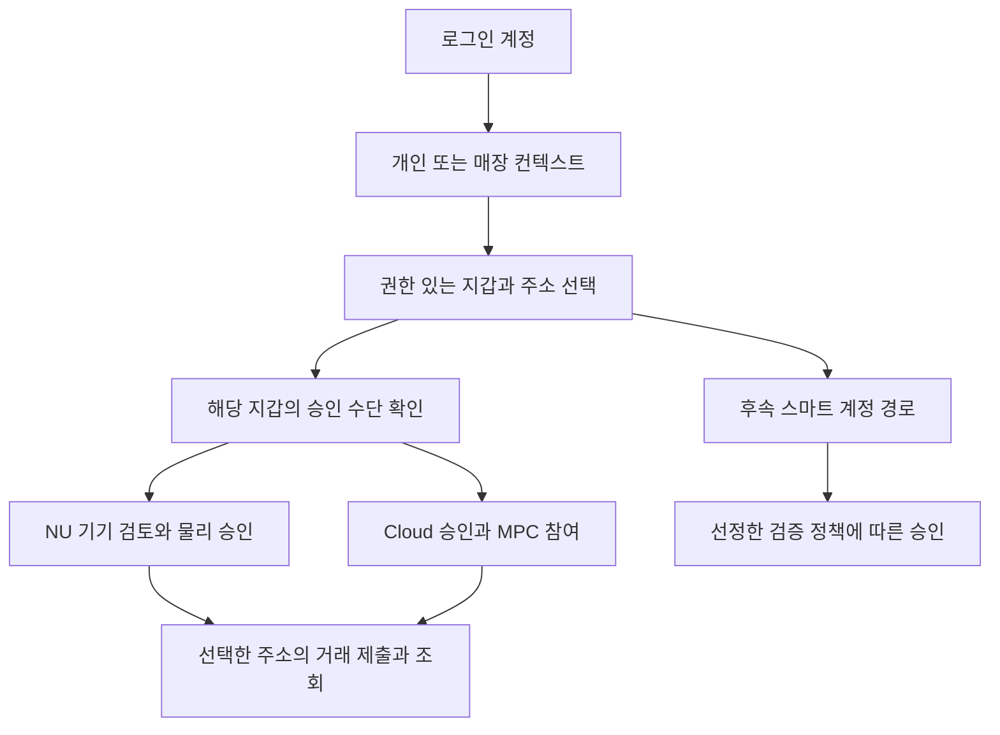

# HW·Cloud 지갑 — 사용 흐름과 키 통제·복구 경계

2026-09-18 · **상세 설계 제안, 제품 구현 미착수.** D03/D04/D09를 중심으로 D01/D02/D08/D11/D19에 연결한다. 전체 15개 요구·12주 앱 연동·3명·Zephyr 펌웨어 조건은 유지한다. 새 작업 패키지나 개인 배정은 추가하지 않는다.

앱에서는 **자산 주소와 승인 수단을 함께 보여주고, 선택한 지갑에서만 승인**하게 한다. HW는 NU 기기에서 서명하고 Cloud는 별도 MPC 경로에서 서명하는 기존 요구를 유지한다. HW와 Cloud를 별도 주소로 생성하는 방식, MPC 참여자 배치, 신규 여행 지갑의 복구 수단은 아직 제안이다.

[검토 사례·참조 원본](wallet-control-recovery-design.json) · [전체 설계 통합 현황](../planning/design-integration-register.md) · [IF-10/11](implementation-interfaces.md) · [복구·반납 후보](return-recovery-design.md)

후속 [지갑 API 계약 후보](wallet-api-contracts.md)에서 WC-C01/C03의 개인 지갑 선택·승인·제출 문맥을 상세화했다. 아직 기준 계약 병합과 실행 검증 전이다.

## 1. 앱에서 구분할 대상

| 대상 | 역할 | 다른 대상과의 관계 |
|---|---|---|
| 로그인 계정 | Google/Apple 로그인, 개인 기록과 매장 소속 접근 | 로그인 성공만으로 자금 서명이나 MPC 복구 권한이 생기지 않는다 |
| 체인 계정 | 체인 ID와 주소로 식별하는 자산·거래의 대상 | 계정별 잔액과 nonce를 조회한다. 앱 지갑 카드 수와 잔액 수는 다르다 |
| 지갑 연결 | 앱 사용자 또는 매장이 해당 지갑에 가지는 조회/사용 권한 | 주소를 알고 있다는 것만으로 개인정보·환불·서명 권한을 부여하지 않는다 |
| 서명 수단 | NU 키 서비스, Cloud MPC 참여자 조합 등 | 키 참조, 허용 형식, 현재 승인 조건을 가진다. 원시 키를 업무 API로 넘기지 않는다 |
| 대여 기기 연결 | 특정 대여자·대여 건·기기 세대의 권한 | 대여 종료와 체인 계정 삭제는 같은 사건이 아니다 |
| 스마트 계정 | 선택한 계정 모델의 실행·검증 규칙 | EOA 이후 같은 12주 범위에서 지원한다. EOA와 같은 주소/자산/복구를 자동 보장하지 않는다 |

기존 `walletId`는 업무 참조로 유지한다. 아래의 체인 계정/서명 수단 분리는 **개념 모델 후보**다. 기준 DB의 `wallets.kind/signer_ref`를 이미 다중 signer 모델로 변경했다는 뜻이 아니다.

화살표는 선택한 지갑에 허용된 경로다. 같은 결제에 두 경로가 동시에 서명하거나, HW 연결 실패 시 Cloud로 자동 전환하는 흐름은 아니다.

## 2. 세 가지 지갑 경로

| 경로 | 생성·연결 | 일상 승인 | 반납·분실 시 의미 |
|---|---|---|---|
| 기기 지갑 / 새 여행 지갑 | NU에서 생성하고 공개 주소와 소유 증명만 앱에 연결 | NU에 표시된 내용을 확인하고 기기에서 서명 | 별도 복구 수단이 없다면 기기 키 상실 후 접근을 보장할 수 없다. 늦은 입금 복구 정책 미답변 |
| 기기 지갑 / 기존 지갑 가져오기 | 앱의 민감 입력 경로에서 인증·암호화해 NU에 import | NU에서 서명. 기존 외부 지갑도 같은 키를 보유할 수 있음 | 외부 접근을 확인하고 기기 사본을 삭제한다. 외부 키·주소·기존 자산 전체를 없애거나 전액 이동시키지 않는다 |
| Cloud 지갑 / MPC | 소셜 계정과 연결하되 별도의 참여자 등록·분산 생성 절차 | 승인된 intent에 대해 허용된 quorum이 서명 | NU 반납과 독립적으로 유지. 폰 변경·복구는 참여자 교체 절차이며 소셜 재로그인만으로 완료되지 않음 |

**작업용 추천:** HW와 Cloud를 처음에는 독립 signer·별도 주소로 생성하고 한 앱에 나란히 표시한다. 지갑 간 자산 이동은 주소·체인·가스를 확인하는 송금으로 다룬다. 기존 HW 키를 Cloud에 복제하거나 가져온 니모닉을 자동으로 MPC로 전환하지 않는다. 이 추천은 D03 결정 전 후보다.

같은 기존 키를 다시 import하면 같은 파생 조건에서 같은 주소가 나올 수 있다. `chainId + address`를 정규화해 자산 합산에서 중복을 제외하고, 사용 가능한 승인 수단을 별도로 보여주는 안을 제안한다. 그렇다고 같은 주소를 가진 다른 앱 계정의 사적 기록이나 매장 권한을 병합하지 않는다. 파생 경로·passphrase·주소 확인 조건도 import 완료 검토에 포함한다.

같은 주소는 nonce도 공유한다. 제출 추적은 walletId만으로 분리하지 않고 체인/주소의 실행과 연결한다. 플랫폼 내부 예약만으로 외부 지갑의 송금을 잠글 수는 없다. 외부 거래가 같은 nonce를 사용하면 기존 거래의 대기·대체·실행 여부를 확인하고 새 견적/승인이 필요한지 판정한다.

## 3. 주요 화면과 일상 흐름

### 지갑 목록 U02

카드에 이름, 주소, 체인, 자산별 잔액/관측 시점, 승인 수단, 사용 상태를 표시한다. 예: `여행 기기 지갑 · NU 연결 필요`, `Cloud 지갑 · 사용 가능`, `Cloud 지갑 · 복구 진행 중`. 자산을 총액으로 보여줄 때에도 실제 결제 가능 잔액과 네이티브 가스는 선택한 주소 기준으로 판단한다. 같은 주소 중복 카드나 개인/매장 컨텍스트를 합산하지 않는다.

`지갑 없음`, `키 생성 진행`, `사용 가능`, `서명 수단 연결 필요`, `복구 중`, `반납으로 사용 제한`, `읽기만 가능`을 구분한다. 이들은 화면 표시 조건의 제안이며 기존 DB enum을 대체하지 않는다. 여러 제한이 겹치면 가장 제한적인 조건을 적용하고 서버·실기·체인 관측 시점을 표시한다.

### 생성·가져오기 U04

1. 등록 가능한 대여 기기와 현재 세대를 확인한다. 이전 반납이 완료됐다는 기록만으로 새 생성/import를 허용하지 않는다.
2. 사용자가 `새 여행 지갑` 또는 `기존 지갑 가져오기`를 선택한다. 새 여행 지갑에는 복구 준비 상태를 표시한다. 미정인 백업 기능을 제공 중인 것처럼 표시하지 않는다.
3. 새 지갑은 NU의 키 서비스에서 생성한다. import는 명시적으로 선택한 민감 입력 경로에서만 진행한다. 앱의 일반 상태 저장소·분석 이벤트·크래시 로그·백오피스로 원문을 보내지 않는다.
4. 기기 신원과 세션을 확인한 기밀 채널에 import 요청, 순서, 완료 transcript를 결합한다. 재연결은 새 세션의 유효성을 확인하며 비밀 입력을 일반 캐시에서 자동 복원하지 않는다. 정확한 키 교환·인증·AEAD profile은 IF-02/03의 후속 선정이다.
5. NU에 저장된 주소와 사용자가 의도한 주소/파생 조건을 대조하고 API-098로 공개 연결을 등록한다. 키 생성/import 성공과 서버 등록 성공은 별도 결과다. 서버 응답 유실 때 새 키를 만들지 않고 기존 결과의 소유 증명을 다시 확인한다.

전송 암호화는 외부 도청에 대한 설계다. 감염된 폰의 입력·키보드·런타임을 보호했다고 표현하지 않는다. 앱에서 입력하는 요구는 유지하되 native 입력·보호 메모리·로그 차단의 실제 보장 범위는 개발 단계에서 확인한다.

### Cloud 생성 U02

API-014의 `createRequestId → DKG session → 검증된 공개키/주소 → walletId` 관계를 같은 생성 작업에 고정하는 안을 사용한다. 참여자 등록·분산 생성·서버 연결이 모두 확인되기 전에는 `준비 중`이며, 임시 주소로 잔액/입금 화면을 열지 않는다. 응답 유실은 API-020의 원 operation을 조회한다. 부분 생성 자료가 남아 있으면 선정한 프로토콜에 따라 동일 작업을 복구하거나 정리한 뒤 명시적으로 다시 생성하며, 재시도가 자동으로 다른 지갑을 만들지 않게 한다.

### 결제·송금 U03

1. 개인/매장 컨텍스트 → 지갑/주소 → 체인/자산 → 수취·금액을 선택한다.
2. `walletId`, payer 주소, signer 참조/세대, binding 권한 revision, chain, nonce, 대상·금액·가스, 요청 종류·digest·기한을 같은 검토 건에 고정하는 안을 사용한다. 모든 필드가 기존 DTO에 있다는 뜻은 아니다.
3. HW는 NU에서 실제 payload와 대응하는 내용을 확인하고 물리 승인한다. Cloud는 앱 검토와 등록된 사용자 참여자 승인 후 MPC를 진행한다. 로그인 토큰은 거래 승인 증명으로 대체하지 않는다.
4. 서명 완료, 네트워크 제출, 체인 실행, 주문 결제 반영을 따로 표시한다. 제출 결과 불명확 시 원 intent/operation/transaction을 조회한다.
5. 사용자가 지갑을 바꾸면 기존 검토를 그대로 쓰지 않는다. 서명 전이면 이전 승인 요청을 안전하게 종료하고 새 견적/승인을 만든다. 서명 후이면 서명 데이터가 외부에서 제출될 가능성이 남으므로 기존 지급을 대사하기 전 중복 주문 결제를 자동 허용하지 않는다. 앱 취소·기한 만료는 이미 만들어진 EOA 서명의 온체인 무효화를 뜻하지 않는다.

HW 승인에 Cloud quorum을 강제하지 않는다. 반대로 Cloud 결제를 NU 승인처럼 표시하지 않는다. 거리 확인은 선택한 프로토콜의 추가 조건이며 서명권·소유권·사용자 확인을 대신하지 않는다.

### 점주 사용

동일 로그인으로 유저 앱의 개인 지갑과 `매장 자산` 컨텍스트를 전환한다. 매장 조회권, 환불 업무 승인권, 실제 수취 지갑의 서명권을 각각 검사한다. RN 키오스크에 로그인했다는 이유로 점주의 개인 자산이나 MPC 복구 수단을 보여주지 않는다. 환불은 원지급 allocation·수취인·가용 금액에 결합하며 임의의 다른 지갑에서 자금을 내는 것으로 자동 대체하지 않는다.

## 4. Cloud MPC 통제 모델 비교

**A=사용자 폰 참여자, B=서비스 참여자, C=독립 복구 참여자**인 2-of-3을 비교 기준으로 둔다. C의 실제 운영 주체·신원 확인·사용자 통제 방식은 미선정이다. 아래 내용은 이 구조를 채택했을 때 필요한 조건이며 확정된 서비스가 아니다.

| 상황 | 사용할 조합 후보 | 필요한 조건·남는 한계 |
|---|---|---|
| 평소 서명 | A+B | 사용자 intent 승인·참여자 권한·세대·round 검사. C를 일상 서명에 자동 사용하지 않음 |
| 폰 분실로 A 접근 불가 | B+C를 통한 새 A 등록/교체 | 기존에 등록한 복구 근거와 별도 사용자 확인 필요. 동일 Google/Apple 세션만으로 두 참여자를 해제하지 않음 |
| 서비스 B 장기 중단 | A+C를 통한 복구 또는 자산 이동 | B의 API·배포·DNS·로그인에 의존하지 않는 실행 경로가 있어야 함. C 존재만으로 서비스 독립 복구 완료가 아님 |
| A와 B 모두 접근 불가 | C만 남음 | 임계값 부족. C 하나로 복구하거나 NU 키를 대신 쓰지 않음 |
| C 유실, A+B 정상 | A+B를 통한 복구 참여자 교체 | 선정한 프로토콜이 지원하는 membership 변경 및 이전 C의 권한 처리 필요 |
| A+B 또는 B+C가 함께 침해/공모 | 임계값 충족 가능 | 2-of-3만으로 막을 수 없음. 특히 B+C는 사용자 폰 없이도 quorum이 될 수 있음을 설명해야 함 |

서버 관리자 한 명이 B와 C의 저장소·백업·복구 권한을 모두 제어하면 운영상 독립성이 부족하다. 별도 프로세스·DB 두 개라는 설명만으로 독립 복구 주체라고 부르지 않는다. 복구 참여자의 권한을 줄이려면 사용자 보유 증명과 독립된 보호 경계를 구체적으로 정의해야 하며, 임계값 자체가 B+C의 암호학적 능력을 제거해주지는 않는다.

| 비교안 | 장점 | 명시해야 할 대가 | 상태 |
|---|---|---|---|
| A+B+C 2-of-3, C 독립 운영 | 폰 분실과 서비스 중단을 다른 조합으로 다룰 수 있음 | B+C의 사용자 부재 quorum·C의 신뢰/가용성·복구 증명 설계 | 기존 TECH-12의 우선 검토 후보 |
| 사용자 통제 복구 수단을 가진 C | 복구 참여에 사용자 통제를 더 둘 수 있음 | 수단 분실·새 폰 복원·안전한 보관 책임, 두 사용자 수단 동시 유실 시 복구 제한 | 비교 후보 |
| A+B 2-of-2 | 복구 참여자 운영이 단순해짐 | 한쪽 상실/장기 중단을 그 두 share만으로 해결할 수 없음; 별도 복구 설계 필요 | 비교 후보, 복구 요구 충족으로 간주하지 않음 |

NIST는 임계 암호를 비밀을 여러 주체에 분산하고 연산 중에도 전체 키를 재구성하지 않는 방식으로 설명한다. 따라서 이 제품에서도 조각 파일을 한 프로세스에서 합쳐 서명하는 구현을 MPC 완료로 인정하지 않는다. 이것은 특정 라이브러리나 2-of-3 배치를 NIST가 승인했다는 뜻은 아니다. [NIST Multi-Party Threshold Cryptography](https://csrc.nist.gov/projects/threshold-cryptography)

## 5. 복구 작업의 시작·종료 기준

Cloud 복구는 `신청 → 증명 확인 → 교체 준비 → 참여자 교체 → 새 상태 확인 → 완료`로 나누는 논리 후보다. API-016/020의 operation으로 추적하며 세부 DTO/상태 enum은 아직 병합하지 않는다.

- **신청:** 대상 wallet과 복구 이유를 고정하고 기존 operation 중복 여부를 확인한다. 계정 로그인 복구와 MPC share 복구를 분리한다.
- **증명 확인:** 선정한 복구 정책과 독립 증거로 권한을 확인한다. 지원 담당자는 상태 확인·심사를 도울 수 있지만 단독으로 quorum을 대체하지 않는다. 증명 원문은 일반 감사 로그에 남기지 않는다.
- **교체 준비:** 현재 참여자 세대와 진행 중인 서명 세션을 확인한다. 안전 우선 제안으로 해당 Cloud 지갑의 새 서명을 제한하되, 이미 서명/제출된 거래는 계속 관측한다. HW 별도 지갑까지 자동 정지시키지 않는다. 계정 탈취 사건이면 별도의 권한 철회 범위를 적용한다.
- **교체:** 프로토콜 지원에 따라 분산 교체/refresh를 수행한다. 부분 성공·응답 유실은 같은 operation을 재조회한다. 서비스 메타데이터에 완료를 썼다는 이유로 모든 참여자의 변경을 완료로 추정하지 않는다. 구세대 서명 세션·라운드·사전 생성 자료의 종료/폐기 조건과 새 세대 활성화를 연결하고 서로 다른 세대의 자료를 섞지 않는다. 실제 barrier·저장 원자성은 후속 계약에서 정한다.
- **확인:** 새 참여자 접근, 주소/공개키의 기대값, 참여자 세대, 구세대 요청 거절을 확인한다. 주소를 유지한 share 교체와 새 키/주소로의 자산 이동은 구분한다.
- **완료:** 복구된 권한과 남은 제한을 사용자에게 보여준다. 시험 서명을 실제 송금이나 임의 동의로 재사용하지 않는다. 검증 전에는 `복구 완료`를 표시하지 않는다.

**철회의 범위:** 서비스가 이전 참여자 세션을 거절할 수는 있어도 이미 유출된 유효 quorum이나 전체 키를 체인에서 소급 무효화하지는 못한다. 같은 공개키를 유지하는 share refresh를 키 유출의 자동 치료로 표현하지 않는다. 침해가 의심될 때는 새 키/주소와 자산·권한 이동을 별도 사건 대응안으로 다룬다. 일반 EOA가 개인키로 통제되는 계정이라는 성질에 따른 설계상의 한계다. [Ethereum accounts](https://ethereum.org/developers/docs/accounts/)

## 6. 장애·반납·탈퇴에 따른 결과

| 사건 | HW 신규 여행 | HW import | Cloud MPC | 앱에서 보여줄 결과 |
|---|---|---|---|---|
| 휴대폰 교체, NU 보유 | 현재 대여/기기 증명으로 앱 연결 재설정 후보 | 동일 | 별도 참여자 이전/복구 | 로그인 완료와 사용 가능 복구를 구분 |
| NU 분실, 폰 보유 | 외부 복구 없으면 키 접근 복구 보장 불가 | 외부 지갑 접근 확인 가능 | 자체 조건 충족 시 계속 사용 | 플랫폼 기기 연결 차단이 온체인 키 철회는 아님 |
| 폰과 NU 동시 분실 | 독립 복구 수단 여부에 따름 | 외부 원지갑 복구 여부에 따름 | 선택한 quorum과 증명 확보 여부에 따름 | 임계값 부족을 지원팀의 임의 재발급으로 처리하지 않음 |
| 정상 반납 | 자산·가스·미확정 거래·자격·영수증·늦은 자산 복구 점검 후 reset | 외부 접근 확인 후 NU 사본 정리; unrelated 자산 전액 이동 강제 금지 | NU 반납 때문에 Cloud share를 지우지 않음 | 원반납 종료와 기기 재대여 허용을 구분 |
| 반납 뒤 늦은 입금/환불 | 기존 복구 정책에 따라 접근 가능 여부 결정 | 외부 signer로 접근 | 해당 Cloud 주소에 도착하면 Cloud 권한으로 접근 | 기존 주소로 온 자산을 현재 선택 지갑에 도착한 것처럼 표시하지 않음 |
| 로그아웃 | 일반 앱 세션 종료, NU 키 삭제와 분리 | 동일 | 로컬 참여자 보관·잠금 정책에 따라 재인증 | 캐시 지우기와 키 삭제/복구를 구분 |
| 소셜 제공자 사용 불가 | 계정 접근과 NU 자산 통제는 별도 | 동일 | 소셜 로그인에만 의존하지 않는 사전 복구 근거 필요 | 이메일 문자열 일치만으로 계정 자동 병합 금지 |
| 서비스 탈퇴 | 자산·기록·대여 종료 조건 검토 | 외부 지갑 키 삭제 아님 | 서비스 의존성과 사전 접근 확보 확인 | 탈퇴 요청·데이터 삭제·키 접근 상실을 따로 표시 |

반납 후 기록 접근은 자산 키와 별개로 관리한다. 계정에 연결한 영수증·스탬프·여행 기록은 원래 권한으로 조회한다. 미연결 익명 ticket만 남기고 payer 키를 삭제하면 사후 claim이 가능하다고 보장하지 않는다. 녹음 파일/전사·위치 데이터 역시 Cloud Wallet 복구 성공만으로 복원되지 않는다. 각 저장·동의 정책을 따로 적용한다.

대여 기기의 passkey는 wallet EOA 키나 MPC share와 같은 객체로 취급하지 않는다. 서비스별 다른 로그인/복구 경로를 확보한 뒤 등록 해제·기기 자격 삭제를 처리한다. NU가 유일한 인증 수단이면 반납이 계정 잠금으로 이어지지 않도록 U24에서 별도로 확인한다.

## 7. 남은 정책 선택 — 확정하지 않은 사항

| ID | 기존 결정 | 작업용 제안·선택 영향 | 현재 상태 |
|---|---|---|---|
| WC-P01 | D03 | HW·Cloud 별도 주소/서명 수단으로 시작. 하나의 키/주소 공유를 원하면 별도 보안·수명주기 설계 필요 | 제안, 선택 안 됨 |
| WC-P02 | D04 | A+B+C 2-of-3 우선 비교. C 운영 주체, 사용자 확인, 서비스 중단 경로와 B+C 권한을 결정 | 제안, 선택 안 됨 |
| WC-P03 | D03/D09, RR-DEC-01 | 신규 여행 지갑에 본인 전용 암호화 복구 백업 추가 / 복구 수단 없으면 초기화 보류 | **기존 질문 답변 대기**, 재질문하지 않음 |
| WC-P04 | D03/D04/D19 | 로그아웃은 세션 종료·참여자 잠금 우선, 키 삭제는 별도 명시 행동. 탈퇴 전에 자산 접근·복구 확인 | 제안, 보관/삭제 정책 미선정 |

WC-P03을 선택하기 전에는 export 기능을 구현 대상으로 확정하지 않는다. 수취 주소를 하나 지정했거나 현재 잔액이 0이라는 사실만으로 미래 입금·환불 복구가 해결됐다고 보지 않는다. 복구 목적지로 Cloud 지갑을 지정하더라도 **기존 HW 주소에 대한 signer 복구**가 자동 생기지는 않는다. 필수 복구 조건 미충족 시 새 파괴적 reset commit을 발급하지 않는 기존 후보 제한을 유지한다.

## 8. 기존 명세에 반영할 차이

| 연결 | 이번에 구체화한 내용 | 후속 반영물 |
|---|---|---|
| U02/U03, API-007/008/009 | 주소 중복 합산 방지, 개인/매장 조회, signer 사용 가능 상태 | 역할별 WalletView·잔액 projection. 기준 `wallets` 모델과 다중 signer 관계 결정 |
| U04, API-098, IF-02/03 | 기기 생성/import와 서버 등록 분리, 주소·파생 조건 확인 | 재등록/응답 유실 처리, 연결 증명과 import 프로파일 |
| U03, API-015/017/018/019/020, IF-10 | signer·binding revision·digest 고정, 지갑 변경/기존 서명 처리 | 승인 문맥·멱등 처리·서명 후 중복 지급 방지 계약 |
| U12, API-014/016/020, IF-11 | 참여자 등록·독립 복구 증명·교체 과정·서비스 중단 | MPC provider/epoch/operation/보호 증명 저장과 오류 계약 |
| U24/U04/U05, API-046/047/091 | 신규/import/Cloud 분기와 늦은 자산·자격 처리 | 기존 반납 프로토콜 후보에 정책 선택 결과 연결; 임의로 재작성하지 않음 |
| U13, API-055/056 | EOA 주소와 스마트 계정의 signer 관계 | 전환 모델·계정 검증·자산/권한/기록 이동 계획 |
| API-008, SHOP-06, U25 | 매장 조회·환불 승인·서명권과 탈퇴/계정 복구 분리 | 역할별 접근 매핑·감사·복구 권한 명세 |

이 문서는 기존 API 107개·BLE 논리 명령 34개·화면 37개·참조 DDL을 변경하지 않는다. 위 표는 병합 전 변경 대상이며, provider API나 미정 타입을 호출 가능한 서비스로 표시하지 않는다. 실제 MPC·Zephyr 키 저장·암호화 import·모바일 이전·스마트 계정 호환 시험은 개발 단계에 남긴다.

기존 19개 결정을 닫거나 12주 기능을 제외하지 않는다. 다음 기술 설계는 **지갑 선택·승인 문맥을 기존 전체 API 계약에 연결하는 작업**이다. 복구 정책 미답변과 무관하게 진행할 수 있는 읽기/선택/요청 결합을 먼저 다룬다.

## 9. 개발 단계에서 확인할 검토 사례

아래 21개는 기대 결과를 정리한 사례다. 암호·실기·앱 시험을 실행한 결과가 아니다.

| 사례 | 입력/사건 | 기대 결과 |
|---|---|---|
| WC-01 NU 미연결 시 자동 전환 | NU가 없는 상태로 HW 지갑 결제 요청 | Cloud로 자동 전환하지 않고 해당 NU 연결을 안내한다 |
| WC-02 로그인과 서명 분리 | 소셜 로그인 토큰만 제출 | 조회/등록의 허용 범위만 적용하고 MPC 서명·복구를 승인하지 않는다 |
| WC-03 주소 중복 표시 | 동일 EOA를 여러 NU에 import | 체인/주소별 잔액을 중복 합산하지 않으며 현재 컨텍스트의 승인 수단만 보인다 |
| WC-04 외부 nonce 경쟁 | 외부 원지갑이 동일 nonce 거래를 먼저 제출 | 원거래의 대체/실행/대기를 확인하고 필요 시 새 승인; 외부 제출 잠금 보장 금지 |
| WC-05 서명 전 지갑 변경 | 견적 후 payer 지갑이나 개인/매장 컨텍스트 변경 | 기존 review를 재사용하지 않고 새 권한·견적·승인 결합을 만든다 |
| WC-06 서명 후 연결 유실 | 서명 결과가 전달된 뒤 제출 여부 불명확 | 원 intent/operation/tx 대사; 취소/기한으로 체인 서명 무효화 또는 자동 재결제 금지 |
| WC-07 매장 조회권 오용 | 매장 자산 조회자 또는 같은 주소의 개인 사용자가 환불 서명 요청 | 현재 매장 binding·환불 업무 승인·실제 signer 권한을 각각 검사 |
| WC-08 import 등록 응답 유실 | NU import 성공 후 API-098 응답 유실 | 공개 결과/소유 증명으로 원결과 조회·연결; 새 키 생성과 비밀 캐시 재전송 금지 |
| WC-09 미인증 import 수신자 | 가짜 장치/이전 세션에 암호화만 하여 키 전송 시도 | 인증된 현재 기기/세션 결합 전에는 전송을 허용하지 않는다 |
| WC-10 MPC 생성 응답 유실 | DKG 일부 또는 전부 완료 후 서버 등록 응답 유실 | 같은 createRequestId/session/public key 관계 복구; 다른 주소 자동 생성·임시 입금 주소 금지 |
| WC-11 복구 참여자 재발급 우회 | A 유실 후 동일 소셜 로그인만으로 C 재발급 요청 | 소셜 인증만으로 B+C 복구 quorum 해제 금지; 독립 사전 복구 근거 확인 |
| WC-12 서비스 중단 | B API/로그인/인프라 사용 불가 | A+C가 B에 의존하지 않는 검증된 경로를 갖추기 전 복구 가능으로 표시하지 않는다 |
| WC-13 임계값 부족 | 2-of-3 후보에서 C만 접근 가능 | 임계값 부족으로 차단; 지원팀 또는 NU 키로 대체 서명하지 않는다 |
| WC-14 교체 중 구세대 요청 | participant 교체 중 기존 round/사전 생성 자료 도착 | 구세대 처리/새세대 활성화 규칙 적용; epoch 혼합 금지, 이미 완성된 서명은 별도 관측 |
| WC-15 이미 유출된 quorum | 유효한 두 share가 외부로 유출된 후 refresh 수행 | 서비스 철회만으로 키 안전 회복 선언 금지; 새 키/주소·자산/권한 이동 필요성 별도 평가 |
| WC-16 복구 수단 없는 신규 반납 | 신규 여행 지갑 잔액 0, RR-DEC-01 미답변 | 미래 입금 복구 해결로 보지 않고 필수 조건 미충족이면 새 reset commit 금지 |
| WC-17 import 반납 | 외부 지갑 접근이 남아 있는 기존 지갑 반납 | 외부 접근 확인 후 NU 사본 삭제 범위를 적용; unrelated 자산 전액 회수·외부 키 삭제 주장 금지 |
| WC-18 Cloud 잔액과 NU 반납 | NU를 반납하지만 Cloud 지갑에 자산과 기록 존재 | Cloud share 자동 삭제 금지; 영수증/기록과 기기 자격 수명주기 별도 |
| WC-19 유일한 passkey 반납 | NU 자격만으로 서비스에 로그인 가능 | 대체 로그인/복구 조건을 별도 확인; MPC 지갑 복구를 passkey 복구로 대체하지 않는다 |
| WC-20 스마트 계정 전환 | EOA에서 선택한 스마트 계정 모델 전환 | 주소·검증 정책·자산·기록/권한 변경을 검토하고 실제 결과 확인 전 자동 이전 표시 금지 |
| WC-21 탈퇴와 복구 | 소셜 탈퇴 또는 동일 이메일의 다른 제공자 로그인 | 이메일만으로 계정 병합/키복구 금지; 자산 접근·대여·데이터삭제 결과를 분리 |
