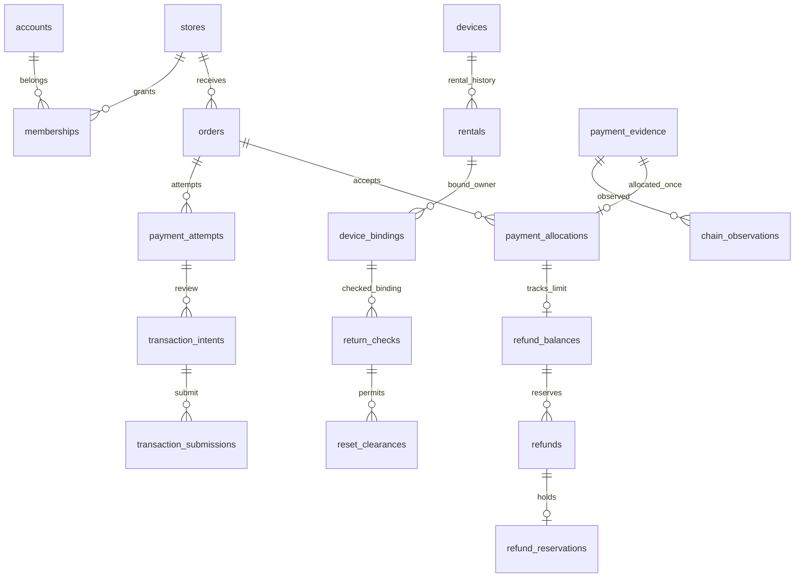

# 데이터베이스 테이블·관계·마이그레이션 명세

2026-09-18. **전체 15개 기능을 앱 연동까지 12주 안에 완료**하는 계획의 데이터 저장 설계다. 61개 업무 테이블을 7개 마이그레이션으로 작성했다. PostgreSQL은 구체적인 DDL을 검토하기 위한 **참조 엔진 제안**이며, 운영 DB 선정이나 배포를 완료한 것은 아니다. 기존 indexer-go 저장소는 유지하고 여기에는 앱 업무 원장·관측 연결·조회 projection을 둔다.

[테이블·컬럼 사전](tables.md) · [구조 원본/마이그레이션 해시](schema-catalog.json) · [검증 결과](validation-result.json) · [저장 작업 16개](../storage-operations.md)

## 1. 저장 영역과 경계

| 영역 | 주요 테이블 | 담는 데이터 |
|---|---|---|
| 계정·플랫폼 | accounts, auth_identities, memberships, operations, idempotency_records, outbox/inbox | 계정/권한 연결, 요청 수명주기, 중복 제거 |
| 지갑·기기 | wallets, wallet_bindings, devices, rentals, device_bindings, enrollments | 지갑 주소/서명 참조, 소유/대여, 등록 challenge |
| MPC | mpc_participants, signing_sessions | 참여자/격리 저장소 참조, 서명 요청 digest/진행 상태 |
| 카페 원장 | orders, order_lines, payment_attempts, payment_allocations, refunds | 주문 snapshot, 지급 귀속, 별도 환불 |
| 체인 연결 | transaction_intents/submissions, payment_evidence, chain_observations | 승인 요청, 제출과 번들 관계, 지급 정체성과 관측 이력 |
| 정산·혜택 | refund_balances/reservations, settlements/revisions, benefit_entries/redemptions | 예약/완료 금액, 마감 snapshot, 적립·사용·보정 |
| 기기 수명주기 | return_checks, reset_clearances, firmware_releases, device_jobs | 반납 점검, 초기화 허가/증거 참조, 업데이트 상태 |
| 개인 데이터 | consents, recordings, processing_jobs, privacy_requests, data_lineage | 동의와 처리 작업, 원음/결과 참조, 삭제 영향 |
| 온체인 제품 | credential_metadata/status_history, paid_resource_requests, entitlements, market_quotes, chain_projections, keeper_jobs | 자격 상태, 이용권, 견적, 상품 조회/실행 상태 |
| 여행 | places, store_place_links, reviews, trips, travel_evidence, itineraries, participations, challenge_entries | 장소 출처, 후기/방문·구매 증거, 코스와 챌린지 |

HW private key·니모닉·MPC 전체키 컬럼은 없다. `share_store_ref`, `private_content_ref`, `cloud_object_ref`는 별도 보호 저장소 참조이며 공개 URL이라는 의미가 아니다. 모바일 로컬 원음을 서버에 자동 복제하지 않는다. profile별 임의 payload가 일반 DB JSON에 들어가기 전에 허용 schema·민감정보 제외를 검사한다.

## 2. 주요 관계



전체 FK/컬럼은 [테이블 사전](tables.md)을 따른다. 그림은 핵심 관계만 표시한다.

### 잘못된 소속 연결 방지

- 주문의 수취 설정은 `(recipient_config_id, store_id)`로 같은 매장인지 확인한다.
- device binding은 `(rental_id, device_id, account_id)`로 같은 대여/기기/사용자인지 확인한다.
- return check는 `(binding_id, rental_id, wallet_origin)`을 결합해 다른 대여 또는 신규/import 구분을 바꿔 붙일 수 없게 한다.
- observation은 지급 evidence와 chain/txHash를 결합한다. allocation은 observation/evidence 및 attempt/order/asset를 함께 참조한다.
- refund balance는 allocation/order/asset, refund는 balance/order/asset를 결합해 다른 주문의 환불 한도를 소비하는 관계를 차단한다.

## 3. 타입·고유키·금액

`app_id`는 기존 API ID 형식과 같은 문자·길이 제약을 가진다. 주소/hash는 DB에 소문자 hex로 정규화한다. API의 원래 표시 문자열과 DB 정규화 정책을 혼동하지 않는다.

금액은 부동소수점이 아닌 numeric domain이다. `uint256_amount`는 음수·소수·uint256 초과를 거절하고, `atomic_total`은 기간 집계 등 단일 거래 상한을 넘을 수 있는 정수 합계용이다. 소수를 반올림해 받아들이지 않도록 scale을 0으로 강제 변환하는 대신 값의 정수성을 CHECK로 검사한다.

현재 활성 기기 대여, 활성 소유 binding, 현재 수취 설정, 현재 동의는 조건부 고유 인덱스를 사용한다. 서로 다른 상태의 과거 이력은 남길 수 있다. PostgreSQL의 부분 고유 인덱스와 FK 대상 고유성 규칙에 맞춰 작성했다. [공식 제약 조건 문서](https://www.postgresql.org/docs/15/ddl-constraints.html)

### EOA와 UserOperation 제출

- EOA: `(chain_id, tx_hash)`를 고유하게 관리한다.
- UserOperation: `(chain_id, userop_hash)`가 고유하다. 외부 txHash는 번들 관측 전 null일 수 있다.
- 여러 UserOperation이 같은 외부 번들 txHash를 공유할 수 있다. 외부 txHash 조회 인덱스는 이 경우 고유하지 않다.
- 지급 증거는 실제 ERC20 log 또는 네이티브 거래로 식별한다. 일반 네이티브 거래에는 가짜 logIndex를 만들지 않는다.

## 4. DB가 보장하는 것과 서비스가 검사할 것

| 항목 | DDL 제약 | 별도 서비스/transaction 책임 |
|---|---|---|
| 환불 | 동일 order/asset 관계, 금액 타입, counter의 reserved+confirmed≤policy_refundable | 모든 예약/완료/해제가 counter와 reservation을 함께 바꾸도록 잠금·권한·상태 검사 |
| 반납 | 동일 rental/binding/origin, 활성 대여/소유 고유성 | 필수 점검 목록·proof 진위·기한·물리적 초기화와 현재 상태 재검사 |
| 지급 | evidence/observation/attempt/order/asset 관계·고유 배정 | 서명/수취/금액·확정 정책·재구성 보정 |
| 권한 | FK와 소속 데이터 | 다른 매장/계정 조회 차단·역할·서명 권한; 현재 DDL은 RLS/GRANT 배포안 아님 |
| snapshot | 필수 필드와 소속 관계 | 과거 메뉴/수취/견적/마감 데이터를 수정하지 않는 write API·권한 |
| JSON | JSONB 저장 타입 | profile별 schema·금액/시각 관계·필수 점검·민감 필드 검증 |
| 원장 이벤트 | inbox/event 고유성 | 상태 변경+outbox 동일 transaction, 재시도·순서 보정 |
| 혜택 | 한 grant의 활성/사용 redemption 고유성 | 누적 스탬프 잔액·혜택 규칙·동시 사용·보정 |

SQL CHECK만으로 다른 테이블 전체의 환불 합계나 권한을 보장한다고 가정하지 않는다. 관련 원장 행을 잠그고 같은 transaction에서 counter/예약/이벤트를 바꿔야 한다. 같은 행의 동시 갱신 제어는 PostgreSQL의 행 잠금 규칙에 맞춰 구현할 대상이다. [공식 잠금 문서](https://www.postgresql.org/docs/15/explicit-locking.html)

61개 테이블은 전체 제품의 저장 경계를 드러낸 참조 설계다. 상품별 profile가 정해지면 chain_projections·quote JSON 등의 상세 필드를 더 제한해야 한다. 범용 텍스트 상태/외부 참조의 존재가 상태 전이나 증명 검증을 대체하지 않는다.

## 5. 마이그레이션 순서와 검토 관문

| 순서 | 파일 | 적용 후 확인 | 다음 단계 의존 |
|---|---|---|---|
| 001 | [계정·공통 기반](001_identity_foundation.sql) | ID/금액 domain, identity·매장·자산·멱등/event | 나머지 전부 |
| 002 | [지갑·기기](002_wallet_device.sql) | wallet·대여·binding·MPC 참조 | 결제 signer/반납 |
| 003 | [카페·결제 원장](003_commerce_ledger.sql) | snapshot·제출·evidence·환불·정산·혜택 | 반납 검사/여행 결제 출처 |
| 004 | [기기 수명주기](004_device_lifecycle.sql) | return checks·clearance·FOTA | 기기 운영 |
| 005 | [개인정보·녹음](005_privacy_recording.sql) | 동의·기록·job·삭제 계보 | 여행/AI |
| 006 | [온체인 제품](006_onchain_services.sql) | 자격·유료 자원·시장 조회/keeper | 앱 상품 화면 |
| 007 | [여행·챌린지](007_travel_challenges.sql) | 장소·후기·여행·코스·증거 | 전체 여행 흐름 |

각 파일은 BEGIN/COMMIT 단위다. 이미 적용한 파일을 편집해 다시 실행하지 않고, 원래 파일 해시와 schema_migrations version을 대조한다. 변경은 새 migration으로 추가한다. 이 참조 설계에는 데이터 파괴형 down migration을 넣지 않았다.

신규 빈 DB에서는 위 순서로 적용한다. 데이터가 있는 DB로 옮길 때는 다음 절차를 별도 migration에 작성한다.

1. 새 nullable 필드/테이블을 추가하고 기존 앱과 읽기 호환을 유지한다.
2. 작업 cursor·원천 version을 기록해 backfill하고 누락/중복/오류를 대조한다.
3. 새 쓰기 경로와 상태/권한 검증을 연결한다. 필요한 기간만 호환 경로를 유지한다.
4. 유효성을 확인한 뒤 NOT NULL/고유/FK 제약과 새 읽기를 전환한다.
5. 모든 사용자가 전환된 후 별도 변경으로 과거 필드를 정리한다. 반납/개인 자료 삭제 기록을 복원 과정에서 재적용한다.

실패한 파일은 transaction rollback 후 원인을 수정한 새 참조안으로 빈 검증 DB에서 다시 확인한다. 운영 중 forward fix·백업 복구·배포 중단 기준은 운영 런북과 함께 확정한다. migration 실행 권한과 앱 읽기/쓰기 권한을 분리하는 배포 단계도 남아 있다.

## 6. 확인한 결과

설치된 **PostgreSQL 15.12**의 별도 임시 클러스터에서 7개 DDL을 실행했다. 61개 업무 테이블과 migration 기록 테이블 1개가 생성됐고, [19개 제약 사례](constraint-cases.json)가 기대대로 통과했다. 기존 DB를 연결하거나 네트워크 리스너를 시작하지 않았으며 종료 후 임시 클러스터를 삭제했다. [실행 결과와 파일 해시](validation-result.json)

검사에는 uint256 최대값/초과·소수·음수, 활성 대여 중복, 다른 매장/대여자/관측/주문/자산 연결 거절, 환불 예약 상한, 반납 binding/origin, 같은 번들의 복수 UserOperation이 포함된다.

검증은 single-user 모드의 **DDL 실행과 순차 제약 검사**다. 다중 세션 경쟁·잠금·앱 권한·실제 블록체인·실기 초기화 검증은 하지 않았다. PostgreSQL도 single-user 모드에서는 실제 프로세스 간 잠금 동작을 재현하지 않는다고 명시한다. [공식 single-user 설명](https://www.postgresql.org/docs/15/app-postgres.html)

재현 명령:

```bash
python3 content/specifications/database/validate_reference.py --pg-bin /path/to/postgresql/bin
```

검증기는 지정된 PostgreSQL 실행 파일로 새 임시 디렉터리만 만들며 기존 연결 URL/DB 데이터를 사용하지 않는다. 환경에서 공유 메모리 생성이 제한되어 있으면 해당 로컬 검증 실행의 권한이 필요할 수 있다.

## 7. 다음 구체화

각 테이블의 읽기/쓰기 역할과 서비스 transaction 경계를 실제 API에 연결하고, 선택해야 할 프로토콜·계정·시장 profile을 배포 manifest 항목으로 나눈다. 이후 실제 ABI/주소·펌웨어 전송 profile·환경 설정을 채워 구현 입력으로 만든다. 전체 기능 범위와 12주 전제, 역할·공수 배정 보류는 유지한다.
