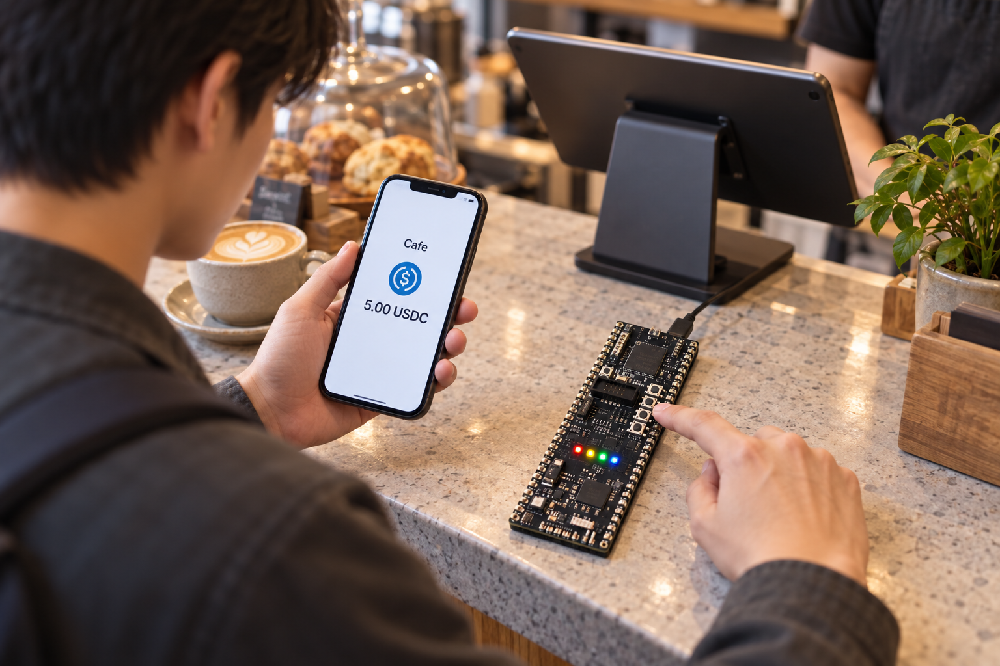
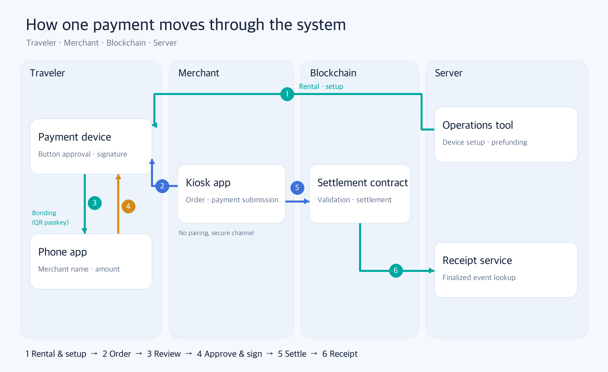
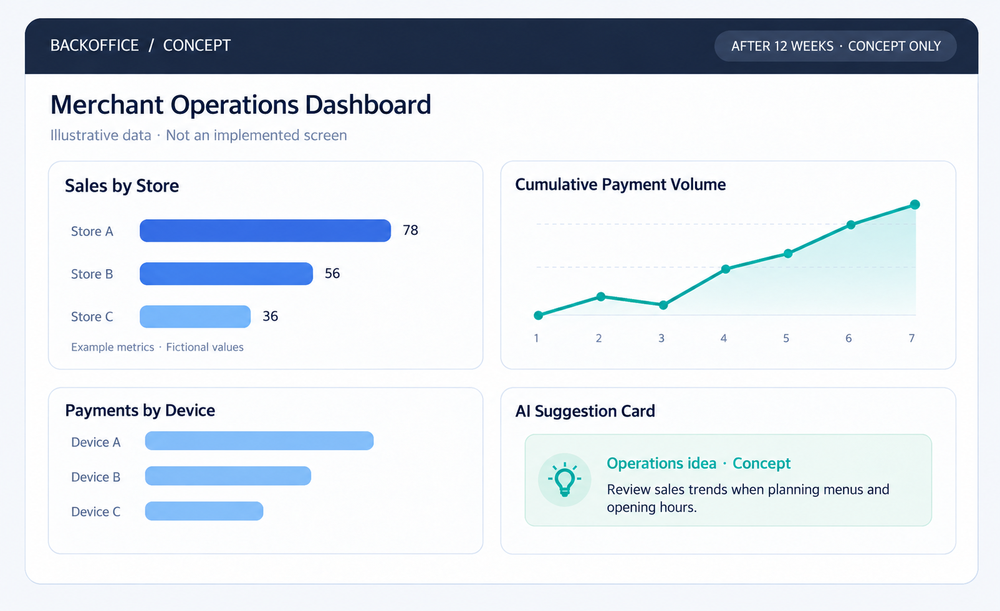
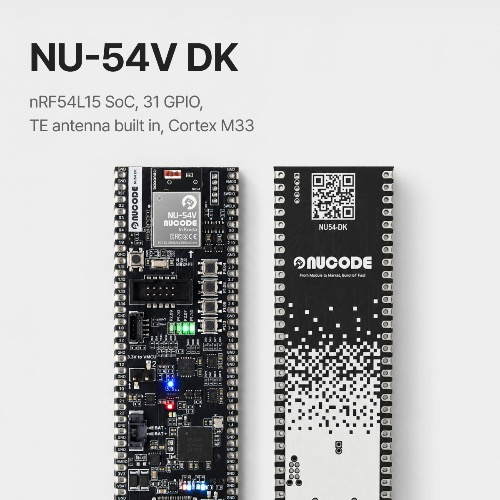
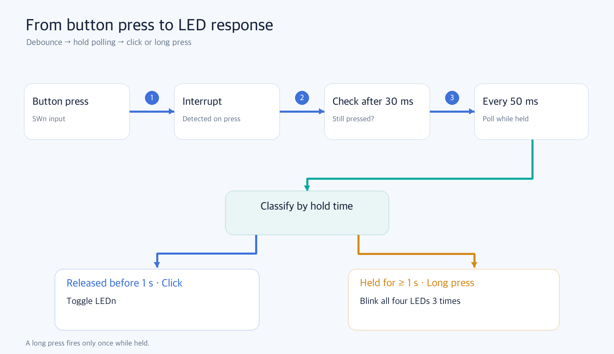

# [NU-54V-DK 01] Building a Stablecoin Payment Device: Starting with a Plan, LEDs, and Buttons

### We planned the payment flow around the NU-54V-DK board, then tested the first firmware's LED and button behavior

> Stablecoin payment device build log 01 · Previous article: [Building a Stablecoin Travel Wallet with NU-54V-DK: A 12-Week Plan for a Three-Person Team](https://medium.com/@bc.0x4861/building-a-stablecoin-travel-wallet-with-nu-54v-dk-a-12-week-plan-for-a-three-person-team-51eb43343458)

Imagine an international traveler ordering coffee at a neighborhood café. If their card does not work or exchanging currency is inconvenient, they may want to pay with a stablecoin wallet on their phone. But can they trust the amount and merchant address shown on the café's payment screen?

The simplest approach is to scan a QR code with a phone wallet and send the payment. The merchant-side device generates both the QR code and the payment details. If that device is compromised, the traveler may not notice that the money is going to a different address. We need a way for the traveler to check the amount and recipient again on their side, then authorize a signature only by pressing a physical button.

Our team is building a small payment device for that purpose with the NU-54V-DK board. It signs **only two types of requests**: one payment and a limit change. A smart contract enforces per-payment and daily limits. We plan to build **seven products** over 12 weeks. Our goal for **week 7 (October 21)** is to approve the first payment with the device button and record it on a testnet block.

In this article, we explain what we plan to build and in what order, then show how we controlled the board's LEDs and buttons with our first firmware. Key generation, storage, and the details of the payment protocol belong to later articles. This project is a proof of concept (PoC) using a testnet and test tokens, not a real-asset payment service.



*Figure 1. The merchant name and amount appear only in the traveler's phone app. AI-generated concept image; not a photograph of the finished product.*

### INDEX

1. What changed since the previous article: the device has no screen
2. Seven products and the path of one payment
3. The 12-week schedule and its checkpoints
4. NU-54V-DK firmware tools: what we installed and why
5. Using the published board package
6. Controlling LEDs and buttons through GPIO
7. Decisions, open questions, and limits

---

## 1. What changed since the previous article: the device has no screen

In the previous article, we said the merchant and amount would appear on the device's screen. After examining the board, we found that the NU-54V-DK has four LEDs and four buttons, but no screen. We considered adding one. For the first implementation, however, we chose to **use the renter's own phone app as the confirmation screen**. As with many Internet of Things (IoT) devices, the phone app connects to and configures the device before use, then displays payment details for each transaction.

Moving the display to the phone weakens the assurance that what the user sees is what the device signs. We set two rules to address this:

- The phone app displays **only values sent by the device**. It does not separately show values supplied by the merchant kiosk, so a compromised kiosk cannot directly replace the details shown to the traveler.
- Approval still happens **only on the device button**. The phone app has no approval button.

One limit remains: if the traveler's phone itself is compromised, the display cannot be trusted. We return to that limit in section 7.

The merchant kiosk and the device do not pair. Like bringing a card to a reader, the kiosk connects to a nearby device and opens a payment session. We plan to exchange a one-time key for each session, encrypt its contents, and verify the kiosk's merchant-key signature through a secure channel. The first device-approved payment in week 7 is scheduled to work without that channel; we will add it afterward.

We are also leaving near-field communication (NFC) out of this implementation. The nRF54L15 chip supports NFC, but this board uses the two NFC pins for I2C connections to the charging IC and expansion connector, and it has no NFC antenna. We will find the device through Bluetooth Low Energy (BLE) scanning.

## 2. Seven products and the path of one payment

These are the products in the 12-week plan:

| Product | Responsibility | Technology |
|---|---|---|
| Payment device firmware | Key generation and storage, button approval, EIP-712 signatures[5], BLE communication | C, Zephyr RTOS (nRF Connect SDK v3.4.1) |
| Traveler phone app | Device connection and setup, payment confirmation screen | React Native, Kotlin |
| Merchant kiosk app | Order entry, BLE connection to device, payment submission and confirmation | React Native, Kotlin |
| Operations tool | Merchant registration and certificate issuance, device rental setup and return | Go |
| Settlement smart contract | Prefunding, payment verification and settlement, limits, delayed withdrawal | Solidity, Foundry |
| Receipt lookup service | Collecting settlement events and providing receipts by order | Go, PostgreSQL |
| Shared protocol and validation tools | Message formats, code generation for each language, cross-checks | JSON Schema, Python |

One payment follows this path:

1. **Rental and setup.** An operator uses the operations tool to set up the device and prefund the contract. The traveler scans the QR code on the device label with the phone app to connect to the device.
2. **Order.** A café employee enters an order in the kiosk app, which sends a payment request to the device over BLE.
3. **Review.** The device checks the merchant certificate and order signature in the request, then sends the merchant name and amount to the traveler's phone app.
4. **Approval and signature.** The traveler reviews the phone screen and presses a device button. The device signs the payment approval using EIP-712.
5. **Settlement.** The kiosk submits the signature to the contract. The contract checks the signature and limits, then moves stablecoins to the merchant account. A finalized settlement event is the sole evidence of completion.
6. **Receipt.** The receipt lookup service collects settlement events and displays them by order.



*Figure 2. Product architecture and payment flow, from device setup to receipt lookup. Diagram created by the authors.*

### What comes after the 12 weeks

Our longer-term vision goes beyond completing one payment:

- **Kiosk features for store operators:** Sales and inventory management, menu management, events, orders and refunds, and daily, weekly, and monthly settlement management.
- **Back office:** An infographic dashboard for total sales by store, user counts, payments and amounts made with this device, and cumulative payment volume to support management decisions.
- **AI business support:** Suggestions for menus, events, and operating hours based on accumulated sales and payment data.

Three people cannot build all of this in 12 weeks. During this cycle, we will focus on **completing one payment safely from start to finish** and leave those features for the next phase. For the back office, this cycle covers only the operations core and command-line tool, while the design anticipates the broader dashboard structure.



*Figure 3. Concept for an operations dashboard after the 12-week project. All values are fictional. AI-generated screen concept; not an implemented screen.*

## 3. The 12-week schedule and its checkpoints

The schedule follows the maker program, with each week starting on Thursday. At four checkpoints, if the agreed result is missing, we will reduce scope in a predetermined order.

| Week | Dates | Main work | Checkpoint |
|---|---|---|---|
| 4 | 9/24–9/30 | Board bring-up, development environment, external secure-chip documentation | Basic board functions and the chip's secp256k1 support |
| 5 | 10/1–10/7 | Firmware skeleton (LEDs and buttons), settlement contract core, kiosk BLE | |
| 6 | 10/8–10/14 | Contract deployment to testnet, merchant registration | One testnet settlement with a software signature |
| 7 | 10/15–10/21 | Device BLE and signing, kiosk submission | **One payment approved with the device button** |
| 8 | 10/22–10/28 | Key storage in the secure area (TF-M), device setup commands, kiosk error handling | |
| 9 | 10/29–11/4 | External secure-chip integration, device-side payment secure channel, limit changes | One payment with a key wrapped by the secure chip |
| 10 | 11/5–11/11 | Device return, signed firmware image, receipt lookup, start of phone app, kiosk-side secure channel | |
| 11 | 11/12–11/18 | Security checks, phone app setup screen, rehearsal of 20 consecutive payments and refusal cases | |
| 12 | 11/19–11/25 | Phone app payment confirmation screen, stabilization, demonstration | 12 acceptance items |

If the week 7 payment fails, we will cut external secure-chip integration first and the receipt lookup service second. We will keep the merchant confirmation screen under all circumstances. The firmware engineer also owns the phone app, so the work planned for weeks 8–12 is tight. The phone confirmation screen is scheduled for the final week.

## 4. NU-54V-DK firmware tools: what we installed and why

The NU-54V-DK is a development kit with a carrier board holding a NU-54V module based on Nordic's nRF54L15. Its built-in USB debugger (DAPLink-based CMSIS-DAP) lets us flash firmware and read logs with one USB cable.



*Figure 4. Official NU-54V-DK photograph. The USB connector is outside the image, so we omitted component location labels. [Manufacturer source](https://nucode.store/product/nu-54v-dk-nucode-nrf54l15-ble-60-mcu-kcfcccemic/36/category/25/display/1/).*

We chose Zephyr and the nRF Connect SDK (NCS) for development[2]. The manufacturer also provides an Arduino core, but its stable release supports Windows only, and that core still builds on NCS and Zephyr. Our team chose Zephyr because we can use it directly on macOS.

We needed four pieces:

- **nRF Util (`nrfutil`):** Nordic's command-line tool. It installs versioned SDKs and toolchains and runs commands inside their environments.
- **nRF Connect SDK v3.4.1 and its toolchain:** Includes Zephyr 4.4.2, Nordic drivers, an ARM compiler, CMake, Ninja, the `west` build tool, and pyOCD 0.42.0 for flashing.
- **Board package (`nu54v_dk`):** Describes this board's pins and circuits to Zephyr. Without it, a build would target a different Nordic development board (section 5).
- **Serial terminal:** Reads board logs. The nRF Terminal in VS Code or `screen` on macOS is enough.

We chose SDK v3.4.1 because the board package and examples were made for that version. Matching it lets us use the board package without changing it.

These are the commands we actually ran on an Apple Silicon Mac:

```bash
# nRF Util: 홈 아래에 두어 sudo 없이 씁니다.
curl -sSL -o ~/.local/bin/nrfutil \
  https://files.nordicsemi.com/artifactory/swtools/external/nrfutil/executables/aarch64-apple-darwin/nrfutil
chmod +x ~/.local/bin/nrfutil
nrfutil install sdk-manager

# macOS에서 SDK 설치 위치는 /opt/nordic/ncs로 정해져 있어, 이 자리만 관리자 권한으로 만듭니다.
sudo mkdir -p /opt/nordic && sudo chown -R "$(whoami)" /opt/nordic

# SDK와 툴체인 (판본당 약 12 GB)
nrfutil sdk-manager install v3.4.1
```

Two details can save time:

- **Do not install `nrfutil` with pip.** The version published there is old.
- **There is no need to install pyOCD separately.** It is already in the NCS v3.4.x toolchain. Enter the toolchain environment with `nrfutil sdk-manager toolchain launch --ncs-version v3.4.1 --shell` to use it.

Connecting the board over USB exposes one debugger and two serial ports (`/dev/cu.usbmodem…`). Console logs appear at 115200 baud on the port whose name ends in `04`.

## 5. Using the published board package

Zephyr reads a board package to learn which chip is present and which pins connect to the LEDs and buttons. The package contains a devicetree (`.dts`), Kconfig defaults, pin assignments (`pinctrl`), and flashing settings[4]. Building it from scratch would mean reading through the schematic.

Fortunately, the NU-54V-DK board package is published under the MIT license in the [chcbaram/nu54v-dk](https://github.com/chcbaram/nu54v-dk) repository[1]. Its board target is `nu54v_dk/nrf54l15/cpuapp`. Based on Nordic's nRF54L15 DK definition, it describes this board's LEDs, buttons, UART, I2C, clocks, and memory regions according to the schematic. We copied the package into our repository without modifying it and recorded its source commit and license.

```text
products/p01-device-firmware/
├── boards/nucode/nu54v_dk/   # 가져온 보드 패키지 (MIT, 출처 기록 포함)
├── app/                      # Zephyr 애플리케이션
├── core/                     # 보드와 무관한 C 코드 (컴퓨터에서 시험)
└── test/                     # core/ 단위 시험
```

The package's devicetree defines LEDs and buttons like this:

```dts
leds {
    compatible = "gpio-leds";
    led0: led_0 { gpios = <&gpio2 9 GPIO_ACTIVE_HIGH>; label = "LED1"; };
    /* led1 = P1.10, led2 = P2.07, led3 = P1.14 */
};

buttons {
    compatible = "gpio-keys";
    button0: button_0 { gpios = <&gpio1 13 (GPIO_PULL_UP | GPIO_ACTIVE_LOW)>; label = "SW1"; };
    /* SW2 = P1.09, SW3 = P1.08, SW4 = P0.04 */
};

aliases { led0 = &led0; sw0 = &button0; /* ... led3, sw3 */ };
```

An LED turns on when its pin is High. The buttons have no external pull-up, so they use the chip's internal pull-up and read Low when pressed. The application accesses them through aliases such as `led0` and `sw0` instead of pin numbers, so the application code can stay the same if the pin assignment changes.

We encountered one catch when keeping the board package outside the SDK repository. NCS sysbuild looks for the board before it reads the application's `CMakeLists.txt`. Putting the board path in `CMakeLists.txt` is therefore too late; the build command must pass `BOARD_ROOT`.

```bash
west build -b nu54v_dk/nrf54l15/cpuapp app -d build -- -DBOARD_ROOT=$PWD
pyocd flash -t nrf54l build/merged.hex
```

In our repository[6], `make fw` and `make flash` wrap those two commands.

## 6. Controlling LEDs and buttons through GPIO

Our first firmware implements the general-purpose input/output (GPIO) that the payment device needs. Buttons will serve approval and refusal; LEDs will indicate device status. The behavior is simple: **a short press on SWn toggles LEDn, while holding a button for at least one second makes all four LEDs blink three times.**

### Turning LEDs on and off

We get GPIO information through aliases, configure the pins as outputs, and set the LEDs[3].

```c
static const struct gpio_dt_spec leds[4] = {
    GPIO_DT_SPEC_GET(DT_ALIAS(led0), gpios),
    GPIO_DT_SPEC_GET(DT_ALIAS(led1), gpios),
    GPIO_DT_SPEC_GET(DT_ALIAS(led2), gpios),
    GPIO_DT_SPEC_GET(DT_ALIAS(led3), gpios),
};

gpio_pin_configure_dt(&leds[i], GPIO_OUTPUT_INACTIVE);  /* 꺼진 상태로 시작 */
gpio_pin_set_dt(&leds[i], 1);                           /* 켜기: 극성은 devicetree가 처리 */
```

Passing `1` to `gpio_pin_set_dt` means “on.” The devicetree's `GPIO_ACTIVE_HIGH` setting determines whether that requires a physical High or Low level. On the NU-40 board we used for an earlier hardware wallet, for example, an LED turns on at Low. That difference belongs in the devicetree, not in the application code.

### Receiving button presses through interrupts

We configure each button as an input and request an interrupt on the active edge (`GPIO_INT_EDGE_TO_ACTIVE`). Button contacts may bounce between connected and disconnected as they are pressed. To handle that chatter, the interrupt only schedules a check 30 ms later.

```c
static void button_isr(const struct device *port, struct gpio_callback *cb, uint32_t pins)
{
    for (uint8_t i = 0; i < 4; i++) {
        /* SW4만 P0 포트, 나머지는 P1 포트라 포트와 핀을 함께 비교합니다. */
        if (buttons[i].port != port || !(pins & BIT(buttons[i].pin))) {
            continue;
        }
        if (!atomic_test_and_set_bit(&debounce_pending, i)) {
            k_work_schedule(&debounce[i], K_MSEC(30));   /* 30 ms 뒤 다시 확인 */
        }
    }
}
```

The NU-54V-DK buttons span two ports (P0 and P1). Comparing only pin numbers could confuse a pin on one port with a pin of the same number on the other. The earlier code compared only pin numbers; we added a port comparison.

### Distinguishing a click from a long press

If the button is still pressed after 30 ms, we accept the press and read its state every 50 ms. Releasing it before one second is a “click”; holding it for at least one second is a “long press.” We separated this decision into board-independent C code (`core/`), so it can also be tested on a computer.

```c
nu54_button_event_t nu54_button_update(nu54_button_t *b, bool pressed, uint32_t now_ms)
{
    if (pressed == b->pressed) return NU54_BTN_NONE;
    b->pressed = pressed;
    if (pressed) { b->pressed_at = now_ms; b->long_sent = false; return NU54_BTN_NONE; }
    if (b->long_sent) return NU54_BTN_NONE;
    /* 부호 없는 뺄셈이라 49.7일마다 돌아오는 밀리초 카운터가 넘쳐도 맞게 계산됩니다. */
    return (uint32_t)(now_ms - b->pressed_at) < 1000 ? NU54_BTN_CLICK : NU54_BTN_LONG;
}
```

The computer-side tests cover five cases, including whether click and long-press events occur only once and what happens when the counter wraps around.

```text
$ make test
100% tests passed, 0 tests failed out of 2
```

### Results on the board

The build uses 38,468 B of flash (2.46%) and 7,456 B of RAM (2.89%). On boot, the log reports the port and pin for each LED and button.

```text
*** Booting nRF Connect SDK v3.4.1-b20f8619ba9a ***
*** Using Zephyr OS v4.4.2-33fa6a7aac6a ***
<inf> board_io: LED1 gpio@50400 pin 9, SW1 gpio@d8200 pin 13
<inf> board_io: LED2 gpio@d8200 pin 10, SW2 gpio@d8200 pin 9
<inf> board_io: LED3 gpio@50400 pin 7, SW3 gpio@d8200 pin 8
<inf> board_io: LED4 gpio@d8200 pin 14, SW4 gpio@10a000 pin 4
<inf> nu54_signer: ready: click SWn toggles LEDn, long-press blinks all LEDs
```

First, we used a debugger-based test tool to simulate button presses. Temporarily switching a pin's internal pull-up to a pull-down produces the same voltage as pressing the button. We pressed SW1 and SW3 briefly and held SW2 and SW4. Finally, we read the LED output register and confirmed that only LED3 was on.

```text
(일부 줄 생략)
  1.30s SIM  BTN1 P1.13 pressed for 0.3s
  1.95s VCOM <inf> nu54_signer: SW1 click -> LED1 off
  2.99s SIM  BTN2 P1.09 pressed for 1.8s
  4.15s VCOM <inf> nu54_signer: SW2 long press -> blink all
  6.85s VCOM <inf> nu54_signer: SW3 click -> LED3 on
  9.07s VCOM <inf> nu54_signer: SW4 long press -> blink all
LED1(P2.09)=0 LED2(P1.10)=0 LED3(P2.07)=1 LED4(P1.14)=0
```

LED1 was off because an earlier test had already turned it on once. We then pressed SW1–SW4 by hand on the board. Clicks and long presses produced the same logs, and the LEDs responded as expected.



*Figure 5. Button click and long-press detection and the corresponding LED behavior. Diagram created by the authors.*

## 7. Decisions, open questions, and limits

**We changed how we detect button release.** Our first version used interrupts for both press and release (`GPIO_INT_EDGE_BOTH`). In the test, the release interrupt did not arrive, so every press became a long press. The board package configures the button pins to use a power-saving GPIO SENSE mechanism, which emulates detection in both directions in software. We switched to an interrupt on press and a 50 ms check for release only while the button is held. Because the test ran with a debugger attached, we have not yet isolated whether SENSE or the debugger caused the missing release interrupt.

**The timer appeared to stop while the debugger remained attached.** When the simulation tool held the debugger connection, the 50 ms polling work did not run and missed the release. Changing the tool to attach only while switching a pin, then disconnect, produced the expected classification. We still need to investigate how the chip's power-saving behavior and timer interact with an attached debugger.

**Using the phone as the confirmation screen has a limit.** If the traveler's phone is compromised, its display cannot be trusted. The physical button and contract-enforced limits reduce possible damage, but the arrangement is weaker than a hardware wallet with its own screen.

**Much remains unimplemented.** At the time of this article, key generation and storage, the BLE payment protocol, the contract, and the apps exist only as designs. In the next article, we will discuss how to keep a key on the device and allow only one signature for each button approval.

## Closing

In this article, we organized seven products around the payment device, laid out the 12-week schedule, and controlled LEDs and buttons with our first firmware. The hardest part was finding out what the board does not have. Discovering the lack of a screen and an NFC antenna early let us move confirmation to the phone app. Next, we will look at key generation, storage, and the rules for when the device allows a signature.

### References

- [1] chcbaram/nu54v-dk — NU-54V-DK board package and examples — https://github.com/chcbaram/nu54v-dk
- [2] nRF Connect SDK documentation — https://docs.nordicsemi.com/bundle/ncs-latest/page/nrf/index.html
- [3] Zephyr Project, GPIO API — https://docs.zephyrproject.org/latest/hardware/peripherals/gpio.html
- [4] Zephyr Project, Devicetree — https://docs.zephyrproject.org/latest/build/dts/index.html
- [5] EIP-712: Typed structured data hashing and signing — https://eips.ethereum.org/EIPS/eip-712
- [6] Project repository — https://github.com/0xmhha/nu-54v-dk-toy

`#NUCODE` `#누코드` `#NU54VDK` `#누코더스` `#Nucoders`

---

## Publication notes (do not post on Medium)

### Images

| Figure | Placement | File | Attribution |
|---|---|---|---|
| 1 | After the introduction | `assets/01/01-hero.png` | AI-generated concept image; not a product photograph |
| 2 | Section 2 | `assets/01/02-architecture-en.png` | Diagram created by the authors |
| 3 | Section 2, after the 12-week scope | `assets/01/03-backoffice-concept-en.png` | AI-generated concept; fictional values, not an implemented screen |
| 4 | Section 4 | `assets/01/04-board.png` | Manufacturer photograph; location labels omitted because the image is cropped |
| 5 | Section 6 | `assets/01/05-button-flow-en.png` | Diagram created by the authors |

### Prepublication checks

- [x] The previous English article links to the published Medium post.
- [x] All five images have captions and attribution.
- [x] The article and images contain no private keys, full addresses, transaction hashes, account names, or RPC secrets.
- [x] The introduction identifies the testnet PoC scope.
- [x] Code, commands, and logs match the Korean draft.
- [ ] Medium post URL will be recorded after publication.
