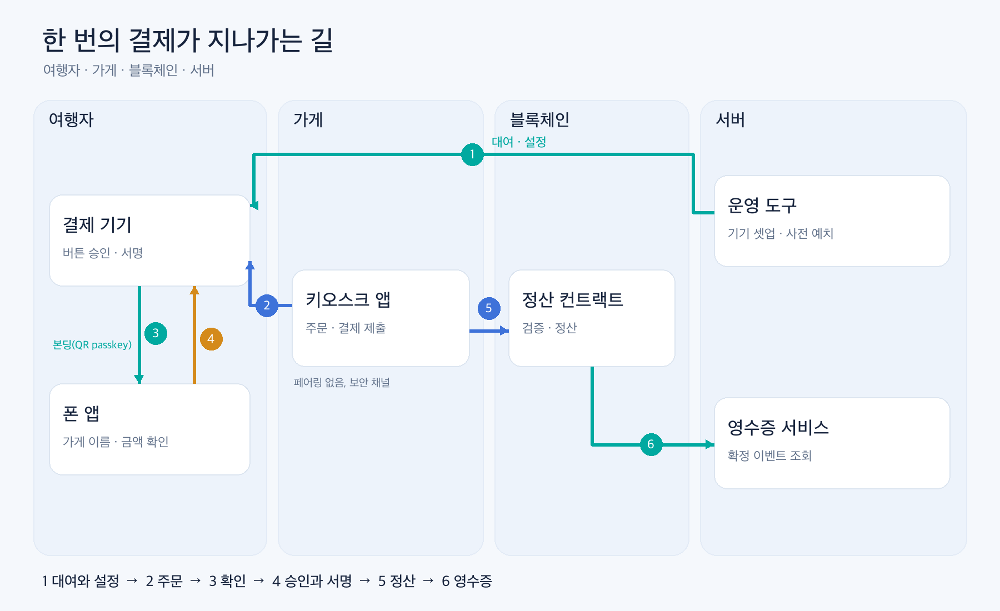
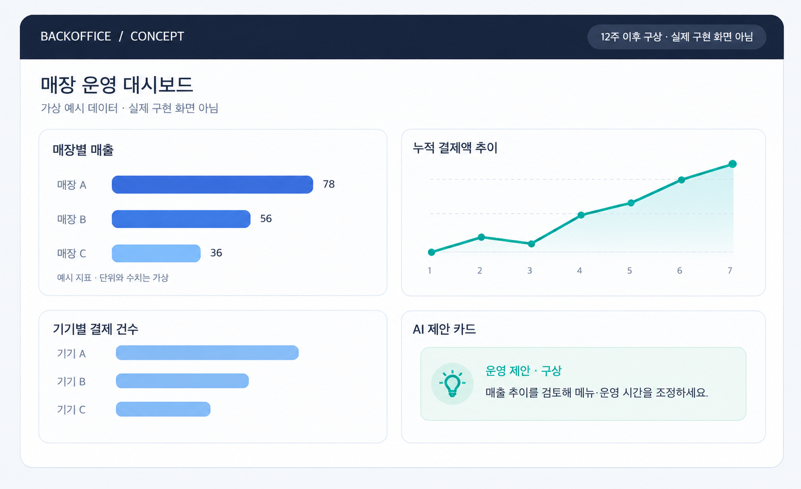
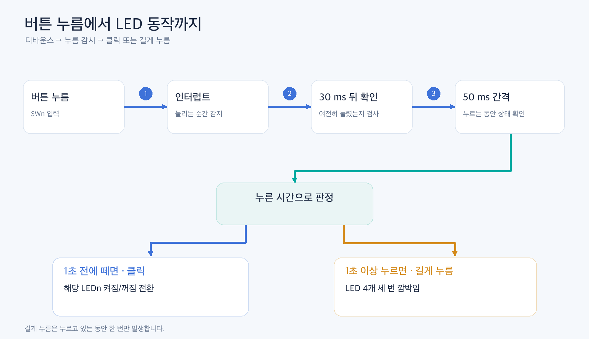

# [NU-54V-DK 01] 스테이블코인 결제 기기 만들기: 계획을 세우고 LED·버튼부터 켜다

### NU-54V-DK 보드에 맞춰 결제 흐름을 정리하고, 첫 펌웨어의 LED·버튼 동작을 시험했습니다

> 스테이블코인 결제 기기 제작기 01 · 이전 글: [NU-54V-DK로 만드는 여행자용 스테이블코인 지갑: 세 사람의 12주 제작 계획](https://medium.com/@bc.0x4861/nu-54v-dk%EB%A1%9C-%EB%A7%8C%EB%93%9C%EB%8A%94-%EC%97%AC%ED%96%89%EC%9E%90%EC%9A%A9-%EC%8A%A4%ED%85%8C%EC%9D%B4%EB%B8%94%EC%BD%94%EC%9D%B8-%EC%A7%80%EA%B0%91-%EC%84%B8-%EC%82%AC%EB%9E%8C%EC%9D%98-12%EC%A3%BC-%EC%A0%9C%EC%9E%91-%EA%B3%84%ED%9A%8D-74a4fcf9c166)

외국인 여행자가 동네 카페에서 커피를 주문한다고 해 보겠습니다. 카드 결제가 막히거나 환전이 번거롭다면 휴대폰 속 스테이블코인 지갑으로 결제하고 싶을 것입니다. 그런데 카페의 결제 화면에 나온 금액과 가게 주소를 그대로 믿어도 될까요?

가장 단순한 방법은 휴대폰 지갑으로 QR 코드(Quick Response code)를 읽어 송금하는 것입니다. 하지만 QR 코드와 송금 화면은 가게 쪽 기기가 만들어 보여 줍니다. 그 기기가 조작되면 여행자는 다른 주소로 돈을 보내도 알아차리기 어렵습니다. 결제 금액과 받는 곳을 여행자 쪽에서 한 번 더 확인하고, 여행자가 직접 버튼을 눌러야만 서명되는 장치가 필요합니다.

저희 팀은 이 역할을 하는 작은 결제 기기를 NU-54V-DK 보드로 만들고 있습니다. 기기는 결제 한 건과 한도 변경, **두 가지 형식에만 서명**합니다. 한 번 결제 한도와 하루 한도는 스마트 컨트랙트(smart contract)가 강제합니다. 이번 12주 동안 만들 제품은 **일곱 가지**이며, **7주차(10/21)**에 기기 버튼으로 첫 결제를 승인해 테스트넷 블록에 기록하는 것이 목표입니다.

이번 글에서는 무엇을 만들고 어떤 순서로 만들지, 그리고 보드에 처음 올린 펌웨어로 LED와 버튼을 어떻게 제어했는지를 살펴보겠습니다. 키를 만들고 보관하는 방법과 결제 프로토콜의 세부는 다음 글들에서 다룹니다. 이 프로젝트는 테스트넷과 시험용 토큰만 쓰는 개념 증명(PoC)이며 실제 자산 결제 서비스가 아닙니다.


*그림 1. 여행자의 폰 앱에만 가게 이름과 금액이 보이는 결제 장면. AI로 생성한 콘셉트 이미지입니다. 실제 제품 사진이 아닙니다.*

### INDEX

1. 처음 글에서 바뀐 것: 기기에는 화면이 없습니다
2. 만들 제품 일곱 가지와 한 번의 결제가 지나가는 길
3. 12주 일정과 확인 지점
4. NU-54V-DK 펌웨어 개발 환경: 무엇을 왜 설치하나
5. 보드 설정은 공개된 보드 패키지로 가져옵니다
6. LED와 버튼을 GPIO로 제어하기
7. 고민했던 점과 남은 한계

---

## 1. 처음 글에서 바뀐 것: 기기에는 화면이 없습니다

이전 글에서는 기기 화면에 가게와 금액이 표시된다고 적었습니다. 보드를 살펴보니 NU-54V-DK에는 LED 4개와 버튼 4개만 있고 화면이 없었습니다. 화면을 따로 붙이는 방법도 검토했지만, 첫 구현에서는 **대여자 본인의 폰 앱을 확인 화면으로 쓰기로** 했습니다. 사물인터넷(Internet of Things, IoT) 기기에서 흔한 방식처럼, 사용 전에 폰 앱으로 기기와 연결해 설정하고 결제할 때마다 폰 앱에 결제 내용을 보여 주는 구조입니다.

화면을 폰으로 옮기면 "보이는 내용과 서명하는 내용이 같다"는 약속이 흔들릴 수 있습니다. 그래서 두 가지 규칙을 정했습니다.

- 폰 앱은 **기기가 보낸 값만** 표시합니다. 가게 키오스크가 보낸 값을 따로 보여 주지 않으므로, 키오스크가 조작되어도 여행자가 보는 내용은 속일 수 없습니다.
- 승인은 여전히 **기기 버튼**으로만 합니다. 폰 앱에는 승인 버튼이 없습니다.

남는 한계도 있습니다. 여행자의 휴대폰 자체가 조작되면 표시를 믿을 수 없습니다. 이 한계는 7장에서 다시 적겠습니다.

가게 키오스크와 기기는 페어링(pairing)하지 않습니다. 카드를 리더기에 대듯이, 키오스크는 가까이 있는 기기에 바로 연결해 결제 세션을 엽니다. 대신 결제 세션마다 1회용 키를 교환해 내용을 암호화하고, 키오스크가 등록된 가게의 것인지 가게 키 서명으로 확인하는 보안 채널을 넣습니다. 7주차 첫 실결제는 이 채널 없이 먼저 통과하고, 그 뒤에 붙입니다.

같은 이유로 근거리 무선 통신(Near Field Communication, NFC)도 이번에는 쓰지 않습니다. nRF54L15 칩은 NFC를 지원하지만, 이 보드는 NFC 핀 두 개를 I2C(충전 IC와 확장 커넥터)로 쓰도록 설계되어 있고 NFC 안테나가 없습니다. 기기는 저전력 블루투스(Bluetooth Low Energy, BLE) 스캔으로 찾습니다.

## 2. 만들 제품 일곱 가지와 한 번의 결제가 지나가는 길

이번 12주에 만드는 제품은 다음과 같습니다.

| 제품 | 하는 일 | 기술 |
|---|---|---|
| 결제 기기 펌웨어 | 키 생성과 보관, 버튼 승인, EIP-712 서명[5], BLE 통신 | C, Zephyr RTOS(nRF Connect SDK v3.4.1) |
| 대여자 폰 앱 | 기기 연결과 설정, 결제 내용 확인 화면 | React Native, Kotlin |
| 가맹점 키오스크 앱 | 주문 입력, 기기와 BLE 연결, 결제 제출과 확인 | React Native, Kotlin |
| 운영 도구 | 가맹점 등록과 인증서 발급, 기기 대여 셋업과 반납 | Go |
| 정산 스마트 컨트랙트 | 사전 예치, 결제 검증과 정산, 한도, 지연 출금 | Solidity, Foundry |
| 영수증 조회 서비스 | 정산 이벤트를 모아 주문별 영수증 조회 | Go, PostgreSQL |
| 공통 프로토콜과 검증 도구 | 메시지 형식 정의, 언어별 코드 생성, 교차 검증 | JSON Schema, Python |

결제 한 건은 이렇게 지나갑니다.

1. **대여와 설정.** 운영자가 운영 도구로 기기를 셋업하고 결제용 잔액을 컨트랙트에 예치합니다. 여행자는 기기 라벨의 QR 코드를 폰 앱으로 읽어 기기와 연결합니다.
2. **주문.** 가게 직원이 키오스크 앱에 주문을 넣으면, 키오스크가 BLE로 기기에 결제 요청을 보냅니다.
3. **확인.** 기기는 요청에 담긴 가게 인증서와 주문 서명을 검사한 뒤, 가게 이름과 금액을 여행자 폰 앱으로 보냅니다.
4. **승인과 서명.** 여행자가 폰 화면을 보고 기기 버튼을 누르면, 기기가 결제 승인에 EIP-712 서명을 합니다.
5. **정산.** 키오스크가 서명을 컨트랙트에 제출하고, 컨트랙트가 서명과 한도를 검사해 가게 계정으로 스테이블코인을 옮깁니다. 확정된 정산 이벤트가 결제 완료의 유일한 근거입니다.
6. **영수증.** 영수증 조회 서비스가 정산 이벤트를 모아 주문별로 보여 줍니다.



*그림 2. 대여와 설정부터 영수증 조회까지의 제품 구조와 결제 흐름. 직접 작성.*

### 12주 뒤에 이어서 만들 것

저희 팀이 장기적으로 그리는 모습은 결제 한 건보다 넓습니다.

- **가게 운영자용 키오스크 기능:** 매출과 재고 관리, 메뉴 관리, 이벤트 관리, 주문과 환불, 일별·주별·월별 정산 관리
- **백오피스:** 매장별 전체 매출, 이용자 수, 이 기기로 결제된 내역과 금액, 누적 결제액을 인포그래픽 대시보드로 보여 주어 의사 결정과 경영 관리에 쓰게 합니다
- **AI 경영 지원:** 쌓인 매출과 결제 데이터로 AI가 메뉴, 이벤트, 운영 시간 같은 경영 전략을 제안합니다

다만 세 사람이 12주 안에 이 기능까지 모두 만들 수는 없습니다. 이번 12주에는 **결제가 안전하게 한 번 끝나는 길**을 먼저 완성하고, 위 기능은 그다음 단계로 둡니다. 백오피스는 운영 코어와 명령줄 도구만 만들고, 설계에는 대시보드까지 포함한 전체 구조를 전제로 해 두었습니다.



*그림 3. 12주 이후를 구상한 백오피스 대시보드. 수치는 가상의 값입니다. AI로 생성한 화면 콘셉트입니다. 실제 구현 화면이 아닙니다.*

## 3. 12주 일정과 확인 지점

일정은 메이커 프로그램 주차를 따르고, 한 주는 목요일에 시작합니다. 네 번의 확인 지점(게이트)에서 약속한 결과가 나오지 않으면 미리 정해 둔 순서대로 범위를 줄입니다.

| 주차 | 기간 | 주요 작업 | 확인 지점 |
|---|---|---|---|
| 4주차 | 9/24–9/30 | 보드 동작 확인, 개발 환경, 외부 보안칩 자료 확인 | 보드 기본 기능과 보안칩의 secp256k1 지원 |
| 5주차 | 10/1–10/7 | 펌웨어 골격(LED·버튼), 정산 컨트랙트 핵심, 키오스크 BLE | |
| 6주차 | 10/8–10/14 | 컨트랙트 테스트넷 배포, 가맹점 등록 | 소프트웨어 서명으로 테스트넷 정산 1건 |
| 7주차 | 10/15–10/21 | 기기 BLE와 서명, 키오스크 제출 | **기기 버튼으로 승인한 실결제 1건** |
| 8주차 | 10/22–10/28 | 보안 영역(TF-M) 키 보관, 기기 셋업 명령, 키오스크 오류 처리 | |
| 9주차 | 10/29–11/4 | 외부 보안칩 통합, 기기 쪽 결제 보안 채널, 한도 변경 | 보안칩으로 감싼 키로 결제 1건 |
| 10주차 | 11/5–11/11 | 기기 반납, 서명된 펌웨어 이미지, 영수증 조회, 폰 앱 시작, 키오스크 쪽 보안 채널 | |
| 11주차 | 11/12–11/18 | 보안 점검, 폰 앱 설정 화면, 20회 연속 결제와 거절 시연 리허설 | |
| 12주차 | 11/19–11/25 | 폰 앱 결제 확인 화면, 안정화와 시연 | 12개 수용 항목 |

7주차 실결제가 실패하면 외부 보안칩 통합, 영수증 조회 서비스 순서로 범위를 줄입니다. 가맹점 정보를 확인하는 화면은 어떤 경우에도 줄이지 않습니다. 펌웨어 담당이 폰 앱까지 맡아 8~12주차 일정이 빠듯하다는 점도 솔직히 적어 둡니다. 폰 확인 화면은 마지막 주에 완성될 예정입니다.

## 4. NU-54V-DK 펌웨어 개발 환경: 무엇을 왜 설치하나

NU-54V-DK는 Nordic nRF54L15 칩을 올린 NU-54V 모듈을 캐리어 보드에 얹은 개발 키트입니다. 보드에는 USB 디버거(DAPLink 기반 CMSIS-DAP)가 붙어 있어 USB 케이블 하나로 펌웨어를 굽고 로그를 읽을 수 있습니다.


*그림 4. NU-54V-DK 보드 공식 사진. 사진에서 USB 커넥터를 확인할 수 없어 위치 표시는 생략했습니다. 제조사 공식 사진에 표시 추가. [사진 출처](https://nucode.store/product/nu-54v-dk-nucode-nrf54l15-ble-60-mcu-kcfcccemic/36/category/25/display/1/).*

개발 경로는 Zephyr와 nRF Connect SDK(NCS)로 정했습니다[2]. 제조사가 Arduino 코어도 내놓았지만 안정판은 Windows만 지원하고, 그 Arduino 코어도 내부에서는 NCS와 Zephyr로 빌드합니다. 저희 팀은 macOS에서 바로 쓸 수 있는 Zephyr를 골랐습니다.

설치할 것은 네 가지입니다.

- **nRF Util(`nrfutil`):** Nordic의 명령줄 도구입니다. SDK와 툴체인을 판본별로 설치하고, 그 환경 안에서 명령을 실행하게 해 줍니다.
- **nRF Connect SDK v3.4.1과 툴체인:** Zephyr 4.4.2, Nordic 드라이버, ARM 컴파일러, CMake, Ninja, 빌드 도구 `west`, 굽기 도구 pyOCD 0.42.0이 함께 들어 있습니다.
- **보드 패키지(`nu54v_dk`):** 이 보드의 핀과 회로를 Zephyr에 알려 줍니다. 없으면 Nordic 공식 개발 보드로 잘못 빌드됩니다(5장).
- **시리얼 터미널:** 보드 로그를 읽습니다. VS Code의 nRF Terminal이나 macOS의 `screen`이면 충분합니다.

SDK 판본을 v3.4.1로 맞춘 이유는 보드 패키지와 예제가 v3.4.1을 기준으로 만들어졌기 때문입니다. 같은 판본을 써야 보드 패키지를 고치지 않고 그대로 쓸 수 있습니다.

실제로 설치한 명령은 다음과 같습니다(Apple Silicon 맥 기준).

```bash
# nRF Util: 홈 아래에 두어 sudo 없이 씁니다.
curl -sSL -o ~/.local/bin/nrfutil \
  https://files.nordicsemi.com/artifactory/swtools/external/nrfutil/executables/aarch64-apple-darwin/nrfutil
chmod +x ~/.local/bin/nrfutil
nrfutil install sdk-manager

# macOS에서 SDK 설치 위치는 /opt/nordic/ncs로 정해져 있어, 이 자리만 관리자 권한으로 만듭니다.
sudo mkdir -p /opt/nordic && sudo chown -R "$(whoami)" /opt/nordic

# SDK와 툴체인 (판본당 약 12 GB)
nrfutil sdk-manager install v3.4.1
```

두 가지를 알아 두면 시간을 아낄 수 있습니다.

- **pip으로 `nrfutil`을 설치하지 않습니다.** pip에 올라온 것은 오래된 판본입니다.
- **pyOCD를 따로 설치하지 않아도 됩니다.** NCS v3.4.x 툴체인에 이미 들어 있어서, `nrfutil sdk-manager toolchain launch --ncs-version v3.4.1 --shell`로 툴체인 환경에 들어가면 바로 쓸 수 있습니다.

보드를 USB로 연결하면 디버거 하나와 시리얼 포트 두 개(`/dev/cu.usbmodem…`)가 잡힙니다. 콘솔 로그는 이름이 `04`로 끝나는 포트에 115200 baud로 나옵니다.

## 5. 보드 설정은 공개된 보드 패키지로 가져옵니다

Zephyr는 "이 보드에 어떤 칩이 있고, LED와 버튼이 어느 핀에 붙어 있는가"를 보드 패키지에서 읽습니다. 보드 패키지는 디바이스 트리(devicetree, `.dts`), Kconfig 기본값, 핀 배치(`pinctrl`), 굽기 설정으로 이루어집니다[4]. 이것을 처음부터 만들려면 회로도를 한 장씩 읽어야 합니다.

다행히 NU-54V-DK용 보드 패키지가 [chcbaram/nu54v-dk](https://github.com/chcbaram/nu54v-dk) 저장소에 MIT 라이선스로 공개되어 있습니다[1]. 보드 타깃 이름은 `nu54v_dk/nrf54l15/cpuapp`이고, Nordic nRF54L15 DK 보드 정의를 바탕으로 이 보드의 LED, 버튼, UART, I2C, 클럭, 메모리 영역을 회로도에 맞춰 정의합니다. 저희 팀은 이 패키지를 수정하지 않고 저장소에 가져왔으며, 출처 커밋과 라이선스도 함께 기록했습니다.

```text
products/p01-device-firmware/
├── boards/nucode/nu54v_dk/   # 가져온 보드 패키지 (MIT, 출처 기록 포함)
├── app/                      # Zephyr 애플리케이션
├── core/                     # 보드와 무관한 C 코드 (컴퓨터에서 시험)
└── test/                     # core/ 단위 시험
```

보드 패키지의 devicetree는 LED와 버튼을 이렇게 정의합니다.

```dts
leds {
    compatible = "gpio-leds";
    led0: led_0 { gpios = <&gpio2 9 GPIO_ACTIVE_HIGH>; label = "LED1"; };
    /* led1 = P1.10, led2 = P2.07, led3 = P1.14 */
};

buttons {
    compatible = "gpio-keys";
    button0: button_0 { gpios = <&gpio1 13 (GPIO_PULL_UP | GPIO_ACTIVE_LOW)>; label = "SW1"; };
    /* SW2 = P1.09, SW3 = P1.08, SW4 = P0.04 */
};

aliases { led0 = &led0; sw0 = &button0; /* ... led3, sw3 */ };
```

LED는 핀이 High일 때 켜집니다. 버튼은 외부 풀업이 없어 칩 내부 풀업을 쓰며, 누르면 Low가 됩니다. 애플리케이션은 핀 번호 대신 `led0`, `sw0` 같은 별칭(alias)으로 접근하므로 핀 배치가 바뀌어도 애플리케이션 코드는 그대로입니다.

보드 패키지를 저장소 밖에 두고 쓸 때 한 가지 함정이 있었습니다. NCS의 sysbuild는 애플리케이션의 `CMakeLists.txt`를 읽기 전에 보드를 먼저 찾습니다. 그래서 `CMakeLists.txt`에 보드 경로를 적어도 소용이 없고, 빌드 명령에서 `BOARD_ROOT`를 넘겨야 합니다.

```bash
west build -b nu54v_dk/nrf54l15/cpuapp app -d build -- -DBOARD_ROOT=$PWD
pyocd flash -t nrf54l build/merged.hex
```

저희 저장소[6]에서는 이 두 줄을 `make fw`와 `make flash`로 묶어 두었습니다.

## 6. LED와 버튼을 GPIO로 제어하기

첫 펌웨어에서는 결제 기기에 필요한 범용 입출력(General Purpose Input/Output, GPIO)부터 만들었습니다. 버튼은 결제 승인과 거절에, LED는 기기 상태 안내에 쓰기 때문입니다. 동작은 단순합니다. **SWn을 짧게 누르면 LEDn이 켜지거나 꺼지고, 1초 이상 누르면 LED 네 개가 세 번 깜박입니다.**

### LED 켜고 끄기

별칭으로 GPIO 정보를 가져와 출력으로 설정한 뒤 LED를 켜고 끕니다[3].

```c
static const struct gpio_dt_spec leds[4] = {
    GPIO_DT_SPEC_GET(DT_ALIAS(led0), gpios),
    GPIO_DT_SPEC_GET(DT_ALIAS(led1), gpios),
    GPIO_DT_SPEC_GET(DT_ALIAS(led2), gpios),
    GPIO_DT_SPEC_GET(DT_ALIAS(led3), gpios),
};

gpio_pin_configure_dt(&leds[i], GPIO_OUTPUT_INACTIVE);  /* 꺼진 상태로 시작 */
gpio_pin_set_dt(&leds[i], 1);                           /* 켜기: 극성은 devicetree가 처리 */
```

`gpio_pin_set_dt`에 1을 주면 "켜기"라는 뜻이고, 실제로 핀을 High로 할지 Low로 할지는 devicetree의 `GPIO_ACTIVE_HIGH` 설정이 정합니다. 예를 들어 예전에 하드웨어 지갑을 만들었던 NU-40 보드는 LED가 Low에서 켜지는데, 이런 차이는 devicetree에만 적히고 애플리케이션 코드는 바뀌지 않습니다.

### 버튼 누름을 인터럽트로 받기

버튼은 입력으로 설정하고, 눌리는 순간(`GPIO_INT_EDGE_TO_ACTIVE`) 인터럽트(interrupt)가 오게 합니다. 버튼 접점은 누를 때 여러 번 붙었다 떨어집니다. 이 채터링 때문에 인터럽트 안에서는 30 ms 뒤에 다시 확인하는 작업만 예약합니다.

```c
static void button_isr(const struct device *port, struct gpio_callback *cb, uint32_t pins)
{
    for (uint8_t i = 0; i < 4; i++) {
        /* SW4만 P0 포트, 나머지는 P1 포트라 포트와 핀을 함께 비교합니다. */
        if (buttons[i].port != port || !(pins & BIT(buttons[i].pin))) {
            continue;
        }
        if (!atomic_test_and_set_bit(&debounce_pending, i)) {
            k_work_schedule(&debounce[i], K_MSEC(30));   /* 30 ms 뒤 다시 확인 */
        }
    }
}
```

NU-54V-DK는 버튼이 두 포트(P0, P1)에 나뉘어 있어서, 핀 번호만 비교하면 다른 포트의 같은 번호 핀과 헷갈릴 수 있습니다. 예전 코드는 핀 번호만 비교했는데, 이번에 포트 비교를 더했습니다.

### 짧게 누름과 길게 누름 구분하기

30 ms 뒤에도 눌려 있으면 누름으로 인정하고, 그때부터 50 ms마다 버튼 상태를 읽습니다. 1초가 되기 전에 떼면 "클릭", 1초 이상 누르고 있으면 "길게 누름"입니다. 이 판정은 보드와 상관없는 순수 C 코드(`core/`)로 분리해 두어 컴퓨터에서도 시험할 수 있습니다.

```c
nu54_button_event_t nu54_button_update(nu54_button_t *b, bool pressed, uint32_t now_ms)
{
    if (pressed == b->pressed) return NU54_BTN_NONE;
    b->pressed = pressed;
    if (pressed) { b->pressed_at = now_ms; b->long_sent = false; return NU54_BTN_NONE; }
    if (b->long_sent) return NU54_BTN_NONE;
    /* 부호 없는 뺄셈이라 49.7일마다 돌아오는 밀리초 카운터가 넘쳐도 맞게 계산됩니다. */
    return (uint32_t)(now_ms - b->pressed_at) < 1000 ? NU54_BTN_CLICK : NU54_BTN_LONG;
}
```

컴퓨터에서 돌리는 시험에서는 클릭과 길게 누름이 한 번만 나오는지, 카운터가 넘치는 경우까지 다섯 가지를 확인합니다.

```text
$ make test
100% tests passed, 0 tests failed out of 2
```

### 보드에서 확인한 결과

빌드하면 플래시 38,468 B(2.46%), RAM 7,456 B(2.89%)를 씁니다. 부팅하면 각 LED와 버튼이 어느 포트의 몇 번 핀인지 로그로 나옵니다.

```text
*** Booting nRF Connect SDK v3.4.1-b20f8619ba9a ***
*** Using Zephyr OS v4.4.2-33fa6a7aac6a ***
<inf> board_io: LED1 gpio@50400 pin 9, SW1 gpio@d8200 pin 13
<inf> board_io: LED2 gpio@d8200 pin 10, SW2 gpio@d8200 pin 9
<inf> board_io: LED3 gpio@50400 pin 7, SW3 gpio@d8200 pin 8
<inf> board_io: LED4 gpio@d8200 pin 14, SW4 gpio@10a000 pin 4
<inf> nu54_signer: ready: click SWn toggles LEDn, long-press blinks all LEDs
```

먼저 디버거로 버튼 누름을 흉내 내는 시험 도구를 썼습니다. 핀의 내부 풀업을 잠깐 풀다운으로 바꾸면 버튼을 누른 것과 같은 전압이 됩니다. SW1과 SW3은 짧게, SW2와 SW4는 길게 눌렀고, 마지막에 LED 출력 레지스터를 읽어 LED3만 켜져 있는 것을 확인했습니다.

```text
(일부 줄 생략)
  1.30s SIM  BTN1 P1.13 pressed for 0.3s
  1.95s VCOM <inf> nu54_signer: SW1 click -> LED1 off
  2.99s SIM  BTN2 P1.09 pressed for 1.8s
  4.15s VCOM <inf> nu54_signer: SW2 long press -> blink all
  6.85s VCOM <inf> nu54_signer: SW3 click -> LED3 on
  9.07s VCOM <inf> nu54_signer: SW4 long press -> blink all
LED1(P2.09)=0 LED2(P1.10)=0 LED3(P2.07)=1 LED4(P1.14)=0
```

LED1이 꺼진 것은 앞선 시험에서 이미 한 번 켜 두었기 때문입니다. 이어서 보드의 SW1~SW4를 손으로 직접 눌렀을 때도 클릭과 길게 누름이 같은 로그로 나오고 LED가 동작하는 것을 확인했습니다.



*그림 5. 버튼의 클릭·길게 누름 판정과 LED 동작 흐름. 직접 작성.*

## 7. 고민했던 점과 남은 한계

**버튼을 뗄 때도 인터럽트로 받으려다 바꿨습니다.** 처음에는 누를 때와 뗄 때 모두 인터럽트를 받도록(`GPIO_INT_EDGE_BOTH`) 만들었습니다. 그런데 시험에서 뗄 때의 인터럽트가 오지 않아 모든 누름이 "길게 누름"으로 판정됐습니다. 보드 패키지는 버튼 핀에 전력을 아끼는 GPIO SENSE 방식을 쓰도록 설정되어 있고, 이 방식은 양쪽 방향 검출을 소프트웨어로 흉내 냅니다. 그래서 누름만 인터럽트로 받고, 뗌은 누르고 있는 동안에만 50 ms 간격으로 확인하도록 바꿨습니다. 다만 이 시험은 디버거가 붙어 있는 상태에서 했기 때문에(아래 문단), 인터럽트가 오지 않은 원인이 SENSE 방식인지 디버거인지는 아직 가리지 못했습니다.

**디버거가 붙어 있는 동안에는 타이머가 멈추는 것처럼 보였습니다.** 버튼 흉내 도구가 디버거를 계속 붙잡고 있으면, 50 ms 간격 확인이 돌지 않아 뗌을 놓쳤습니다. 도구가 핀을 바꾸는 순간에만 디버거를 붙였다 떼도록 고치자 정상으로 판정됐습니다. 디버거가 연결된 동안 칩의 절전과 타이머가 어떻게 동작하는지는 더 확인해야 합니다.

**폰을 확인 화면으로 쓰는 데 따른 한계가 있습니다.** 여행자 폰이 조작되면 표시를 믿을 수 없습니다. 기기 버튼 승인과 컨트랙트의 한도가 피해를 줄이지만, 화면이 달린 하드웨어 지갑만큼 강하지는 않습니다.

**아직 하지 않은 것이 많습니다.** 키 생성과 보관, BLE 결제 프로토콜, 컨트랙트, 앱은 이번 글 시점에 설계만 되어 있습니다. 다음 글에서는 키가 기기 밖으로 나가지 않게 하는 방법과, 버튼 한 번에 서명 한 건만 허락하는 구조를 다루겠습니다.

## 마무리

이번 편에서는 결제 기기를 중심으로 일곱 가지 제품과 12주 일정을 정리하고, 첫 펌웨어로 LED와 버튼을 제어했습니다. 가장 어려웠던 점은 "보드에 무엇이 없는가"를 확인하는 일이었습니다. 화면과 NFC 안테나가 없다는 것을 일찍 알아 폰 앱을 확인 화면으로 쓰는 쪽으로 설계를 바꿀 수 있었습니다. 다음 편에서는 키 생성과 보관, 그리고 기기가 서명을 허락하는 규칙을 살펴보겠습니다.

### 레퍼런스

- [1] chcbaram/nu54v-dk — NU-54V-DK 보드 패키지와 예제 — https://github.com/chcbaram/nu54v-dk
- [2] nRF Connect SDK 문서 — https://docs.nordicsemi.com/bundle/ncs-latest/page/nrf/index.html
- [3] Zephyr Project, GPIO API — https://docs.zephyrproject.org/latest/hardware/peripherals/gpio.html
- [4] Zephyr Project, Devicetree — https://docs.zephyrproject.org/latest/build/dts/index.html
- [5] EIP-712: Typed structured data hashing and signing — https://eips.ethereum.org/EIPS/eip-712
- [6] 이 프로젝트 저장소 — https://github.com/0xmhha/nu-54v-dk-toy

`#NUCODE` `#누코드` `#NU54VDK` `#누코더스` `#Nucoders`

---

## 발행 준비 메모 (Medium에는 올리지 않습니다)

### 이미지 목록

| 번호 | 위치 | 파일 | 내용 | 만드는 방법 | 캡션에 적을 출처 |
|---|---|---|---|---|---|
| 1 | 도입부 바로 뒤 | `assets/01/01-hero.png` | 카페 계산대, 여행자, 결제 기기, 폰 앱 화면, 키오스크 | AI 생성 | "AI로 생성한 콘셉트 이미지입니다. 실제 제품 사진이 아닙니다." |
| 2 | 2장 | `assets/01/02-architecture.png` | 제품 구조와 결제 흐름 1~6 | 다이어그램 직접 작성 | "직접 작성" |
| 3 | 2장 "12주 뒤" | `assets/01/03-backoffice-concept.png` | 백오피스 대시보드 콘셉트 | AI 생성 | "AI로 생성한 화면 콘셉트입니다. 실제 구현 화면이 아닙니다." |
| 4 | 4장 | `assets/01/04-board.png` | NU-54V-DK 보드 앞면. USB 커넥터가 사진 밖에 있어 위치 표시 생략 | 제조사 공식 사진 사용 | "제조사 공식 사진에 표시 추가"(위치 표시는 생략) |
| 5 | 6장 | `assets/01/05-button-flow.png` | 버튼 처리 흐름도 | 다이어그램 직접 작성 | "직접 작성" |

### 영문판 이미지

한글 표기가 없는 그림 1과 그림 4는 영문판에서도 같은 파일을 사용합니다. 영문 글에서는 아래 파일과 영문 캡션을 사용합니다. 이후 편에서도 이미지 안에 글자가 들어가는 도식과 목업은 같은 번호의 `-en.png` 파일을 함께 만듭니다.

| 번호 | 영문 이미지 파일 | 영문 캡션 |
|---|---|---|
| 2 | `assets/01/02-architecture-en.png` | *Figure 2. Product architecture and payment flow, from device setup to receipt lookup. Diagram created by the authors.* |
| 3 | `assets/01/03-backoffice-concept-en.png` | *Figure 3. Concept for an operations dashboard after the 12-week project. All values are fictional. AI-generated screen concept; not an implemented screen.* |
| 5 | `assets/01/05-button-flow-en.png` | *Figure 5. Button click and long-press detection and the corresponding LED behavior. Diagram created by the authors.* |

### 발행 전 확인

- [x] 이전 글 Medium URL을 도입부 첫 줄에 넣었다
- [x] 이미지 5장에 캡션과 출처가 있다
- [x] 주소, 키, 토큰, 계정 같은 민감정보가 본문과 이미지에 없다
- [x] 테스트넷 PoC라는 문장이 도입부에 있다
- [x] 코드와 로그는 저장소 커밋과 같은 내용이다

이전 글 Medium URL은 사용자 제공 프로필에서 제목이 일치하는 공개 글을 확인해 채웠습니다.
