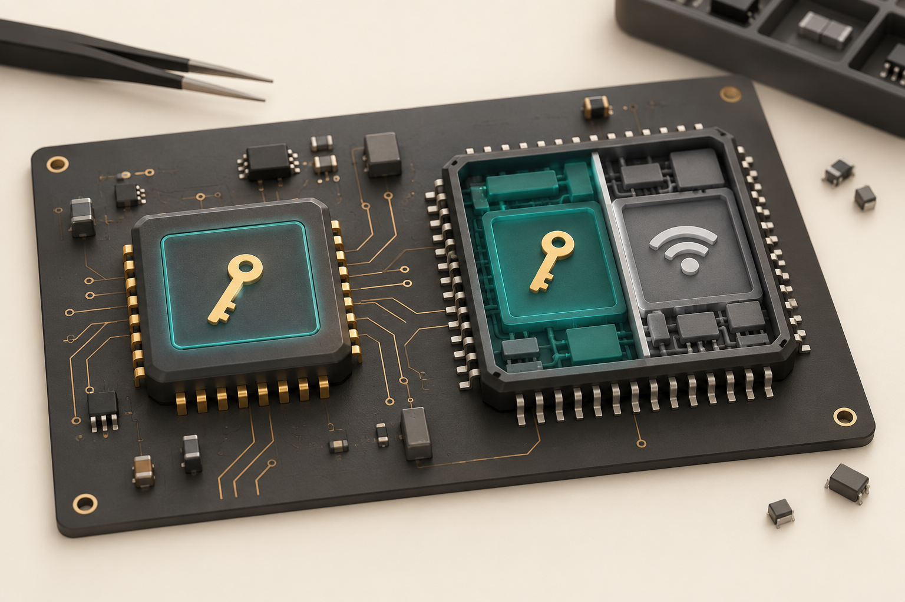
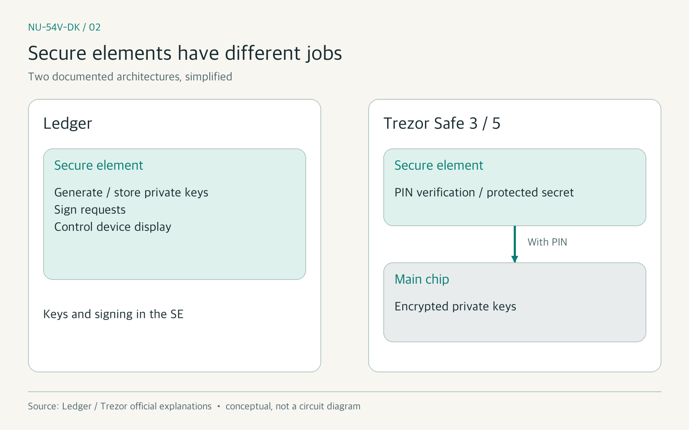
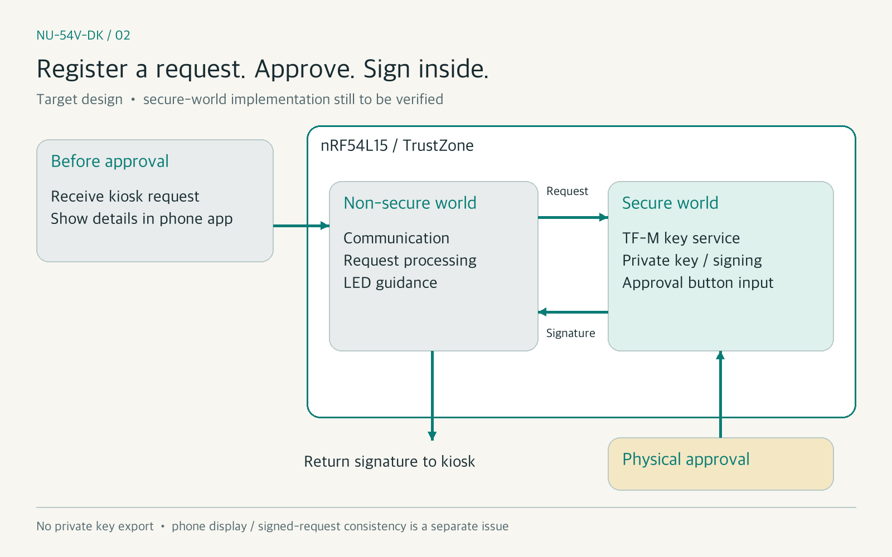
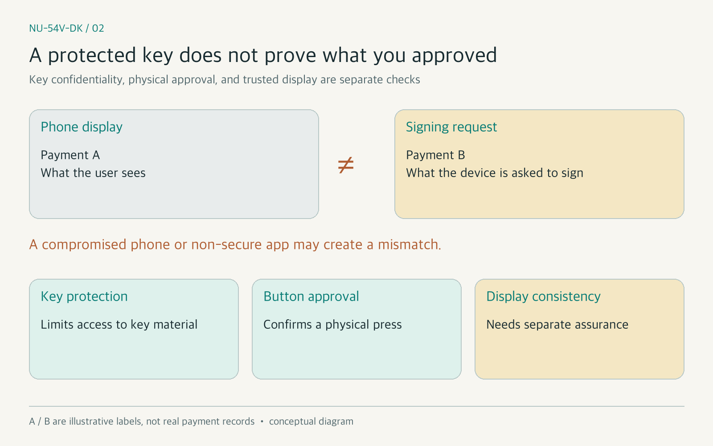

# [NU-54V-DK 02] Hardware Wallet Private Keys: Secure Elements vs TrustZone

### We examined what secure elements do in hardware wallets and how the NU-54V-DK board could protect key storage and signing

> Building a Stablecoin Payment Device 02 · Previous article: [Starting with a Plan, LEDs, and Buttons](https://medium.com/p/54cccf2f6edb)

In the previous article, our team tested the NU-54V-DK board's LEDs and buttons. Turning a button press into payment approval raises another question: where should the private key used to sign a payment live, and how should we protect it?

A dedicated secure element often appears in discussions of hardware wallets. Yet its role varies by product. Some devices keep keys and perform signing inside the secure element. Others use it to protect PIN verification and a secret needed to unlock keys stored on the main chip. The presence of a secure element does not tell us the entire architecture.

We chose a design using TrustZone in the board's nRF54L15 instead of connecting an external secure element. Our schedule allocated six days to external secure-element integration. Removing that work from our twelve-week plan does not establish the same protection level as a secure element.

This article compares these approaches and explains our design choice and remaining checks. Secure-world key handling and its connection to the approval button are described as a design, not a completed implementation. This project is a proof of concept (PoC) using a testnet and test tokens.

*Figure 1. A secure element and TrustZone-based isolation. AI-generated conceptual illustration. This does not depict the actual board layout or establish equivalent security between the two approaches.*

### INDEX

1. How do hot wallets and hardware wallets differ?
2. What does a secure element do in a hardware wallet?
3. What can TrustZone on the NU-54V-DK protect?
4. Keeping the private key inside and returning the signature
5. Problems that key protection alone cannot solve
6. Our choice for this testnet PoC and the remaining checks

---

## 1. How do hot wallets and hardware wallets differ?

A wallet manages the keys that authorize asset movements rather than holding the coins themselves. A signature made with a private key can authorize a request. Someone who obtains that key can also exercise that authority.

A hot wallet is available for use in an online environment. In a typical software wallet, an app on a phone or computer handles keys and signing. Some wallets use the phone's hardware security features, so we should not assume that every hot wallet stores keys in the same way.

A hardware wallet handles keys and signing in a separate device without handing its private key to the connected phone or computer. Being connected over USB or Bluetooth Low Energy (BLE) is different from transferring the private key over that connection. We need to examine both connectivity and **where the key lives and which code can use it**.[1]

## 2. What does a secure element do in a hardware wallet?

Secure elements are designed to protect sensitive values and operations. In addition to restricting software access, they may counter side-channel attacks that analyze power or electromagnetic signals, and fault injection that induces errors by disturbing voltage or clocks. Features and evaluation scope must be checked for each chip.[1][2]

Two documented product families illustrate the difference.

| Product example | Role of the secure element |
|---|---|
| Ledger | Private-key generation, storage, and signing; control of the device's confirmation display |
| Trezor Safe 3 and 5 | PIN verification and protection of a secret used for key encryption; private keys are stored encrypted on the main chip |

Ledger places keys and signing in the secure element. Trezor Safe 3 and 5 use a protected secret together with the PIN to protect keys on the main chip. **Having a secure element and keeping the private key inside it are separate architectural choices.**[1][2]

*Figure 2. Simplified secure-element roles. Created by the author from Ledger and Trezor's official explanations[1][2]. This is not a circuit diagram or an architecture shared by every model.*

We initially investigated signing with secp256k1 inside an external secure element. Among the candidates we checked at the time, the NXP SE050 family supported this curve; OPTIGA Trust M and TROPIC01 did not. That finding applies to the chips and signing path we investigated. It does not mean those chips cannot be used in hardware wallets with a different architecture.[6]

## 3. What can TrustZone on the NU-54V-DK protect?

The NU-54V-DK uses Nordic's nRF54L15, whose main core is an Arm Cortex-M33. TrustZone provides a foundation for separating secure and non-secure worlds. A system can be configured so that non-secure code cannot directly access memory and peripherals assigned to the secure world.[3][4]

TrustZone is not itself a wallet or a key-storage service. Our design places a key service on Trusted Firmware-M (TF-M), combining protected storage with a cryptographic accelerator. TF-M provides a software foundation for secure services and isolation.[5]

TrustZone provides the **access boundary**, TF-M provides **services within that boundary**, and the accelerator performs **cryptographic operations**. Key storage and signing depend on connecting those pieces correctly. Firmware integrity at boot, storage protection, and debug access restrictions must also be checked.

The nRF54L15 also includes side-channel protection and tamper detectors. Describing this board as a generic microcontroller unit (MCU) with no physical protections would miss those features. However, a chip's feature list does not establish the physical attack resistance of the device we build.[4]

## 4. Keeping the private key inside and returning the signature

Our design lets the phone app and kiosk request a payment without holding the private key. The non-secure world handles communication and payment messages. The secure world is intended to handle key generation, storage, signing, and approval-button input.

The flow is:

1. The device receives a payment request from the kiosk.
2. The non-secure world processes it and sends confirmation details to the phone app.
3. The signing request is registered with the secure world.
4. The user presses the device's approval button.
5. The secure world connects that approval to the registered request and signs it.
6. The signature is returned to the kiosk.

The phone display and request registration must precede approval. The secure world is designed to use physical button input as a signing condition rather than trusting an approval flag supplied by non-secure code. **Submitting a request alone should not be enough to obtain a signature.**

*Figure 3. Registering a request, approving it with a button, and signing inside the device. Created by the author. This is a target design, not a verified implementation, and does not guarantee that the phone display matches the signing request.*

The key service should expose public keys and signature results without exporting the private key. But an API policy that prohibits key export does not prove that non-secure code cannot read the key. Memory isolation and storage protection need to be tested as well.

## 5. Problems that key protection alone cannot solve

The first is payment confirmation. Our device has no screen; the phone app displays the merchant name and amount. If the phone app or non-secure firmware is compromised, displayed details may differ from the signing request. An attacker might obtain a signature on the wrong request without extracting the key.

Receiving button input in the secure world can establish that a person pressed a button. It cannot establish **what that person saw** before pressing it. This is a difference to explain when comparing our design with Ledger's control of a trusted device display.[1]

*Figure 4. Key protection and confirmation of user intent require separate checks. Created by the author. Payments A and B are conceptual labels illustrating a possible mismatch, not actual payment records.*

The second is an attacker who holds the device for an extended period. A rented device can be disassembled or tested repeatedly. Using the chip's security features does not mean we have performed an independent physical security evaluation. The risks of omitting the external secure element must remain explicit limitations of this testnet PoC.

Settlement-contract payment limits provide another layer of protection. They apply to payments through that contract, not to the private key itself or assets elsewhere. They do not resolve the display-confirmation problem.

## 6. Our choice for this testnet PoC and the remaining checks

We removed the external secure element because there was insufficient time to procure it and validate wiring, drivers, and communication protection. We chose to design around TrustZone in this cycle and check the actual protection boundaries in subsequent work.

The current firmware record describes a development path that generates keys and signs through PSA Crypto and CRACEN in the non-secure world. Key export is prohibited by API policy, but this is not TF-M secure-world key isolation. Connecting key handling and the approval button within the secure world remains part of the week-eight plan.

We still need to check that non-secure code cannot access the key, that signing cannot occur without approval, and that the approved request is tied to the actual signing target. Storage and debug access protection also require verification. Until those checks are performed, the secure-world design should not be presented as a successfully verified implementation.

## Closing

We examined how secure-element roles vary and how TrustZone could support our key-protection design. Our choice is a structure to implement and test within a testnet PoC, not proof of security equivalent to a secure element. The hardest part was explaining both private-key protection and the user's approval of the correct payment. Next, we will cover the settlement contract and software-signed payments, distinguishing what we actually verified.

### References

- [1] [Ledger, The Secure Element Chip](https://www.ledger.com/academy/security/the-secure-element-whistanding-security-attacks)
- [2] [Trezor, Secure Elements in Trezor Safe devices](https://trezor.io/learn/security-privacy/how-trezor-keeps-you-safe/secure-elements-in-trezor-safe-devices)
- [3] [Arm, TrustZone for Cortex-M](https://www.arm.com/technologies/trustzone-for-cortex-m)
- [4] [Nordic Semiconductor, nRF54L15](https://www.nordicsemi.com/Products/nRF54L15)
- [5] [Trusted Firmware-M, Introduction](https://trustedfirmware-m.readthedocs.io/en/latest/introduction/index.html)
- [6] [NXP, AN12436 SE050 configurations](https://www.nxp.com/docs/en/application-note/AN12436.pdf)

`#NUCODE` `#누코드` `#NU54VDK` `#누코더스` `#Nucoders`

---

## Publication preparation notes (do not upload to Medium)

- Both editions were reviewed and publicly published on Medium on 2026-10-06 at the user's request.
- The earlier draft's measurements are preserved in [source notes](02-source-notes.md).
- Official sources checked on 2026-10-06. Secure-world functionality remains a target design.
- Reveal the project repository link in the final installment of the series. It is excluded from this article's references.
- Image 1 is shared with the Korean edition; images 2–4 use the `-en.png` variants in `assets/02/`.

- [English Medium article](https://medium.com/p/65c931f581c3)
- [Korean Medium article](https://medium.com/p/3c8fc79adca7)
- Both saved drafts, all four images, and all five topics were checked after reloading.
- After publication, all four images and all five topics were verified on each public page, with the project repository link excluded. Exact public URLs are listed above; detailed verification records are retained in local working materials.

### Pre-publication checks

- [x] Title, INDEX, and section headings agree.
- [x] Previous English article link included.
- [x] Design and current development path distinguished.
- [x] Testnet PoC scope stated.
- [x] Original five tags retained.
- [x] Four image files and captions checked.
- [x] Four images actually uploaded to Medium.
- [x] Five Medium topic tags entered.
- [x] Saved text and image loading checked after reloading.
- [x] Both editions publicly published and public pages verified.
- [ ] Next article link added after publication.
