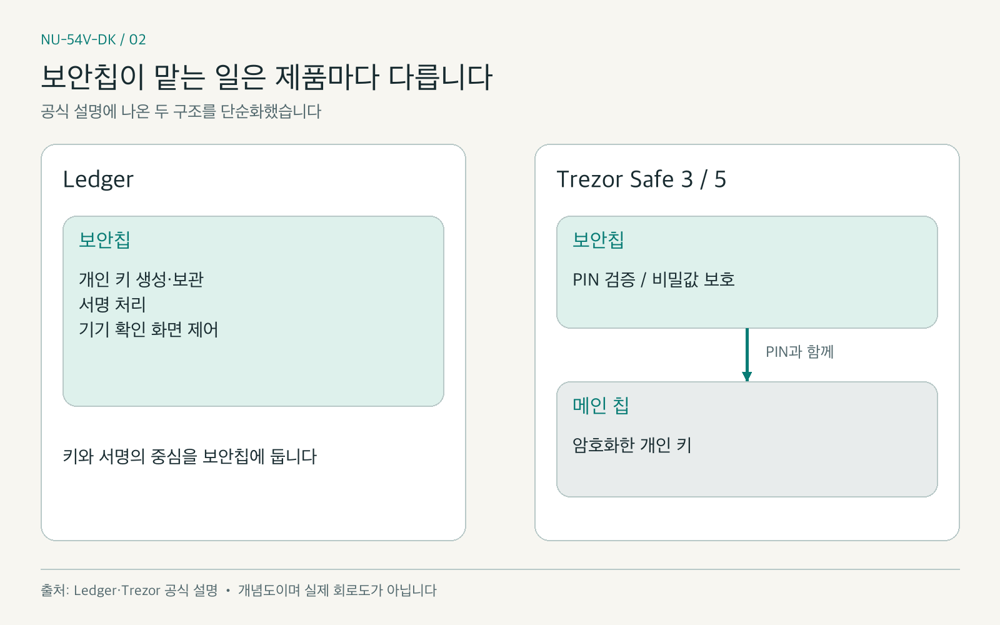
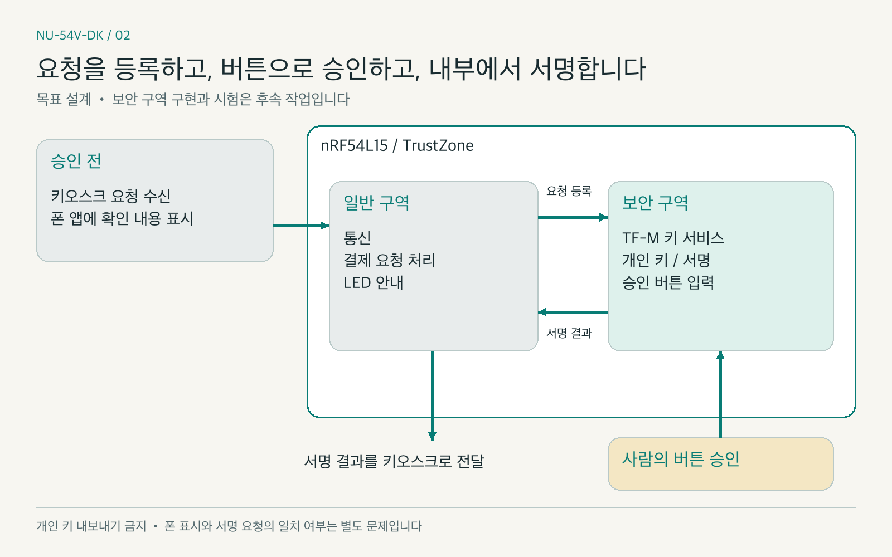
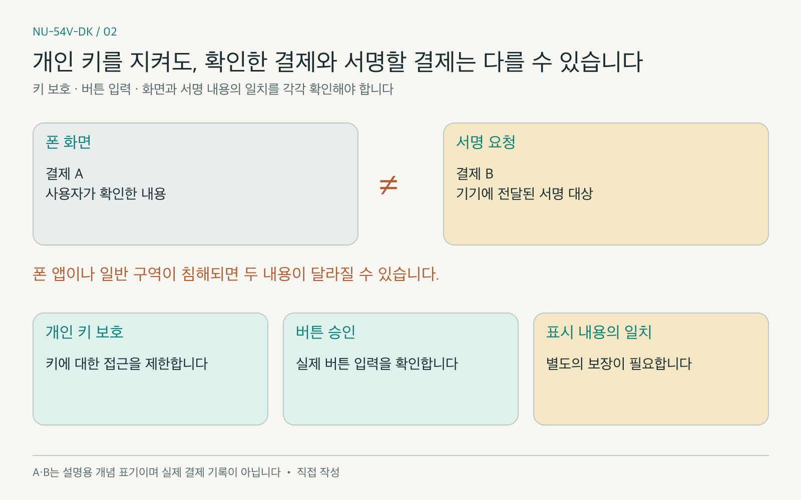

# [NU-54V-DK 02] 하드월렛 개인키 : 보안칩 vs TrustZone

### 하드웨어 지갑의 보안칩 역할을 살펴보고, NU-54V-DK 보드에서 키 보관과 서명을 보호하는 구조를 검토했습니다

> 스테이블코인 결제 기기 제작기 02 · 이전 글: [계획을 세우고 LED·버튼부터 켜다](https://medium.com/p/e409766b0101)

지난 글에서 저희 팀은 NU-54V-DK 보드의 LED와 버튼을 켜 봤습니다. 이제 버튼을 누르면 결제를 승인하는 기기로 만들려면, 먼저 한 가지를 정해야 합니다. 결제에 서명하는 개인 키(private key)를 어디에 두고 어떻게 보호할 것인가입니다.

하드웨어 지갑(hardware wallet)을 살펴보면 전용 보안칩(secure element)이 자주 등장합니다. 그런데 제품마다 보안칩이 맡는 일이 다릅니다. 키를 보관하고 서명하는 제품도 있고, 메인 칩에 저장된 키를 풀기 위한 비밀값과 PIN 검증을 보호하는 제품도 있습니다. 보안칩이 있다는 사실만으로 내부 구조를 한 가지로 설명할 수는 없습니다.

저희는 외부 보안칩을 연결하는 대신, 보드의 nRF54L15에 내장된 TrustZone을 활용하는 설계를 선택했습니다. 외부 보안칩 통합에 배정했던 작업은 6일이었습니다. 12주 일정에서 이 작업을 제외했지만, 그 결정이 보안칩과 같은 보호 수준을 확보했다는 뜻은 아닙니다.

이번 글에서는 하드웨어 지갑의 키 보호 방식과 TrustZone의 역할을 비교하고, 저희가 선택한 구조와 남은 검증을 살펴보겠습니다. 보안 구역에서의 키 처리와 승인 버튼 연결은 설계로 설명하며, 구현을 완료한 결과로 쓰지 않습니다. 이 프로젝트는 테스트넷과 시험용 토큰을 쓰는 개념 증명(Proof of Concept, PoC)입니다.

*그림 1. 보안칩과 TrustZone 기반 구역 분리를 표현했습니다. AI로 생성한 개념도입니다. 실제 보드 구조나 두 방식의 동등한 보안 수준을 나타내는 그림은 아닙니다.*

### INDEX

1. 핫월렛과 하드웨어 지갑은 무엇이 다른가
2. 하드웨어 지갑에서 보안칩이 하는 일
3. NU-54V-DK의 TrustZone이 보호하는 범위
4. 개인 키를 안에 두고 서명 결과만 보내는 구조
5. 개인 키 보호만으로 해결되지 않는 문제
6. 이번 테스트넷 PoC에서 선택한 방식과 남은 검증

---

## 1. 핫월렛과 하드웨어 지갑은 무엇이 다른가

지갑은 코인 자체를 담는 상자라기보다, 자산을 움직일 권한을 가진 키를 관리하는 도구입니다. 개인 키로 만든 서명을 검증해 요청을 승인하므로, 다른 사람이 키를 얻으면 그 권한도 사용할 수 있습니다.

핫월렛(hot wallet)은 온라인 환경에서 사용할 수 있는 지갑입니다. 일반적인 소프트웨어 지갑에서는 폰이나 컴퓨터의 앱이 키와 서명을 처리합니다. 다만 폰의 하드웨어 보안 기능을 활용하는 지갑도 있으므로, 모든 핫월렛이 키를 같은 방식으로 저장한다고 단정하지는 않습니다.

하드웨어 지갑은 별도의 기기에서 키와 서명을 처리해, 연결된 폰이나 컴퓨터에 개인 키를 넘기지 않는 구조를 사용합니다. USB나 저전력 블루투스(Bluetooth Low Energy, BLE)로 연결되어 있다는 사실과 개인 키가 그 연결을 통해 전달된다는 것은 서로 다른 문제입니다. 비교할 때는 연결 상태와 함께 **키가 어디에 있고, 어느 코드가 키를 사용할 수 있는지**를 살펴봐야 합니다.[1]

## 2. 하드웨어 지갑에서 보안칩이 하는 일

보안칩은 민감한 값과 연산을 보호하도록 설계한 부품입니다. 소프트웨어 접근 제한뿐 아니라, 전력과 전자기 신호를 분석하는 부채널 공격(side-channel attack), 전압이나 클록을 흔들어 오류를 유도하는 결함 주입(fault injection) 같은 공격에 대한 대응도 제품 선택의 근거가 됩니다. 구체적인 지원 기능과 평가 범위는 칩마다 확인해야 합니다.[1][2]

대표적인 두 제품군을 비교하면 역할의 차이가 보입니다.

| 제품 사례 | 보안칩이 맡는 역할 |
|---|---|
| Ledger | 개인 키 생성·보관과 서명, 기기의 확인 화면 제어 |
| Trezor Safe 3·5 | PIN 검증과 키 암호화에 쓰는 비밀값 보호. 개인 키는 메인 칩에 암호화해 저장 |

Ledger는 보안칩을 키와 서명의 중심에 둡니다. Trezor Safe 3·5는 보안칩에 저장한 비밀값을 PIN과 함께 사용해 메인 칩의 개인 키를 보호합니다. 따라서 **보안칩이 있는가와 개인 키가 그 칩 안에 있는가는 구분해서 봐야 합니다.**[1][2]

*그림 2. 제품별 보안칩 역할을 단순화했습니다. 직접 작성. 출처: Ledger와 Trezor 공식 설명[1][2]. 실제 회로도나 모든 모델에 공통으로 적용되는 구조는 아닙니다.*

저희는 처음에 외부 보안칩 안에서 secp256k1 서명을 처리하는 방식을 검토했습니다. 당시 확인한 후보 가운데 NXP SE050 계열은 이 곡선을 지원했고, OPTIGA Trust M과 TROPIC01은 지원하지 않았습니다. 이것은 저희가 검토한 칩과 서명 경로의 조건이며, 다른 방식으로 해당 칩을 사용하는 하드웨어 지갑이 불가능하다는 뜻은 아닙니다.[6]

## 3. NU-54V-DK의 TrustZone이 보호하는 범위

NU-54V-DK에는 Nordic의 nRF54L15가 탑재되어 있고, 메인 코어는 Arm Cortex-M33입니다. 이 코어가 지원하는 TrustZone은 보안 구역(secure world)과 일반 구역(non-secure world)을 분리하는 기반입니다. 일반 구역의 코드가 보안 구역으로 지정한 메모리와 주변장치에 직접 접근하지 못하도록 구성할 수 있습니다.[3][4]

TrustZone 자체가 지갑이나 키 저장 서비스는 아닙니다. 저희 설계에서는 보안 구역의 펌웨어인 Trusted Firmware-M(TF-M) 위에 키 서비스를 두고, 보호 저장소와 암호 가속기를 함께 사용합니다. TF-M은 보안 서비스와 구역 분리를 구현하는 소프트웨어 기반을 제공합니다.[5]

즉, TrustZone은 **접근 경계**, TF-M은 **그 경계 안의 서비스**, 암호 가속기는 **암호 연산**을 맡습니다. 키 보관과 서명은 이 기능들을 올바르게 연결해야 성립합니다. 부팅할 펌웨어의 무결성, 저장소 보호, 디버그 접근 제한도 함께 확인해야 합니다.

nRF54L15에는 TrustZone 외에 부채널 대응과 변조 감지 기능도 있습니다. 그래서 일반적인 마이크로컨트롤러(Microcontroller Unit, MCU)는 물리 공격에 아무런 대응이 없다고 설명하면 이 보드의 특성을 놓치게 됩니다. 다만 칩의 기능 목록만으로 저희가 만든 기기의 물리 공격 방어 수준을 입증할 수는 없습니다.[4]

## 4. 개인 키를 안에 두고 서명 결과만 보내는 구조

저희 설계의 목표는 폰 앱과 키오스크가 개인 키를 갖지 않고 결제를 요청할 수 있게 하는 것입니다. 일반 구역은 통신과 결제 메시지 처리를 맡고, 보안 구역은 키 생성·보관·서명과 승인 버튼 입력을 맡도록 나눕니다.

흐름은 다음과 같습니다.

1. 키오스크의 결제 요청을 기기가 받습니다.
2. 일반 구역이 요청을 처리하고 폰 앱에 확인할 내용을 전달합니다.
3. 서명할 요청을 보안 구역에 등록합니다.
4. 사람이 기기의 승인 버튼을 누릅니다.
5. 보안 구역이 등록된 요청과 승인을 연결해 서명을 처리합니다.
6. 서명 결과를 키오스크에 전달합니다.

폰 화면 표시와 서명 요청 등록은 승인 전에 이루어져야 합니다. 보안 구역은 일반 구역이 임의로 넘긴 승인 표시를 믿는 대신, 실제 버튼 입력을 서명 허용 조건에 연결하도록 설계합니다. 목표는 **요청을 보냈다는 이유만으로 서명을 내주지 않는 것**입니다.

*그림 3. 요청 등록 → 승인 버튼 → 기기 내부 서명의 설계 흐름입니다. 직접 작성. 현재 구현을 검증한 결과가 아니며, 폰 화면과 서명 요청의 일치까지 보장하는 그림은 아닙니다.*

외부 인터페이스로 개인 키를 내보내지 않고, 공개 키와 서명 결과만 전달하는 것이 키 서비스의 원칙입니다. 하지만 키 내보내기 API를 막았다는 사실만으로 일반 구역에서 키를 읽을 수 없다고 증명되지는 않습니다. 실제 메모리 접근 경계와 저장소 보호를 함께 시험해야 합니다.

## 5. 개인 키 보호만으로 해결되지 않는 문제

첫 번째는 결제 내용 확인입니다. 저희 기기에는 화면이 없고, 가게 이름과 금액은 폰 앱에 표시합니다. 폰 앱이나 일반 구역이 침해되면 화면에 보이는 내용과 서명할 요청이 달라질 가능성이 남습니다. 키를 꺼내지 못하더라도 잘못된 요청에 서명하게 할 수 있는 것입니다.

보안 구역에서 버튼 입력을 직접 받으면 사람이 버튼을 눌렀다는 조건은 확인할 수 있습니다. 그러나 사람이 **어떤 내용을 보고** 눌렀는지까지 확인하지는 못합니다. 기기의 신뢰할 수 있는 화면(trusted display)을 제어하는 Ledger의 구조와 비교할 때, 저희 설계에서 드러내야 하는 차이입니다.[1]

*그림 4. 개인 키 보호와 사용자 의도 확인은 각각 검증해야 합니다. 직접 작성. 결제 A와 B는 화면과 요청이 달라질 수 있음을 설명하는 개념 표기이며 실제 결제 기록이 아닙니다.*

두 번째는 기기를 오래 손에 쥔 공격자입니다. 대여 기기는 공격자가 분해하거나 반복해서 시험할 수 있습니다. 저희는 칩의 보안 기능을 사용하더라도 물리 공격에 대한 독립적인 평가를 수행한 것은 아닙니다. 보안칩을 제외한 데 따른 위험은 테스트넷 PoC의 한계로 기록해야 합니다.

정산 컨트랙트의 결제 한도는 추가 방어 수단입니다. 하지만 그 컨트랙트를 통한 결제에 적용되는 제한이며, 개인 키 자체나 다른 곳의 자산까지 보호한다는 뜻은 아닙니다. 한도가 있다는 이유로 화면 확인 문제를 해결했다고 쓰지는 않습니다.

## 6. 이번 테스트넷 PoC에서 선택한 방식과 남은 검증

외부 보안칩을 제외한 이유는 부품 조달, 연결, 드라이버와 통신 보호를 검증할 시간이 부족했기 때문입니다. 저희는 이번 사이클에서 TrustZone을 활용한 구조를 설계하고, 실제 보호 경계를 후속 작업에서 확인하는 선택을 했습니다.

현재 펌웨어 기록에는 일반 구역에서 PSA Crypto와 CRACEN으로 키를 생성하고 서명하는 개발 경로가 있습니다. 키 내보내기는 API 정책으로 막았지만, 이 경로를 TF-M 보안 구역의 키 격리 구현이라고 부를 수는 없습니다. 보안 구역에서 키 처리와 승인 버튼을 연결하는 작업은 8주차 계획으로 남아 있습니다.

남은 검증은 일반 구역에서 키에 접근할 수 없는지, 승인 없이 서명이 나오지 않는지, 승인된 요청과 실제 서명 대상이 연결되는지입니다. 저장소와 디버그 접근 보호도 확인해야 합니다. 이 시험을 수행하기 전에는 보안 구역 설계를 성공한 구현으로 소개하지 않습니다.

## 마무리

이번 편에서는 보안칩의 역할이 제품마다 다르다는 점과 TrustZone을 이용한 키 보호 설계를 살펴봤습니다. 저희가 선택한 것은 테스트넷 PoC에서 구현하고 검증할 구조이며, 보안칩과 동등한 보안을 입증한 결과는 아닙니다. 가장 고민한 부분은 개인 키를 지키는 문제와 사용자가 올바른 결제를 승인하는 문제를 함께 설명하는 일이었습니다. 다음 편에서는 정산 컨트랙트와 소프트웨어 서명 결제를 다루며, 실제 확인한 결과를 구분해 기록하겠습니다.

### 레퍼런스

- [1] [Ledger, The Secure Element Chip](https://www.ledger.com/academy/security/the-secure-element-whistanding-security-attacks)
- [2] [Trezor, Secure Elements in Trezor Safe devices](https://trezor.io/learn/security-privacy/how-trezor-keeps-you-safe/secure-elements-in-trezor-safe-devices)
- [3] [Arm, TrustZone for Cortex-M](https://www.arm.com/technologies/trustzone-for-cortex-m)
- [4] [Nordic Semiconductor, nRF54L15](https://www.nordicsemi.com/Products/nRF54L15)
- [5] [Trusted Firmware-M, Introduction](https://trustedfirmware-m.readthedocs.io/en/latest/introduction/index.html)
- [6] [NXP, AN12436 SE050 configurations](https://www.nxp.com/docs/en/application-note/AN12436.pdf)

`#NUCODE` `#누코드` `#NU54VDK` `#누코더스` `#Nucoders`

---

## 발행 준비 메모 (Medium에는 올리지 않습니다)

- 사용자 요청에 따라 한글·영문을 검토한 뒤 2026-10-06에 Medium에 공개 발행했습니다.
- 기존 초안의 점검·일정·가스 측정 기록은 [보존본](02-source-notes.md)에 남겼습니다. 후속 정산 글에서 당시 측정과 최신 결과를 구분합니다.
- 설계 문서의 키 격리 목표와 현재 일반 구역 개발 경로를 구분했습니다. 키 봉인의 예외 기록도 남아 있어 TF-M 보호 완료로 표현하지 않습니다.
- 공식 자료 확인일: 2026-10-06.
- 프로젝트 저장소 링크는 시리즈 마지막 편에서 공개합니다. 이번 편의 레퍼런스에서는 제외했습니다.

- [한글판 Medium 공개 글](https://medium.com/p/3c8fc79adca7)
- [영문판 Medium 공개 글](https://medium.com/p/65c931f581c3)
- 두 판본의 저장된 본문, 이미지 4장 로딩, 주제 태그 5개를 새로고침 후 확인했습니다.
- 공개 발행 후에도 이미지 4장, 태그 5개, 프로젝트 저장소 링크 제외를 확인했습니다. 정확한 공개 URL은 위 링크에 표시했으며 상세 확인 기록은 로컬 작업 자료에 보관합니다.

### 이미지 목록

| 번호 | 위치 | 한글 파일 | 영문 파일 | 출처 |
|---|---|---|---|---|
| 1 | 도입 뒤 | assets/02/01-hero.png | assets/02/01-hero.png | AI로 생성한 개념도입니다 |
| 2 | 2장 | assets/02/02-secure-element-roles.png | assets/02/02-secure-element-roles-en.png | 직접 작성. Ledger·Trezor 공식 설명 |
| 3 | 4장 | assets/02/03-trustzone-signing-flow.png | assets/02/03-trustzone-signing-flow-en.png | 직접 작성. 설계 흐름 |
| 4 | 5장 | assets/02/04-approval-and-display.png | assets/02/04-approval-and-display-en.png | 직접 작성. 개념도 |

### 발행 전 확인

- [x] 제목과 INDEX 및 본문 섹션 제목이 일치합니다.
- [x] 이전 글의 한글판 링크를 넣었습니다.
- [x] 설계와 현재 개발 경로를 구분했습니다.
- [x] 테스트넷 PoC 범위를 밝혔습니다.
- [x] 원문 태그 5개를 유지했습니다.
- [x] 이미지 4장 파일과 캡션을 확인했습니다.
- [x] Medium 초안에 이미지 4장을 실제 업로드했습니다.
- [x] Medium 주제 태그 5개를 입력했습니다.
- [x] 새로고침 후 저장된 본문과 이미지 로딩을 확인했습니다.
- [x] 한글·영문 공개 발행과 공개 페이지 표시를 확인했습니다.
- [ ] 후속 글 발행 후 다음 편 링크를 넣었습니다.
