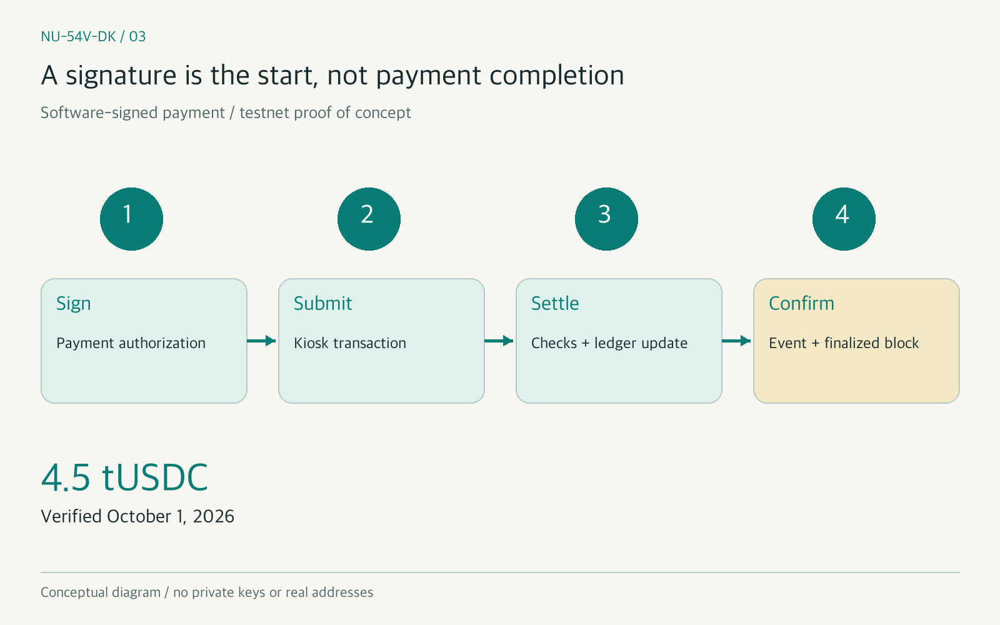
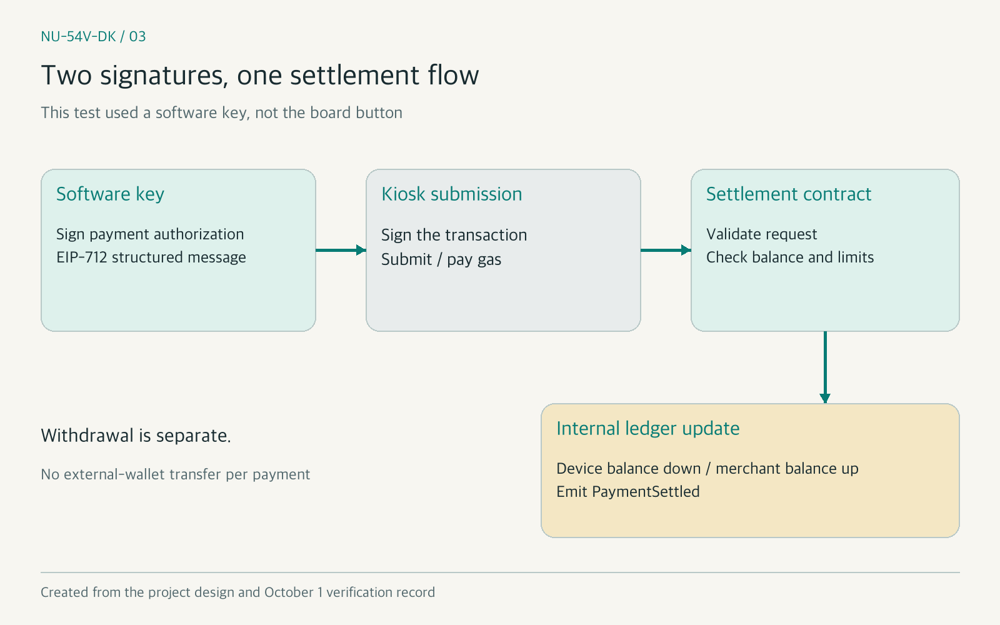
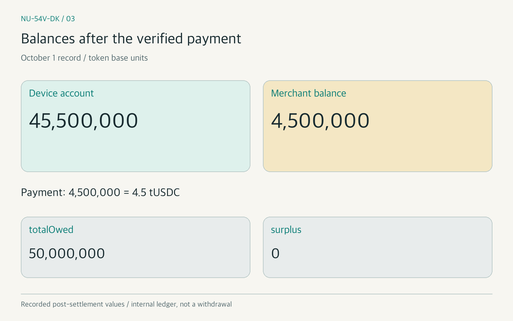
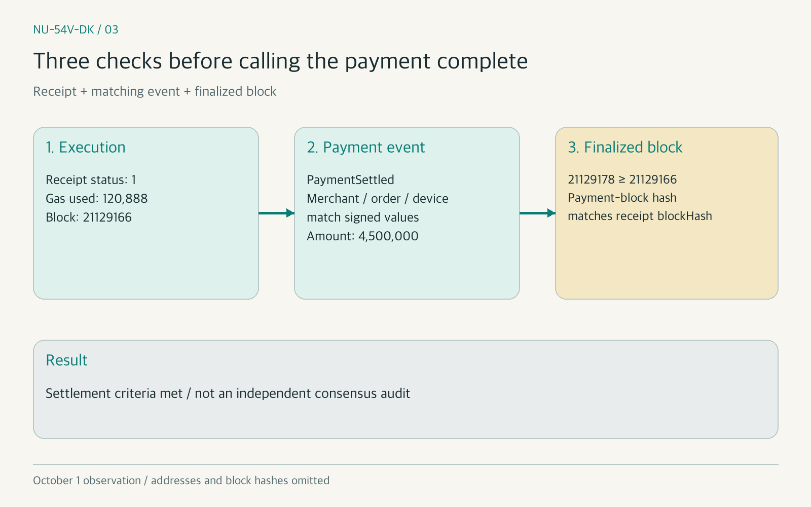

# [NU-54V-DK 03] How Does a Signed Payment Settle? Our First Testnet Payment

### We signed a payment with a software key and checked the settlement contract's balance changes and finalized event

> Building a Stablecoin Payment Device 03 · Previous article: [Hardware Wallet Private Keys: Secure Elements vs TrustZone](https://medium.com/p/65c931f581c3)

In the previous article, we examined where to protect a private key. Keeping it safe and producing a signature does not complete a payment. What must the kiosk and blockchain check before they can call that payment complete?

The simplest answer might be to send the signature to the chain and wait for success. But accepting a request, executing a transaction, matching the payment details, and finalizing the block are separate checks. Receiving the same signature again must not settle the payment twice.

Our team tested settlement before connecting the board. On October 1, 2026, we settled a **4.5 tUSDC** payment signed with a software key on the StableNet testnet. The planned deadline was October 14; the actual verification finished earlier.

This article covers the difference between signing and settlement, the contract's checks, and the balances and event recorded for our first payment. Board-button and kiosk-app integration is for the next installment. This project is a proof of concept (PoC) using a testnet and test tokens.

*Figure 1. Stages between creating a signature and completing a payment. Created by the author as a conceptual diagram, not an actual app screen. No private key or real address is depicted.*

### INDEX

1. How does button approval differ from on-chain settlement?
2. Why we tested the payment flow with software signing first
3. What the settlement contract checks
4. Deploying to testnet and submitting the first payment
5. What confirms that a payment is complete?
6. Duplicate submissions, gas costs, and next steps

---

## 1. How does button approval differ from on-chain settlement?

The device's button approval is a condition for allowing a signature. That signature serves as authorization for specific payment details. The kiosk submits those details and the signature to the settlement contract. An on-chain settlement result exists only after the contract completes its checks and balance changes.

There are two signatures to distinguish: **the payment-authorization message signature** and **the transaction signature used to submit to the chain**. In our architecture, a key representing the device signs the authorization; the kiosk submits the transaction and pays gas. A software key took the device key's role in this test.

## 2. Why we tested the payment flow with software signing first

Connecting the board, wireless link, button, and contract all at once makes failures difficult to isolate. We first created and signed a payment authorization in software, submitted it, and checked the settlement result.

We use EIP-712, the standard for typed structured data signing. It gives payment details such as amount and order a defined structure and binds them to a domain identifying the chain and verifying contract.[1] The focus here is what the authorization covers, without exposing implementation internals or actual keys.

**EIP-712 does not provide replay protection by itself.** Our contract separately checks whether an order has already been paid and whether its authorization nonce has been used.[1] This software test also does not verify the board's key isolation or physical-button approval.

*Figure 2. The software-signed settlement flow used in this test. Created by the author from the project design and October 1 verification record. It is not presented as a board-button test.*

## 3. What the settlement contract checks

Our contract does not accept a payment solely because its signature is valid. Its checks can be grouped as follows:

- The request is for this chain, contract, and token, and its amount is nonzero.
- The order has not already been paid, and the authorization remains within its valid time range.
- The signer has an active device account, the merchant is active, and the payout destination matches the registry.
- The authorization nonce is unused, and the amount fits the per-payment limit, daily limit, and account balance.

After those checks, the contract reduces the device-account balance, increases the merchant balance, and emits `PaymentSettled`. This is **a balance movement in the contract's internal ledger**. Each payment does not transfer tokens to the merchant's external wallet; withdrawal is a separate flow.

After the October 1 settlement, the device balance was 45,500,000 and the merchant balance was 4,500,000. The recorded `totalOwed` was 50,000,000, and `surplus` was 0. The payment amount of 4,500,000 corresponds to 4.5 tUSDC in the test token's display units.

*Figure 3. Balances recorded after settlement on October 1. Created by the author. Numbers are token base units, not the result of a transfer or withdrawal to an external wallet.*

## 4. Deploying to testnet and submitting the first payment

We deployed the test token, merchant registry, and settlement contract. The compiler was solc 0.8.30, the optimizer setting was 200, and the EVM target was prague. We verified that the network's chain ID was 8283.

| Deployed contract | Measured gas usage |
|---|---|
| TestUSDC | 990,001 gas |
| MerchantRegistry | 539,362 gas |
| PaymentSettlement | 1,953,730 gas |
| Total | 3,483,093 gas |

At the recorded gas price of 47,600 gwei, deployment cost approximately 165.8 WKRC. We compared the on-chain runtime code with the build output, excluding positions containing values fixed during construction.

We then registered the settlement contract as a trusted sender for the test token. That setup used 45,816 gas in block 21129151. The software-signed payment was included in block **21129166**, with receipt `status` 1 and **120,888 gas** used.

## 5. What confirms that a payment is complete?

We checked more than a transmission-success message. We verified the transaction receipt's success `status`, then checked that the merchant, order, and device in `PaymentSettled` matched the signed values. The event amount was also 4,500,000.[2]

We then queried the node's `finalized` block. At that point it was **21129178**, at or above payment block 21129166. The payment block's hash also matched the receipt's `blockHash`. We compared block identity as well as height.[2]

*Figure 4. Checks used to determine completion of this payment. Created by the author using the October 1 result and block numbers. Actual addresses and block hashes are omitted.*

Those records met our settlement-verification criteria. They establish that we checked the node's `finalized` result, not that we independently verified the chain's consensus algorithm.

## 6. Duplicate submissions, gas costs, and next steps

A call simulation with the same signature, using `eth_call`, reverted with `OrderAlreadyPaid`. **We did not send a second transaction and report another settlement.** We used a call that does not change state to check that the contract rejected the already-paid order.[2]

Fee configuration also caused a deployment failure. At the time, the node rejected requests whose priority fee was below 27,600 gwei or whose fee cap was below the sum of the 20,000 gwei base fee and the priority fee. Forge's default priority fee of 1 wei did not work.

We used the priority fee returned by the node and set the fee cap to twice the base fee plus that priority fee. Rejected attempts stopped before transmission, so the transaction nonce and balance did not change. These fee numbers describe that observation, not a fixed network tariff.[3]

The local payment measurement of 165,399 gas and the first testnet payment's 120,888 gas came from different conditions. A separate payment submitted through the kiosk module on October 1 used 103,473 gas. On October 2, we changed the settlement-gas estimate from 170,000 to 130,000 gas and the kiosk's minimum gas-balance threshold from 20 to 13 WKRC. This revised our preparation thresholds using measurements; it does not imply that every payment has the same cost.

## Closing

We verified that a software-key signature led to testnet settlement, with balances and a finalized event recorded. The hardest part was distinguishing signature creation, request submission, execution success, and payment completion. This was not verification of board key protection or the user's confirmation flow. Next, we will examine the integration in which a person pressed the NU-54V-DK board's button and the kiosk app submitted the payment.

### References

- [1] [EIP-712: Typed structured data hashing and signing](https://eips.ethereum.org/EIPS/eip-712)
- [2] [Ethereum JSON-RPC API: transaction receipts, block queries, and eth_call](https://ethereum.org/en/developers/docs/apis/json-rpc/)
- [3] [EIP-1559: Fee market change for ETH 1.0 chain](https://eips.ethereum.org/EIPS/eip-1559)

`#NUCODE` `#누코드` `#NU54VDK` `#누코더스` `#Nucoders`

---

## Publication preparation notes (do not upload to Medium)

- Source records: the October 1 settlement gate, settlement-contract design and requirements, and the preserved local gas measurements from the earlier draft.
- Distinguish the October 1 execution, October 2 threshold changes, and planned deadline.
- Reveal the project repository only in the final installment. Do not include internal source links or paths in the public body.
- Figure 3 shows only recorded post-settlement values; no measured pre-settlement balance is invented.
- Korean and English Medium drafts have been saved. Private links and detailed working records are retained locally and excluded from the repository.

### Pre-publication checks

- [x] Title, INDEX, and section headings agree.
- [x] Previous English article link and original five tags included.
- [x] Testnet and test-token PoC scope stated.
- [x] Software signing distinguished from board-button testing.
- [x] Receipt, event, and finalized checks distinguished.
- [x] Duplicate submission described as eth_call, not another sent transaction.
- [x] Numbers and dates checked against source records.
- [x] Project repository, keys, addresses, hashes, and internal paths excluded from the public body.
- [x] Four images and language-specific captions verified.
- [x] Saved text, images, and topics checked in both Medium drafts.
- [ ] Public publication verified.
- [ ] Next article link added after publication.
