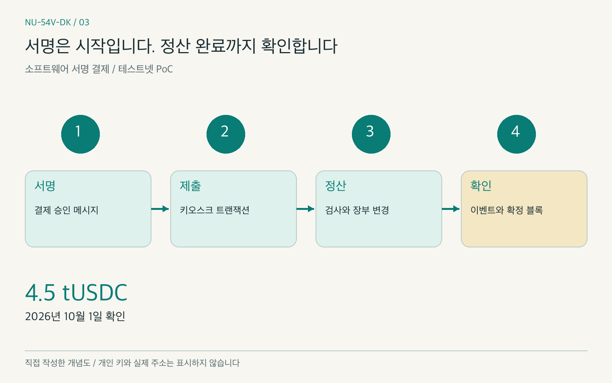
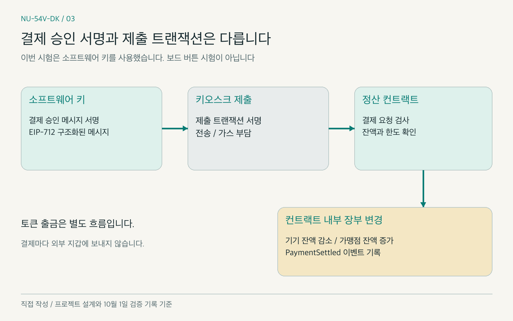
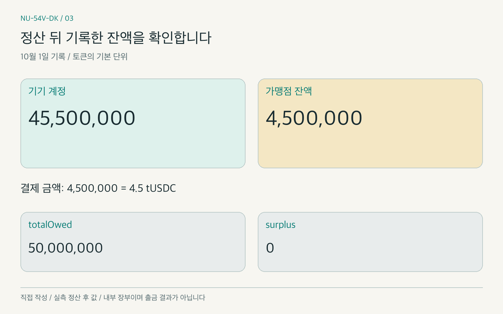
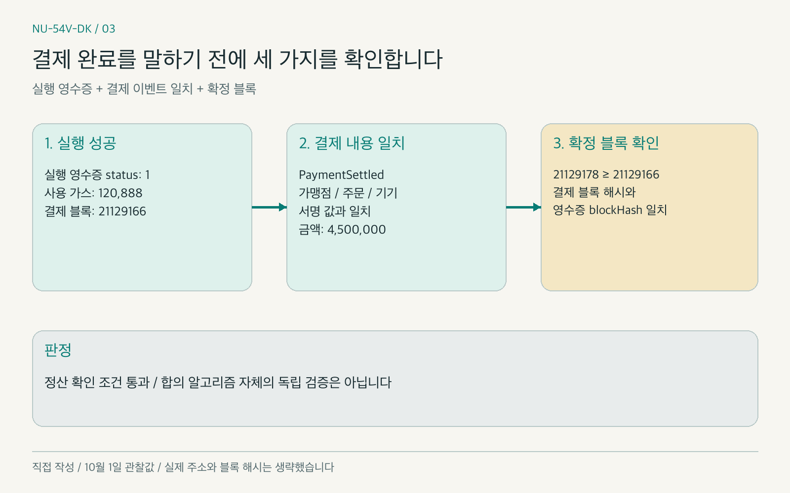

# [NU-54V-DK 03] 서명한 결제는 어떻게 정산될까: 테스트넷 첫 결제

### 기기 대신 소프트웨어 키로 결제를 서명하고, 정산 컨트랙트의 잔액 변화와 확정 이벤트를 확인했습니다

> 스테이블코인 결제 기기 제작기 03 · 이전 글: [하드월렛 개인키 : 보안칩 vs TrustZone](https://medium.com/p/3c8fc79adca7)

지난 글에서는 개인 키(private key)를 어디에서 보호할지 살펴봤습니다. 그런데 키를 안전하게 두고 서명한다고 해서 결제가 끝나는 것은 아닙니다. 그 서명을 받은 키오스크와 블록체인은 무엇을 확인해야 결제를 완료했다고 말할 수 있을까요?

가장 단순한 생각은 서명을 체인에 보내고 성공 응답을 받으면 된다는 것입니다. 하지만 요청 접수, 트랜잭션 실행, 결제 내용 일치, 블록 확정은 서로 다른 확인입니다. 같은 서명이 다시 전달되어도 두 번 정산되지 않아야 합니다.

저희 팀은 보드 연결보다 정산 흐름을 먼저 시험했습니다. 2026년 10월 1일, 소프트웨어 키로 서명한 **4.5 tUSDC** 결제를 StableNet 테스트넷에서 정산했습니다. 계획상 확인 기한은 10월 14일이었고, 실제 확인은 그보다 먼저 끝났습니다.

이번 글에서는 서명과 정산의 차이, 컨트랙트가 검사하는 내용, 첫 결제에서 확인한 잔액과 이벤트를 살펴보겠습니다. 보드 버튼과 키오스크 앱의 통합은 다음 편에서 다룹니다. 이 프로젝트는 테스트넷과 시험용 토큰을 사용하는 개념 증명(Proof of Concept, PoC)입니다.

*그림 1. 서명 생성과 결제 완료 사이의 단계를 표현했습니다. 직접 작성한 개념도이며 실제 앱 화면이 아닙니다. 개인 키나 실제 주소를 나타내지 않습니다.*

### INDEX

1. 버튼 승인과 블록체인 정산은 무엇이 다른가
2. 소프트웨어 서명으로 결제 흐름부터 시험한 이유
3. 정산 컨트랙트가 확인하는 것
4. 테스트넷에 배포하고 첫 결제를 제출하기
5. 무엇을 확인해야 결제 완료라고 할 수 있을까
6. 중복 제출과 가스 비용, 다음 단계

---

## 1. 버튼 승인과 블록체인 정산은 무엇이 다른가

기기의 버튼 승인은 서명을 허용하는 조건입니다. 서명은 특정 결제 내용을 승인했다는 증거로 사용하고, 키오스크는 결제 내용과 서명을 정산 컨트랙트에 제출합니다. 컨트랙트가 검사와 잔액 변경을 마쳐야 체인에서 정산된 결과가 생깁니다.

여기에는 두 종류의 서명이 있습니다. **결제 승인 메시지의 서명**과 **체인에 제출하는 트랜잭션(transaction)의 서명**입니다. 저희 구조에서 결제 승인 서명자는 기기를 대표하는 키이고, 트랜잭션 제출과 가스(gas) 부담은 키오스크가 맡습니다. 이번 시험에서는 기기 키의 역할을 소프트웨어 키가 대신했습니다.

## 2. 소프트웨어 서명으로 결제 흐름부터 시험한 이유

보드, 무선 연결, 버튼, 컨트랙트를 한꺼번에 연결하면 실패 원인을 찾기 어렵습니다. 저희는 먼저 소프트웨어에서 결제 승인 메시지를 만들고 서명해, 체인에 제출한 뒤 정산 결과까지 확인했습니다.

서명에는 구조화된 데이터 서명(typed structured data signing) 표준인 EIP-712를 사용합니다. 금액과 주문 같은 결제 내용에 형식을 부여하고, 체인과 검증 컨트랙트에 관한 도메인(domain)을 함께 묶습니다.[1] 구현 내부나 실제 키를 공개하지 않고, 어떤 내용이 승인과 연결되는지에 초점을 맞춥니다.

**EIP-712 자체가 재사용 공격을 막아 주는 것은 아닙니다.** 한 주문이 이미 결제됐는지, 승인 번호가 이미 쓰였는지는 저희 컨트랙트가 별도로 검사합니다.[1] 또한 이 소프트웨어 시험은 보드의 키 격리나 물리 버튼 승인을 검증한 결과가 아닙니다.

*그림 2. 이번 시험의 소프트웨어 서명 정산 흐름입니다. 직접 작성. 프로젝트 설계와 10월 1일 검증 기록을 바탕으로 단순화했으며, 보드 버튼을 사용한 시험으로 표시하지 않았습니다.*

## 3. 정산 컨트랙트가 확인하는 것

저희 컨트랙트는 서명만 맞으면 결제하는 구조가 아닙니다. 검사 내용을 묶으면 다음과 같습니다.

- 이 체인·컨트랙트·토큰을 위한 요청인지, 금액이 0이 아닌지 확인합니다.
- 이미 결제된 주문인지, 승인 유효 시간이 지났는지 확인합니다.
- 서명자가 활성 기기 계정인지, 가맹점이 활성 상태이고 받는 주소가 등록 내용과 같은지 확인합니다.
- 승인 번호(nonce)를 이미 썼는지, 건당·일일 한도와 계정 잔액을 넘는지 확인합니다.

검사를 통과하면 기기 계정의 잔액을 줄이고 가맹점 잔액을 늘린 뒤 `PaymentSettled` 이벤트(event)를 남깁니다. 이 정산은 **컨트랙트 내부 장부의 잔액 이동**입니다. 결제마다 토큰을 가맹점의 외부 지갑으로 보내는 동작은 아니며, 출금은 별도 흐름입니다.

10월 1일 결제 뒤 기기 잔액은 45,500,000, 가맹점 잔액은 4,500,000이었습니다. 총 지급 의무를 뜻하는 `totalOwed`는 50,000,000, 초과분을 나타내는 `surplus`는 0으로 기록됐습니다. 결제 금액 4,500,000은 시험 토큰 표시로 4.5 tUSDC입니다.

*그림 3. 10월 1일 정산 뒤 기록한 잔액입니다. 직접 작성. 숫자는 토큰의 기본 단위이며, 외부 지갑으로의 토큰 전송이나 인출 결과를 나타내지 않습니다.*

## 4. 테스트넷에 배포하고 첫 결제를 제출하기

저희는 시험 토큰, 가맹점 등록부, 정산 컨트랙트를 배포했습니다. 컴파일러는 solc 0.8.30, 최적화 설정은 200, EVM 대상은 prague였습니다. 네트워크의 체인 ID(chain ID)는 8283으로 확인했습니다.

| 배포한 계약 | 실제 가스 사용량 |
|---|---|
| TestUSDC | 990,001 gas |
| MerchantRegistry | 539,362 gas |
| PaymentSettlement | 1,953,730 gas |
| 합계 | 3,483,093 gas |

당시 기록의 가스 가격 47,600 gwei로 배포 비용은 약 165.8 WKRC였습니다. 체인의 실행 코드도 빌드 결과와 대조했으며, 생성 시 정해지는 값이 들어가는 위치는 비교에서 제외했습니다.

배포 후 정산 컨트랙트를 시험 토큰의 신뢰 송신자로 등록했습니다. 이 설정은 블록 21129151에서 45,816 gas를 사용했습니다. 이후 소프트웨어 서명 결제는 블록 **21129166**에 들어갔고, 실행 결과는 `status` 1, 가스 사용량은 **120,888 gas**였습니다.

## 5. 무엇을 확인해야 결제 완료라고 할 수 있을까

저희가 확인한 것은 전송 성공 메시지 하나가 아닙니다. 트랜잭션 실행 영수증(transaction receipt)의 `status`가 성공인지 보고, `PaymentSettled`의 가맹점·주문·기기가 서명한 값과 같은지 확인했습니다. 이벤트의 금액도 4,500,000이었습니다.[2]

그다음 노드가 제공하는 `finalized` 블록을 확인했습니다. 당시 확정 블록은 **21129178**로 결제 블록 21129166 이상이었고, 결제 블록의 해시도 실행 영수증의 `blockHash`와 같았습니다. 높이만 비교하지 않고 같은 블록인지까지 대조했습니다.[2]

*그림 4. 이번 결제의 완료 판정에 사용한 확인 단계입니다. 직접 작성. 10월 1일의 실행 결과와 블록 번호를 사용했으며 실제 주소와 블록 해시는 생략했습니다.*

이 기록으로 정산 확인 조건을 통과했습니다. 다만 노드의 `finalized` 결과를 확인했다는 뜻이며, 체인의 합의 알고리즘 자체를 별도로 검증한 결과는 아닙니다.

## 6. 중복 제출과 가스 비용, 다음 단계

같은 서명을 다시 넣은 호출 시뮬레이션(`eth_call`)은 `OrderAlreadyPaid` 오류로 되돌려졌습니다. 이 확인은 **실제 두 번째 트랜잭션을 전송해 정산한 결과가 아닙니다.** 이미 결제된 주문을 컨트랙트가 거절하는지 상태를 바꾸지 않는 호출로 확인한 것입니다.[2]

배포 과정에서는 수수료 설정도 문제가 됐습니다. 당시 노드는 우선순위 수수료(priority fee)가 27,600 gwei보다 낮거나, 수수료 상한(fee cap)이 기본 수수료(base fee) 20,000 gwei와 우선순위 수수료의 합보다 낮으면 요청을 거절했습니다. Forge 기본값인 우선순위 수수료 1 wei로는 배포되지 않았습니다.

저희는 노드가 반환한 우선순위 수수료를 사용하고, 수수료 상한을 기본 수수료의 2배와 우선순위 수수료의 합으로 설정했습니다. 거절된 시도는 전송 전에 멈춰 트랜잭션 nonce와 잔액이 바뀌지 않았습니다. 위 수수료 수치는 당시 관찰값이며 고정된 네트워크 요금으로 소개하지 않습니다.[3]

로컬 시험의 결제 가스 165,399와 이번 테스트넷 첫 결제의 120,888은 측정 조건이 다른 기록입니다. 10월 1일 키오스크 모듈로 낸 별도 결제는 103,473 gas였습니다. 10월 2일에는 정산 가스 추정값을 170,000에서 130,000 gas로, 키오스크 최소 가스 잔액 기준을 20에서 13 WKRC로 바꿨습니다. 모든 결제 비용이 같다는 뜻이 아니라, 실측을 반영해 준비 기준을 고친 것입니다.

## 마무리

이번 편에서는 소프트웨어 키의 서명이 테스트넷 정산으로 이어지고, 잔액과 확정 이벤트가 기록된 것을 확인했습니다. 가장 신경 쓴 부분은 서명 생성, 요청 제출, 실행 성공, 결제 완료를 구분하는 일이었습니다. 보드의 키 보호와 사용자 확인까지 검증한 결과는 아닙니다. 다음 편에서는 사람이 NU-54V-DK 보드 버튼을 누른 뒤 키오스크 앱이 결제를 제출한 실기 통합 과정을 살펴보겠습니다.

### 레퍼런스

- [1] [EIP-712: Typed structured data hashing and signing](https://eips.ethereum.org/EIPS/eip-712)
- [2] [Ethereum JSON-RPC API: transaction receipts, block queries, and eth_call](https://ethereum.org/en/developers/docs/apis/json-rpc/)
- [3] [EIP-1559: Fee market change for ETH 1.0 chain](https://eips.ethereum.org/EIPS/eip-1559)

`#NUCODE` `#누코드` `#NU54VDK` `#누코더스` `#Nucoders`

---

## 발행 준비 메모 (Medium에는 올리지 않습니다)

- 근거: `docs/content/acceptance/gate-w6.md`, `docs/content/products/p06/design.md`, `docs/content/products/p06/srs.md`, `02-source-notes.md`의 로컬 측정 기록.
- 핵심 근거는 2026-10-01 실행이며, 2026-10-02 기준 변경을 별도로 표시했습니다. 예정 주차와 실제 실행일을 구분합니다.
- 저장소 링크는 시리즈 마지막 편에서 공개합니다. 공개 본문에는 내부 자료의 링크·경로를 넣지 않습니다.
- 그림 3은 기록에 있는 정산 후 값만 표시합니다. 정산 전 잔액을 새 실측값처럼 생성하지 않습니다.
- 한글·영문 Medium 초안을 저장했습니다. 비공개 링크와 상세 작업 기록은 로컬 자료에 보관하며 저장소에는 넣지 않습니다.

### 이미지 목록

| 번호 | 한글 파일 | 영문 파일 | 내용 |
|---|---|---|---|
| 1 | assets/03/01-hero.png | assets/03/01-hero-en.png | 서명과 정산의 단계 |
| 2 | assets/03/02-settlement-flow.png | assets/03/02-settlement-flow-en.png | 소프트웨어 서명 정산 흐름 |
| 3 | assets/03/03-settlement-balances.png | assets/03/03-settlement-balances-en.png | 정산 뒤 잔액 |
| 4 | assets/03/04-finality-checks.png | assets/03/04-finality-checks-en.png | 완료 판정 |

### 발행 전 확인

- [x] 제목, INDEX, 본문 섹션이 일치합니다.
- [x] 이전 편 링크와 공통 태그 5개를 넣었습니다.
- [x] 테스트넷·시험용 토큰의 PoC 범위를 밝혔습니다.
- [x] 소프트웨어 서명과 보드 버튼 시험을 구분했습니다.
- [x] 실행 영수증, 이벤트, finalized 확인을 구분했습니다.
- [x] 중복 제출 시험은 eth_call이며 실제 재전송 결과로 쓰지 않았습니다.
- [x] 수치와 날짜를 근거 기록과 대조했습니다.
- [x] 프로젝트 저장소·키·주소·해시·내부 경로를 공개 본문에서 제외했습니다.
- [x] 이미지 4장과 언어별 캡션을 확인했습니다.
- [x] Medium 두 초안의 본문·이미지·태그 저장을 확인했습니다.
- [ ] 공개 발행을 확인했습니다.
- [ ] 후속 편 발행 후 다음 편 링크를 넣었습니다.
